# MongoDB 中的设置和 CRUD 操作

> 原文：<https://medium.com/analytics-vidhya/setup-and-crud-operations-in-mongodb-dd821c4621a?source=collection_archive---------20----------------------->


> 在这篇文章中，我们将看到如何在 MongoDB **cloud** 服务中建立一个帐户，并使用 Pymongo 进行 CRUD 操作。

## 首先，我们将设置帐户

在【https://www.mongodb.com/cloud】的[T3 的](https://www.mongodb.com/cloud)开户。

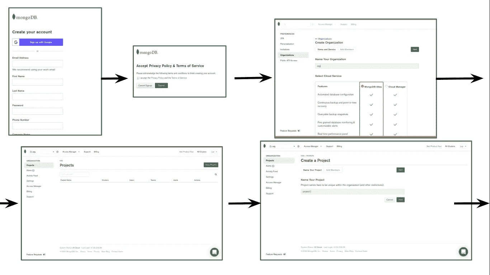

如果你使用的是免费账户，我建议你保留所有默认设置。

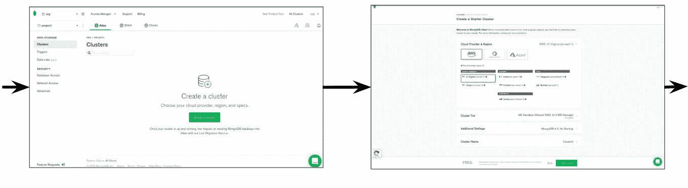

一旦帐户被创建，你可以看到下面的页面。

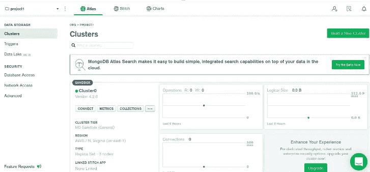

现在我们必须通过点击**连接**按钮*设置连接* 。单击“连接”按钮后，请按照以下步骤操作。

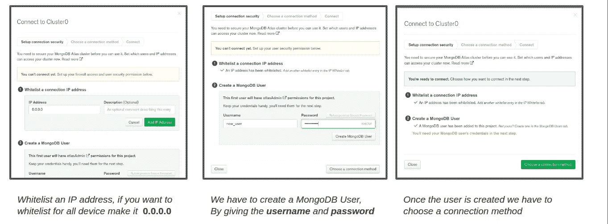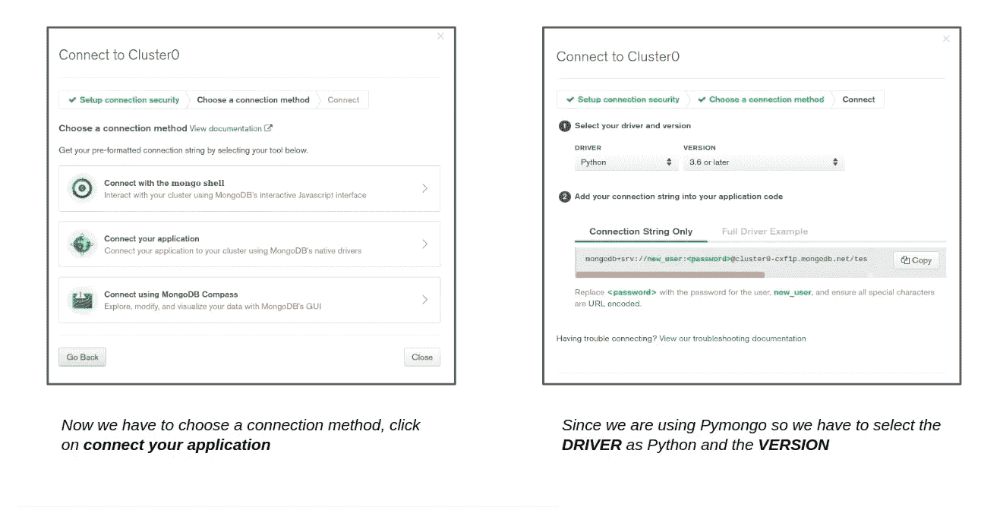

*复制****连接字符串*** 我们将在应用中需要它。既然连接部分完成了，我们就要 ***创建一个数据库和集合。***

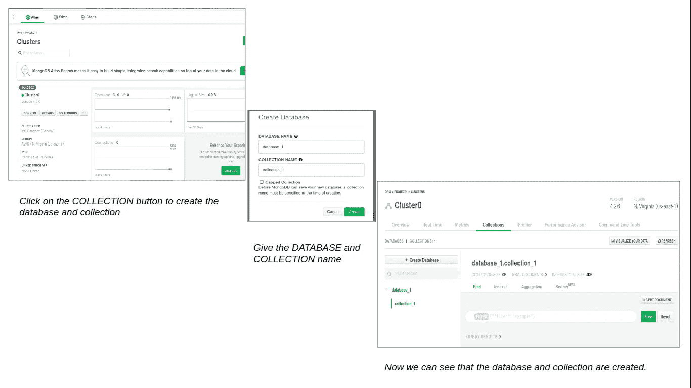

设置数据库和收集部分已经完成。

现在，通过在终端中运行下面的命令，为 MongoDB 安装 python **pymongo** 模块。

```
pip install pymongo
```

让我们转到 python 控制台。

通过下面的命令导入 pymongo 包并使用 ***MongoClient*** 实例设置连接到我们在上面创建的集群，粘贴连接字符串并放置您在创建 MongoDB 用户时设置的密码-

```
import pymongo
from pymongo import MongoClient
client = MongoClient("CONNECTION STRING")
```

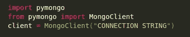

> **创建**

我们已经连接到**集群** ( *它是云数据库*中的空间)，在那里它将支持多个独立的数据库。现在我们将指定我们想要使用哪个**数据库**和**集合**。*收藏是表的一种*。

```
*# database* db = client["database_1"]
*# collections* collection = db["collection_1"]
```

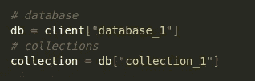

一旦我们选择了集合，现在我们将看到如何在其中存储数据。我们在 MongoDB 中将数据存储为 *JSON 风格的文档或者 python* 中的字典，它被称为**文档**。

```
post = { "name": "Cena" , "age": 25 }
collection.insert_one(post)
```

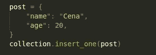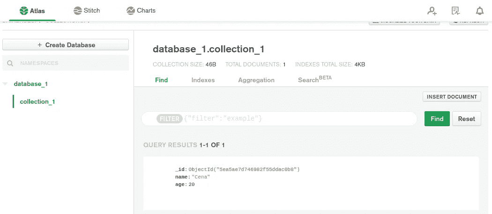

当我们插入文档时，会自动添加一个 ***"_id"*** 键。如果我们愿意，我们也可以指定它，但它必须在整个集合中是唯一的。

要插入许多文档，我们只需通过 **insert_many()** 命令传递一个帖子列表。

```
post_1 = {"name": "Batista","age": 22,}
post_2 = {"name": "Kane","age": 21,}
collection.insert_many([post_1,post_2])
```

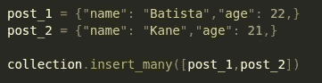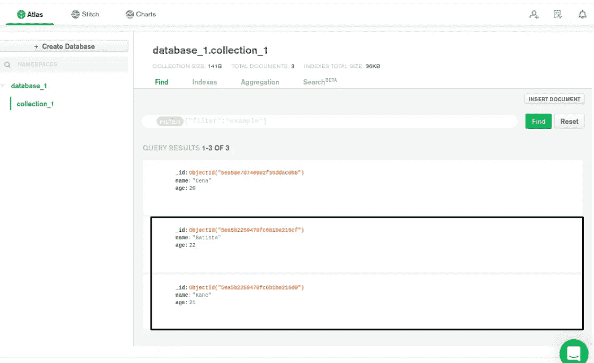

> **改为**

我们可以通过 ***find_one()*** 或者 ***find()*** 命令在 MongoDB 中执行查询。

```
result = collection.find()
for res in result:
    print(res)
```

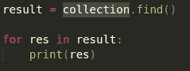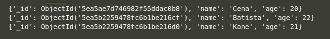

如果需要，我们可以通过给定一个条件来查找一个特定的文档，例如***find({ " name ":" Cena " })***，这将返回名称等于" Cena "的文档。为了从被搜索的文档中访问一个单独的元素，我们可以给出像 ***print(res["age"])，*** 这样的命令来从被搜索的文档中获取年龄。通过在查询对象中使用修饰符作为值，可以进行一些更高级的查询，例如***find({ " age ":{ " $ gt ":21 } })***

> **更新**

我们可以使用修饰符来执行更新操作。为此我们将使用 ***update_one()*** 方法。

```
update=collection.update_one({"age": 21},{"$set":{"name":"Bruce"}})
```

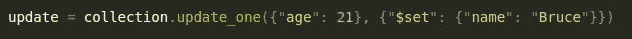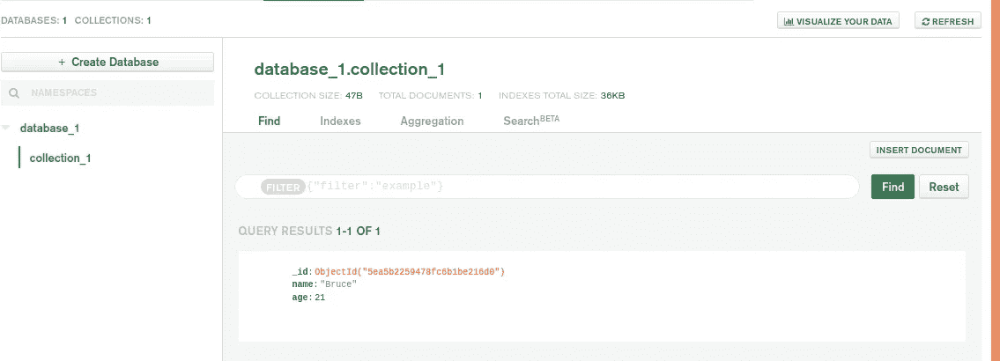

上面的代码将查找年龄等于 21 的文档，然后将名称设置为 Bruce。通过使用***update _ many()***方法，可以更新所有满足特定查询条件的文档。

> **删除**

我们可以使用带有某些条件的 ***delete_one()*** 命令从我们的集合中删除一个文档，如果我们不给出任何条件，它将删除集合中的第一个文档。

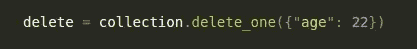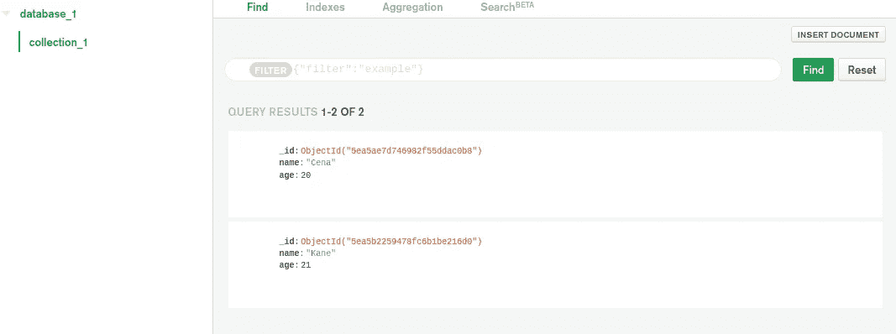

要删除多个文档，我们可以使用***delete _ many()***方法。使用 delete_many 时要非常小心，如果不指定任何条件，它将从集合中删除所有文档。

我希望你已经掌握了 MongoDB 快速入门的基础知识，更多详情请访问 [MongoDB 文档](https://docs.mongodb.com/)。如果这篇文章对你有所帮助，请考虑给👏来激励我。感谢阅读。

[](/analytics-vidhya/extracting-audio-files-from-api-storing-it-on-a-nosql-database-789c12311a48) [## 从 API 中提取音频文件并将其存储在 NoSQL 数据库中

### 存储和提取音频文件的最简单方法(。wav/API)

medium.com](/analytics-vidhya/extracting-audio-files-from-api-storing-it-on-a-nosql-database-789c12311a48) [](/@darpanlekharu4/trigger-aws-lambda-function-to-store-audio-from-api-in-s3-bucket-b2bc191f23ec) [## 触发 AWS Lambda 函数以将来自 API 的音频存储在 S3 桶中

### 这是一个教程，我将展示如何触发一个 lambda 函数，当我们上传一个音频 API 在 S3 桶和…

medium.com](/@darpanlekharu4/trigger-aws-lambda-function-to-store-audio-from-api-in-s3-bucket-b2bc191f23ec)