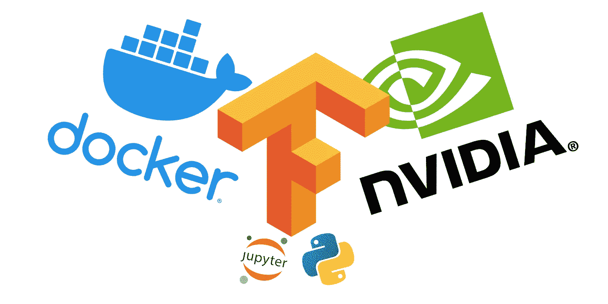
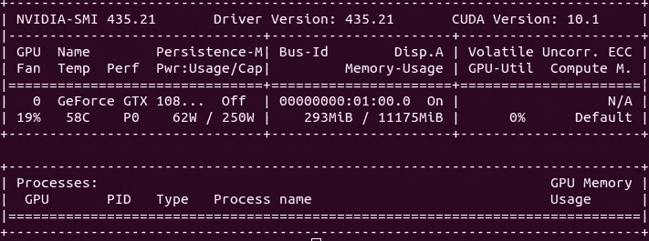

# 在几分钟内设置任何 Tensorflow-gpu 和 Jupyter[Ubuntu 18.04]

> 原文：<https://medium.com/analytics-vidhya/setup-any-tensorflow-gpu-31ef64337a66?source=collection_archive---------7----------------------->



我制作这个教程是因为我第一次设置它花了太多时间。在 Ubuntu 的一次更新后，一切都丢失了，我需要重新设置一切。因为我没有记录，我担心我至少要花几个小时来重新设置一切。现在它被记录下来，我可以在 10 分钟左右完成！想和大家分享一下我的经验:)

使用 Tensorflow/docker(和其他框架)的主要优点是可以自由设置您想要使用的版本。不再强调安装哪个 Cuda 或 Cudnn 版本。您将不再需要设置它们！

基本要求:

*   Ubuntu 18.04 lts:已测试
*   对机器的超级用户访问权限
*   至少 1 个支持 Cuda 的 Nvidia GPU:我有 1 个 1080Ti

# Readyy…开始！

# **0.1。清除 Nvidia(可选)~2 分钟**

```
sudo apt-get purge nvidia*
```

## **安装 nvidia 驱动**

*   搜索更新管理器
*   单击设置
*   单击其他驱动因素
*   选择 ***nvidia-driver-*(专有，已测试)***
*   单击应用更改

```
sudo apt-get install nvidia-container-toolkit
sudo reboot
```

# **0.2。吹扫对接器(可选)~30 秒**

*   检查这个有用的链接来做好它:[https://askubuntu.com/a/1021506](https://askubuntu.com/a/1021506)

# **1。安装 Docker(版本 19.03+) ~1 分钟**，支持链接:https://docs.docker.com/install/linux/docker-ce/ubuntu/

*   标准安装:

```
sudo apt-get remove docker docker-engine docker.io containerd runcsudo apt-get updatesudo apt-get install \
    apt-transport-https \
    ca-certificates \
    curl \
    gnupg-agent \
    software-properties-commoncurl -fsSL https://download.docker.com/linux/ubuntu/gpg | sudo apt-key add -sudo apt-key fingerprint 0EBFCD88sudo add-apt-repository \
   "deb [arch=amd64] https://download.docker.com/linux/ubuntu \
   $(lsb_release -cs) \
   stable"sudo apt-get updatesudo apt-get install docker-ce docker-ce-cli containerd.io
```

*   奖金:执行 docker 没有 sudo:

```
sudo usermod -aG docker ${USER}
sudo su - ${USER}
sudo reboot
```

# **2。设置 nvidia docker ~30 s** ，支持链接 https://github.com/NVIDIA/nvidia-docker

对于 Ubuntu 用户，请键入以下命令:

```
distribution=$(. /etc/os-release;echo $ID$VERSION_ID)
curl -s -L [https://nvidia.github.io/nvidia-docker/gpgkey](https://nvidia.github.io/nvidia-docker/gpgkey) | sudo apt-key add -
curl -s -L [https://nvidia.github.io/nvidia-docker/$distribution/nvidia-docker.list](https://nvidia.github.io/nvidia-docker/$distribution/nvidia-docker.list) | sudo tee /etc/apt/sources.list.d/nvidia-docker.list
sudo apt-get update && sudo apt-get install -y nvidia-container-toolkit
sudo systemctl restart docker
```

# 3.**测试设置(可选)~30 秒+** (取决于您的网速)

```
docker run --gpus all nvidia/cuda:9.0-base nvidia-smi
```

(docker 不退出会自动拉 nvidia/cuda:9.0-base 镜像)

结果屏幕应该如下所示



`docker run --gpus all nvidia/cuda:9.0-base nvidia-smi`

# **4。设置 Jupyter 笔记本的访问权限约 1 分钟**

注意:Tensorflow 在 Docker 中有很多支持，你可以找到所有类型的 tensorflow 版本，无论是在 python 2 还是 python3 中，有/无 GPU 支持。你只需要拉你需要的图像。Tensorflow/Docker 图片每日更新！查看此链接了解更多信息。【https://hub.docker.com/r/tensorflow/tensorflow/tags?page=9】

对于这个例子，我们将使用这个图像:latest-gpu-py3-jupyter。它使用了最新的 Tensorflow (2.0.0)并有 Gpu 支持和 python3 环境。

对于这些步骤，您将只需要在终端中对 C/P 执行两个命令:

*   第一个将让您通过桌面内的端口 8889 访问 jupyter 笔记本(到 jupyter 的链接将显示在终端中)。如果需要，您可以更改本地路径或端口
*   如果你想保存新安装的包(Pytorch，Opencv…)，第二个会让你提交对 docker 镜像的修改。确保名称标签在两个命令中匹配

为了方便使用，我在~/.bashrc 中添加了这两个命令作为别名。我建议你也这样做。

这是怎么做的: **Readyy… GO！**

*   **型*须藤 vi ~/。bashrc*** *(轻松编辑:* ***须藤纳米~/。巴沙尔*** *)*
*   选择 C/P 该块的一条线(如果设置，您可以删除符合的 sudo):

*   键入 ***Esc***
*   键入 ***:wq*** (保存并退出)

# **5。最终测试~5 分钟+** (取决于你的网速)

*   打开一个新终端并键入别名

```
*tensorflow-docker-gpu* 
```

(如果图像不存在，将下载该图像)

*   打开笔记本(单击将显示的链接)
*   创建新笔记本
*   C/P 并在笔记本中执行以下脚本:

输出结果应该是这样的(枕头已经安装在我的案例中):

```
tensorflow version 2.0.0
Num GPUs Available:  1
True
True
Pillow already installed
Pillow installed
```

要在退出前保存对 docker 图像的更改:

*   打开另一个终端
*   键入别名:

```
 docker-commit-tf
```

*   您新安装的软件包现在已保存。可以退出:)

现在，您已经准备好使用 Jupyter 上的本地 GPU 运行您的模型进行训练了

如果你觉得这个教程有用，请告诉我

谢谢