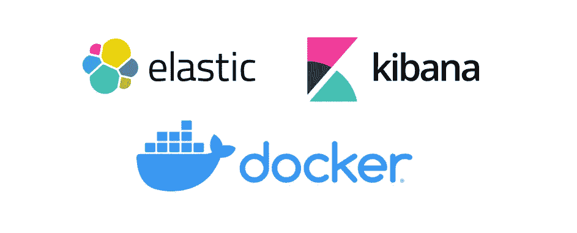
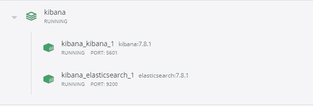
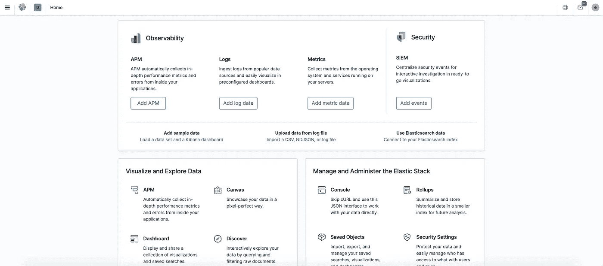

# 使用 Docker 安装 Elasticsearch 和 Kibana

> 原文：<https://medium.com/analytics-vidhya/setup-elasticsearch-kibana-via-docker-ce21cf6f5312?source=collection_archive---------3----------------------->



首先，你必须在你的机器上安装 Docker 和 Docker compose。如果您还没有安装它，请点击此[链接](https://docs.docker.com/get-docker/)在您的机器上安装它。

对于本教程，我们将使用[**docker-compose**](https://docs.docker.com/compose/)**命令来运行我们自己的容器 Elasticsearch 和 Kibana。**

**继续创建一个 **docker-compose.yml** 文件并粘贴下面的代码，**

```
version: '3'
services:
  elasticsearch:
    image: elasticsearch:7.8.1
    ports:
      - 9200:9200
    environment:
      discovery.type: 'single-node'
      xpack.security.enabled: 'true'
      ELASTIC_PASSWORD: '<your_password>'
  kibana:
    image: kibana:7.8.1
    volumes:
      - ./kibana.yml:/usr/share/kibana/config/kibana.yml
    ports:
      - 5601:5601
```

**这个 Docker 合成食谱在你的机器上旋转 2 个 Docker 容器。一个容器运行 Elasticsearch 7.8.1，另一个运行 Kibana 7.8.1。它将 Elasticsearch API 映射到机器上的端口 9200，将 Kibana 映射到端口 5601。您可以查看官方 Docker 图片，了解 [Elasticsearch](https://hub.docker.com/_/elasticsearch) 和 [Kibana](https://hub.docker.com/_/kibana) 的所有可用配置选项。对于本教程，我们将在 Elasticsearch 上启用安全性(咄！)和配置密码(默认用户名是“elastic”)。**

**菜谱还将 **kibana.yml** 挂载到 Kibana config 目录，您需要对该文件进行一些更改，以确保 kibana 正确连接到运行 Elasticsearch 的容器。**

```
# To allow connections from remote users, set this parameter to a non-loopback address.server.host: "0.0.0.0"# The URLs of the Elasticsearch instances to use for all your queries.elasticsearch.hosts: ["[http://elasticsearch:9200](http://elasticsearch:9200)"]# If your Elasticsearch is protected with basic authentication, these settings provide
# the username and password that the Kibana server uses to perform maintenance on the Kibana
# index at startup. Your Kibana users still need to authenticate with Elasticsearch, which
# is proxied through the Kibana server.elasticsearch.username: "elastic"
elasticsearch.password: "<your_password>"
```

**更新 19/3/22:从 8.1 版本开始，使用“elastic”用户名将 Kibana 连接到 ElasticSearch 不起作用。请改用授权令牌或旧版本。**

**两个 **yml** 文件都准备好之后，打开一个终端，导航到您的目录并执行下面的命令，**

```
docker-compose up
```

**Docker 将为 [Elasticsearch](https://hub.docker.com/_/elasticsearch) 和 [Kibana](https://hub.docker.com/_/kibana) 下载图像，并设置您的容器。成功完成后，您将能够看到您的容器正在运行，**

****

**Elasticsearch 和 Kibana 容器运行**

**前往 [http://localhost:9200/](http://localhost:9200/) 验证 Elasticsearch 现在正在运行(输入您的用户名和密码，默认用户名是“elastic”)，您应该会看到如下所示的响应，**

```
{
  "name": "localhost",
  "cluster_name": "elasticsearch",
  "cluster_uuid": "DoZwos0YR26WsHSZYO4O2A",
  "version": {
    "number": "7.8.1",
    "build_flavor": "default",
    "build_type": "tar",
    "build_hash": "508c38a",
    "build_date": "2019-06-20T15:54:18.811730Z",
    "build_snapshot": false,
    "lucene_version": "8.5.1",
    "minimum_wire_compatibility_version": "6.8.0",
    "minimum_index_compatibility_version": "6.0.0-beta1"
  },
  "tagline": "You Know, for Search"
}
```

**点击此链接查看 [Elasticsearch 搜索 API](https://www.elastic.co/guide/en/elasticsearch/reference/current/search-search.html) 的文档。**

**要验证 Kibana 是否在您的机器上成功启动并运行，请前往 [http://localhost:5601/](http://localhost:5601/) 并输入您的用户名和密码，**

****

**验证 Kibana 正在运行，您应该会看到一个登录屏幕**

**登录后，您可以使用 Kibana 的全部潜力，**

****

**基巴纳主屏幕**

**感谢阅读，这就是所有的乡亲！**