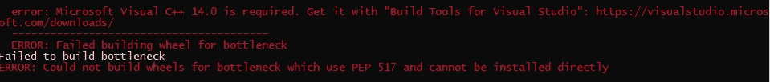
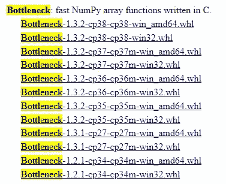
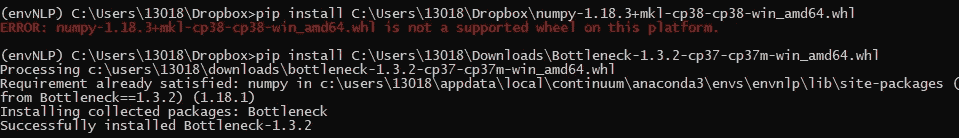

# 在本地笔记本电脑上使用 GPU 设置深度学习

> 原文：<https://medium.com/analytics-vidhya/setup-for-deep-learning-with-gpu-on-your-local-laptop-3ab29eae68f2?source=collection_archive---------2----------------------->

如何配置笔记本电脑用 GPU 运行深度学习？


特伦特·欧文在 [Unsplash](https://unsplash.com/s/photos/deep-learning?utm_source=unsplash&utm_medium=referral&utm_content=creditCopyText) 上拍摄的照片

去年圣诞节，我花 599 美元买了一台新的笔记本电脑联想 IdeaPad Flex，配有英特尔酷睿 i7 第八代处理器和英伟达 GeForce MX230。对于这样的计算能力和 GPU 以及 Costco 的四年保修来说，这是一笔很好的交易。我急于在我的新玩具上运行深度学习算法。然而，我花了很长时间才弄明白如何设置它。

在云上的 GPU 上运行深度学习算法实验有点昂贵。比如在 AWS SageMaker 上使用 GPU，每小时至少要花费 1.26 美元。然而，鉴于设置本地机器进行深度学习的潜在头痛，一些有经验的老师仍然建议租用云服务。手头有了 GPU 机器，我就无法控制自己的好奇心，试图弄清楚如何设置本地机器进行深度学习实验，以便我可以随心所欲地使用自己的 GPU，而不用担心成本。

这就是为什么我想在这个帖子里分享我的经历。我希望这篇文章能帮你节省一些时间。

以下是几个主要步骤:

1.  **安装 CUDA**

要在 GPU 上运行深度学习算法，如果你的机器上没有预装 CUDA，你需要安装 CUDA。你可以在 https://developer.nvidia.com/accelerated-computing-toolkit[下载 CUDA 工具包。选择合适的目标平台(我用的是 Windows 10)下载。按照](https://developer.nvidia.com/accelerated-computing-toolkit)[https://docs . NVIDIA . com/cuda/cuda-installation-guide-Microsoft-windows/index . html](https://docs.nvidia.com/cuda/cuda-installation-guide-microsoft-windows/index.html)上的安装说明进行操作。

2.**安装 TensorFlow 包。**

一旦你安装了 CUDA，你可以 pip 安装 TensorFlow。我没有遇到任何问题。

**3。安装火炬包。**

我开始得到一个错误，当我运行“画中画安装火炬。”错误为“ModuleNotFoundError:没有名为“tools.nnwrap”的模块。”您可以从普通 pip 安装更改为以下 pip 安装，并带有参数:

```
pip install torch==1.5.0 torchvision==0.6.0 -f [https://download.pytorch.org/whl/torch_stable.html](https://download.pytorch.org/whl/torch_stable.html)
```

如果你去网页，你会发现所有版本的火炬安装车轮文件。

4.**安装 Keras 和 theano pygpu。**

以下安装未发现错误:

```
pip install keras
conda install theano pygpu
```

5.**安装 fastai。**

当我运行“pip install fastai”时，我得到了“为瓶颈构建轮子失败”的错误消息。以及“无法为使用 PEP 517 且无法直接安装的瓶颈制造轮子”这个问题困扰了我好一阵子。我试图 pip-安装“瓶颈”第一次失败了。我还试着装了‘minGW’，然后装了‘瓶颈’。它仍然不起作用。



“为瓶颈构建车轮失败”的错误消息

Visual C++是一个误导信息，因为我已经在我的笔记本电脑上安装了 VC 2019。这个问题仍然与“瓶颈”的车轮文件有关。在网上四处搜索后，发现可以从这个网站下载车轮文件:[https://www.lfd.uci.edu/~gohlke/pythonlibs/](https://www.lfd.uci.edu/~gohlke/pythonlibs/)。



“瓶颈”的车轮文件

当我来到这个页面并看到我需要的车轮文件时，我非常兴奋。所以我下载了列表中的第一个文件，并尝试再次安装“瓶颈”包。哎呀，我仍然得到一个如下的错误:



“瓶颈”包的安装

这次的错误信息有所不同。过了一会儿，我得到了教训:确保你下载了与你的系统相匹配的正确版本。可以猜到，cp38 是针对 Python 3.8 的，cp37 是针对 Python 3.7 的。我机器上的 Python 版本是 3.7 不是 3.8。一旦我下载了 Python 3.7 的正确版本(列表中的第三个文件)，我就成功地安装了“瓶颈”包。耶！

安装“瓶颈”后，我可以毫无问题地安装 fastai。

```
pip install fastai
```

瞧啊。我们已经在本地笔记本电脑上成功安装了典型的深度学习包。我们现在已经准备好实验所有令人兴奋的深度学习算法。希望这篇帖子能帮你省下一些时间和头疼的事。

如果还需要租 GPU 机器，可以参考我的另一篇帖子:“[在 GPU 上廉价运行 Github 项目](/@ppeng08/run-github-projects-on-gpu-in-a-cheap-way-722cd7850fe9)”