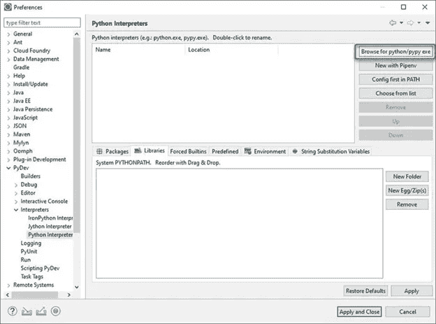

# 在 windows 中使用 eclipse 和 python 设置 selenium

> 原文：<https://medium.com/analytics-vidhya/setup-selenium-using-python-and-eclipse-in-windows-53335600c02f?source=collection_archive---------3----------------------->

使用 eclipse 和 python 设置 Selenium

**按照几个步骤用 python 配置 eclipse for selenium。**
**第一步:**下载 python—[https://www.python.org/downloads/](https://www.python.org/downloads/)
**第二步:**下载 chrome 驱动—[https://chromedriver.chromium.org/](https://chromedriver.chromium.org/)
**第三步:**安装 pip —为 selenium、python 和 pip 设置环境变量
**a.** 在系统的搜索栏中搜索环境变量

系统属性下的高级部分

**b.** 转到右下角的环境变量部分

路径已经添加到系统中

**c.** 点击编辑，添加 selenium、python 和 pip 文件的路径

**4。**在您的系统中安装 selenium—[https://selenium.dev/downloads/](https://selenium.dev/downloads/)

**5。在你的系统上安装 Eclipse—[https://www.eclipse.org/downloads/](https://www.eclipse.org/downloads/)**

可用的客户端和网络驱动程序

**6。**按照以下步骤在 Eclipse 中安装和配置 PyDev

**a.** 打开 eclipse 并转到帮助

**b.** 转到帮助，然后单击安装新软件

**c.** 在“使用”中搜索“http://pydev.org/updates ”,然后选择所有列出的项目，并单击“下一步”两次

**d.** 接受许可协议，然后单击“完成”。

Pydev 组织/更新

**e.** 你可能会遇到安全警告，点击“无论如何都要安装”。

安全警告

**f.** 现在**，**在这一步你将设置首选项。借助 preference 选项，您可以根据项目需要使用 Python。

转到窗口>首选项> PyDev >解释器> Python 解释器。

**g.** 点击应用并关闭。在这一步，给出 Python 的“解释器名”和“exe”文件路径。

点击“浏览”,找到你安装 python 的 python.exe。

**二。**点击‘确定’按钮。

**iii。**选择所有文件夹并点击确定

**四。**点击“应用并关闭”。

**五、**点击确定并继续

**h** 。用 Python 创建一个新项目。在这一步中

**我**。右键单击 PyDev 包浏览器> New。

**二世。**选择选项其他

**三世。**选择“PyDev > PyDev 项目”

**四。**按下“下一步”按钮

**六。为您的项目命名**

**七。**点击下一步并完成

**七。**您可以看到新的 Python (PyDev)项目已经创建

**八世。创建一个新的 Python 包**

**九。**命名您的包并点击完成

**x.** 创建一个新的 PyDev 模块。右键单击包>新建> PyDev 模块

xi。命名你的模块并点击 OK

**十二。**点击 OK，开始编写 python 脚本。下面是我附上的样本脚本

