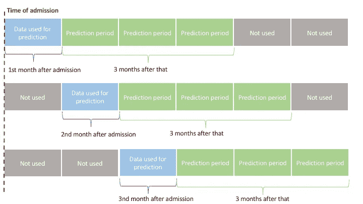

# 机器学习中要避免的七个陷阱

> 原文：<https://medium.com/analytics-vidhya/seven-pitfalls-to-avoid-in-machine-learning-1ef1e5fa9221?source=collection_archive---------17----------------------->

随着我开始在数据科学领域的职业生涯，我逐渐意识到学术项目和行业应用之间的差异。

学术项目的设置往往简单明了，就像人们可以在 Scikit-learn 管道中看到的那样——一些编码和转换，训练-测试分割，训练模型，然后评估模型。但是在现实世界的应用中有更多的陷阱。

这篇文章的想法来自于我作为一名新手数据科学家的工作经历。这肯定不是一个详尽的列表，我期待着你的反馈！


照片来自[谷歌图片](https://images.app.goo.gl/Fnhi3odPgs4W3aD96)

所以让我们开始吧！

# 1.主键泄漏

这是最明显的陷阱。这听起来可能很愚蠢，但有时我们确实会忘记从我们的特性集中删除 id。

```
y = df[“target”]X = df.drop(columns=“target”) # ID is still kept!
```

大多数时候，这可以很容易地从回归中的不收敛，训练精度和测试精度之间的巨大差异，ROC 曲线不合理的完美形状…

但是，包含 ID 并不一定会带来高性能。下面是我得到的 ROC 曲线，通过将约会 ID 作为一个数字特征来预测失约约会。逻辑回归的表现“相当”差，未能发出警报。


逻辑回归中包含数字 ID 时的 ROC 曲线

因此，最佳解决方案是在为预测构建数据集时始终检查唯一标识符。

# 2.复合主键泄漏

这一点不太明显，如果缺乏背景知识，可能很难识别。例如，一起使用邮政编码、出生日期和性别，我们可以唯一地识别美国的大多数人。将它们都作为特征包含在内会使模型泛化能力很差。

# 3.时间机器

如果他/她没有真正考虑用例，例如使用实际飞行时间来预测航班延误，这将是一个错误。在观察到航班延误状态之前，无法观察到实际的航班时间。我们无法用时间机器看到未来。

有时候更像薛定谔的猫。一旦你观察到了 b，不确定性就消失了，你对结果是确定的。这听起来像是一个具有很大可变重要性的好特性，但也可能是一个没有任何有趣内容的坏特性。在没有赴约的例子中，如果你知道一个病人的登记时间，你马上就会知道他/她赴约了。用“签到时间”来预测是没有意义的。

# 4.标记为预测值

是的，会发生这种情况。在预约失约预测中，我们有“患者是否已经打电话取消”的信息。取消的约会应该与未出现的约会同等对待。它们都代表任命状态。如果我们使用“患者是否打电话取消”作为预测的一个特征，模型性能可能会高得不合理，但没有意义。在这种情况下，我们可以添加“取消”作为标签(如果还没有的话)，或者我们可以使用基于规则的语句来快速确定约会状态，而不是混淆模型。

```
if call_to_cancel == True: 
    return 'Canceled appointments'
else: 
    ...
```

# 5.不同的人群

不同的总体意味着我们在训练集和测试集中使用的总体不同于现实世界中的总体。对于约会失约问题，一个约会可能有几种结果——失约、完成、重新安排、取消。我们是只包括“未出现”和“已完成”的样本，还是将除“已完成”、“重新安排”和“已取消”组之外的所有样本归入同一类别，因为“未出现”为 0？在我看来，第一种方法是有问题的。它手动扭曲样本分布，使其不同于真实总体。当新的数据进来时，它的真实状态是“重新安排的”，模型可能不知道如何分类它，因为它可能带来新的看不见的模式。

# 6.有偏见的表示

机器学习中的偏见是一个巨大的话题。简单地说，偏见可以在数据收集、数据准备、数据建模过程中引入，也可以来自世界本身。这是一个复杂的问题。应该有更多的文章专门讨论这个话题。

这里的有偏表示是关于某些人群以我们不希望的方式更多/更少地出现在数据集中。如下所示，在滚动基础上预测 3 个月住院死亡率时，住院时间较长的患者在样本集中具有更多代表性。二次抽样可以用来解决这个问题，例如从一个病人的全部数据中随机抽取 3 个样本。



使用滚动窗口预测 3 个月的住院死亡率

# 7.缺乏实用性

由于我在医疗保健行业工作，对我来说，这主要是关于临床效用。

一个常见的错误是在做预测时向后看。例如，当对住院死亡率进行预测时，人们从入院结束时一直回顾到入院开始时。具体来说，使用入院结束前 1 个月的数据，预测整个住院期间的住院死亡率。然而，在现实世界中，我们不知道患者入院的结束时间，因此不能使用该模型。

另一个例子是，使用 1 小时的数据进行预测，而实际数据接收有 2 小时的延迟。例如，在实践中，当现在是上午 11 点时，您看不到上午 10 点的数据。您只能在 9 点获得“陈旧数据”。

# 结论

如前所述，该列表并不详尽，其中一些并不完全排除在外，例如“不同人群”类似于“有偏见的陈述”。本质上，它是关于在设计、构建和测试模型时模拟用例的。

*感谢阅读。希望这篇文章对你有用！*

*你也可以通过* [*LinkedIn*](https://www.linkedin.com/in/ling-hong-498971149/) *联系我。*

# 参考

[1]拉坦娅·斯威尼。(2000).*简单的人口统计通常可以唯一地识别人们*

[https://dataprivacylab.org/projects/identifiability/](https://dataprivacylab.org/projects/identifiability/)

[2]伊莱·谢尔曼、希廷德尔·格姆、尤利西斯·巴利施、斯科特·欧文斯、珍娜·威恩斯。(2018 年 04 月 16 日)。*利用临床时间序列数据进行预测:警示故事*

[https://www.ncbi.nlm.nih.gov/pmc/articles/PMC5977714/](https://www.ncbi.nlm.nih.gov/pmc/articles/PMC5977714/)