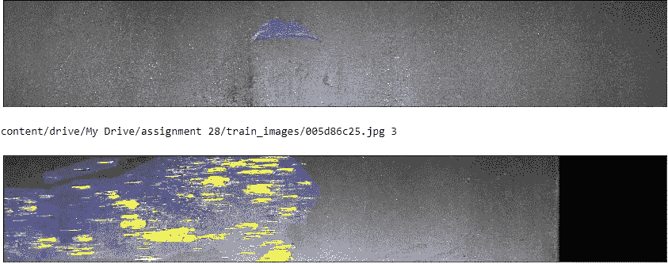

# 谢韦尔钢铁公司:钢铁缺陷检测

> 原文：<https://medium.com/analytics-vidhya/severstal-steel-defect-detection-2d2e836855c2?source=collection_archive---------6----------------------->

钢是现代最重要的建筑材料之一。钢结构建筑可以抵抗自然和人为的磨损，这使得这种材料在世界各地无处不在。

谢韦尔钢铁公司是高效钢铁开采和生产的领导者。他们相信冶金的未来需要行业的经济、生态和社会方面的发展——他们认真对待企业责任。钢铁缺陷检测比赛由谢韦尔钢铁公司通过 Kaggle 组织。

平板钢板的生产工艺特别精细。从加热和轧制，到干燥和切割，当扁钢准备装运时，几台机器会接触到它。本次竞赛的目的是使用所提供的图像预测钢铁制造中发现的缺陷的位置和类型，以提高过程的制造标准和过程效率。

**1。** **描述**

我们将预测在钢铁制造中发现的缺陷的位置和类型。图像以唯一的 ImageId 命名。我们必须对测试集中的缺陷进行分割和分类。每个图像可以没有缺陷、单一类别的缺陷或多个类别的缺陷。对于每幅图像，我们必须分割每一类缺陷(ClassId = [1，2，3，4])。即使图像上有几个不连续的缺陷位置，每个缺陷类别的段也将被编码成单行。

该数据集根据平均 Dice 系数进行评估。Dice 系数可用于比较预测的分割与其对应的基本事实之间的逐像素一致性。该公式由下式给出:

2∫| X∩Y | | X |+| Y |

其中 X 是预测的像素组，Y 是地面实况。当 X 和 Y 都为空时，Dice 系数定义为 1。

**2。** **数据**

图 1: train.csv

我们为这项任务提供的数据来自 Severstal，由 12568 幅独特的训练图像和 1801 幅独特的测试图像组成。它还包含一个. csv 文件，该文件包含 ImageId 和一个编码像素列，该列告诉我们缺陷以及哪些像素受到了影响。该数据由 50272 行组成。

**3。** **探索性数据分析**

我们在 train.csv 文件中共有 50272 行，对应于每幅训练数据图像的 4 行。这是因为每个图像可以没有缺陷、有一个缺陷或缺陷的组合。因此，我们开始将缺陷类分离到数据的一个单独的列中。

图 2: DefectClass 分离

我们还试图了解每张图像的缺陷发生率。

图 3:每幅图像的缺陷

我们可以看到，这个问题是一个多标签分类问题。每个图像可以有多个缺陷，它们可以被分类并且不互相排斥。我们还发现 53%的数据包含有缺陷的图像。

我们进一步观察了训练图像中每个缺陷类别的出现频率。

图 4:缺陷类型频率

我们可以观察到，大多数缺陷存在于类型 3 中，其余类型的缺陷在它们之间具有较少的、相等的分布。

我们可视化了一些数据，以便使用来自[源](https://www.kaggle.com/kenmatsu4/visualize-steel-defect)的代码更好地查看训练数据。

**缺陷类型 1:**

缺陷用红色掩盖，我们可以看到它们非常小。

**缺陷类型 2:**

这些缺陷被绿色所掩盖，看起来是线性的。

**缺陷类型 3:**

与之前的缺陷类别相比，这些缺陷似乎更严重、更大。

**缺陷类型 4:**

与之前的缺陷类别相比，这些缺陷似乎更严重、更大。我们可以观察到，与类 3 和类 4 相比，类 1 和类 2 非常小，因此可能更容易识别和训练。

**4。** **数据清理和预处理**

我们已经把所有重复的名字删除了，并把数据按缺陷分类。我们还从测试数据中删除了所有重复的 ImageId。由于这不是一个时间序列数据集，我们可以直接将我们的数据分为训练和 CV 数据。由于测试数据集可能与训练集不相似，我们将图像的大小调整为相同的大小，并增加训练数据集，以便部分解决这个问题。我们使用了来自这个[源](https://keras.io/preprocessing/image/)的数据生成器。

图 4:数据生成器

**5。分类方法**

我们的目标是识别有缺陷的图像，并进一步分类为缺陷的类型。为此，我们将使用两种模型。第一个模型将根据图像是否包含缺陷来对图像进行分类，并且被分类为有缺陷的图像将被转发到下一个模型。

第二个模型将接收先前被分类为有缺陷的图像，并确定代表哪种类型的缺陷。

5.1 如果存在缺陷，进行分类

对于第一个任务，我们使用了一个 DenseNet 模型，该模型根据从 image-net 数据训练的权重进行训练。我们使用二元交叉熵作为损失函数以及 Adam 优化器。

图 5:确定缺陷是否存在的 DenseNet 模型

一旦我们训练了模型并保存它以备将来使用，我们就要求模型预测测试图像，以便我们可以将有缺陷的图像与没有任何缺陷的图像分开。

图 6:预测和过滤有缺陷的图像

基于该图像，我们过滤掉具有小于 0.5 的存在缺陷的概率的所有图像。这将是下一个模型的输入测试数据。我们还过滤掉了我们的训练数据，只包含存在缺陷的图像，因为我们现在不需要无缺陷的图像。

5.2 在 4 个缺陷类别中进行分类

为了实现这一点，我们需要获得编码像素数据，并基于预测图像中存在的缺陷类型，并对我们发现的缺陷类型进行分类。我们使用下面的函数将掩码转换为游程长度编码器，反之亦然，并构建掩码。

图 7:构建遮罩的实用函数

我们还需要为我们的生成器获取编码像素进行训练，因此我们使用斯坦福 Edu 的图像生成器。为了实现这一点。

现在，为了预测缺陷和掩模的类型，我们使用了 U-Net 模型架构，该架构具有作为损失函数的二进制交叉熵和 Adam 优化器。我们在过滤后的训练数据集上训练它。

图 8: U-Net 模型

一旦我们训练了模型并保存了权重，我们就用它来预测我们的测试数据。

图 9:缺陷类型的分类

我们还重新组合先前过滤的无缺陷图像数据，以得到由无缺陷图像 id 和具有缺陷类型的缺陷图像 id 组成的最终输出。

**6。结论**

我们从由 12568 幅训练数据图像和 1801 幅测试数据图像组成的数据集开始，我们将其分类为有缺陷或无缺陷，如果存在缺陷，我们将其分类为一个或多个缺陷类型类别。我们以级联方式使用两个模型实现了这一点。

下面我们可以看到一些预测的口罩。这些图像是用这个[代码](https://www.kaggle.com/a03102030/practice-for-visualizing-mask)生成的。我们可以观察到我们的模型在任务中表现良好。

然而，我们可以通过使用更好的数据扩充方法、更好的流程管道或两者同时使用来进一步提高这项任务的性能:)。我们还可以尝试将图像调整到比我们使用的 256x512 更高的分辨率，因为更大的图像会导致我们面临资源耗尽的错误。

来源:[https://www . ka ggle . com/c/severstal-steel-defect-detection/data](https://www.kaggle.com/c/severstal-steel-defect-detection/data)

领英:[https://www.linkedin.com/in/shashidhar-mangam/](https://www.linkedin.com/in/shashidhar-mangam/)