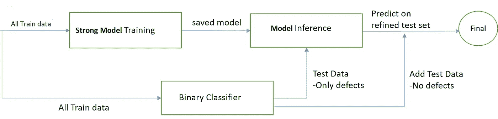
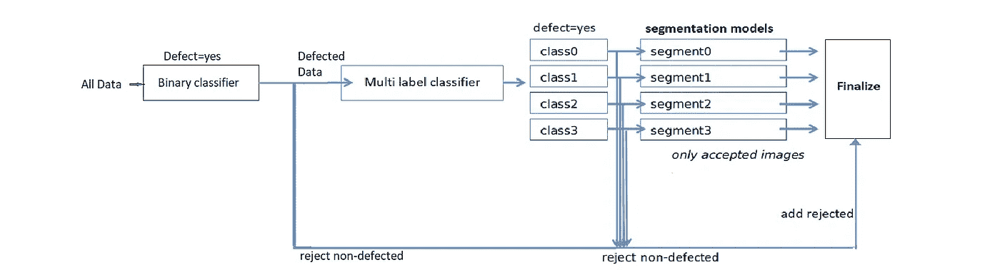

# 建立分类和预测钢中缺陷的模型

> 原文：<https://medium.com/analytics-vidhya/severstal-steel-defect-detection-5e5b50fe21ce?source=collection_archive---------2----------------------->

## 图像掩模的多标记分类和预测


一场追逐赛

*钢材缺陷检测是由美国最大的钢铁制造公司* [***谢韦尔***](https://www.severstal.com/eng/about/) ***主办的一场竞赛。*** [*这里的*](https://www.kaggle.com/c/severstal-steel-defect-detection) *是本次比赛的环节。请访问 kaggle 网站了解更多关于本次比赛的详情*

# 问题陈述

本次比赛的目的是使用提供的图像预测钢铁制造中发现的缺陷的位置和类型。这些图像以唯一的 *ImageId* 命名，我们的任务是分割每一幅图像并对测试集中的缺陷进行分类。

**关于数据:** [***来源***](https://www.kaggle.com/c/severstal-steel-defect-detection/data) ****DataTrain _ images。Zip*** :包含所有列车图像的 Zip 文件(12568 唯一)
***Test _ images . Zip***:包含所有列车图像的 Zip 文件(1801 唯一)
***train . csv***:包含 Imageid 和编码像素列
***submission . CSV:***测试包含 Imageid 和编码像素的 CSV 文件*

***数据描述:**
每张图像可能有*，一个 ***缺陷的单个类*** ，或 ***缺陷的多个类*** (ClassId = [1，2，3，4])。**

****目的** :
给定一幅图像，我们的任务是对缺陷进行分类，并定位缺陷的分割。对于每一幅图像，如果它属于每一类(ClassId = [1，2，3，4])，你必须分割缺陷。
***类标签和掩码信息:***
有两个任务与此问题相关
1。将图像分类为 4 个缺陷类(ClassId = [1，2，3，4])。
1。预测发现缺陷的位置(分段)**

****注意**:每个缺陷类别的段将被编码成一个单独的行，即使一幅图像上有几个不连续的缺陷位置，你也可以在这里 *了解更多信息 [*。*](https://www.kaggle.com/c/severstal-steel-defect-detection/overview/evaluation)***

# *各种渠道策略*

*由于这个问题涉及到二元分类，多标签分类和回归，有许多方法可以解决这个问题，我将讨论我在比赛中遇到的一些方法。*

## *管道 1:使用分段模型的基本管道*

*第一个也是最有效的策略是使用分割模型，使用分割模型是因为它们将图像划分为多个区域，并可以对图像中的对象进行分类，您可以在此了解更多信息。*

**

*这是一个简单的管道，所有的输入数据都使用一个强大的训练模型进行训练(很可能是预先训练好的)。该模型的输出层是 CNN(4)，其中对于每个输入图像，我们得到四个具有该类分割的掩模(图像)，即类([1，2，3，4])。*

## ***管道-2:使用二元分类进行分割***

**

*该策略处理建立分段模型以及二进制分类，强分段模型(预训练的)建立在所有训练数据上，并使用 model.save(model_name.h5)保存模型。同样地，保存二进制分类模型，当开始测试数据时，使用预先训练的二进制分类器过滤有缺陷的图像，并且仅将有缺陷的图像发送到分割模型，这样我们可以更快地测试结果，因为我们保存了我们的模型并且还从原始数据中过滤了有缺陷的图像。*

## *管道-3:使用多标签分类的分段*

**

*这是一个与前一个类似的策略，我们不是过滤有缺陷的图像，而是使用一个预先训练的多标签分类模型来获得有缺陷的图像，因为这是一个多标签分类器，一个图像可以属于多个类别。我们直接将来自多标签分类通道的输出用于类别的四个分割模型([1，2，3，4])，这里每个模型是具有各自缺陷类别([1，2，3，4])的预训练分割模型。*

## *pipeline-4:使用二元和多标签分类的分割模型*

**

*你可能已经猜到了，是的！它是管道 3 和管道 4 的组合。我部分尝试了上述所有策略，并坚持这样做，因为它给了我比所有更好的结果。这也花费了更少的时间来测试结果，因为我们过滤掉了没有缺陷的图像，并且只将有缺陷的图像发送到分割模型。下面让我给你一个我实现这个方法的详细视图。*

# *探索性数据分析*

*让我们看一些 EDA 来了解更多的数据！*

**

***二元分类***

*正如我们在上面看到的缺陷类和非缺陷类的分布，我们说这是一个平衡的**二元分类**问题*

## *多标签分类*

**

***多标签分类***

*正如我们看到的，这是一个具有挑战性的问题，其中我们的多标签分类在数据上不平衡，因为 2 类缺陷图像在数据大小上非常小，而 1 类缺陷在数据上非常大，3、4 类在某种程度上是平衡的。*

*考虑到多标签分类的不平衡，我们绘制了每幅图像的类别数*

**

***每幅图像的类别数量***

*我们可以观察到图像中前 2 类分布较多，3，4 类几乎为零*

# *可视化训练数据中的每种缺陷:*

*让我们看看每一类的一些图像。这种可视化可以很容易地通过掩蔽列车数据图像上给定的编码像素来完成，您可以在这里查阅代码[。](https://www.kaggle.com/kenmatsu4/visualize-steel-defect)*

## *一级缺陷*

****

*图像中的红色阴影表示 1 级。1 类似乎缺陷较少，几乎与无缺陷图像相似。*

## *二级缺陷*

****

*图像中的绿色阴影表示 2 级。可以使用训练数据中提供的编码像素来绘制这些缺陷，正如我们可以注意到的，这些缺陷类似于 1 级缺陷，并且在它们之间进行分类有些困难。*

## *三级缺陷*

****

*图像中蓝色、黄色的像素表示 3 级图像。我们可以观察到，与 1、2 级图像相比，3 级图像在缺陷方面更差。*

## *四级缺陷*

****

*图像中以青色表示的像素描述了第 4 类。我们可以看到，这些第 4 类图像是受损最严重的图像。我们最终得出结论，类别 1、2 是相似的且缺陷较少，而类别 3、4 不太相似但缺陷较多，因此对它们进行分类是容易的。*

# *使用二元和多标签分类的分割模型*

*正如我提到的，我使用 pipeline-4 作为我的策略，让我们详细查看一下！*

## *二元和多标签分类*

***列车-Cv 分离:***

*我们的数据不是时间序列数据，所以我们可以将数据随机分成 train-Cv。通过阅读 kaggle 讨论和其他笔记本，我发现训练数据与提供的测试数据不相似。因此，建议至少进行数据扩充。这样做我们不能完全解决问题，只能部分解决问题。下面是使用 keras 数据生成器生成和扩充数据的代码。*

```
**#*[*reference*](/@vijayabhaskar96/tutorial-on-keras-flow-from-dataframe-1fd4493d237c) columns =['class1','class2','class3','class4']

mtr_df, mval_df = train_test_split( mc, random_state=42, test_size=0.1825)
print('train_data shape:',mtr_df.shape,'val_data:',mval_df.shape)

datagen=ImageDataGenerator(rescale=1./255.,
                           shear_range=0.1,
                           zoom_range=0.1,
                           brightness_range=[0.6,1.0],
                           rotation_range=60,
                           horizontal_flip=True,
                           vertical_flip=True
                           )
*#test_datagen=ImageDataGenerator(rescale=1./255.)*

train_gen=datagen.flow_from_dataframe(
dataframe=mtr_df,
directory=dir1+"./train_images",
x_col="imageid",
y_col=columns,
batch_size=16,
seed=42,
shuffle=False,
class_mode="other",
target_size=(299,299))

val_gen=datagen.flow_from_dataframe(
dataframe=mval_df,
directory=dir1+"./train_images",
x_col="imageid",
y_col=columns,
batch_size=16,
seed=42,
shuffle=False,
class_mode="other",
target_size=(299,299))*
```

***二元和多标签分类模型***

*对于这两个模型，我使用 keras 的预训练 InceptionResNetV2()模型和从 image-net 数据训练的权重。*

```
*model = InceptionResNetV2(weights=None, input_shape=(299,299,3), include_top=False)
model.load_weights('/kaggle/input/inceptionresnetv2/inception_resent_v2_weights_tf_dim_ordering_tf_kernels_notop.h5')
model.trainable=False

x=model.output
x=GlobalAveragePooling2D()(x)
x=Dense(128,activation='relu')(x)
x=Dense(64,activation='relu')(x) 
out=Dense(1,activation='sigmoid')(x) *#final layer binary classifier*

model_binary=Model(inputs=model.input,outputs=out)* 
```

*类似的**多标签分类**模型除了输出层也以同样的方式加载，因此它是一个四标签分类器，即 **out=Dense(4，activation =‘sigmoid’)(X)***

*在对生成器进行几个时期的训练后，我们得到了模型的良好性能*

**

***二元模型性能***

*正如我们可以看到的，在 17 个时期结束时，out **二元模型**获得了 90 的准确率和 96 的召回率，这意味着 out 二元模型做得很好:)。*

*让我们看看我们的**多标签分类器**工作得有多好。我一次展示两个模型，因为我们使用了相同的预训练模型，这样我们就可以使用公共代码而不重复。*

**

***多标签分类***

*我们的多标签模型也有很好的性能，它有 95 的准确率。*

***绩效衡量模型:***

*我们为什么要用精准和召回？*

***召回**实际计算我们的模型通过将它标记为阳性(真阳性)而捕获了多少实际阳性，并且**召回**应该是当存在与假阴性相关联的高成本时的模型度量。在我们的例子中,**假阴性**是将有缺陷的图像分类为无缺陷的，所以对我们来说，我们不能允许我们的模型产生假阴性是有意义的，因为这可以完全放弃将图像发送给进一步的模型。*

*对于**多标签分类**，我们同时使用了精度和召回率，因为在进行多标签或多类别分类时，建议同时使用这两个指标。*

*因为我们已经保存了我们的模型以备将来使用，并且它有 keras 中默认没有的指标，所以它必须通过以下方式加载*

```
*#For multi label classification, precision and recallmodel_mul=load_model('/kaggle/input/multicaugg/multic_aug.h5',
                     custom_objects="recall":recall,
                     "precision":precision}
)#use only recall for binary classification*
```

## *测试时间增加*

*为了更好的模型性能，我们使用了测试时间增加，这提高了我们的模型性能。我们已经将 TTA 用于二元和多标签分类。我将提供一个简单的 TTA 代码片段，你可以了解更多关于 TTA [在这里](https://towardsdatascience.com/test-time-augmentation-tta-and-how-to-perform-it-with-keras-4ac19b67fb4d)。*

```
**#TTA*
tta_steps = 10
multi_class= []
for val **in** tqdm_notebook(test_gen_mul):

    batch_pred = []
    for i **in** range(tta_steps):
        preds = model_mul.predict_generator(augmentation_gen.flow(val,batch_size=bs, shuffle=False),steps=1)
        batch_pred.append(preds)

    pred = np.mean(batch_pred, axis=0)
    multi_class.append(pred)*
```

# *分割模型(掩模预测)*

## *数据加载*

*有必要使用其他类型的生成器，而不是 keras generatot，因为我们必须将编码的像素(data_y)输入到我们的生成器中进行训练，这是使用 keras 图像生成器无法实现的。这可以通过使用斯坦福 edu 定制的数据生成器来完成。*

```
*class **DataGenerator**(keras.utils.Sequence):
    'Generates data for Keras'
    def __init__(self, list_IDs, df, target_df=None, mode='fit',
                 base_path='../input/severstal-steel-defect-detection/train_images',
                 batch_size=16, dim=(128, 800),preprocess=None, n_channels=3,
                 n_classes=1, random_state=2019, shuffle=False):
        self.dim = dim
        self.batch_size = batch_size
        self.df = df
        self.mode = mode
        self.preprocess = preprocess
        self.base_path = base_path
        self.target_df = target_df
        self.list_IDs = list_IDs
        self.n_channels = n_channels
        self.n_classes = n_classes
        self.shuffle = shuffle
        self.random_state = random_state
        self.on_epoch_end()

    def __len__(self):
        'Denotes the number of batches per epoch'
        return int(np.floor(len(self.list_IDs) / self.batch_size))

    def __getitem__(self, index):
        'Generate one batch of data'
        *# Generate indexes of the batch*
        indexes = self.indexes[index*self.batch_size:(index+1)*self.batch_size]
        *#print(indexes)*
        *# Find list of IDs*
        list_IDs_batch = [self.list_IDs[k] for k **in** indexes]

        X = self.__generate_X(list_IDs_batch)

        if self.mode == 'fit':
            y = self.__generate_y(list_IDs_batch)
            return X, y

        elif self.mode == 'predict':
            return X

        else:
            raise **AttributeError**('The mode parameter should be set to "fit" or "predict".')

    def on_epoch_end(self):
        'Updates indexes after each epoch'
        self.indexes = np.arange(len(self.list_IDs))
        if self.shuffle == True:
            np.random.seed(self.random_state)
            np.random.shuffle(self.indexes)

    def __generate_X(self, list_IDs_batch):
        'Generates data containing batch_size samples'
        *# Initialization*
        X = np.empty((self.batch_size, *self.dim, self.n_channels))

        *# Generate data*
        for i, ID **in** enumerate(list_IDs_batch):
            *#print(i,ID)*
            im_name = self.df['imageid'][ID]
            img_path = f"**{self.base_path}**/**{im_name}**"
            img = self.__load_rgb(img_path)
            *#print(im_name,img_path)*
            *# Store samples*
            img = cv2.resize(img,(800,128))
            X[i,] = img 
            *#print(" X sahpe",X.shape)*
            *#print(" img sahpe",img.shape)*
            *# normalize* 
            *#X = X / 255*
        if self.preprocess!=None: X = self.preprocess(X)

        return X

    def __generate_y(self, list_IDs_batch):
        y = np.empty((self.batch_size, *self.dim, self.n_classes), dtype=int)

        for i, ID **in** enumerate(list_IDs_batch):
            im_name = self.df['imageid'][ID]
            *#image_df = self.target_df[self.target_df['imageid'] == im_name]*

            rles = self.df['EncodedPixels'][ID]
            h,w=self.dim
            masks = rle_to_mask(rles, 256,1600)
            masks = cv2.resize(masks,(800,128))

            *#print(" y sahpe",y.shape)*
            *#print(" masks sahpe",masks.shape)*
            y[i, ] = np.expand_dims(masks, -1)
            y = (y > 0).astype(int)
        return y 

    def __load_rgb(self, img_path):
        img = cv2.imread(img_path)
        img = cv2.cvtColor(img, cv2.COLOR_BGR2RGB)
        img = img.astype(np.float32) / 255.

        return img

    def __load_grayscale(self, img_path):
        img = cv2.imread(img_path, cv2.IMREAD_GRAYSCALE)
        img = img.astype(np.float32) / 255.
        img = np.expand_dims(img, axis=-1)

        return img*
```

## ***RLE(行程长度编码器)***

*为了预测有缺陷的像素区域，我们需要把它们转换成 RLE 区域。kaggle 这样做是为了减少提交文件的大小。我将提供代码片段这样做，你可以参考 [*这里*](https://www.kaggle.com/c/severstal-steel-defect-detection/overview/evaluation) 更多关于如何转换像素到 RLE 的细节。*

```
*def mask_to_rle(mask):
    *'''*
 *Convert a mask into RLE*

 *Parameters:* 
 *mask (numpy.array): binary mask of numpy array where 1 - mask, 0 - background*

 *Returns:* 
 *sring: run length encoding* 
 *'''*
    pixels= mask.T.flatten()
    pixels = np.concatenate([[0], pixels, [0]])
    runs = np.where(pixels[1:] != pixels[:-1])[0] + 1
    runs[1::2] -= runs[::2]
    return ' '.join(str(x) for x **in** runs)*
```

*此外，我们需要将 RLE 提供的训练数据转换为掩码，以适应训练数据，因此我们做如下*

```
*def rle_to_mask(rle_string, height, width):

    rows, cols = height, width
    img = np.zeros(rows * cols, dtype=np.uint8)
    if len(str(rle_string)) > 1:
        rle_numbers = [int(numstring) for numstring **in** rle_string.split(' ')]
        rle_pairs = np.array(rle_numbers).reshape(-1, 2)
        for index, length **in** rle_pairs:
            index -= 1
            img[index:index+length] = 255
    else: img = np.zeros(cols*rows)
    img = img.reshape(cols, rows)
    img = img.T
    return img*
```

## ***分割模型***

*来自先前模型的输出(有缺陷的图像)将是分割模型的输入。分割模型对于预测区域是非常有用的，分割模型给了我们很好的结果，GitHub 知识库中有很多精彩的预先训练好的分割模型。我用的一个来自 quvbel，他在 keras 和 pytorch 都发布了模型。你需要做的就是输入`pip install segmentation-models`，然后导入。*

```
*from segmentation_models import Unet
model = Unet('resnet34')*
```

*开始训练*

```
*model.compile()
model.fit(X,y)*
```

***培训模式***

*我们将建立四个分割模型来分别训练四个缺陷类别，以便我们可以将每个缺陷图像(它是多标签的输出)传递给相应的分割模型来预测缺陷区域的位置。*

```
*#For class-1 defective images
pred_c1 = Unet('resnet50', input_shape=(128, 800, 3), classes=1, activation='sigmoid')
pred_c1.compile(optimizer='adam', loss='binary_crossentropy', metrics=[dice_coef,loss_dice_coef])
*#pred_c1.summary()*history = pred_c1.fit_generator(
    trainc1,
    validation_data=valc1,
    use_multiprocessing=False,
    workers=1,
    epochs=25 )*
```

*类似地，对于班级 2、3、4，我们已经建立并训练了类似的模型，并且保存了这些模型以供将来使用。让我们看看训练数据性能结果。*

**

***有缺陷的 1 级列车结果***

**

***有缺陷的二级列车结果***

**

***有缺陷的 3 级列车结果***

**

***有缺陷的 4 级列车结果***

*正如我们已经讨论过的，并且可以从 train-Cv 结果中观察到，类 1，2 具有低 dice-coef，而类 3，4 具有良好的 dice_coef，因为类 3，4 具有更多的边和大的缺陷。*

## *骰子系数*

*Dice 系数可用于比较预测的分割与其对应的基本事实之间的逐像素一致性。该公式由下式给出:*

```
*[#reference](https://www.kaggle.com/c/severstal-steel-defect-detection/overview/evaluation)2 ∗(|X∩Y|) / (|X|+|Y|)*
```

*其中 X 是预测的像素组，Y 是地面实况。当 X 和 Y 都为空时，Dice 系数定义为 1。排行榜分数是测试集中每对`<ImageId, ClassId>`骰子系数的平均值。*

# *结果*

*让我们看一下一些随机掩码预测结果。*

***一级***

**

***有缺陷的一级 Cv 结果***

***二级***

**

***有缺陷的二级 Cv 结果***

***三级***

**

***三级缺陷 Cv 结果***

***四级***

**

***有缺陷的四级 Cv 结果***

*这些结果表明，我们的模型性能良好*

# *进一步的范围*

*到目前为止，我们取得了不错的结果，但仍有一些改进模型的空间:*

*   *由于训练测试数据之间的相似性较小，我们可以使用对抗性验证来提高性能。*
*   *您还可以使用其他数据扩充技术进行训练和测试扩充。*
*   *你可以用更好的流水线，可能比这个性能更好。*

# *参考*

1.  *[***https://Stanford . edu/~ sher vine/blog/keras-how-to-generate-data-on-the-fly***](https://stanford.edu/~shervine/blog/keras-how-to-generate-data-on-the-fly)*
2.  *[***https://github.com/qubvel***](https://github.com/qubvel)*
3.  *[***https://www.appliedaicourse.com/***](https://www.appliedaicourse.com/)*
4.  *[***https://kaggle.com/c/severstal-steel-defect-detection***](https://www.kaggle.com/c/severstal-steel-defect-detection)*

# ***联系人***

***领英:**[***https://www.linkedin.com/in/sai-krishna-reddy-1bbb56169/***](https://www.linkedin.com/in/sai-krishna-reddy-1bbb56169/)*