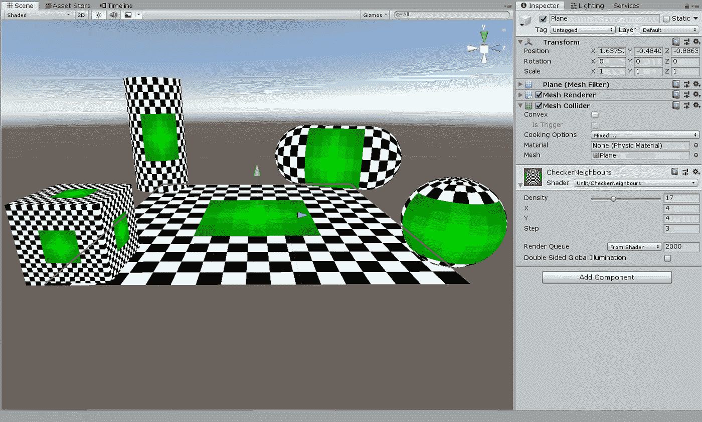
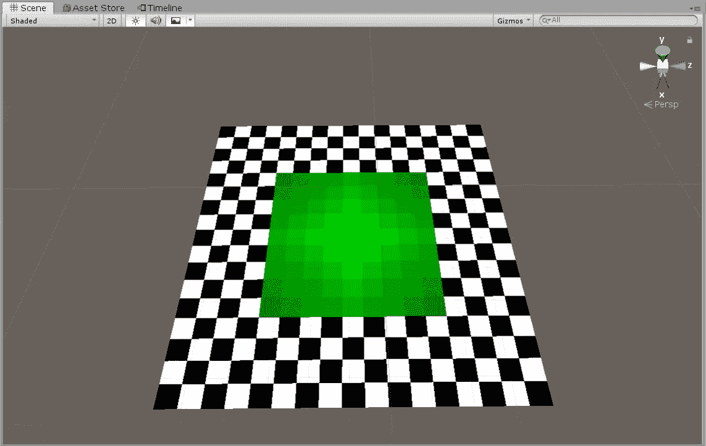
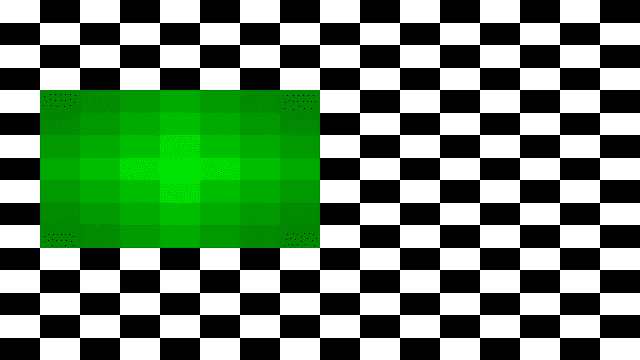
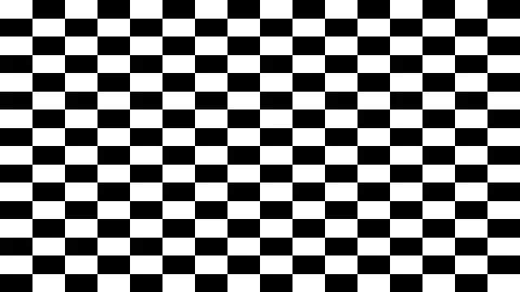
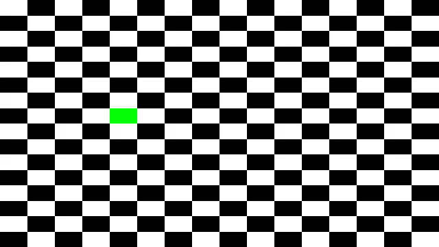
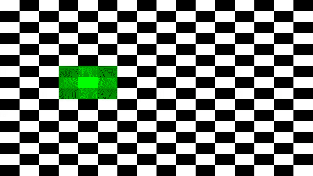
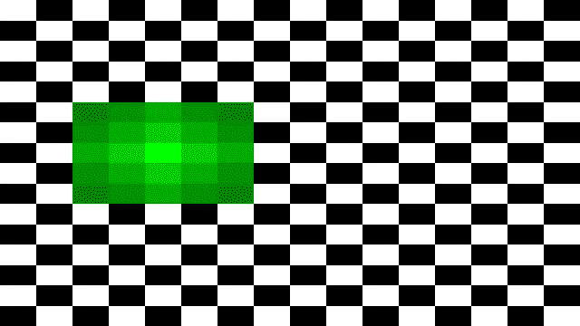

# [着色器]: kNearest 邻居

> 原文：<https://medium.com/analytics-vidhya/shader-knearest-neighbors-5700cc16d52d?source=collection_archive---------15----------------------->

通过这篇文章，我想分享我最近在寻找最近邻居方面所做的研究。



## 问题陈述:

给定一个 2d 网格，输入为 2D 坐标 X 和 Y，找出离它最近或相邻的网格单元。范围从 0 到 n。

## 输入:

从解决方案开始，我们需要以下输入:

网格大小-> X*Y 或行*列

网格单元->我们需要找到其邻居的网格单元/点的 X 和 Y 坐标

步长或范围->我们需要找到邻居的范围

## 解决方案:

解决方案以 Unity 中的着色器形式给出(在方形平面上):



也称为阴影部分(640x360)图像:



## 基础知识:

首先，我们从创建 2D 网格开始。我将使用 ShaderToy 进行 web 演示。下面的代码片段将帮助您从棋盘模式开始:

```
vec2 _GridSize = vec2(16.0, 16.0);void mainImage( out vec4 fragColor, in vec2 fragCoord )
{
 fragCoord.x *= _GridSize.x;
 fragCoord.y *= _GridSize.y;

 // Normalized pixel coordinates (from 0 to 1)
 vec2 uv = fragCoord/iResolution.xy;// Time varying pixel color
 vec3 col;
 vec2 floorVal = vec2(floor(uv.x), floor(uv.y))/2.0;
 float checkerVal = fract(floorVal.x+floorVal.y)*2.0;
 col.x = checkerVal;
 col.y = checkerVal;
 col.z = checkerVal;

 // Output to screen
 fragColor = vec4(col,1.0);
}
```



## 最近的邻居:

一旦你有了 2D 网格，我们需要接受其他的输入，开始写算法。

在计算 2D 网格时，我们知道它是行数*列数的简单数据集合。因此，当我们取一个位置 2D 网格时，它会有两个坐标 X 和 Y 作为行和列。

用这些术语思考会使计算最近邻变得非常简单。我们需要做的就是改变行号和列号来得到相邻的网格单元。我们现在用单位(1)来改变它，得到下面的坐标:

StartPos : [X，Y]

邻居:[X-1，Y]，[X+1，Y]，[X，Y-1]和[X，Y+1]；可以更进一步用[X+1，Y+1]，[X-1，Y-1]，[X-1，Y+1]和[X+1，Y-1] …

现在，使用 for 循环从 minValue 迭代到 maxValue 来覆盖我们想要选择的邻域范围更有意义。下面的代码片段将帮助您找到正在迭代的位置是否靠近输入:

```
float isNearest(vec2 pt)
{
    bool val = false;
    for (float x = (-0.5*float(_Step)); x <= (0.5*float(_Step)); x+=0.5)
    {
        for (float y = (-0.5*float(_Step)); y <= (0.5*float(_Step)); y+=0.5)
        {
            if (pt.x == _InputPos.x+x && pt.y == _InputPos.y+y)
            {
                if(_Step == 0)
                    return 1.0/(float(_Step)+1.0);
                else
                    return float(_Step)/(float(_Step) + abs(x)+abs(y));
            }
        }
    }
    return 0.0;
}
```

## 示例:

网格:16x16_InputPos : [2.0，4.0]；步骤:0



网格:16x16_InputPos : [2.0，4.0]；第一步



网格:16x16_InputPos : [2.0，4.0]；第二步



网格:16x16_InputPos : [2.0，4.0]；第三步


## 源代码:

https://www.shadertoy.com/view/tscXRf

Unity 着色器:

```
Shader "Unlit/CheckerNeighbours"
{
    Properties
    {
        _Density("Density", Range(2,50)) = 30
        _PosX("X", Float) = 1
        _PosY("Y", Float) = 1
        _Step("Step", Int) = 1
    }
    SubShader
    {
        Tags { "RenderType"="Opaque" }
        LOD 100

        Pass
        {
            CGPROGRAM
            #pragma vertex vert
            #pragma fragment frag
            #include "UnityCG.cginc"

            struct v2f
            {
                float2 uv : TEXCOORD0;
                float4 vertex : SV_POSITION;
            };

            float _Density;
            float _PosX;
            float _PosY;
            int _Step;

            v2f vert(float4 pos : POSITION, float2 uv : TEXCOORD0)
            {
                v2f o;
                o.vertex = UnityObjectToClipPos(pos);
                o.uv = uv * _Density;
                return o;
            }

            bool isOnMap(float x, float y, float2 pt)
            {
                return x == pt.x && y == pt.y;
            }

            float isNearest(float2 pt)
            {
                bool val = false;
                for (float x = (-0.5*_Step); x <= (0.5*_Step); x+=0.5)
                {
                    for (float y = (-0.5*_Step); y <= (0.5*_Step); y+=0.5)
                    {
                        if (pt.x == _PosX+x && pt.y == _PosY+y)
                        {
                            if(_Step == 0)
                                return 1.0/(_Step+1.0);
                            else
                                return _Step/(_Step + abs(x)+abs(y));
                        }
                    }
                }
                return 0;
            }

            fixed4 frag(v2f i) : SV_Target
            {
                float rows = _Density;
                float cols = _Density;

                float2 c = i.uv;
                c = floor(c) / 2;
                float checker = frac(c.x + c.y) * 2;
                if (isNearest(c))
                {
                    return float4(0.0, isNearest(c), 0.0, 1.0);
                }
                return checker;
            }
            ENDCG
        }
    }
}
```