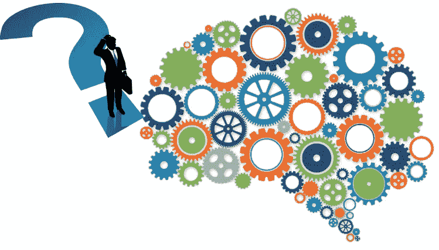
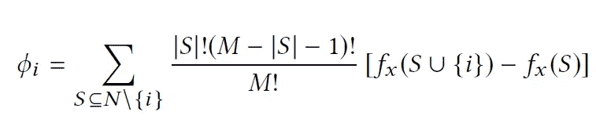

# SHAP 第一部分:SHAP 简介

> 原文：<https://medium.com/analytics-vidhya/shap-part-1-an-introduction-to-shap-58aa087a460c?source=collection_archive---------8----------------------->

图片鸣谢:[AI 是否应该自我解释](https://towardsdatascience.com/should-ai-explain-itself-or-should-we-design-explainable-ai-so-that-it-doesnt-have-to-90e75bb6089e)

## **为什么我们需要模型的可解释性？**

在我们进入问题的“为什么”部分之前，让我们理解一下什么是可解释性。虽然可解释性没有数学定义，但在机器学习文献中可以找到类似这里的启发式定义:“*可解释性是人类可以理解决策原因*的程度”，或者这里:“*可解释性是人类可以持续预测模型 result⁴* 的程度。机器学习模型的可解释性越高，人们就越容易理解为什么该模型会做出某种预测。

现在，我们已经定义了模型的可解释性，让我们来看看为什么可解释性对机器学习模型很重要。

*   *建立信任*:许多组织依靠机器学习模型来做出重要决策。例如，银行使用模型批准或拒绝向申请人提供贷款，医院评估患者的医疗状况风险，或者信用卡公司预测交易是否欺诈。如果机器学习模型也能解释它为什么做出预测，那么机器学习模型的用户会更信任这些预测。
*   *人类的好奇心&学习*:人类对他们的环境有一个心智模型，这个模型通过为他们周围发生的事件寻找解释而不断更新。黑盒机器学习模型可能会让用户感到困惑，因为它对所做的预测提供的解释很少。另一方面，可解释的机器学习模型可以促进学习，并帮助其用户对预测问题形成更好的理解和直觉。
*   *检测偏差和边缘案例*:考虑一个机器学习模型的例子，该模型用于在银行批准或拒绝贷款。模型可能会在训练数据中发现偏差，并可能歧视某些少数群体。可解释性有助于在模型开发时发现偏差。可解释性还有助于识别模型可能失败的边缘情况。例如，如果发现自动驾驶汽车中的 ML 模型使用自行车的两个轮子来检测骑自行车的人，它可能会提示我们思考如果模型看到一辆带有侧袋的自行车，轮子可能看不清楚，它会如何表现。
*   *监管要求*:欧洲的 GDPR 或美国的平等信贷机会法案等法规为个人提供了对机器学习模型做出的对他们有重大影响的决策进行解释的权利，特别是在法律或财务方面。

## 什么是 SHAP？

SHAP(SHapley Additive exPlanation)是一种解释任何机器学习模型输出的博弈论方法。**shap 的目标是将任何 xᵢ实例的预测解释为其单个特征值贡献的总和。**假设单个特征值在合作游戏中，其支出是预测。在此设置中，Shapley 值提供了一种在特征值之间公平分配支出的方法。请注意，这里的“特征值”是指 xᵢ.实例的某个特征的数值或分类值下面我们用一个简单的例子来解释这个概念。

## **什么是沙普利价值观？**

让我们假设 A、B、C、D 是联盟博弈中具有不同技能组合的四个玩家(即 A、B、C & D 在同一个队中),并且有一些支付。玩家之间分配奖金的最公平方式是什么？回答这个问题的一个方法是，认为玩家是按顺序加入群体的(例如:A>B>C>D)，然后，我们可以计算每个玩家的边际贡献，作为玩家加入群体时支出的变化。但是，可能存在影响支付计算的交互效应。例如，如果 A 和 B 有不同的技能组合，那么只有 A 和 B 的组的总支出将是以下 3 部分的总和:

*   单独用 A 支付，
*   单独用 B 支付，
*   拥有 A 和 b 的额外支出。

然而，如果我们假设 B 在 A 之后加入，那么上述算法将同时拥有 A & B 的“*额外支出完全归属于玩家 B，这是不正确的。我们发现边际贡献将取决于我们假设玩家加入群体的顺序。Shapley values 通过计算所有可能序列中每个玩家的平均边际贡献来克服这一缺点。因此，如果有 n 个玩家，则考虑 n 阶乘的可能序列。这里，我们假设可以计算任何玩家子集的支出。*

在机器学习模型的上下文中，实例 xᵢ的个体特征值是玩家，并且“*预测 yᵢ减去整个训练数据的平均预测*”是支付。可以从理论上证明 Shapley 值是唯一满足以下性质的归属方法:

1.  效率:特征贡献必须加起来是 xᵢ预测和平均预测的差。
2.  对称性:如果两个特征值 j 和 k 对所有可能的联合的贡献相等，则它们的贡献应该相同。
3.  哑元:不改变预测值的要素 j(无论它被添加到哪个要素值联盟)的 Shapley 值应该为 0。
4.  可加性:对于一个有 P₁和 P₂联合支付的游戏，他们各自的沙普利值应该是ϕ₁ᵢ + ϕ₂ᵢ.

对于具有预测函数 f(x)和 M 特征的模型，我们可以如下获得 Shapley 值:

符号:|M|是特征的总数。S 表示不包括第 I 个特征的任何特征子集，而|S|是该子集的大小。fₓ()代表模型的预测函数。

上面的公式是除了第 I 个特征值之外的所有可能的特征值子集的总和。这里，|S|！表示出现在第 I 个特征值之前的特征值的排列数。同理，(|M|-|S|-1)！表示出现在第 I 个特征值之后的特征值的排列数。上述等式中的差项是将第 I 个特征值加到 s 上的边际贡献。另请注意，上述等式要求我们计算任何特征子集的模型预测，这对于 ML 模型可能是不可行的。

## 沙普利价值公司的 SHAP

SHAP 值是上述方程在假设条件下的解: *f(xₛ) = E[f(x|xₛ)].即，对于特征值的任何子集 s 的预测是给定子集 xₛ.的 f(x)的预测的期望值*

SHAP 值的精确计算在计算上具有挑战性。SHAP 论文描述了两种与模型无关的近似方法，一种是已知的(Shapley 采样值)，另一种是新颖的&基于石灰(核 SHAP)。SHAP 论文还描述了几种特定模型类型的近似方法，如线性 SHAP、树形 SHAP、深度 SHAP 等。这些方法假设特征独立和模型线性，以简化 SHAP 值的计算。我们将在后续文章中详细探讨其中的一些方法。

**SHAP 论文的主要贡献有**:

*   确定一类新的附加特征重要性度量，它统一了六种现有的方法。
*   理论结果表明，这类方法存在一个唯一的解，并具有理想的性质。
*   用于计算特征重要性值的新方法，具有改进的计算性能和与人类直觉更好的一致性。

**链接到本系列的其他文章:**

[SHAP 第二部分:内核 SHAP](/@rakesh.melezhath/shap-part-2-kernel-shap-3c11e7a971b1)

[SHAP 第三部:树 SHAP](/@rakesh.melezhath/shap-part-3-tree-shap-3af9bcd7cd9b)

**参考文献:**

1.  [可解释的机器学习——让黑盒模型变得可解释的指南。](https://christophm.github.io/interpretable-ml-book/)
2.  SHAP:解释模式预测的统一方法。arXiv:1705.07874
3.  米勒蒂姆。"人工智能中的解释:来自社会科学的见解."arXiv 预印本 arXiv:1706.07269。(2017)
4.  Kim，Been，Rajiv Khanna，和 Oluwasanmi O. Koyejo。“例子还不够，要学会批判！对可解释性的批评。”神经信息处理系统进展(2016)。
5.  [可解释的人工智能科学&医学——微软研究院](https://www.youtube.com/watch?v=B-c8tIgchu0)
6.  [https://towards data science . com/one-feature-attribute-method-to-possible-rule-them-all-Shapley-values-f3e 04534983d](https://towardsdatascience.com/one-feature-attribution-method-to-supposedly-rule-them-all-shapley-values-f3e04534983d)