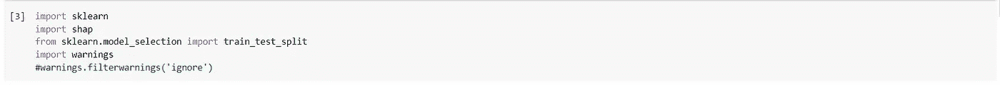

# SHAP 第 2 部分:内核 SHAP

> 原文：<https://medium.com/analytics-vidhya/shap-part-2-kernel-shap-3c11e7a971b1?source=collection_archive---------2----------------------->

核 SHAP 是一种模型不可知的方法，它使用来自 LIME 和 Shapley 值的思想来近似 SHAP 值。这是我第二篇关于 SHAP 的文章。参考我之前的文章[这里](/@rakesh.melezhath/shap-part-1-an-introduction-to-shap-58aa087a460c)是对 SHAP 的理论介绍。

## 什么是石灰？

局部可解释模型不可知解释(LIME)是一种通过建立许多可解释的局部代理模型(如线性回归)来解释黑盒机器学习模型的预测的技术。代理模型基于底层黑盒模型的预测进行训练。训练本地代理模型的方法是:

*   选择您想要了解其黑盒模型预测的相关 xᵢ实例。
*   通过扰动 xᵢ.的特征值生成新数据集对于替代模型，我们不使用 xᵢ的实际特征值，但是简化的二进制版本(zᵢ)被构造如下:如果 x∈Rᴾ是 xᵢ的原始表示，则简化的二进制版本(称为可解释表示)是 1}ᴾ.的 zᵢ∈{0 例如，如果 xᵢ = (x₁，x₂，x₃)，相应的可解释表示 zᵢ由 zᵢ = (z₁，z₂，z \u\u\u 给出，其中 z \u\u，z \u\u\u 和 z \u\u\u 可取值 0 或 1。
*   注意黑盒模型对每个扰动样本 zᵢ.的预测通过将 zᵢ映射回原始表示 Rᴾ来获得预测，如下所示:zᵢ中的‘1’被映射到实际特征值，而‘0’根据数据集的类型被映射到适当的非信息值。参考 [*了解石灰如何解释预测*](https://towardsdatascience.com/understanding-how-lime-explains-predictions-d404e5d1829c) & [*了解石灰*](https://cran.r-project.org/web/packages/lime/vignettes/Understanding_lime.html) 了解表格、文本和图像数据集的处理。SHAP KernelExplainer()函数(如下所述)将简化表示 zᵢ中的“0”替换为给定背景数据集中相应要素的随机样本值。因此，局部替代模型的独立变量是一串 1 和 0，因变量是获得的预测。然而，这种计算特征贡献的过程对特征独立性和模型线性度做出了额外的假设，至少在 xᵢ.附近是局部的
*   根据新样本与感兴趣实例的接近程度对其进行加权(xᵢ).
*   训练一个可解释的模型(如线性回归、套索、决策树等。)在这个新的数据集上。
*   通过解释局部模型(也称为解释模型)来解释黑盒模型的预测。

LIME 要求用户选择局部代理模型的复杂性和合适的核函数来为生成的数据集中的样本分配权重。下图展示了石灰背后的直觉。

石灰背后的直觉:黑盒模型决策功能由蓝色/粉色背景表示。加粗的红叉是正在解释的例子。灰色虚线表示建立的解释模型。

## 内核 SHAP:线性石灰+沙普利值

在 SHAP 的论文中，作者表明，使用加权线性回归模型作为局部代理模型和适当的加权核，石灰代理模型的回归系数估计 SHAP 值。恢复 SHAP 值的沙普利核由下式给出:

其中 M 是特征的数量& |z'|是简化输入 z '中非零特征的数量。

我们将通过 iris 数据集上的一个例子来理解 KernelExplainer 的工作原理。我们将使用 google Colab 来运行我们的代码。代码文件上传到这里: [Kernel_SHAP.ipynb](https://github.com/Rakeshsuku/Medium-Blog)

我们将使用 SHAP·克纳解释 SVM 模型。

KernelExplainer()函数的参数:

*   模型:要解释的模型。模型的输出可以是大小为 n_samples 的向量或大小为[n_samples x n_output]的矩阵(对于分类模型)。
*   数据:背景数据集，用于生成训练替代模型所需的扰动数据集。我们通过用背景数据集中的值替换特征来模拟“丢失”(在 zᵢ为“0”)。因此，如果背景数据集是全零的简单样本，那么我们将通过将其设置为零来近似缺失的特征。对于小问题，此背景数据集可以是整个训练集，但是对于大问题，可以考虑使用单个参考值或使用 kmeans 函数来汇总数据集。
*   link:将特征贡献值连接到模型输出的函数。对于分类模型，我们通常将预测概率的 logit 解释为特征贡献的总和。因此，如果“模型”(第一个参数)的输出是一个概率，我们设置 link = "logit "以获得 logit 形式的特性贡献。

接下来，我们计算 SHAP 值如下:

explainer.shap_values()函数的参数:

*   x:解释模型输出的数据集。
*   nsamples:为建立解释每个预测的代理模型而抽取的样本数。
*   l1_reg:用于选择要素以解释模型预测的 l1 正则化。可能的值为:" num _ features(<int>)"-选择固定数量的特征来解释模型预测；“AIC”/“BIC”-使用 AIC/BIC 规则进行调整；<float>-设置 sklearn.linear_model.lasso 的 alpha 参数；“自动”-当枚举少于 20%的可能样本空间时使用 AIC，否则不使用正则化。</float></int>

对于分类问题，explainer.shap_values()返回一个大小为 n_classes(类的数量)的列表。对于二元分类模型，n_classes=2(负类和正类)。该列表中的每个对象都是一个大小为[n_samples，n_features]的数组，并且对应于各个类的 SHAP 值。对于回归模型，我们得到大小为[n_samples，n_features]的单组 shap 值。这里，我们有一个 3 类分类问题，因此我们得到一个长度为 3 的列表。

**解释单个预测**

让我们解释一下测试集中第一项的预测。

link="logit "参数将 logit 值转换为概率。每个图显示了训练数据集中各个类的基本概率值。蓝色表示特征降低了概率，红色表示特征值增加了概率*。*

**解释一个以上样本的预测**

如果我们为每个样本的任何一个类别绘制上述图，将它们旋转 90 度并并排堆叠，我们可以在单个图中解释多个样本的预测(请注意，样本是按相似性排序的):

**SHAP 汇总图**
SHAP.summary_plot()可以绘制每个类的平均 shap 值，前提是提供一个 shap 值列表(分类问题的 explainer.shap_values()的输出)，如下所示:

上图表明*花瓣长度(cm)* 对所有 3 类的预测影响最大，其次是*花瓣宽度(cm)。*

如果提供了一组 shap 值(分类问题中单个类的 shap 值或回归问题的 shap 值)，shap.summary_plot()将为每个要素创建 SHAP 值的密度散点图，以确定每个要素对模型输出的影响程度。要素按所有样本的 SHAP 量值总和排序。

对于 Setosa 输出，我们看到*花瓣长度(cm)* (由蓝色圆点表示)的低值增加了样本被分类为 Setosa 的概率(高 shap 值)。

**SHAP 依赖图**

SHAP 依赖图揭示了交互作用效应。

Versicolor 输出描述了*花瓣长度(cm)* 和*花瓣宽度(cm)* 之间的相互作用。

找到这里上传的代码文件: [Kernel_SHAP.ipynb](https://github.com/Rakeshsuku/Medium-Blog) 。

**链接到本系列的其他文章:**

SHAP 第一部:SHAP 简介

[SHAP 第三部:树 SHAP](/@rakesh.melezhath/shap-part-3-tree-shap-3af9bcd7cd9b)

**参考文献:**

1.  [可解释的机器学习——让黑盒模型变得可解释的指南。](https://christophm.github.io/interpretable-ml-book/)
2.  “我为什么要相信你？”:解释任何分类器的预测。arXiv:1602.04938
3.  SHAP:解释模式预测的统一方法。arXiv:1705.07874
4.  [https://towards data science . com/understanding-how-lime-explains-predictions-d 404 e 5d 1829 c](https://towardsdatascience.com/understanding-how-lime-explains-predictions-d404e5d1829c)
5.  [https://cran . r-project . org/web/packages/lime/vignettes/Understanding _ lime . html](https://cran.r-project.org/web/packages/lime/vignettes/Understanding_lime.html)