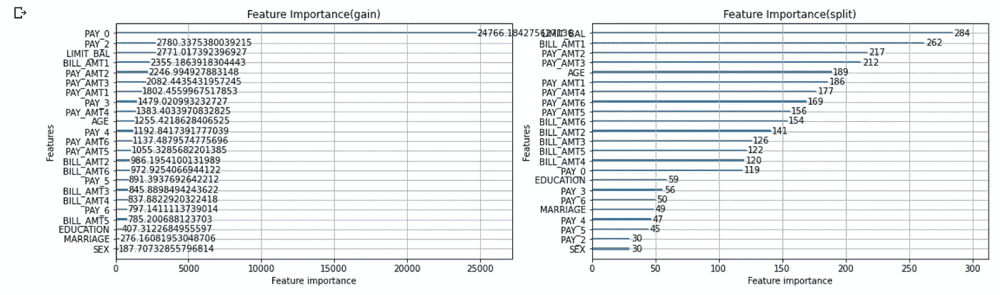
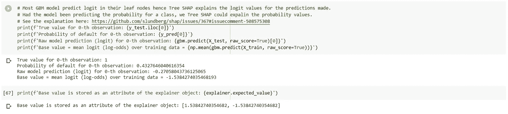
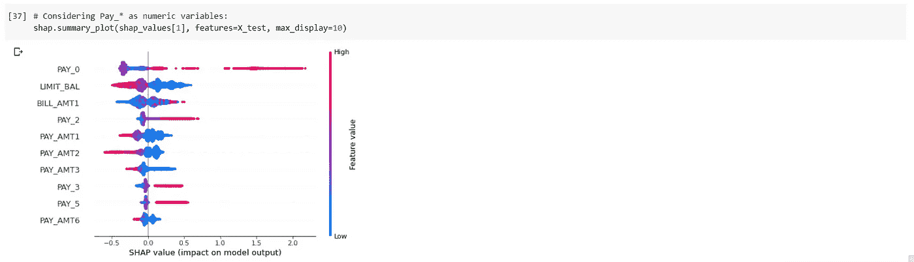

# SHAP 第三部分:树 SHAP

> 原文：<https://medium.com/analytics-vidhya/shap-part-3-tree-shap-3af9bcd7cd9b?source=collection_archive---------0----------------------->

树 SHAP 是一种为基于决策树的模型计算精确 SHAP 值的算法。SHAP(SHapley Additive exPlanation)是一种解释任何机器学习模型输出的博弈论方法。SHAP 的目标是将任何 xᵢ实例的预测解释为其单个特征值贡献的总和。参见本系列[的第一部分这里](/@rakesh.melezhath/shap-part-1-an-introduction-to-shap-58aa087a460c)对 SHAP 的简要理论介绍。

正如在第一篇文章中所解释的，SHAP 值通过以下等式获得:

符号:|M|是特征的总数。S 表示不包括第 I 个特征的任何特征子集，而|S|是该子集的大小。fₛ()代表子集 s 的模型的预测函数

让我们计算一下简单回归树的 SHAP 值，以便更好地理解算法。考虑一个由 10 个样本组成的假设数据集，其中有三个数字自变量(即:x、y、z)和一个目标变量 t。在将回归树拟合到该数据集时，我们得到了下面的树结构。看这里的代码文件:[*Tree _ SHAP _ hypothetic _ example . ipynb*](https://github.com/Rakeshsuku/Medium-Blog)。

n1，n2，n3，…，n7 代表树的节点。s 值表示落入每个节点的训练集中的样本数。

让我们计算一个由[x=150，y=75，z=200]给出的**实例 I 的 SHAP 值。**这个实例的预测是 **t=20** 。请记住，SHAP 是一种局部特征归因技术，它将模型中的每个预测解释为单个特征贡献的总和。

从本系列第一部分[SHAP 的理论解释中，我们了解到，我们可以从没有任何独立变量的零模型开始计算 SHAP 值，然后计算每个变量按顺序添加到该模型时的平均边际贡献；对所有可能的序列进行平均。因为我们这里有 3 个独立变量，所以我们必须考虑 3 个！=6 个序列。让我们计算每个序列的边际贡献。注意，SHAP 假设具有独立变量的任何子集 s 的模型的模型预测是给定子集 xₛ.的预测的期望值](/@rakesh.melezhath/shap-part-1-an-introduction-to-shap-58aa087a460c)

空模型ϕ⁰的预测值(也称为基值)=训练集的平均预测值= (50*2 + 30*2 + 20*1 + 10*5)/10 = 23

***考虑顺序:x > y > z:***

1)首先，将特征 x 添加到空模型中。注意，对于**选择的实例 i** ，我们可以仅利用该信息来计算精确的预测，因为在通向叶节点 n6 的节点(n1 & n3)中仅使用了变量 x。因此，仅具有特征 x 的模型的预测是 20。因此 x 在这个序列中的边际贡献，ϕˣ= 20–23 =-3。

2)现在，让我们将特征 y 添加到上述模型中(在步骤 1 中)。由于添加 y 不会改变所选实例 I 的预测，因此 y 在此序列中的边际贡献，ϕʸ= 20–20 = 0。

3)同样，在这个序列中 z 的边际贡献，ϕᶻ = 0。

***接下来我们来考虑序列 y > z > x:***

1)首先，特征 y 被添加到空模型。第一节点 n1 使用 x 作为分离变量，因为 x 还不可用，所以我们将预测计算为(4/10)*(来自左侧子节点 n2 的预测)+ (6/10)*(来自右侧子节点 n3 的预测)；100、60 和 40 分别是落入节点 n1、n2 和 n3 的训练样本的数量。

I)来自节点 n2 的预测:n2 使用 y 作为分割变量，因为 y 是可用的(对于实例 I，yᵢ = 75)，来自节点 n2 的预测= 50。

ii)来自节点 n3 的预测:n3 再次使用 x 作为分割变量。因此，通过类似的逻辑，预测从 n3 = (1/6)*20 + (5/6)*10= 70/6。

iii)因此，仅具有特征 y 的模型的预测是(4/10)*50 + (6/10)*(70/6) = 27。因此，y 在这个序列中的边际贡献，ϕʸ= 27–23 = 4。

2)接下来，我们将特征 z 添加到上述模型中。由于 z 在树的任何内部节点中不被用作分割变量，所以添加该特征不会以任何方式改变预测。因此在这个序列中 z 的边际贡献，ϕᶻ = 0。您可以通过遵循与步骤 1 相同的方法来验证这一点。

3)最后，我们将特征 x 添加到给出预测为 20 的模型中。因此，x 在这个序列中的边际贡献是ϕˣ= 20–27 =-7。

类似地，我们计算剩余序列的每个特征值的边际贡献:

*序列 x > z > y:* ϕˣ = -3，ϕʸ = 0，ϕᶻ = 0

*序列 z > x > y:* ϕˣ⁴ = -3，ϕʸ⁴ = 0，ϕᶻ⁴ = 0

*序列 z > y > x:* ϕˣ⁵ = -7，ϕʸ⁵ = 4，ϕᶻ⁵ = 0

*序列 y > x > z:* ϕˣ⁶ = -7，ϕʸ⁶ = 4，ϕᶻ⁶ = 0

因此，实例 I 的 SHAP 值由下式给出:

ϕˣ = (ϕˣ¹ + ϕˣ² + ϕˣ³ + ϕˣ⁴ + ϕˣ⁵ + ϕˣ⁶)/6 = (-3–7–3–3–7–7)/6 = -5

ϕʸ = (ϕʸ¹ + ϕʸ² + ϕʸ³ + ϕʸ⁴ + ϕʸ⁵ + ϕʸ⁶)/6 = (0+4+0+0+4+4)/6 = 2

ϕᶻ = (ϕᶻ¹ + ϕᶻ² + ϕᶻ³ + ϕᶻ⁴ + ϕᶻ⁵ + ϕᶻ⁶)/6 = (0+0+0+0+0+0)/6 = 0

以及对实例 I(20)=ϕ⁰+ϕˣ+ϕʸ+ϕᶻ= 23+(-5)+2+0 = 20 的预测的解释；这可以解释如下:

*在没有任何自变量信息的情况下，预测的基值为 23；知道 x=150 会使预测值减少 5，知道 y = 75 会使预测值增加 2，最终预测值为 20。知道 z = 300 对模型预测没有影响。*

SHAP 为这种解释提供了一个很好的图示，如下。蓝色表示 x 值(=150)减少了预测，红色表示 y 值(=75)增加了预测。这个例子的代码文件可以在这里找到:[*Tree _ SHAP _ 假想 _ 示例. ipynb*](https://github.com/Rakeshsuku/Medium-Blog) 。

## 实际树 SHAP 算法

上述算法的计算复杂度是 O(LT2ᴹ量级，其中 t 是树集合模型中树的数量，l 是任何树中叶子的最大数量，m 是特征的数量。在树 SHAP 的论文中，作者提出了这种算法的修改版本，它跟踪流入树的每个节点的子集的数量。改进的算法具有 O(LTD)的计算复杂度，其中 D 是树的最大深度。

## **SHAP 互动值**

SHAP 允许我们通过考虑成对的特征属性来计算相互作用的影响。这将产生一个属性值矩阵，表示所有特征对给定模型预测的影响。SHAP 相互作用效应基于博弈论的沙普利相互作用指数，由下式给出

在哪里，

上述等式表明，第 I 个特征相对于第 j 个特征的 SHAP 相互作用值可以解释为具有和不具有第 j 个特征的第 I 个特征的 SHAP 值之间的差。这允许我们使用计算 SHAP 值的算法来计算 SHAP 相互作用值。

第 I 个和第 j 个之间的 SHAP 相互作用效应被平均分割(即ϕᵢⱼ=ϕⱼᵢ),并且总的相互作用效应是ϕᵢⱼ + ϕⱼᵢ.然后，预测的主要影响可通过某个特征的 SHAP 值和 SHAP 相互作用值之和的差值获得:

## **真实数据集上的 SHAP 树**

现在让我们使用 [UCI 信用卡默认数据集](https://archive.ics.uci.edu/ml/datasets/default+of+credit+card+clients)进一步探索树 SHAP 算法。值为{0:否，1:是}的二进制变量“*下个月的违约付款*”指示客户是否已经拖欠他/她的信用卡付款，该变量是目标变量(因变量)，与客户相关的 23 个变量，如年龄、教育等以及他/她以前的账单和付款历史可用作解释变量(自变量)。从 UCI 网站了解有关数据集的更多信息。我们将使用 google colab 来运行我们的代码。找到这里上传的代码文件:[Tree _ SHAP _ UCI _ 信用卡 _ 默认. ipynb](https://github.com/Rakeshsuku/Medium-Blog) 。

让我们从安装 shap 库并加载所有需要的库开始。

接下来，从 UCI 网站下载数据集，并将数据读入熊猫数据框。请注意，我们已经删除了数据集中的 ID 列。

让我们将数据集中的解释变量可视化。

x 轴标签 0-无默认值；1-默认

图例:0-无默认值；1-默认

让我们看看目标变量的分布。

我们将在这个数据集上训练一个 lightgbm 模型。我们看到 PAY_*列的值范围从-2 到 8。因为 lightgbm 认为所有负值都是缺失值，所以我们在这些值上加 3，使范围从 1 到 11。

让我们将目标复制到一个新的变量 y 中，并将数据分成按目标变量分层的训练集和测试集。

我们现在将构建一个基线 lightgbm 模型。

现在让我们使用 hyperopt 来调整这个模型的超参数。如果你需要更多关于使用 hyperopt 的信息，请参考我的博文[这里](/analytics-vidhya/introduction-to-automatic-hyperparameter-optimization-with-hyperopt-e0b9c84d1059)。

调整后的模型给出了 78.4%的 ROC AUC。产生最佳结果的超参数值为:

让我们为找到的最佳超参数改装模型。

我们将创建测试数据集的新副本(X_test_disp ),用相应的类别值替换整数编码的类别变量，以便 SHAP 图更加直观。我们从 [UCI 网站](https://archive.ics.uci.edu/ml/datasets/default+of+credit+card+clients)获得分类级别的详细信息。记得我们给所有的 PAY_*变量加了 3。此外，我们使用“Unk_*”表示 UCI 站点中未定义的级别。

## 计算 SHAP 值

让我们计算 shap 值。

我来简单解释一下对 shap 的论证。TreeExplainer()函数。

*   模型:基于树的模型。目前树 SHAP 支持以下模型:XGBoost，LightGBM，CatBoost，py spark & scikit-learn 中大多数基于树的模型。
*   数据:用于计算树 SHAP 算法中特征变量的边际贡献的数据集。这是一个可选参数，默认值为 None。除非提供，否则将按照上面算法部分的说明使用训练数据集。
*   feature_perturbation:可以取两个值。“tree_path_dependent”是数据参数为 None 时的默认值。如果提供了数据参数，则“interventional”是默认值。干预方法使用共享数据集来计算存在相关输入要素时的条件期望。另一方面,“tree_path_dependent”方法使用训练数据集和落入每个节点的样本数，如算法部分所述。
*   model_output:使用 model_output='raw '(默认值)，SHAP 值解释来自树的叶节点的原始预测。**由于大多数梯度增强分类模型预测其叶节点中的 logit (log-odds)，** **SHAP 值默认解释 GBM 模型的 logit 预测**。这里见解释[。其他可能的值有“概率”、“log_loss”或任何模型方法名称。用“log _ loss”SHAP 值解释模型损失函数的对数。看到了吗？shap。TreeExplainer 了解更多细节。](https://github.com/slundberg/shap/issues/367#issuecomment-508575308)

对于分类问题，explainer.shap_values()返回大小为 n_classes 的列表。因为这是一个二元分类模型，n_classes=2。该列表中的每个对象都是一个大小为[n_samples，n_features]的数组，并且对应于各个类的 SHAP 值。在本例中，shap_values[1]是正分类的 shap 值(*默认下月付款=是* ) & shap_values[0]是负分类的 SHAP 值。对于回归模型，我们得到大小为[n_samples，n_features]的单组 shap 值。

**解释单个预测**

让我们解释一下测试集中第一项的预测。

训练数据集上正类的基本 logit 值为-1.538。该样本的 logit 预测值为-0.27。 *PAY_2* 其次是 *LIMIT_BAL = 5e+4。*

**解释一个以上样本的预测**

如果我们对每个样本取上面的图，将它们旋转 90 度并并排堆叠，我们可以在一个图中解释多个样本的预测:

默认情况下，样本按相似度排序。但是，我们可以将这种排序更改为按输出值排序，或按原始样本顺序排序，或按数据集中的任何数字自变量排序。颜色代码的含义与上图相同，红色特征增加了每个数据点的对数，蓝色特征减少了每个数据点的对数。

**SHAP 汇总图**
SHAP.summary_plot()可以绘制每个类的平均 shap 值，前提是提供一个 shap 值列表(分类问题的 explainer.shap_values()的输出)，如下所示:

注意，两个类的 shap_values 是二进制分类问题的加法逆。对于一个多类分类问题，上面的图会直观得多。我们也可以为我们感兴趣的类生成上面的图，如下所示。

如果提供了一组 shap 值(分类问题中单个类的 shap 值或回归问题的 shap 值)，shap.summary_plot()将为每个要素创建 SHAP 值的密度散点图，以确定每个要素对模型输出的影响程度。要素按所有样本的 SHAP 量值总和排序。

注意，对于分类数据，我们得到灰色点，因为整数编码值(对于分类变量)不能总是用于从低到高排列。但是，对于这个数据集，PAY_*变量大致对应于延迟支付的月数，因此可以用来对值进行排序。让我们绘制与上面相同的图形，将 PAY_*变量视为数字变量(我们所要做的就是用上面的 X_test 替换 X_test_disp)。

这个剧情就直观多了。我们观察到，对于所有 PAY_*变量，随着支付延迟的增加，违约的对数优势增加。还要注意，随着支付金额(PAY_AMT*)的增加，违约概率的对数下降。从上面的图中可以观察到一个令人惊讶的现象:违约概率的对数随着给定信用额度(LIMIT_BAL)的增加而降低。这可能是因为信用卡公司必须向违约概率较低的客户提供更高的信用额度。因此，具有高 LIMIT_BAL 的客户也必须具有高 PAY_AMT*值。让我们用 SHAP 依赖图进一步研究这个问题。

**SHAP 依赖图**

我们看到具有高 LIMIT_BAL 的客户也具有高 PAY_AMT1 值。对于高 LIMIT_BAL 样本，带底部的红色点簇显示了 LIMIT_BAL 与 PAY_AMT1 的相互作用效果。

我们也可以创建一个 SHAP 依赖图，分类变量如下。

SHAP 还可以选择似乎与主变量有最强相互作用的交互作用变量。让我们为对模型影响最大的前 3 个特征(平均形状值)创建一个形状依赖图。

**SHAP 互动值和互动汇总图**

LightGBM & CatBoost 模型目前不支持 SHAP 交互值，因为这些库对分类变量进行了特殊处理。关于 github 问题的评论[见此](https://github.com/slundberg/shap/issues/292#issuecomment-432835057)和[见此](https://github.com/slundberg/shap/issues/662#issuecomment-508577551)。请参见 SHAP GitHub 页面中的 [*NHANES 生存模型与 XGBoost 和 SHAP 交互值*](https://slundberg.github.io/shap/notebooks/NHANES%20I%20Survival%20Model.html) 笔记本中的用例示例。

本文的代码文件上传到这里:[Tree _ SHAP _ UCI _ 信用卡 _ 默认. ipynb](https://github.com/Rakeshsuku/Medium-Blog) 。

**链接到本系列的其他文章:**

[SHAP 第一部:SHAP 简介](/@rakesh.melezhath/shap-part-1-an-introduction-to-shap-58aa087a460c)

[SHAP 第二部分:内核 SHAP](/@rakesh.melezhath/shap-part-2-kernel-shap-3c11e7a971b1)

**参考文献**

1.  SHAP:解释模式预测的统一方法。arXiv:1705.07874
2.  树集成的一致个性化特征属性。arXiv:1802.03888 [cs。LG]
3.  [可解释的机器学习——让黑盒模型变得可解释的指南。](https://christophm.github.io/interpretable-ml-book/)
4.  [https://github.com/slundberg/shap](https://github.com/slundberg/shap)