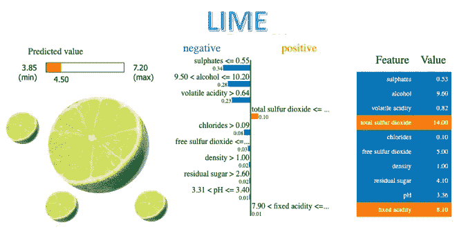
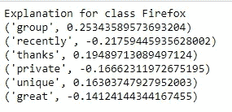
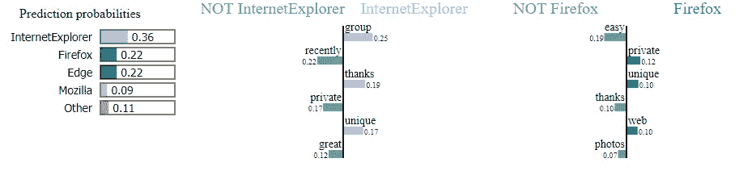
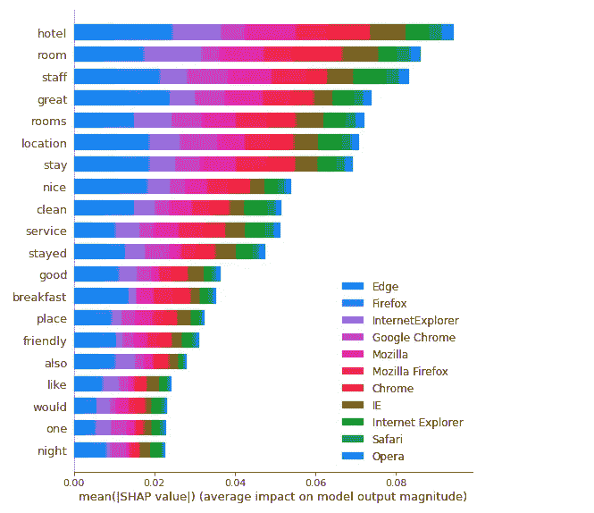

# SHAP (SHapley 附加解释)和 LIME(局部可解释模型不可知解释)用于模型可解释性。

> 原文：<https://medium.com/analytics-vidhya/shap-shapley-additive-explanations-and-lime-local-interpretable-model-agnostic-explanations-8c0aa33e91f?source=collection_archive---------4----------------------->



为什么模型的可解释性如此重要？

模拟智能在期望精度、测量生存能力和评估熟练程度方面令人兴奋。无论如何，计算机通常不会解释它们的欲望。这转化为对人工智能模型聚集的限制。如果客户不信任某个型号或需求，他们就不会使用或发送它。因此，问题是帮助客户信任模型的方法。

虽然较简单类别的模型(如线性模型和决策树)通常容易被人类理解，但对于复杂模型(如集成方法、深度神经网络)来说，情况并非如此。这种复杂的模型实际上是黑盒。理解这种分类器行为的一种方法是建立更简单的解释模型，这些模型是这些黑盒的可解释近似。

为此，在现有文献中已经提出了几种技术。莱姆和 SHAP 是两种流行的模型不可知的局部解释方法，旨在解释任何给定的黑盒分类器。这些方法通过在每个预测周围局部地学习可解释的模型(例如，线性模型),以可解释的和忠实的方式解释任何分类器的各个预测。具体来说，莱姆和 SHAP 估计个体实例的特征属性，这捕获了每个特征对黑盒预测的贡献。下面，我们提供了这些方法的一些细节，同时也强调了它们之间的关系。

## 什么是石灰？

LIME(局部可解释模型不可知解释)是一种新颖的解释技术，它通过学习预测周围的局部可解释模型，以可解释和忠实的方式解释任何分类器的预测。

## 什么是 SHAP？

SHapley 代表沙普利附加解释——很可能是机器学习合理性的前沿。Lundberg 和 Lee 在 2017 年首次发布了这种计算方法，这是一种计算任何有先见之明的计算结果的极好方法。

无论你有一个令人难以置信的模型(可能是梯度推进、神经网络或任何将一些特征作为输入并产生一些预测作为输出的东西)，你都需要理解模型正在做出什么选择，SHAP 推崇备至。

利用酒店评论分类数据集，我们将建立一个多类文本分类模型，然后分别应用*石灰* & *SHAP* 来解释该模型。因为我们以前已经做过多次文本分类，所以我们将快速构建 NLP 模型，并关注模型的可解释性。

[*LIME*](https://github.com/marcotcr/lime)&[*SHAP*](https://github.com/slundberg/shap)帮助我们不仅向最终用户，也向我们自己解释 NLP 模型是如何工作的。

# 数据预处理、特征工程和逻辑回归:

任何机器学习模型最重要的部分是从数据集中获得最佳效果

```
import pandas as pd
import numpy as np
import sklearn
import sklearn.ensemble
import sklearn.metrics
from sklearn.utils import shuffleimport refrom nltk.corpus import stopwords
from sklearn.model_selection import train_test_split
from sklearn.feature_extraction.text import CountVectorizer
from sklearn.linear_model import LogisticRegression
from sklearn.metrics import accuracy_score, f1_score, precision_score, recall_score
import lime
from lime import lime_text
from lime.lime_text import LimeTextExplainer
from sklearn.pipeline import make_pipelinedf = pd.read_csv('hotel-reviews.csv')
df.head()df = df[pd.notnull(df['Browser_Used'])]
df = df.sample(frac=0.5, random_state=99).reset_index(drop=True)
df = shuffle(df, random_state=22)
df = df.reset_index(drop=True)
df['class_label'] = df['Browser_Used'].factorize()[0]
class_label_df = df[['Browser_Used', 'class_label']].drop_duplicates().sort_values('class_label')
label_to_id = dict(class_label_df.values)
id_to_label = dict(class_label_df[['class_label', 'Browser_Used']].values)
```

文本清洗和预处理。为更好的模型解释生成干净的 CSV

```
REPLACE_BY_SPACE_RE = re.compile('[/(){}\[\]\|@,;]')
BAD_SYMBOLS_RE = re.compile('[^0-9a-z #+_]')
STOPWORDS = set(stopwords.words('english'))def clean_text(text):
    """
        text: a string

        return: modified initial string
    """
   # text = BeautifulSoup(text, "lxml").text # HTML decoding. BeautifulSoup's text attribute will return a string stripped of any HTML tags and metadata.
    text = text.lower() # lowercase text
    text = REPLACE_BY_SPACE_RE.sub(' ', text) # replace REPLACE_BY_SPACE_RE symbols by space in text. substitute the matched string in REPLACE_BY_SPACE_RE with space.
    text = BAD_SYMBOLS_RE.sub('', text) # remove symbols which are in BAD_SYMBOLS_RE from text. substitute the matched string in BAD_SYMBOLS_RE with nothing. 
    text = ' '.join(word for word in text.split() if word not in STOPWORDS) # remove stopwors from text
    return text

df['Description'] = df['Description'].apply(clean_text)
df['class_label'].value_counts()
```

# 用 LIME 解释文本预测

要了解更多信息，请参见[石灰教程](https://marcotcr.github.io/lime/tutorials/Lime%20-%20multiclass.html)。

```
c = make_pipeline(vectorizer, logreg)
class_names=list(df.Browser_Used.unique())
explainer = LimeTextExplainer(class_names=class_names)
```

目标不是产生更高的结果，而是更好的分析。

```
print ('Explanation for class %s' % class_names[0])
print ('\n'.join(map(str, exp.as_list(label=1))))
```



它给了我们***ie 浏览器*** 和 ***Firefox。***

```
exp.show_in_notebook(text=False)
```



让我试着解释一下这种形象化:

*   对于该文档，单词“组”对于类别***Internet Explorer***具有最高的正面得分。
*   我们的模型预测该文档应该以 0.25%的概率被标记为 ***组*** 。
*   另一方面，easy 对于类 Firefox 来说是负数，我们的模型已经了解到单词“private”对于类 ***firefox 来说有一个小的正数。***

# 用 SHAP 解释文本预测

以下过程是从[本教程](https://stackoverflow.blog/2019/05/06/predicting-stack-overflow-tags-with-googles-cloud-ai/)中得知的。

```
from sklearn.preprocessing import MultiLabelBinarizer
import tensorflow as tf
from tensorflow.keras.preprocessing import text
import keras.backend.tensorflow_backend as K
K.set_session
import shaptags_split = [tags.split(',') for tags in df['Browser_Used'].values]
print(tags_split[:10])tag_encoder = MultiLabelBinarizer()
tags_encoded = tag_encoder.fit_transform(tags_split)
num_tags = len(tags_encoded[0])
print(df['Description'].values[0])
print(tag_encoder.classes_)
print(tags_encoded[0])train_size = int(len(df) * .8)
print('train size: %d' % train_size)
print('test size: %d' % (len(df) - train_size))y_train = tags_encoded[: train_size]
y_test = tags_encoded[train_size:]class TextPreprocessor(object):
    def __init__(self, vocab_size):
        self._vocab_size = vocab_size
        self._tokenizer = None
    def create_tokenizer(self, text_list):
        tokenizer = text.Tokenizer(num_words = self._vocab_size)
        tokenizer.fit_on_texts(text_list)
        self._tokenizer = tokenizer
    def transform_text(self, text_list):
        text_matrix = self._tokenizer.texts_to_matrix(text_list)
        return text_matrixmodel.fit(X_train, y_train, epochs = 2, batch_size=128, validation_split=0.1)
print('Eval loss/accuracy:{}'.format(model.evaluate(X_test, y_test, batch_size = 128)))
```

*   在模型准备好之后，我们利用最初的 200 条准备记录作为我们的经验信息集合来整合并制作一个 SHAP 解释器对象。
*   我们得到了对测试集子集的奇异期望的归因尊重。
*   将索引转换为单词。
*   利用 SHAP 的 **summary_plot** 技巧来展示影响模型预期的主要亮点。

```
attrib_data = X_train[:200]
explainer = shap.DeepExplainer(model, attrib_data)
num_explanations = 40
shap_vals = explainer.shap_values(X_test[:num_explanations])words = processor._tokenizer.word_index
word_lookup = list()
for i in words.keys():
  word_lookup.append(i)word_lookup = [''] + word_lookup
shap.summary_plot(shap_vals, feature_names=word_lookup, class_names=tag_encoder.classes_)
```



*   单词“hotel”是我们的模型使用的最大信号单词，对类别 ***Edgw*** 预测贡献最大。
*   单词“rooms”是我们的模型使用的第四大信号词，当然对类 ***firefox*** 贡献最大。

就机器学习的可解释性而言，莱姆& SHAP 有很多东西需要学习。

希望这有所帮助:)

如果你喜欢我的帖子，请关注。*如需更多帮助，请查看我的* [*Github*](https://github.com/Afaf-Athar/NLP_With_Python)

通过*LinkedIn*[https://www.linkedin.com/in/afaf-athar-183621105/连接](https://www.linkedin.com/in/afaf-athar-183621105/)

快乐学习😃