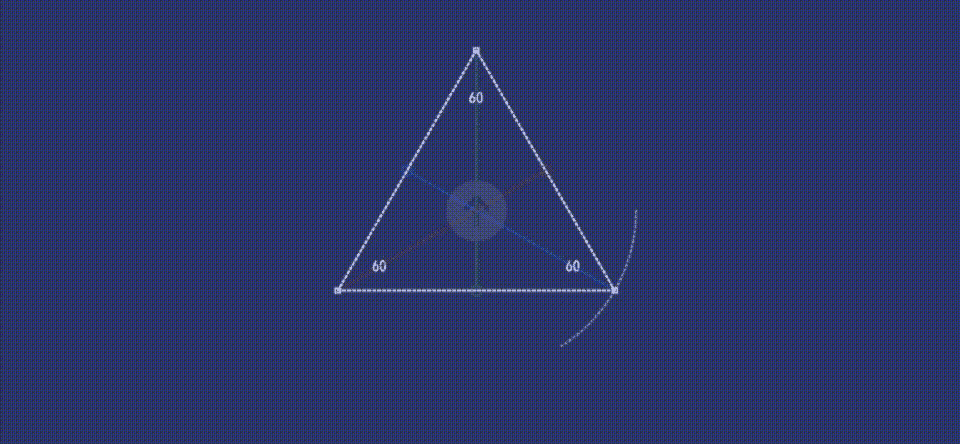

# 使用 SwiftUI 的带路径的形状第 3 部分

> 原文：<https://medium.com/analytics-vidhya/shapes-with-paths-using-swiftui-part3-4d2d988a4846?source=collection_archive---------23----------------------->

## 使用路径的形状概要

在本系列的第 1 和第 2 部分中，我讨论了等腰多边形、等边三角形、直角+左角三角形、平行四边形和梯形；使用基于圆的方法将例程放在一起构建它们。你可以在这里找到这些故事。形状，你可以变异和动画到你的心在代码中的内容。