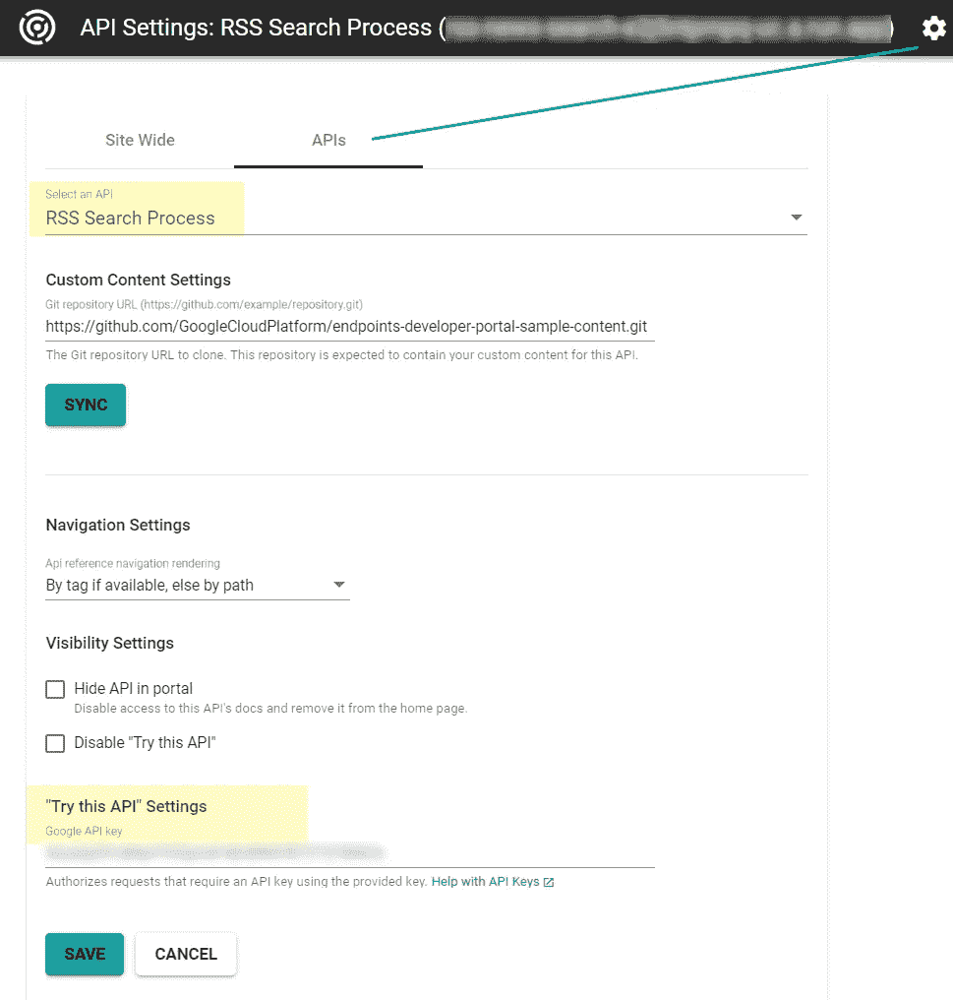

# 共享和保护您的云服务:云端点简介

> 原文：<https://medium.com/analytics-vidhya/share-and-secure-your-cloud-services-an-introduction-to-cloud-endpoints-7a3ec56eefb2?source=collection_archive---------1----------------------->

## 您是一名数据科学家或开发人员，并且您想要安全地共享模型或 Web 服务，让我们开始吧！


照片由[埃里克·沃德](https://unsplash.com/@ericjamesward?utm_source=medium&utm_medium=referral)在 [Unsplash](https://unsplash.com?utm_source=medium&utm_medium=referral) 拍摄

# 解决方案概述

为了演示如何共享和保护云服务，让我们以一个解决方案为例，该解决方案从 RSS 新闻提要*中提取数据(参见* [*上一篇文章*](/@ezzatdemnati/web-scraping-news-data-rss-feeds-python-and-google-cloud-platform-7a0df2bafe44?source=friends_link&sk=788d4a355ca31b7c2270770c929371cc) *)* ，我们希望向最终用户公开这些数据。基本上，我们希望:

*   允许授权用户**使用安全 API 启动**搜索和提取*后台进程，*
*   允许授权用户**使用第二个安全 API**访问文章。

这些功能由两个[云功能](https://cloud.google.com/functions/)实现:

1.  *publish _ RSS _ feed _ Search _ message():*通过向 [Cloud Pubsub](https://cloud.google.com/pubsub/) 主题发布事件消息来触发*搜索和提取流程*，这将启动一个涉及多个步骤的后台流程。
2.  *read_news_articles()* :从 [Cloud Firestore](https://firebase.google.com/docs/firestore) 数据库返回新闻文章。


共享和保护云服务的解决方案概述

# 云端点:它是如何工作的？

> “Endpoints 是一个 API 管理系统，它使用 Google 为自己的 API 使用的相同基础架构，帮助您保护、监控、分析和设置 API 配额。将 API 部署到端点后，您可以使用[云端点门户](https://cloud.google.com/endpoints/docs/dev-portal-overview)创建开发人员门户，API 用户可以访问该网站查看文档并与 API 交互。”[ [来源](https://cloud.google.com/endpoints/docs/) ]

云端点可用于公开不同的云服务，如云功能、应用引擎、Kubernetes、计算引擎(Docker)等。

我们将在这里介绍如何创建一个安全的 API 端点，以便向最终用户公开云功能。如果应用于其他云服务，以下步骤基本相同。

# 云端点:循序渐进

> *参考*:[https://cloud . Google . com/endpoints/docs/open API/get-started-cloud-functions](https://cloud.google.com/endpoints/docs/openapi/get-started-cloud-functions)


1.  部署云功能
2.  将 ESP 部署到云运行
3.  创建 OpenAPI 文档来描述 API 规范
4.  部署端点配置
5.  配置 ESP，以便它可以找到您的端点服务的配置
6.  授予 ESP 调用目标云函数的权限

## **部署** [**云功能**](https://cloud.google.com/functions/)

为了为我们的解决方案部署云功能，我们需要创建这两个文件:

1.  *main.py* 文件包含我们的 python 函数，
2.  *requirements.txt* 文件，列出了要安装的 python 库。在这种情况下，它将包含以下库:

```
google-cloud-pubsub== 0.41.0
pandas==0.25.1
Flask==1.0.2
```

main.py

> 私有包`mylib.gcp_cloud_util.gcp_cloud_util`封装了与 google-cloud 包(storage、pubsub、firestore 等)的交互。)以简化其可重复使用的用法。你可以参考这个公共的 Github 库来安装这个包:

 [## edemnati/public

### python setup . py sdist from GCP _ CLOUD _ util . GCP _ CLOUD _ util 导入 GCP _ CLOUD _ util CD[CLOUD _ FUNCTION _ FOLDER]pip 安装…

github.com](https://github.com/edemnati/public/tree/master/my_lib/gcp) 

让我们使用 [Google Cloud SDK](https://cloud.google.com/sdk/) 部署这个云功能:

```
gcloud functions deploy publish_rss_feed_search_message --runtime python37 --trigger-http
```

## **将 ESP 部署到云运行**

> *参考*:[https://cloud . Google . com/SDK/g cloud/Reference/beta/run/deploy](https://cloud.google.com/sdk/gcloud/reference/beta/run/deploy)
> 
> *注:*目前云运行只支持`us-central1`。

```
gcloud beta run deploy rss-news-search --image=”gcr.io/endpoints-release/endpoints-runtime-serverless:1" --[YOUR GCP PROJECT ID]  --platform managed
```

> *解释*:

*   `gcloud beta`:我们正在使用 glcoud 命令的 beta 版本，所以我们应该迁移到未来的稳定版本。
*   `rss-news-search:` 这是将在云运行中创建的服务名。它也将是云端点服务主机名的一部分。
*   `--platform managed`:这个选项意味着我们将使用完全托管版本的云运行。如果省略，gcloud 会让你选择一个目标平台(`[1] Cloud Run (fully managed), [2] Cloud Run on GKE, [3] cancel`)。

> *成功的结果应该是这样的:*

```
Deploying container to Cloud Run service [rss-news-search] in project [YOUR GCP PROJECT ID] region [us-central1]
 Deploying new service…
 Setting IAM Policy…done
 Creating Revision…done
 Routing traffic…\
 Done.
 Service [rss-news-search] revision [rss-news-search-00001] has been deployed and is serving traffic at https://[[](https://rss-news-search-e2j5ntpmpq-uc.a.run.app)GENERATED SERVICE HOSTNAME]
```

请注意，`[[](https://rss-news-search-e2j5ntpmpq-uc.a.run.app)GENERATED SERVICE HOSTNAME]`将用于设置 OpenAPI 文档中的*主机*参数。

在谷歌云控制台中，您应该看到:

*   在云运行中创建了新服务:


云运行—新增服务

*   在云端点中创建了新服务:


云端点—添加了新服务

## 创建 [OpenAPI 文档](https://swagger.io/docs/specification/2-0/basic-structure/)来描述 API 规范

参考:[*https://swagger . io/docs/specification/descripting-parameters/*](https://swagger.io/docs/specification/basic-structure/)

我们应该创建一个名为`openapi-functions.yaml`的文件。我们想要公开的每个函数都必须在`paths`部分列出。

[RSS 搜索流程— openapi-functions.yaml](https://gist.github.com/edemnati/8846462f6ba244fcaa85fa2d92f8b6ec#file-rss-search-process-openapi-functions-yaml)

> *解说*:

在*主机*部分的`host: [GENERATED SERVICE HOSTNAME]`中，您应该复制我们将 ESP 部署到云运行时生成的 URL。您也可以从云端点控制台界面获取 is。

**参数**

在`paths` 部分中，`/rsssearchprocess/start`是惟一的 API 路径名。它将连接到`host` URL 以获得完整的 API 请求 URL，比如`[https://[host][](https://rss-news-search-e2j5ntpmpq-uc.a.run.app/rsssearchprocess/start)api path]`。

> 有许多方法可以将参数传递给 API。如果我们使用 GET 操作创建一个 API，我们可以直接在 URL 中传递参数:路径参数如`/users/{id}`，或者查询参数如/ `users?role=admin`。

在我们的例子中，我们将使用 POST 操作，因此我们需要指定一个*请求体*来使用 json 格式向后端传递参数。这在 yaml 文件中由下面突出显示的选项表示:


然后我们需要描述主体模式对象:


*   `required` 部分标识强制属性。在这种情况下， *url* 、 *source* 和 *keyword* 必须非空，但是 *limit* 属性仍然是可选的。
*   对于每个属性，我们指定了一个`type`，它引用了一个[数据类型](https://swagger.io/docs/specification/data-models/data-types/)和一个`description`，后者提供了关于属性的描述性信息。我们还可以添加其他的[规范](https://swagger.io/docs/specification/data-models/data-types/)，比如`minimum`，我们在本例中使用它来为*限制*属性指定最小值 1。

> 之前的信息将作为 API 文档的一部分在端点门户中使用。

**安全**

在本例中，我们使用 API 密钥来限制 API 的使用，但是也可以使用其他认证方法。


yaml 文件的末尾描述了安全定义:

`in: “query”`意味着 API 键将作为 URL 的一部分作为查询参数传递，就像`/start?key=[YOUR_API_KEY]`


最后，`x-google-backend`部分用于定位云函数 URL: `address: [https://us-central1-[YOUR](https://us-central1-[YOUR) GCP PROJECT ID].cloudfunctions.net/[Cloud Function Name]`。

`[[YOUR](https://us-central1-[YOUR) GCP PROJECT ID]`:应该是部署云功能的项目 ID。

`[Cloud Function Name]`:应该是云函数名，就是这个例子`publish_rss_feed_search_message`。

## 部署端点配置

填写完 OpenAPI 文档后，我们应该使用以下命令部署它:

```
gcloud endpoints services deploy openapi-functions.yaml --[[YOUR](https://us-central1-[YOUR) GCP PROJECT ID]
```

## 配置 ESP，以便它可以找到您的端点服务的配置

以下命令将使用配置 ESP:

*   `rss-news-search`:云运行服务名称
*   `[GENERATED SERVICE HOSTNAME]`:云端端点服务主机名
*   `[YOUR GCP PROJECT ID]`:部署端点的项目 ID

```
gcloud beta run services update rss-news-search -- set-env-vars ENDPOINTS_SERVICE_NAME=[GENERATED SERVICE HOSTNAME] --[[YOUR](https://us-central1-[YOUR) GCP PROJECT ID] -- platform managed
```

> 如果您收到类似于`gcloud crashed (AttributeError): ‘NoneType’ object has no attribute 'revisionTemplate'`的错误，更新 gcloud 组件可能会解决问题。运行以下命令来执行此操作:`gcloud components update`
> 
> 成功的结果应该是这样的:

```
Deploying…
 Creating Revision…done
 Routing traffic…done
 Done.
 Service [rss-news-search] revision [rss-news-search-00001] is active and serving traffic at [https://](https://rss-news-search-e2j5ntpmpq-uc.a.run.app)[GENERATED SERVICE HOSTNAME]
```

## 授予 ESP 调用目标云函数的权限

以下命令将授予 ESP 使用以下命令调用云函数的权限:

`publish_rss_feed_search_message`:云功能名称

`[Default compute service account]`:进入 *IAM 控制台*找到*默认计算服务账号*

`[YOUR GCP PROJECT ID]:`部署云功能的项目 ID

```
gcloud beta functions add-iam-policy-binding publish_rss_feed_search_message --member "serviceAccount:[[](mailto:171048761773-compute@developer.gserviceaccount.com)Default compute service account] --role "roles/cloudfunctions.invoker" --project [[YOUR](https://us-central1-[YOUR) GCP PROJECT ID]
```

> *成功的结果应该是这样的:*

```
bindings:
 - members:
   - serviceAccount:[[](mailto:171048761773-compute@developer.gserviceaccount.com)Default compute service account]
   role: roles/cloudfunctions.invoker
 etag: xxxxxxxxxxx
 version: 1
```

# 云端点:如何…

## *删除云端点服务*

*   服务列表:`gcloud endpoints services list`
*   删除一个服务:`gcloud endpoints services delete [GENERATED SERVICE HOSTNAME]`

## *授予对 Enpoints 门户网站的访问权限*

参考:Ref:[https://cloud . Google . com/endpoints/docs/grpc/control-API-access](https://cloud.google.com/endpoints/docs/grpc/control-api-access)

```
gcloud beta run services add-iam-policy-binding [GENERATED SERVICE HOSTNAME] --member='[User email]'  --role='roles/run.invoker'
```

## *配置配额*

参考:[https://cloud . Google . com/endpoints/docs/open API/quotas-configure](https://cloud.google.com/endpoints/docs/openapi/quotas-configure)

# 部署第二个安全 API

前面的分步过程用于部署第二个 API，以允许授权用户访问文章。以下是这些步骤的简短总结:

> 部署云功能

```
gcloud functions deploy read_articles_firestore --runtime python37 --trigger-http
```

> 将 ESP 部署到云运行

```
gcloud beta run deploy read-news-articles --image="gcr.io/endpoints-release/endpoints-runtime-serverless:1" --allow-unauthenticated --project=[YOUR GCP PROJECT ID] --platform managed
```

> 创建 OpenAPI 文档来描述 API 规范

[阅读新闻文章— openapi-functions.yaml](https://gist.github.com/edemnati/44f8c88f8f06ef6ac2a1eca43e5ddffd#file-read-news-articles-openapi-functions-yaml)

在这种情况下，我们部署了两个接入点来测试不同的安全模型:

*   `/readnewsarticlesapi/start`:将使用 *API 键*固定，如前所示。
*   `/readnewsarticlesuser/start`:将使用 [*Firebase 认证方法*](https://cloud.google.com/endpoints/docs/openapi/authenticating-users-firebase) 进行保护。`securityDefintion` 部分应配置为:


[*Firebase 认证方法*](https://cloud.google.com/endpoints/docs/openapi/authenticating-users-firebase)

> 部署端点配置

```
gcloud endpoints services deploy openapi-functions.yaml --project [YOUR GCP PROJECT ID]
```

> 配置 ESP，以便它可以找到您的端点服务的配置

```
gcloud beta run services update read-news-articles --set-env-vars ENDPOINTS_SERVICE_NAME=[GENERATED SERVICE HOSTNAME] --project [YOUR GCP PROJECT ID] --platform managed
```

> 授予 ESP 调用目标云函数的权限

```
gcloud beta functions add-iam-policy-binding read_articles_firestore --member "serviceAccount:[[](mailto:171048761773-compute@developer.gserviceaccount.com)Default compute service account] --role "roles/cloudfunctions.invoker" --project [YOUR GCP PROJECT ID]
```

# 测试您的 API

## 端点门户

您可以从云端点控制台的*开发者门户*部分创建一个门户。创建后，您应该会看到端点门户的 URL:


如果您转到门户网站，您应该会看到您的 API 服务:


端点开发人员门户

> RSS 搜索过程

您必须将 API 密钥配置为能够通过 API 密钥保护 API。进入*设置*并输入授权的 API 密钥。



> 如果您还没有 API 密钥，请按照以下步骤创建一个:

1.  登录 GCP 控制台，进入*API&服务>凭证*


创建新的 API 密钥

2.点击创建*凭证> API 键*


API 密钥已创建

3.点击*限制键*选项，将 API 键限制在特定范围内。在这种情况下，我们将 API 键限制为只能访问我们之前创建的两个 API:


限制 API 密钥

## 让我们来测试一下！

测试端点门户 API

## 使用 Python 测试您的 API

此示例代码来自端点门户。其他示例代码可用于 cURL、HTTP、NODE。JS，Javascript，JAVA 和 PHP。

```
# Demo code sample. Not indended for production use.# See instructions for installing Requests module for Python
# [http://docs.python-requests.org/en/master/user/install/](http://docs.python-requests.org/en/master/user/install/)import requestsdef execute():
  requestUrl = "[https://](https://read-news-articles-e2j5ntpmpq-uc.a.run.app/readnewsarticlesuser/start)[GENERATED SERVICE HOSTNAME][/readnewsarticlesuser/start](https://read-news-articles-e2j5ntpmpq-uc.a.run.app/readnewsarticlesuser/start)"
  requestBody = {
    "entity": "Apple"
  }
  requestHeaders = {
    "Authorization": "Bearer [YOUR_API_KEY]",
    "Accept": "application/json",
    "Content-Type": "application/json"
  }request = requests.post(requestUrl, headers=requestHeaders, json=requestBody)print request.contentif __name__ == "__main__":
  execute()
```

# 分享你的作品

> 既然我们已经创建了安全 API，我们可以选择在 Web 应用程序中使用它们，或者与其他用户共享它们。

*   对于 API 密钥认证，我们可以创建不同的 API 密钥来跟踪用户或应用程序调用。
*   对于 Firebase 身份验证方法，您应该授权用户访问您的服务。
*   您还可以允许某人在他们自己的云项目中启用您的服务来调用 API。您需要为他们分配*服务消费者角色*。您可以使用 [gcloud commands](https://cloud.google.com/endpoints/docs/openapi/control-api-callers) 或者转到云端点控制台，选择一个服务并点击 *Permissions* 来添加成员并赋予他们*服务消费者角色*。

# 临终遗言

您的 API 也可以在*API&服务库*中看到。您可以通过私有标签过滤来查看您的 API。点击一个 API 就可以管理它。您将能够禁用它，查看一些关于流量、错误、延迟的指标，并查看哪些 API 键被授权访问它。


API 和服务屏幕


管理 API 屏幕


> 我希望你喜欢这篇文章。请分享您的意见、感受和改进...