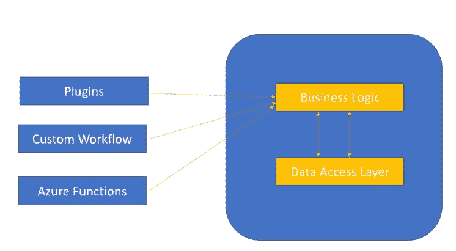
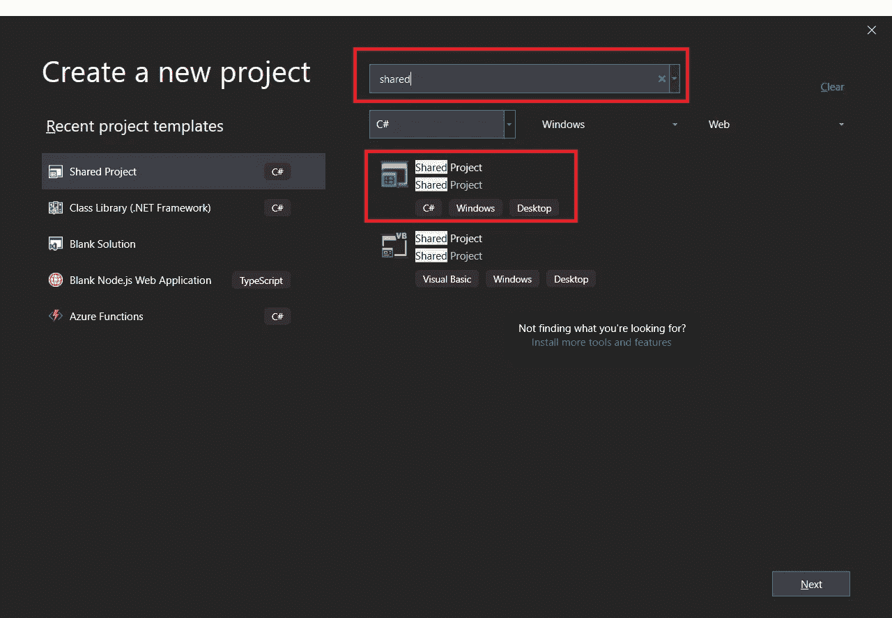
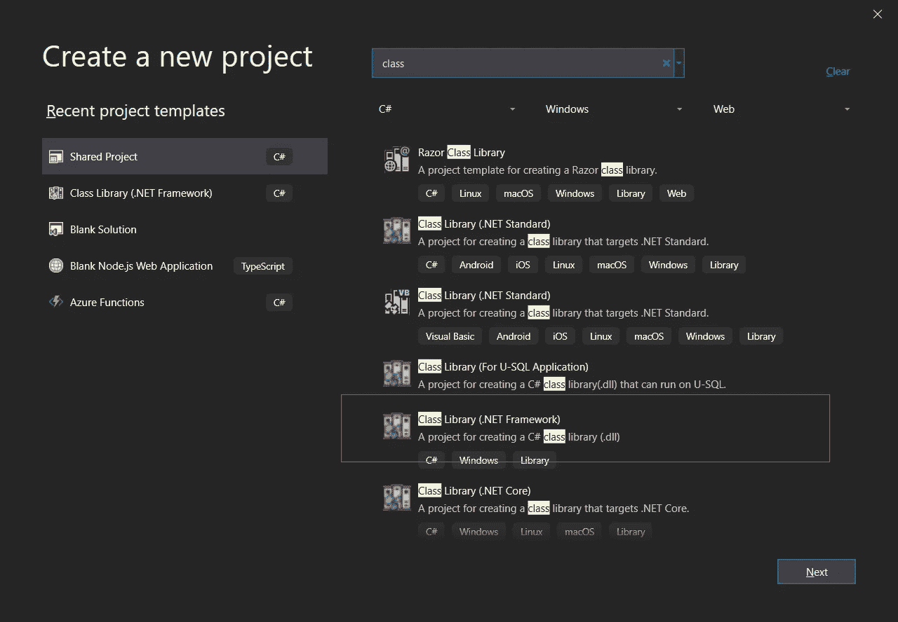
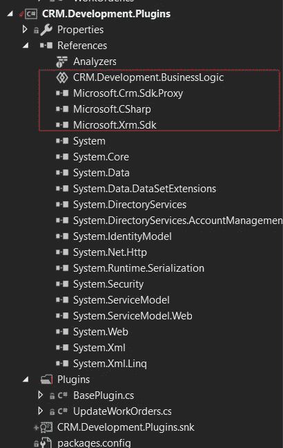
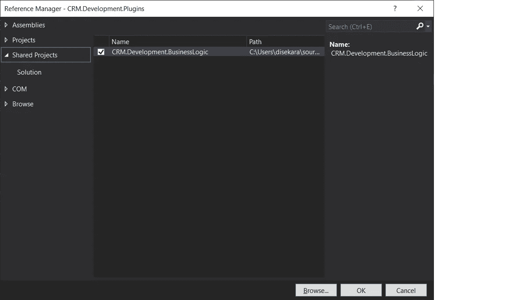
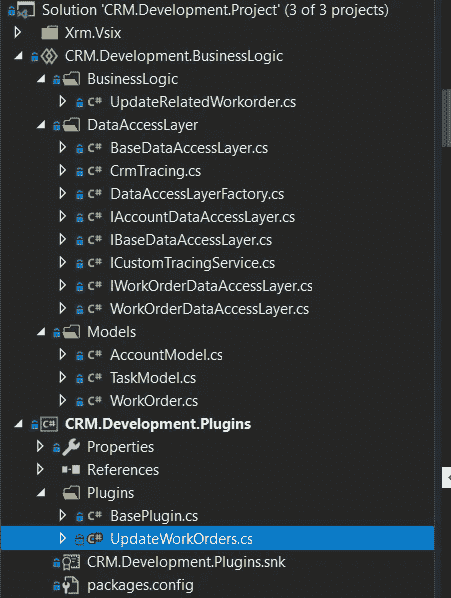
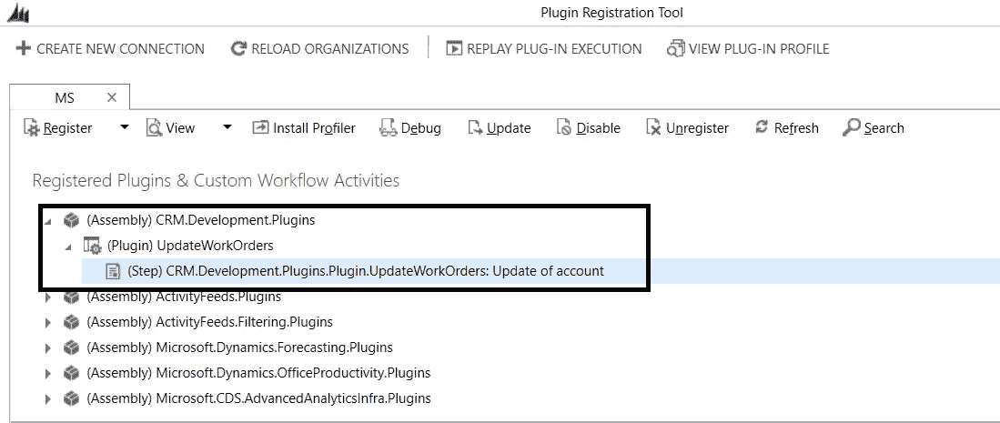
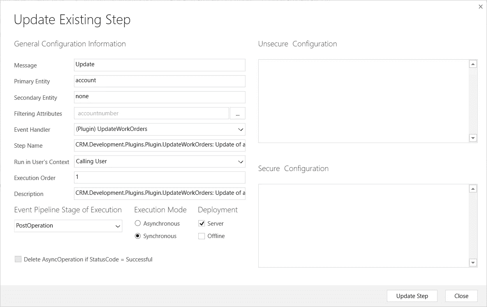

# 共享项目:Dynamics CRM 插件开发中 ILMerge 的替代方案

> 原文：<https://medium.com/analytics-vidhya/shared-project-an-alternative-to-ilmerge-in-dynamics-crm-plugin-development-94e810ae1ac2?source=collection_archive---------2----------------------->

萨法尔·萨法罗夫在 [Unsplash](https://unsplash.com?utm_source=medium&utm_medium=referral) 上拍摄的照片

# 为定制开发合并程序集是目前为止动力学领域的一大难题！！

当谈到在 CRM 中合并像 newtonsoft.json 这样的三方 dll 和插件程序集时，我们总是依赖 ILMerge，这是一个合并程序集并解决自定义插件和工作流问题的神奇工具。

*让我们来了解一下这个工具是关于什么的，它是如何解决这个问题的！！*

# 什么是 ILMerge？

ILMerge 是微软提供的一个工具，它允许将一组[程序集](http://www.blackwasp.co.uk/Assemblies.aspx)合并成一个文件。这可用于将可执行文件与其支持的动态链接库(dll)合并，以允许您将可运行程序作为单个文件分发。它还可以用于简化大型库，否则这些库将包含多个 dll，每个 dll 都需要从使用它们的项目中引用。

ILMerge 工具可以用作命令行实用工具，也可以在项目中引用并以编程方式使用。在本文中，我们将研究命令行变体提供的基本功能。

**有关 ILMerge 与 CRM 插件开发的更多信息，请参见以下链接**

*   [http://gonzaloruizcrm . blogspot . com/2016/04/including-reference-assemblies-in . html](http://gonzaloruizcrm.blogspot.com/2016/04/including-reference-assemblies-in.html)
*   [https://www . inologic . com/blog/2018/06/automate-il merge-for-workflows plugins-to-merge-multiple-assemblies-into-one-in-dynamics-365/](https://www.inogic.com/blog/2018/06/automate-ilmerge-for-workflowsplugins-to-merge-multiple-assemblies-into-one-in-dynamics-365/)

# 动态开发不再支持 ILMerge 了吗？

根据下面的博文，动态 CRM 开发现在不支持 ILMerge

[https://cloud blogs . Microsoft . com/dynamics 365/no-audience/2010/11/09/how-to-reference-assemblies-from-plug-ins/？source=crm](https://cloudblogs.microsoft.com/dynamics365/no-audience/2010/11/09/how-to-reference-assemblies-from-plug-ins/?source=crm)

**" 2015 年 8 月 31 日本文经过编辑，以反映 Dynamics CRM 不支持 ILMerge。它没有被阻止，但不支持作为引用自定义程序集的选项。**

# ILRepack 能代替 ILMerge 吗？

ILRepack 是一个允许你将多个程序集合并成一个程序集的工具。当您部署具有少量依赖项的应用程序时，这可能会很有用。在这种情况下，您可以将所有的 dll 和 exe 文件合并到一个 exe 文件中，这样更容易部署它。如果你创建一个 NuGet 包，它也是有用的。在这种情况下，它允许删除您不想向消费者公开的依赖项。例如，如果您的库依赖于 Newtonsoft。Json 在私有方法中，您可以将这个库合并到您的 dll 中，以避免将 NuGet 包作为您的 NuGet 包的依赖项公开。如果多个 NuGet 包依赖于不同版本的 Newtonsoft.Json，这可以防止一些问题。

**关于 ILRepack 以及如何配置的更多信息可以在下面的链接中找到**

*   [https://www . mezian tou . net/merging-assemblies-using-ilre pack . htm # using-ilre pack-to-me](https://www.meziantou.net/merging-assemblies-using-ilrepack.htm#using-ilrepack-to-me)
*   [https://www.nuget.org/packages/ILRepack/](https://www.nuget.org/packages/ILRepack/)
*   [https://github.com/peters/ILRepack.MSBuild.Task/issues/13](https://github.com/peters/ILRepack.MSBuild.Task/issues/13)

以及如何为 Dynamics 项目配置 ILRepack 可以在下面的链接中找到

*   [https://temmyrahajo . WordPress . com/2018/05/30/dynamic-CRM-merge-assemblies/](https://temmyraharjo.wordpress.com/2018/05/30/dynamic-crm-merge-assemblies/)
*   [https://blog . the neww . org/2019/01/10/how-to-merge-assemblies-CDs/](https://blog.thenetw.org/2019/01/10/how-to-merge-assemblies-cds/)

***让我们继续我们的主题，如何利用 Visual Studio 的本机特性来解决我们的问题！***

# 共享项目隐藏的宝石和救世主

共享项目允许您编写由许多不同的应用程序项目引用的公共代码。代码作为每个引用项目的一部分进行编译，并且可以包含编译器指令，以帮助将特定于平台的功能合并到共享代码库中。

与大多数其他项目类型不同，共享项目没有任何输出(DLL 形式)，相反，代码被编译到引用它的每个项目中。

**有关共享项目的更多信息，请参见下文**

[https://docs . Microsoft . com/en-us/xa marin/跨平台/app-fundamentals/shared-projects？选项卡=窗口](https://docs.microsoft.com/en-us/xamarin/cross-platform/app-fundamentals/shared-projects?tabs=windows)

# 在 CRM 插件开发中使用共享项目的说明

让我们来看一个简单的需求

每当账户记录中的账号发生变化时，应更新并同步各自相关的活动 WO。

**方法**:有多种方法，比如定制工作流、azure 功能，但为了让这篇文章简单，我在账户更新时采用了定制插件方法

**逻辑:**

步骤 1:获取帐户上下文

第二步:如果包含账号

步骤 3:从 PostImage 或实体中检索帐号

第四步:更新

[检索相关工单

在哪里。ServiceAccountid =帐户。帐户 ID

和 WO.statecode=Active]

喔。帐号=步骤 3 .帐号

## 让我们看看如何通过代码实现这一点，为什么这里需要一个共享项目？

我们可以只为上述逻辑的插件创建一个项目，并可以将我们所有的代码放入其中，并在 CRM 中构建和注册它，但如果我想为自定义工作流或 azure 功能重用这些代码，我需要重复相同的代码吗？这会影响我的可维护性。

这也将变得很难进行单元测试

为了解决这个问题，我们将构建以下组件，这些组件带有工厂设计模式的味道

*   业务逻辑

该组件只有业务逻辑/流程代码，直接与插件交互

*   数据访问层

该组件将拥有查询和操作业务逻辑所需的所有相关数据的所有必要逻辑

*   插件条目

该组件只有访问和处理业务逻辑所需的触发器、上下文和图像

逻辑分离

因此，我们可以将业务逻辑和数据访问层放在单独的共享项目中，如果我们想要重用，这个项目可以由工作流、单元测试项目、Azure 功能引用。帖子底部提供了详细的源代码。

第一步:在 VS 2019 中创建一个空白的解决方案

步骤 2:向解决方案添加一个新的共享项目，如下图所示

创建共享项目

步骤 3:为插件添加一个新的类库项目

插件类库

步骤 4:安装核心程序集使用包管理器获取 SDK 程序集的包

步骤 5:引用插件项目中的共享项目，如下所示

步骤 6:按照下面的代码片段为工作订单创建必要的数据模型和数据访问层

代码片段

步骤 7:从源代码中提到的插件项目中调用这个业务逻辑

步骤 8:构建插件项目并签署程序集

项目的最终结构

步骤 9:使用一个像 dotpeek 这样的反汇编器来查看插件 dll 的内部，它将包括业务逻辑项目以及下图

步骤 10:使用插件注册工具在 CRM 中注册插件程序集

第 11 步:创建一个步骤帐户实体，如下所示

该逻辑将在 CRM 中执行。

下面是代码库！

源代码:[https://github.com/sekadiv/CRM.Development.Project/](https://github.com/sekadiv/CRM.Development.Project/tree/master)