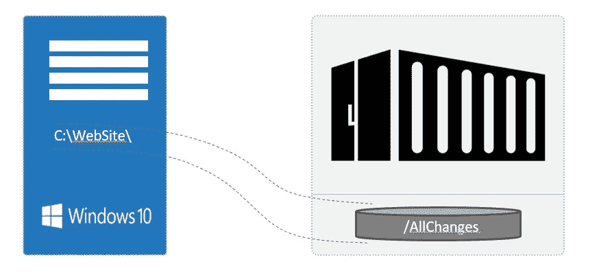

# 共享容器的 Windows 文件夹

> 原文：<https://medium.com/analytics-vidhya/sharing-windows-folders-for-containers-4539f7ed2acf?source=collection_archive---------4----------------------->

Docker 用户知道，当你从一个容器中删除或剥离时，你对该容器所做的所有更改也被删除。这使得所有的更改必须在删除或关闭之前进行保护和保存。您应该将您的更改转移到您的云或本地的安全位置。
Docker 容器与 Windows 或 MacOS 系统完全隔离。如果您想让配置文件或其他资产保持持久，或者所有的更改都必须受到保护，为此，请尝试在容器上挂载 Windows 文件夹..

那我们开始吧。您必须按照以下步骤进行设置:

1.  环境
2.  一般
3.  资源

# 环境

Docker 桌面菜单允许您配置 Docker 设置，如安装、更新、版本频道、Docker Hub 登录等。我们也要去布景。

点击通知区域的 Docker 图标打开 Docker 桌面菜单，并选择**设置**打开设置对话框:

# 一般

在设置对话框的常规选项卡上，您可以配置何时启动或更新 Docker。(我不会谈论它们，因为它们不是本文的主题。)我们必须在这里做第一次设置。

> 注意:
> 文件共享选项卡只在 Hyper-V 模式下可用，因为在 WSL 2 模式和 Windows 容器模式下所有文件都是 Windows 自动共享的。

# 资源

**资源**选项卡允许您配置 CPU、内存、磁盘、代理、网络和其他资源。根据您使用的是 WSL 2 模式下的 Linux 容器、Hyper-V 模式下的 Linux 容器还是 Windows 容器，可以使用不同的设置进行配置。

您应该使用'**文件共享**来允许 **Windows** 上的本地目录与 **Linux 容器**共享。当在容器中运行和测试代码时，这对于在主机上的 IDE 中编辑源代码特别有用。？*注意，配置文件共享对于 Windows 容器不是必需的，对于 Linux 容器才是必需的。*如果目录未与 Linux 容器共享，您可能会在运行时收到文件未找到或无法启动服务的错误。

文件共享设置为:
点击 **+** ，导航到您要添加的目录*，添加您的目录*。
**Apply & Restart** 使用 Docker 的 bind mount (-v)特性使目录对容器可用。

就是这样。

如果您想了解更多关于共享或高级设置的信息，请访问 Docker documentary。 [**点击它。**](https://docs.docker.com/docker-for-windows/#shared-drives)