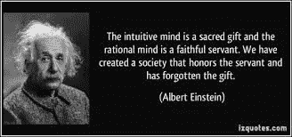

# 她对他-新的见解

> 原文：<https://medium.com/analytics-vidhya/she-vs-he-a-new-insight-d0f86b88fca0?source=collection_archive---------24----------------------->

## 单词嵌入背后的直觉以及它们如何在自然语言处理中使用

> "她与购物的关系是他的五倍."-艾。

她和他之间的差异被蓬勃发展的科技捕捉到了。


我很享受智能的互动，基本上就是文字的交流。

**目标**

我将给出一个灵感，关于单词表示能做什么。

**好玩，第一。**

为了好玩，我写了一个简单的 python 代码，在收到请求时，它几乎直接从 google 预先训练的 word2vec 模型返回响应。以下是几对请求和响应:

请求:比较('乔布斯'，' iPhone '，'盖茨'，' Windows ')

```
Response:'Jobs' is more related to 'iPhone' than 'Gates' is to 'Windows'.
Rate = 0.36 / 0.22 = 1.62 ---------- Is Jobs more dedicated?(The part following the dashed line is my joke.)
```

比较('工作'，'客户'，'盖茨')

```
'Jobs' is more related to 'customer' than 'Gates' is to 'customer'.
Rate = 0.08 / 0.06 = 1.31 ---------- Is Jobs more customer-driven?
```

请注意，这里的“相关”是指它们彼此接近，无论是正的还是负的。我们稍后会详细讨论。

我删除了请求，并简化了回复以提高可读性。所以，

```
'Apple' is more related to 'design' than 'Microsoft' is to 'design'.
Rate = 0.12 / 0.07 = 1.66 ----- Think of Apple's emphasis on design.
```

现在简化为

```
Apple : design > Microsoft : design
Rate = 0.12 / 0.07 = 1.66 
----- Greater emphasis on design.
```

**我们现在在高速公路上:**


两性相互喜欢，因为一种性别拥有另一种性别所缺乏和/或需要的特性。

```
She : eating > He : eating
Rate = 0.13 / 0.09 = 1.56  
----- She eats more often?She : movie > He : movie
Rate = 0.15 / 0.09 = 1.66  
----- Fantasy than action.She : pet > He : pet
Rate = 0.16 / 0.06 = 2.85  
----- Needs emotional exchange?She : cried > He : cried
Rate = 0.15 / 0.07 = 2.00  
----- Their tears attract men.She : sobbing > He : sobbing
Rate = 0.14 / 0.05 = 3.01  
----- Moving men's heart.He : hit > She : hit
Rate = 0.12 / 0.07 = 1.74  
----- She blows in mind, instead.She : love > He : love
Rate = 0.16 / 0.09 = 1.82  
----- Men need them.She : loves > She : works
Rate = 0.22 / 0.08 = 2.67  
----- Literature loves love.He : loves > He : works
Rate = 0.18 / 0.06 = 2.92  
----- Over her 2.67?He : loves > He : hates
Rate = 0.18 / 0.14 = 1.27 
----- Right.She : loves > She : hates
Rate = 0.22 / 0.16 = 1.37  
----- Over his 1.27.She : beach > He : beach
Rate = 0.10 / 0.05 = 1.93  
----- She excels there.She : nag > He : nag
Rate = 0.12 / 0.06 = 1.87  
----- Their lovely nagging.her : computer > his : computer
Rate = 0.10 / 0.02 = 4.73  
----- meaning office jobs.her : skirt > his : skirt
Rate = 0.18 / 0.02 = 9.03  
----- Some men wear a skirt?She : beauty > He : beauty
Rate = 0.18 / 0.05 = 3.66  
----- Their gifted power.He : stubborn > She : stubborn
Rate = 0.10 / 0.09 = 1.22  
----- Let it be so more.She : rude > He : rude
Rate = 0.13 / 0.08 = 1.54  
----- Wear a smile, thee!She : cheerful > He : cheerful
Rate = 0.17 / 0.10 = 1.66
----- Like Cinderella.She : sophisticated > He : sophisticated
Rate = 0.07 / 0.04 = 1.70  
----- Understood.He : selfish > She : selfish
Rate = 0.13 / 0.10 = 1.27  
----- Be stronger, men.She : brave > He : brave
Rate = 0.08 / 0.04 = 1.70 
----- ?She : cheated > He : cheated 
Rate = 0.10 / 0.08 = 1.27 
----- No, ...She : Facebook > He : Facebook 
Rate = 0.09 / 0.05 = 1.73 
----- She likes connection?She : Facebook > She : LinkedIn 
Rate = 0.09 / 0.02 = 4.22 
----- Connection than career.He : Facebook > He : LinkedIn 
Rate = 0.05 / 0.01 = 3.66 
----- He is less so.France : Paris > Germany : Berlin 
Rate = 0.61 / 0.58 = 1.06 
----- Exactly.He : serious > She : serious 
Rate = 0.15 / 0.09 = 1.79 
----- He is more into business.She : died > He : died
Rate = 0.03 / 0.03 = 1.00 
----- The Law of Preservation.He : manager > She : manager
Rate = 0.05 / 0.01 = 7.58 
----- Astonishing?She : studying > He : studying
Rate = 0.13 / 0.08 = 1.51 
----- More related, negatively?He : stole > She : stole 
Rate = 0.05 / 0.05 = 1.00 
----- The same.She : art > He : art 
Rate = 0.09 / 0.05 = 1.92 
----- She is an emotional artist.She : artist > He : artist 
Rate = 0.11 / 0.05 = 2.17 
----- ?She : flower > He : flower 
Rate = 0.17 / 0.07 = 2.62 
----- Exactly.flower : her > flower : him 
Rate = 0.17 / 0.07 = 2.47 
----- The same as the above.She : husband > She : shopping 
Rate = 0.35 / 0.06 = 5.60 
----- I feel relieved, now.She : husband > She : pet 
Rate = 0.35 / 0.16 = 2.21 
----- Men are preferred to a dog!She : loves > She : hates 
Rate = 0.22 / 0.16 = 1.37 
----- 1.37 at present.... ... ... there are 3 million words and phrases in the model.
```

显然，该模型似乎捕捉并“了解”了我们文化的某些方面。如果模型“知道”文化，它可以帮助自然语言任务。很鼓舞人心！


如果语言模型“了解”文化，…

我上面所做的事情背后只是一段简单的 python 代码(向我索取更多):

```
import numpy as np
import gensimdef loadModel():
    model = gensim.models.KeyedVectors.load_word2vec_format \
    ('H:/AI Works/Project5/GoogleNews-vectors-negative300.bin',\ 
    binary=True)   
    return modelrepresent = loadModel() # ex: represent['happy'] = (2, 3, ...)def norm(vector):
    return np.sum(vector * vector) ** .5def related(vector_a, vector_b):
    """ This is my intuition of similarity.
    It's more natural than the cosine similarity."""
    maxNorm = max(norm(vector_a), norm(vector_b));
    return np.sum(vector_a * vector_b)/( maxNorm ** 2)def compare(word_a, word_a1, word_b, word_b1 = -1):
    vector_a = represent[word_a]
    vector_a1 = represent[word_a1]
    related_aa1 = related(vector_a, vector_a1)

    vector_b = represent[word_b]
    if word_b1 == -1:
        word_b1 = word_a1; vector_b1 = vector_a1
    else:
        vector_b1 = represent[word_b1]
        related_bb1 = related(vector_b, vector_b1)

    if related_aa1 > related_bb1:  # don't use absolute.
        winning_word = word_a; winning_word1 = word_a1; 
        lost_word = word_b; lost_word1 = word_b1
        high = related_aa1; low = related_bb1
    else:
    #.... summary = "'" + winning_word + "' is more related to '" \
    + winning_word1 + "' than '" + lost_word + "' is to '" \
    + lost_word1 + "'." rate = high / low print(summary)
    print( 'Rate = %0.2f / %0.2f = %0.2f' % (high, low, abs(rate)) )
    return summary, high, low, rate# repeat this call with different words.
text, high, low, rate = compare('good', 'artificial', 'bad')
#or compare('boy', 'girl', 'He', 'She')
```

这些回答是基于单词向量/表示法，而这些向量/表示法又来自 google 的预训练 word2vec 模型。

那么，什么是词向量呢？还有语言表示，单词嵌入，句子嵌入？

您喜欢以下哪种简报策略？

*   单词嵌入就是以这种教条的方式产生的东西。
*   单词嵌入可以用这种直观的方式来定义和产生。

```
'fun' is more related to 'creative' than 'stern' is to 'creative'.
Rate = 0.31 / 0.06 = 5.16
```

5 次！

[跟着我看下一篇](/@fleetpro/the-power-of-yyy-fddecfc8df8a?sk=5aa36d3868e9d7207cc3eb63d7381a75)，玩得开心。

**前言延期(Postface)**

现代自然语言处理(NLP)的核心似乎是语言嵌入技术。

谷歌预训练的 word2vec 模型是对谷歌新闻数据集的提取，其中有 1000 亿个单词。你可以把 word2vec 模型想象成此刻的单词映射，把一个单词映射到地图上的一个坐标(向量，位置)。300 万个单词和短语中的每一个都被映射到 300 维地图中的一个点上。请注意，语料库是谷歌新闻，反映了当前虽然正式的话题和文化。

虽然有很多教科书般的研究论文、书籍和文章，但我在它们之间选择了一个合适的位置。他们在作品中缺少或者不关心的，往往是非常本质的，直觉的洞察力。那是我的专长。



如果计算机取代了我们理性思维的角色，我们可以像他一样快乐地保持直觉思维。

直觉和理性的头脑与左右腿相比。它们的结合是你进步的充分必要条件。

这篇文章是进入直观的方面。如果这篇文章意外地揭示了一种无意识的性别歧视态度，我不是那个意思。我想以一种令人印象深刻的方式来传达单词表示可以做什么，以便为下一篇文章铺平道路，在下一篇文章中，我将更详细地解释这项技术。

```
'unconsciously' is more related to 'sexist' than 'intentionally' is to 'sexist'.
Rate = 0.23 / 0.11 = 2.19  # it defends me:)
```

[跟着我看下一篇文章](/@fleetpro/the-power-of-yyy-fddecfc8df8a?sk=5aa36d3868e9d7207cc3eb63d7381a75)。