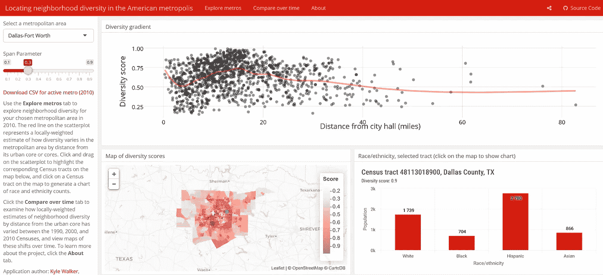
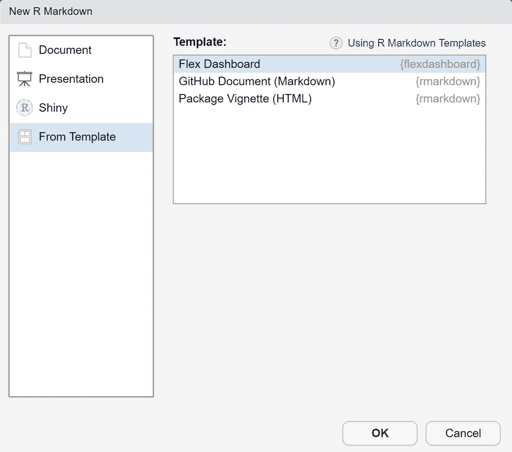
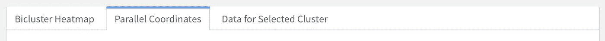
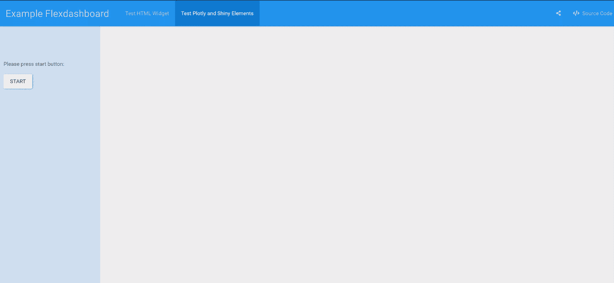

# 带 Flexdashboard 的闪亮仪表盘

> 原文：<https://medium.com/analytics-vidhya/shiny-dashboards-with-flexdashboard-e66aaafac1f2?source=collection_archive---------1----------------------->

## 快速构建漂亮的仪表板。

Flexdashboard 示例。来自 [shinyapps.io](https://walkerke.shinyapps.io/neighborhood_diversity/)

*这是不断增长的微服务数据报告系列的第一部分。关于部署 web 应用程序，特别是这个 Flexdashboard，请参见第二部分，* [***使用 Docker***](/analytics-vidhya/deploying-a-shiny-flexdashboard-with-docker-cca338a10d12) *部署闪亮的 Flexdashboard。关于使用闪亮的代理服务器在生产中大规模部署仪表板，请参见第三部分。*

*这篇文章也发表在*[*https://www.r-bloggers.com/*](https://www.r-bloggers.com/)*上。更新于 2020 年 4 月 10 日，提供关于性能改进的简短建议。*

大多数现代企业都依赖于数据。对能够持续快速地提供准确、相关且易懂的数据见解的技术人员的需求日益增长。这些需求很难满足，而且往往是相互冲突的。它们可以通过提供主要用于内部业务 KPI 的交互式数据仪表板来满足，但也可以用作与存储数据交互的方式，作为[销售平台或生产工具](/better-programming/real-life-use-cases-of-dashboards-with-actual-roi-a8d07e36f530)。R Shiny 是一个方便的框架，用于生成反应性的和强大的仪表板。我将向你展示如何通过`flexdashboard` 包轻松制作漂亮的反应灵敏的仪表盘。

在本文中，我们将构建带有闪亮元素的基本 [Flexdashboard](https://timosch.shinyapps.io/dashboard_example/) :

带 [CloudApp](https://www.getcloudapp.com/) 的 GIF。在 [Shinapps.io](https://timosch.shinyapps.io/dashboard_example/#section-test-plotly-and-shiny-elements) 上试用 Flexdashboard。

# 为什么选择 Flexdashboard？

一个 [Flexdashboard](https://rmarkdown.rstudio.com/flexdashboard/) 是从一个 Rmarkdown 文件构建的。Rmarkdown 是一个强大的框架，用于生成 HTML、PDF、Word 文档、幻灯片或制作整个网站的报告。如果您熟悉 Rmarkdown，那么您已经知道使用 markdown 语法和 CSS 来设计文档样式是多么容易。有太多的交互式 [HTML 小部件](https://www.htmlwidgets.org/)你可以使用渲染成 HTML 的 RMarkdown 文件，如交互式[数据表](https://datatables.net/extensions/)或各种 [Plotly](https://plot.ly/r/) 图，并通过[串扰](https://rstudio.github.io/crosstalk/)链接 HTML 小部件上的数据点。从本质上讲，Flexdashboard 是一个 HTML 报表，但是添加了方便样式的仪表板或幻灯片元素。更重要的是，你可以使用**闪亮的**反应式元素，让它成为一个托管在服务器上的完全反应式 web 应用。或者，您可以使用呈现为 HTML 文件的 Flexdashboard 作为仪表板格式的静态报告。

# 构建 Flexdashboard

首先安装 R 库`flexdashboard`。如果您创建一个新的 R Markdown 文档，您现在将拥有一个 Flexdashboard 模板，您可以从该模板创建您的文档。Flexdashboards 是由 YAML 标题定义的，我们将会看到这个标题。YAML 标题中的选项将配置您的 Flexdashboard 的许多细节，我们在此仅讨论最重要的部分。

**输出:**

*   **flex_dashboard:** 定义格式
*   方向:如果仪表板元素按行或列排序
*   社交:如何以及是否应该嵌入社交分享链接
*   主题:鞋样风格主题，有 14 种主题可供选择
*   source_code:源代码是否以及如何可用
*   还有许多其他重要的输出选项没有在这里使用，仅举几个例子，css:添加自定义 CSS 样式，vertical_layout:启用滚动，logo:在你的仪表板上添加 logo

**运行时:**

*   **闪亮:**启用运行反应闪亮元素

## 构建 Flexdashboard

二级降价标题`---------------`定义了具有相关宽度/高度的行和列。如果没有定义宽度/高度，则行和列被平均分割。第三级标题`###`进一步在行或列内拆分元素。您还可以像在 Rmarkdown 文档中一样在每个级别使用`{.tabset}`来获取标签集。

Tabset 示例。来自 [Rstudio Flexdashboard 指南](https://rmarkdown.rstudio.com/flexdashboard/using.html#tabsets)

对于多页 Flexdashboard，使用 1 级标题`=============`定义页面。您可以用`{data-orientation= }`覆盖 YAML 标题中的元素方向，并用`{data-icon= }`给它一个图标。每一级的标题都可以像 Rmarkdown 一样用`[linktext](#headername)`链接起来。

我们将创建一个两页仪表板。出于演示目的，第一页将一行分成大小不等的两列。第二个页面有一个默认的输入侧边栏，左侧有固定的颜色和宽度，右侧有一个大元素。请注意，我不一定需要在这里给出一个数据宽度参数，如果您在级别 1 上定义了侧边栏，您可以为所有仪表板页面定义一个全局输入侧边栏。

## 仪表板内容

我们将在第一个仪表板页面上制作来自用户 jjallaire 的 [NBA 示例 Flexdashboard](https://beta.rstudioconnect.com/jjallaire/htmlwidgets-d3heatmap/htmlwidgets-d3heatmap.html) 来演示 HTML 小部件功能。第一个代码块用于加载必要的 R 库和导入数据。

在第二页，我们将演示基本的发光反应。我们将在左侧的侧边栏中制作一个输入按钮，它在按钮按下时做出反应，并呈现一个 [Plotly](https://plot.ly/r/) 交互图形。我们用`withProgress(message= , value= {function})`在反应函数中插入一个进度条，并用`incProgress()`增加进度条。该元素增加了用户体验，尤其是当渲染图形或导入数据需要很长时间时。尝试顶部嵌入式仪表板中的按钮反应！你可以在我的 [GitHub repo](https://github.com/timosch29/Dockerized-Shiny-Proxy-Server/blob/master/example_dashboard/dashboard_example.Rmd) 上找到完整的代码。

# **部署**

现在，我们可以在本地查看仪表板进行测试。您可以使用 Rstudio 中的“Run”按钮来渲染 Rmd 文件，并在浏览器的查看器窗格中打开它，或者通过 R 命令`rmarkdown::run("pathto/dashboard_example.Rmd", shiny_args = list(port = 3838, host = "0.0.0.0"))`手动执行此操作。然后，您可以通过`http://localhost:3838`或通过`shiny_args`定义的任何其他主机和端口访问您的网络浏览器中的仪表板。

您还可以使用命令`rmarkdown::render("pathto/dashboard_example.Rmd")`将 Rmd 文件呈现为静态 HTML 文件。优点是你可以通过电子邮件将文件作为报告发送，可以是链接、附件，甚至是嵌入邮件正文。在 Flexdashboard 中制作幻灯片和制作静态报告的选项是展示您的分析结果的一种很好的方式。最大的缺点是你不能使用闪亮的反应。参见下面嵌入的静态 HTML 文件的第二页。

静态 Flexdashboard 闪亮的反应不起作用，但是互动部件是可能的。在 [Github 页面](https://timosch29.github.io/Dockerized-Shiny-Proxy-Server/example_dashboard/dashboard_example#section-test-html-widget)上试试吧。

如果你觉得这篇文章有用，不要忘了鼓掌，并关注我的更多内容！

## 基本 web 部署

对于[反应式 web 应用](https://timosch.shinyapps.io/dashboard_example/#section-test-plotly-and-shiny-elements)，Flexdashboard 需要部署在 web 服务器上。你可以在 [shinyapps.io](https://www.shinyapps.io/) 上轻松做到这一点，你需要有一个帐户来部署，你可以有五个免费版本的应用程序。部署 Rmd 文件就像部署一个闪亮的应用程序一样简单。

您可以将应用程序部署在自己的服务器上，或者作为 AWS 部署在云服务上。我建议将应用程序部署在一个Docker 容器中。在本系列文章的第二部分中，您将了解为什么以及应该如何做，这部分文章是 [**使用 Docker**](/analytics-vidhya/deploying-a-shiny-flexdashboard-with-docker-cca338a10d12) **部署闪亮的 Flexdashboard。**

## 更新:改进 Flexdashboard 的渲染时间

如果您将`runtime: shiny`改为`runtime: shiny_prerendered`，您现在可以显著提高 Flexdashboard 的反应时间。默认情况下，使用这个选项，当 Rmd 文件被渲染时，每个代码块都会被渲染一次。您应该设置 knitr chunk 选项`context="server”`来指定代码，该代码包含应用程序的反应部分，该部分根据用户交互来执行。设置为“数据”或“设置”的上下文允许在渲染和服务器上下文之间高性能地共享对象。您还可以设置一个块选项`cache=TRUE`来缓存预先计算的结果，并设置无效条件。更多信息请见[https://rmarkdown . r studio . com/authoring _ shiny _ prerendered . html](https://rmarkdown.rstudio.com/authoring_shiny_prerendered.html)。