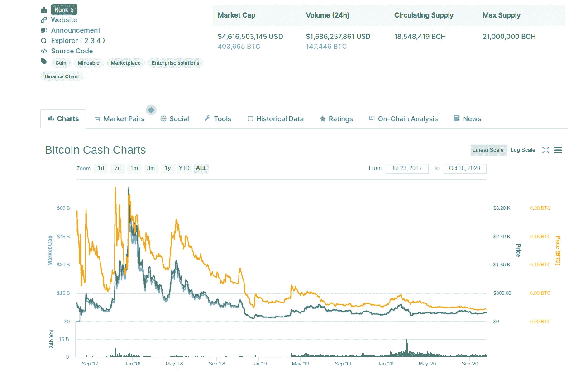
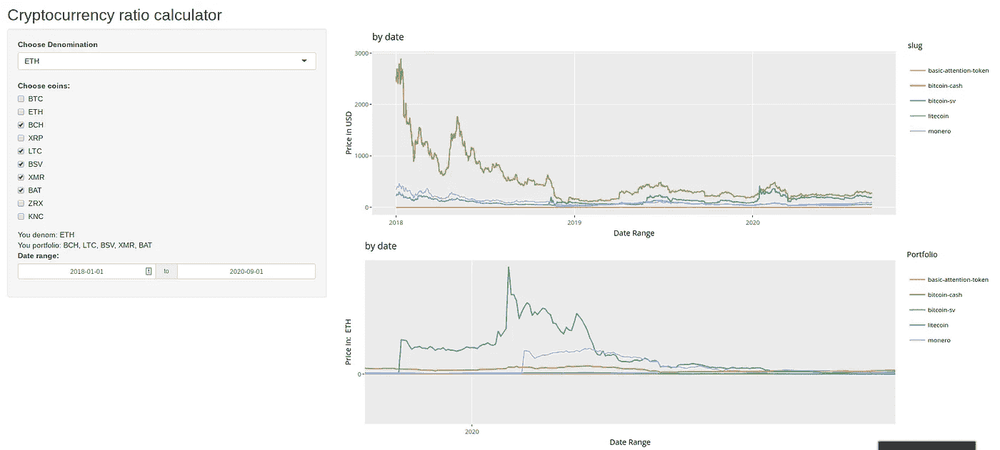

# 一个 R 语言的加密货币面额计算器

> 原文：<https://medium.com/analytics-vidhya/shinycoin-a-cryptocurrency-denomination-calculator-in-r-981f83f488d1?source=collection_archive---------13----------------------->

我们都想*赚更多的钱*但是有这么多的货币可供选择，有些人可以用一种货币“赚钱”,而用另一种货币计价则会“赔钱”。全球经济令人困惑，在混乱中加入数百种新的“替代数字货币”于事无补。

在交易中，很多时候我想看看，我的以太坊(ETH)在 Monero (XMR)方面做得如何，或者我的比特币(BTC)可以获得多少 XRM？有很多像 [CoinMarketCap](https://coinmarketcap.com/) 这样的工具，可以让我们看到每枚以美元、BTC，有时还有瑞士法郎计价的硬币，但我从来没有找到一个好的工具，可以让我选择任何我想要的面值，并一次看到多枚硬币。



到目前为止，我们已经尽力了！

所以我正在构建[闪亮的硬币](https://kyle-benzle.shinyapps.io/ShinyCoin/)，一个用 R 编写的价格可视化工具，使用了闪亮的包。虽然仍处于早期阶段，但各部分已经就绪，我们的目标是拥有一款能够实现以下功能的工具:

*   加载并保存一个用户的“投资组合”和硬币来“命名”。
*   以美元和用户计价的硬币构建投资组合的交互式图表。
*   计算比率并识别高偏差区域。
*   预测未来价格/比率回归。



ShinyCoin 0.1

整个项目在 GitHub 上是开源的[，ShinyCoin 应用程序由 Shiny here](https://github.com/KyleBenzle/ShinyCoin) 托管。我正在努力改进界面和预测部分，我还没有公开，但会喜欢任何想法或反馈。接下来，我将遍历 R 代码来生成上面的代码。

# 首先，很多图书馆

Crypto()是最重要的软件包，可以让我们下载前 100 个硬币的每日价格数据。使数据加载步骤变得非常容易。Plotly()为我们提供了交互式图形，而 lubridate()显然是用来润滑我们的日期的。

```
library(shiny)
library(crypto)
library(remotes)
library(crypto)
library(ggplot2)
library(lubridate)
library(plotly)
```

# 加载和清理数据

我们从我们想要使用的硬币列表开始，必须全部大写。然后，为了获取数据，我们使用 crypto()的 crypto_history()函数，使用硬币列表。在我的例子中，我从 csv 加载旧数据，每次只下载最新的数据来帮助提高加载速度。然后用 rbind()把两者粘在一起。实际上，你所需要的只是 crypto_history()。

```
fullCoinList <- c("BTC", "ETH", "BCH", "XRP", "LTC", "BSV", "XMR", "BAT", "ZRX", "KNC")
allCoinDataBeforeSep01 <- read.csv('allDataToSep1.csv', stringsAsFactors = FALSE)
allCoinDataAfterSep01 <- crypto_history(fullCoinList, start_date = '20200901')
allCoinDataBeforeSep01 <- dplyr::select(allCoinDataBefSep01, -1)
allCoinDataBeforeSep01$date <- as.Date(allCoinDataBeforeSep01$date)
allCoinDataAfterSep01$date <- as.Date(allCoinDataAfterSep01$date)
allCoinData <- rbind(allCoinDataBeforeSep01, allCoinDataAfterSep01)
allCoinData$date <- as.Date(allCoinData$date)
```

# 获取用户输入

在这个应用程序的“ui”功能部分，我们正在获取用户为“投资组合”输入的硬币，硬币命名的选择和日期范围。我不喜欢日期输入，格式化是一个巨大的痛苦，但它的工作，所以我离开它。这是你可以添加更多硬币选择的地方。

```
ui <- fluidPage(
  titlePanel("Cryptocurrency ratio calculator"),
    sidebarLayout(
      sidebarPanel(
        selectizeInput(inputId = "coinDenom", 
                     label = "Choose Denomination", 
                     choices = unique(fullCoinList)),

        checkboxGroupInput("coinCheckChoice", "Choose coins:",
                         choiceNames =
                           list("BTC", "ETH", "BCH", "XRP", "LTC", "BSV", "XMR", "BAT", "ZRX", "KNC"),
                         choiceValues =
                           list("BTC", "ETH", "BCH", "XRP", "LTC", "BSV", "XMR", "BAT", "ZRX", "KNC"),
                         selected='BCH'),

      textOutput('coinDenom'),
      textOutput("workingCoinList"),
      textOutput("coinCheckChoice"),
      textOutput("dateRangeStart"),
      textOutput("dateRangeEnd"),
      dateRangeInput("dateRangeInput", "Date range:",
                     start = "2018-01-01",
                     end   = "2020-09-01"),),

    mainPanel(
      plotlyOutput("distPlot"),
      plotlyOutput("distPlotRatio"),
)))
```

# 服务器功能第 1 部分

这里我们只是向用户展示他们刚刚用这两条输出语句输入了什么。

```
server <- function(input, output) {
  output$workingCoinList <- renderText({
    coinList <- paste(input$coinCheckChoice, collapse = ", ")
    paste("You portfolio: ", coinList)
  })

  output$coinDenom <- renderText({
    coinDenom <- paste(input$coinDenom)
    paste("You denom: ", coinDenom)
  })

  output$dateRangeInput <- renderText({
    dateRangeInput <- paste(input$dateRangeInput)
    paste("You date: ", dateRangeInput)
  })
```

# 服务器功能第 2 部分

输出 gg 图。Plotly 的工作方式是包装 ggplot 对象，这非常好。我选择在这里过滤日期，但是在上面单独的语句中可能会做得更好。

```
output$distPlot <- renderPlotly({
  denomPrice <- allCoinData %>% dplyr::filter(., symbol == input$coinDenom) %>% dplyr::select(., open)
  activeCoinData <- allCoinData %>% dplyr::mutate(., newOpen=(open/denomPrice$open)) 
  userDateInput <- as.Date(input$dateRangeInput) 
  activeCoinData <- activeCoinData %>% dplyr::filter(., date >= as.Date(userDateInput[1]) & date <= as.Date(userDateInput[2]))
  makeGraph(input$coinCheckChoice, userDateInput[1], userDateInput[2], activeCoinData)
  })output$distPlotRatio <- renderPlotly({
    denomPrice <- allCoinData %>% dplyr::filter(., symbol == input$coinDenom) %>% dplyr::select(., open)
    activeCoinData <- allCoinData %>% dplyr::mutate(., newOpen=(open/denomPrice$open))
    userDateInput <- as.Date(input$dateRangeInput) 
    activeCoinData <- activeCoinData %>% dplyr::filter(., date >= as.Date(userDateInput[1]) & date <= as.Date(userDateInput[2]))
    makeGraphRatio(input$coinCheckChoice, userDateInput[1], userDateInput[2], activeCoinData, input$coinDenom)
  })}shinyApp(ui = ui, server = server)
```

# 最后，makeGraph()函数

makeGraph 只是输出 ggplot 对象，并为我们的两个图提供标题和标签。

```
makeGraph <- function(coinList, startDate, endDate, df){
  df <- df %>% dplyr::filter(., symbol %in% coinList )
  graph <- ggplotly(ggplot(df, aes(x = date, y = open, col=slug))+
    geom_line() +  labs(title = "Price in BTC", y= "Price in USD", x = "Date Range") +
    ggtitle("Price in BTC"))
  return(graph)
}makeGraphRatio <- function(coinList, startDate, endDate, df, coinDenom){
  df <- df %>% dplyr::filter(., symbol %in% coinList )
  graph <- ggplotly(ggplot(df, aes(x = date, y = newOpen, col=slug))+
    geom_line() + labs(colour = "Portfolio", title = paste("Price in ", coinDenom), y= paste("Price in: ", coinDenom) , x = "Date Range") +
    ggtitle("by date"))
  return(graph)
}
```

> 仅此而已。我希望添加一个当比率超出其正常范围时的警报，因为这个工具的全部目的是帮助我在交易加密货币时赚钱；)感谢您的任何想法，也请在 Twitter 上联系[。](https://twitter.com/KyleBenzle)

## 下面是 once 块中的完整代码:

```
library(shiny)
library(crypto)
library(remotes)
library(crypto)
library(ggplot2)
library(lubridate)
library(plotly)makeGraph <- function(coinList, startDate, endDate, df){
  df <- df %>% dplyr::filter(., symbol %in% coinList )
  graph <- ggplotly(ggplot(df, aes(x = date, y = open, col=slug))+
    geom_line() +  labs(title = "Price in BTC", y= "Price in USD", x = "Date Range") +
    ggtitle("Price in BTC"))
  return(graph)
}makeGraphRatio <- function(coinList, startDate, endDate, df, coinDenom){
  df <- df %>% dplyr::filter(., symbol %in% coinList )
  graph <- ggplotly(ggplot(df, aes(x = date, y = newOpen, col=slug))+
    geom_line() + labs(colour = "Portfolio", title = paste("Price in ", coinDenom), y= paste("Price in: ", coinDenom) , x = "Date Range") +
    ggtitle("by date"))
  return(graph)
}fullCoinList <- c("BTC", "ETH", "BCH", "XRP", "LTC", "BSV", "XMR", "BAT", "ZRX", "KNC")
allCoinDataBeforeSep01 <- read.csv('allDataToSep1.csv', stringsAsFactors = FALSE)
allCoinDataAfterSep01 <- crypto_history(fullCoinList, start_date = '20200901')
allCoinDataBeforeSep01 <- dplyr::select(allCoinDataBeforeSep01, -1)
allCoinDataBeforeSep01$date <- as.Date(allCoinDataBeforeSep01$date)
allCoinDataAfterSep01$date <- as.Date(allCoinDataAfterSep01$date)
allCoinData <- rbind(allCoinDataBeforeSep01, allCoinDataAfterSep01)
allCoinData$date <- as.Date(allCoinData$date)ui <- fluidPage(
  titlePanel("Cryptocurrency ratio calculator"),
    sidebarLayout(
      sidebarPanel(
        selectizeInput(inputId = "coinDenom", 
                     label = "Choose Denomination", 
                     choices = unique(fullCoinList)),

        checkboxGroupInput("coinCheckChoice", "Choose coins:",
                         choiceNames =
                           list("BTC", "ETH", "BCH", "XRP", "LTC", "BSV", "XMR", "BAT", "ZRX", "KNC"),
                         choiceValues =
                           list("BTC", "ETH", "BCH", "XRP", "LTC", "BSV", "XMR", "BAT", "ZRX", "KNC"),
                         selected='BCH'),

      textOutput('coinDenom'),
      textOutput("workingCoinList"),
      textOutput("coinCheckChoice"),
      textOutput("dateRangeStart"),
      textOutput("dateRangeEnd"),
      dateRangeInput("dateRangeInput", "Date range:",
                     start = "2018-01-01",
                     end   = "2020-09-01"),),

    mainPanel(
      plotlyOutput("distPlot"),
      plotlyOutput("distPlotRatio"),
)))server <- function(input, output) {
  output$workingCoinList <- renderText({
    coinList <- paste(input$coinCheckChoice, collapse = ", ")
    paste("You portfolio: ", coinList)
  })

  output$coinDenom <- renderText({
    coinDenom <- paste(input$coinDenom)
    paste("You denom: ", coinDenom)
  })

  output$dateRangeInput <- renderText({
    dateRangeInput <- paste(input$dateRangeInput)
    paste("You date: ", dateRangeInput)
  })output$distPlot <- renderPlotly({
  denomPrice <- allCoinData %>% dplyr::filter(., symbol == input$coinDenom) %>% dplyr::select(., open)
  activeCoinData <- allCoinData %>% dplyr::mutate(., newOpen=(open/denomPrice$open)) 
  userDateInput <- as.Date(input$dateRangeInput) 
  activeCoinData <- activeCoinData %>% dplyr::filter(., date >= as.Date(userDateInput[1]) & date <= as.Date(userDateInput[2]))
  makeGraph(input$coinCheckChoice, userDateInput[1], userDateInput[2], activeCoinData)
  })output$distPlotRatio <- renderPlotly({
    denomPrice <- allCoinData %>% dplyr::filter(., symbol == input$coinDenom) %>% dplyr::select(., open)
    activeCoinData <- allCoinData %>% dplyr::mutate(., newOpen=(open/denomPrice$open))
    userDateInput <- as.Date(input$dateRangeInput) 
    activeCoinData <- activeCoinData %>% dplyr::filter(., date >= as.Date(userDateInput[1]) & date <= as.Date(userDateInput[2]))
    makeGraphRatio(input$coinCheckChoice, userDateInput[1], userDateInput[2], activeCoinData, input$coinDenom)
  })}shinyApp(ui = ui, server = server)
```