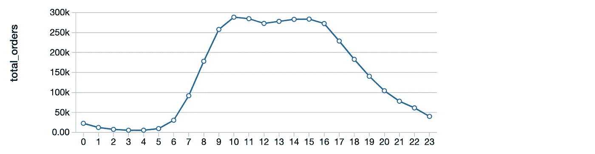
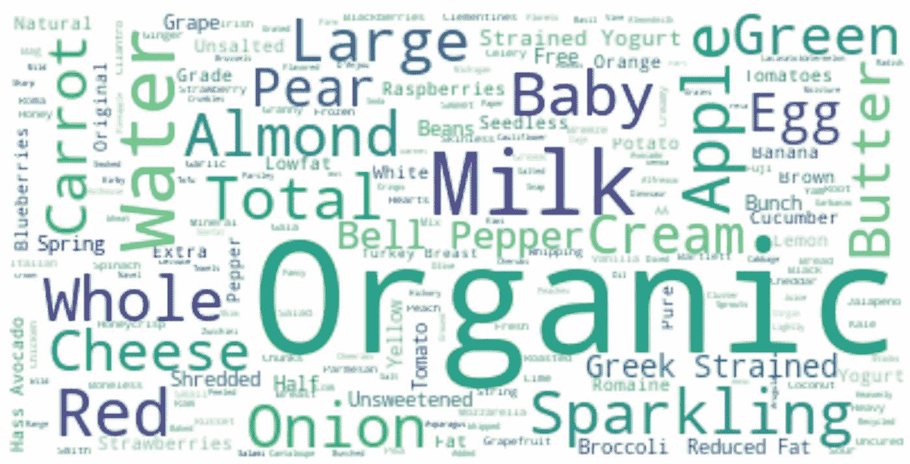

# 使用 Apache Spark 进行购物者行为探索和购物篮分析

> 原文：<https://medium.com/analytics-vidhya/shopper-behavior-exploration-and-market-basket-analysis-using-spark-650656d6a0e1?source=collection_archive---------8----------------------->


在这篇博客中，我将讲述我在一个 3MM+记录的真实 Instacart 数据集上进行的购物者行为探索。我将讨论如何在[数据块](https://databricks.com/spark/about)上使用 Apache Spark ML `FP-growth`算法快速运行您的购物篮分析。

**购物篮分析**是大型零售商用来发现商品之间关联的技术。它通过寻找经常一起购买的商品组合来工作，提供信息来理解购买行为。关联规则挖掘是用于购物篮分析的机器学习的一个非常重要的概念。我们来了解一下是什么。

# 关联规则挖掘

关联规则可以被认为是一种“如果-那么”关系。简而言之，如果客户在购物篮中有一件商品 **A** ，关联规则有助于识别客户最有可能购买的另一件商品 **B** 。例如，如果一个顾客买了面包，那么他很可能也会买黄油。

商店中有数千种不同产品的超市可以通过利用这些未开发的机会来识别所购买商品之间的关系，从而增加收入和利润。他们可以通过将经常一起购买的商品放在同一个通道，优化他们的目录设计，在他们的网站上交叉销售集体折扣的商品，以及分析客户行为分析等方式来做到这一点。

用于定义关联规则的两个重要指标是**支持度**和**置信度**。每个关联规则应该同时具有最小置信度和最小支持度，这些通常是用户指定的。

现在，让我们用 2 项(假设) ***X*** 和 ***Y*** 来看看什么是支持、信心和提升度量。


**支持:-** 支持定义为项目 ***X*** 和 ***Y*** 在总交易次数中被一起购买的频率。这个度量告诉我们一个项目集在所有事务中出现的频率。

**置信度:-** 置信度是一起购买 **X** 和 ***Y*** 的频率超过单独购买 ***X*** 的频率。

**提升:-** 提升定义为支撑超过支撑为 ***X*** 乘以支撑为 *Y* 。把 lift 想象成在知道*X*在不知道 ***X*** 存在的情况下，推车上有 ***Y*** 的概率比推车上有 ***Y*** 的概率高。**

**我将在稍后实现`FP-growth`算法时使用这些指标。**

# **资料组**

**在这篇博客中，我使用的数据集是 2017 年在 Kaggle 上发布的 **Instacart 的真实数据集**。**

***这是一个匿名数据集，包含来自 200，000 多名 Instacart 用户的 300 多万份杂货订单样本。对于每个用户，大约有 4 到 100 个订单，每个订单中有购买产品的顺序。***

**数据集可以从[这里](https://www.kaggle.com/c/instacart-market-basket-analysis/data)下载。**

# **使用的平台**

**我将使用 Apache Spark 来实现这个项目，并使用 **PySpark** 、 **SparkSql** 和后来的 **Scala** 编程语言来编码。**

**请注意，您可以通过这个[链接](https://databricks.com/spark/about)免费试用 Databricks cloud 上的 Apache Spark。**

**好了，理论到此为止，让我们来看看代码。**

## ****将所有可用文件导入 Spark 数据帧并创建临时表格****

**数据集有六种不同的。可以合并在一起进行分析的 csv 文件。首先，我在 Spark 环境中导入了所有 6 个文件，并创建了临时表来运行 Spark SQL 查询。**

**文件导入 Spark 数据框架**

**让我们看看每个导入文件的**前 5 行**以及它们的**数据字典**:**

> **`*orders*` *(3.4m 行，206k 用户):***

*   **`order_id`:订单标识符**
*   **`user_id`:客户标识符**
*   **`eval_set`:该订单属于哪个评估集**
*   **`order_number`:该用户的订单序号(1 =第一个，n =第 n 个)**
*   **`order_dow`:下订单的那一天**
*   **`order_hour_of_day`:下单当天的小时**
*   **`days_since_prior`:自上一次订单以来的天数，上限为 30 天(NAs 为`order_number` = 1)**

```
**orders.show(n=5)**
```

****

> **`*products*` *(50k 行):***

*   **`product_id`:产品标识符**
*   **`product_name`:产品名称**
*   **`aisle_id`:外键**
*   **`department_id`:外键**

```
**products.show(n=5)**
```

****

> **`*aisles*` *(134 行):***

*   **`aisle_id`:过道标识符**
*   **`aisle`:过道的名称**

```
**aisles.show(n=5)**
```

****

> **`*deptartments*` *(21 行):***

*   **`department_id`:部门标识**
*   **`department`:部门名称**

```
**departments.show(n=5)**
```

****

> **`*order_products_train*` *(131K+行):***

**向 Kaggle 参与者提供的培训数据**

```
**order_products_train.show(n=5)**
```

****

> **`*order_products_prior*` *(32MM+排):***

**该用户最近订单之前的订单数据**

```
**order_products_prior.show(n=5)**
```

****

**既然我们已经创建了数据帧并浏览了每个文件的前 5 行，让我们使用 **Spark SQL** 继续使用 **EDA，从 Instacart 数据集中寻找见解和模式。****

# **探索性数据分析**

## **顾客在一天中的什么时候购物？**

```
**df = sqlContext.sql("select count(order_id) as total_orders, order_hour_of_day as hour 
from orders 
group by order_hour_of_day 
order by order_hour_of_day")
df.show()**
```

> ***注意:使用 Databricks 笔记本，我们可以使用* `*%sql*` *在同一个 Python 笔记本中的新单元格内执行 SQL 代码。例如，上面代码片段的等价代码如下所示。***

```
**%sql
select count(order_id) as total_orders, order_hour_of_day as hour 
from orders 
group by order_hour_of_day 
order by order_hour_of_day**
```

***注:Databricks 支持笔记本单元格内各种类型的数据帧和* *SQL 可视化。你可以在这里* *了解更多关于他们的* [*。*](https://docs.databricks.com/notebooks/visualizations/index.html)**

****

****上图折线图显示，客户更有可能在上午 9 点到下午 6 点之间下单****

## ****客户多久下一次订单？****

```
****%sql
select days_since_prior_order,count(order_id) as total_orders
from orders 
group by days_since_prior_order 
order by days_since_prior_order****
```

********

****由于大多数记录都集中在 0 到 7 天之间，因此大多数客户似乎每周订购一次****

******此外，许多客户在 30 天或之后下订单，因为“days_since_prior”列的上限为 30 天******

## ******一周中的哪一天顾客购买最多？******

```
******%sql
select count(order_id) as total_orders, 
  (case 
     when order_dow = '0' then 'Sunday'
     when order_dow = '1' then 'Monday'
     when order_dow = '2' then 'Tuesday'
     when order_dow = '3' then 'Wednesday'
     when order_dow = '4' then 'Thursday'
     when order_dow = '5' then 'Friday'
     when order_dow = '6' then 'Saturday'              
   end) as day_of_week 
  from orders  
 group by order_dow 
 order by total_orders desc******
```

************

******周日和周一的订单最多，而周四的订单最少******

## ******客户在一份订单中购买多少件商品？******

******让我们通过将 products、departments、order_products_train 和 order_products_prior 数据集合并在一起来创建一个主数据集，并在其上运行查询。******

```
******%sql
create table master_table as
(select op.*,p.product_name,p.aisle_id,p.department_id,d.department from
 (select * from order_products_train 
 union
 select * from order_products_prior) as op
 inner join products as p
 on op.product_id = p.product_id
 inner join departments as d
 on p.department_id = d.department_id)%sql
select order_id,count(product_id) as total_items
from master_table 
group by order_id******
```

************

********上图显示，顾客最常购买的商品数量是 4********

**********大多数顾客更喜欢每份订单购买 1 至 15 件商品**********

## ******订单来自哪些顶级部门？******

```
******%sql
select department, count(*) as orders_count from master_table
group by department
order by orders_count desc
limit 10******
```

************

********如果我们看一下购买最多物品的前 10 个部门，我们会推断，几乎 50%的购买物品来自两个部门，即“*生产*和“*乳制品鸡蛋*********

## ********哪些是购买最多的商品？********

```
********%sql
select product_name, count(*) as orders_count from master_table
group by product_name
order by orders_count desc
limit 200********
```

****************

**********▽**这是 Instacart 客户在订单中购买的前 8 项商品。香蕉似乎是篮子里最常买的东西，其次是草莓、菠菜、鳄梨等。********

******我们也来做一个 Instacart 客户购买的前 200 件商品的词云。******

```
******# !pip install wordcloud
from wordcloud import WordCloud 
import matplotlib.pyplot as pltdf = sqlContext.sql("SELECT product_name FROM (select product_name, count(*) as orders_count from master_table group by product_name order by orders_count desc limit 200)")
df2 = df.rdd.flatMap(lambda x: x).collect()
fullStr = ' '.join(df2)wordcloud = WordCloud(background_color="white").generate(fullStr)# Display the generated image:
plt.figure(figsize=(14, 10))
plt.imshow(wordcloud, interpolation='bilinear')
plt.axis("off")
plt.show()
display()******
```

************

******从词云来看，似乎美国人购买 ***有机食品******蔬菜*** 很多，像*有机、牛奶、水、苹果、起泡酒、鸡蛋、绿色、奶酪*等词。是最受关注的。******

# ******FP-增长算法******

******FP-growth 算法在 Han 等人的论文[中进行了描述，在没有候选生成的情况下挖掘频繁模式](http://dx.doi.org/10.1145/335191.335372)，其中“FP”代表频繁模式。给定一个事务数据集，FP-growth 的第一步是计算项目频率并识别频繁项目。不同于[为同一目的设计的类似先验的](http://en.wikipedia.org/wiki/Apriori_algorithm)算法，FP-growth 的第二步使用后缀树(FP-tree)结构对事务进行编码，而无需显式生成候选集，生成候选集通常很昂贵。在第二步之后，可以从 FP-树中提取频繁项集。******

> ******你可以在这里了解更多关于 FP-growth 算法 [涉及的**步骤。**](https://www.softwaretestinghelp.com/fp-growth-algorithm-data-mining/)******

## ******按购物篮组织数据******

******为了实现 FP-growth，首先，我们将在数据集中创建每个订单的购物篮。我们将通过创建一个包含两列的 *baskets* 数据帧来实现这一点:首先是 *order_id* ，其次是以该特定订单购买的商品列表。******

******下面是要输入到 FP-growth 算法中的*篮子*数据帧的前 5 行。******

************

## ******用 Scala 实现 FP-growth 算法******

******这里，我们将使用`spark.ml`的 FP-growth 包来实现。******

******让我们从取最小支持值为 0.001 和最小置信度值为 0 开始。这两个阈值都是用户定义的。选择最小支持值，使得在我们的项目集中至少有 1 个项目，并且不需要太多的计算时间(较小的最小支持值导致更多的计算时间)。******

******生成**频繁项集**并建立**关联规则********

******现在，让我们研究一下上面生成的频繁项目集。******

```
 ******%sql
select items, freq from mostPopularItemInABasket where size(items) > 2 order by freq desc limit 20******
```

************

******篮子里最常见的物品包括有机鳄梨、有机草莓和有机香蕉。******

******思考*关联规则*的一个好方法是，模型决定了如果你购买了某样东西(即*前因*)，那么你将以如下信心购买另一样东西(即*后果*)。******

```
******%sql
select antecedent as `antecedent (if)`, consequent as `consequent (then)`, confidence from ifThen order by confidence desc limit 20******
```

************

******上述结果表明，如果顾客的篮子里有*有机覆盆子、有机鳄梨*和*有机草莓*，那么推荐有机香蕉也是有意义的。令人惊讶的是，10 大购买建议不是有机香蕉就是香蕉。******

******度量*提升*定义了项目集中*前件*和*后件*的独立程度。*Lift**>>1*表示项目之间高度依赖， *lift* *= 1* 表示项目之间相互独立，l *ift < < 1* 表示项目之间相互替代(这意味着一个项目的存在会对另一个项目的存在产生负面影响，反之亦然)。******

```
******%sql
select * **from** **ifThen** where lift > 1 order by lift desc******
```

************

******正如我们在上面的结果中看到的，其中有*关联规则*在降低*提升*的值，如果有人购买*草莓大黄酸奶*，那么也有很高的几率购买*蓝莓酸奶*。******

## ******用 PySpark 实现 FP-growth 算法******

******我们上面使用 Scala 实现的 FP-growth 算法也可以使用 PySpark 实现，其等效代码如下所示:******

# ******摘要******

******在这篇博客中，我们分析了客户的购物行为，并使用 Apache Spark 对一个庞大的数据集进行了购物篮分析。如果想在其他环境下实现购物篮分析，可以使用 Python 中的 [*apyori*](https://pypi.org/project/apyori/) 库和 R 中的 [*arules*](https://cran.r-project.org/web/packages/arules/index.html) 库用于 *Apriori 算法*。******

******好了，这篇文章就到这里。我希望你们喜欢看它，请在评论区分享你们的建议/观点/问题。******

******感谢阅读！！！******

******参考资料:-******

******I)[https://spark . Apache . org/docs/latest/ml-frequency-pattern-mining . html](https://spark.apache.org/docs/latest/ml-frequent-pattern-mining.html)******

******ii)[https://S3 . us-east-2 . Amazon AWS . com/data bricks-Denny lee/notebooks/Market+Basket+Analysis+using+insta cart+Online+杂货+Dataset.html](https://s3.us-east-2.amazonaws.com/databricks-dennylee/notebooks/Market+Basket+Analysis+using+Instacart+Online+Grocery+Dataset.html)******

******iii)[https://towards data science . com/association-rules-2-aa9a 77241654](https://towardsdatascience.com/association-rules-2-aa9a77241654)******