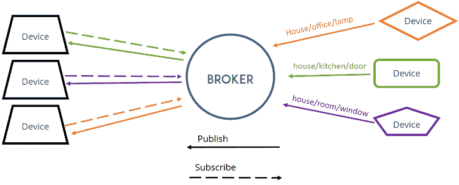

# 使用 Python 的 MQTT 简介

> 原文：<https://medium.com/analytics-vidhya/short-introduction-to-mqtt-with-python-e625c337c8f5?source=collection_archive---------5----------------------->

## 物联网

## Python 中的 MQTT 入门

本月早些时候(2019 年 12 月)，我有机会在 ComparetheMarket.com 主办的 Python 伦敦会议上发言。在考虑话题的时候，我决定谈论一些我作为业余爱好做的事情，而不是谈论一些与工作相关的事情。将我的家变成智能家居。

你们中的许多人可能听说过与物联网相关的术语 MQTT。MQTT 是一个发布/订阅协议，适用于没有大量计算和网络连接的小型设备。MQTT 代表 MQ 遥测传输，以 IBM MQ 服务命名。这已经成为机器对机器通信的标准。我不会深入讨论该协议的细节，但会向您展示一些如何在 Python 中使用它的例子。

# MQTT 概述

正如所料，MQTT 需要两种类型的组件:代理和客户机。代理负责消息的排队和分发；而客户端发布和使用消息。



图片来自[https://randomnerdtutorials . com/what-is-mqtt-and-how-it-works/](https://randomnerdtutorials.com/what-is-mqtt-and-how-it-works/)

尽管与其他著名的发布-订阅系统有一些不同。首先，MQTT 是一个非常轻量级的协议。最小的消息是 2 字节，包括协议头。当设备之间的网络带宽较低时，这一点非常重要。其次，该协议可以通过任何网络系统使用。不一定要通过 TCP/IP。您可以使用 UDP 或任何其他自定义传输层。MQTT 定义了标准和协议，而不是实现。

还有两个特性或功能符合轻量级设备的需求:支持主题层次结构和短暂主题。这些将在稍后的演示中探讨。

# 入门:设置代理

Linux 上最流行的 MQTT 代理之一是 [Mosquitto](https://mosquitto.org/) 。可以用 MacOS 上的`brew`或者 Ubuntu 上的`apt-get`。默认情况下，它监听`localhost`上的 1883 端口。一旦运行它，您将看到:

```
Config loaded from /etc/mosquitto/mosquitto.conf.                                                                          Opening ipv4 listen socket on port 1883\.                                                                                   Opening ipv6 listen socket on port 1883.
```

由于 MQTT 和 Mosquitto 代理非常轻量级，所以我在我的树莓 Pi 1B 模型上运行它，没有出现任何性能问题。

# 设置 Python

`[paho-mqtt](https://pypi.org/project/paho-mqtt/)`是一个简单易用且功能完善的 Python 库，用于使用 MQTT 协议进行通信。在 3 或 4 行 Python 代码中，您可以设置一个基本的发布者。

```
import paho.mqtt.client as mqttclient = mqtt.Client()
client.connect("localhost", 1883, 60)
topic = 'my_topic'
client.publish(topic, payload='on')
```

仅仅推送消息是不够的，让我们看看订阅者。

```
import paho.mqtt.client as mqtt# The callback for when the client receives a CONNACK response from the server.
def on_connect(client, userdata, flags, rc):
    print(f"Connected with result code {str(rc)}")# The callback for when a PUBLISH message is received from the server.
def on_message(client, userdata, msg):
    print(f"{msg.topic} {str(msg.payload)}")if __name__ == '__main__':
    client = mqtt.Client()
    client.on_connect = on_connect
    client.on_message = on_message client.connect("localhost", 1883, 60) topic = 'my_topic'
    client.subscribe(topic) client.loop_forever()
```

有两个基本功能。当客户端成功连接到代理时，调用`on_connect`。`on_message`在代理向客户端推送消息时被调用。客户端将这些注册为回调方法，然后连接到代理。一旦连接上，我们就订阅感兴趣的话题，开始一个等待消息的无限循环。这个客户机目前只是打印主题名和收到的消息。任何进一步的处理都可以添加到`on_message`方法中。

要对此进行测试，请确保 Mosquitto broker 正在运行。首先启动订阅服务器，然后运行发布服务器。一旦发布者运行，它将向主题推送一条消息，订阅者将打印该消息。你可以在你的电脑或类似 Raspberry Pi 的设备上运行。

# 短暂的话题

MQTT broker 规范提到，只有当至少有一个订阅者在监听时，消息才会被持久化。如果在消息被发送到代理时没有订阅者在监听，那么代理将丢弃这个消息。我们可以使用上面的代码看到这一点，但是我们需要改变执行的顺序。

代理运行时，确保发布者和订阅者都已停止。首先运行发布服务器，然后启动订阅服务器。希望您不会看到订户打印的任何输出消息。但是，如果您在订阅者侦听时再次运行发布者，您将再次看到您的消息。这表明如果没有订阅者在侦听，MQTT broker 会丢弃消息。您也可以对多个订户进行尝试。运行订阅者的一个实例，然后发布一条消息，然后启动订阅者的第二个实例。第一个订户将打印消息，但第二个订户不会。

这实际上非常有用，因为传感器等设备可以随着时间的推移发送大量消息。如果没有用户，那么没有必要存储*所有的*消息，然后在连接时让用户过载。在这些情况下，很可能需要忽略旧的消息，因为新的测量更准确和完整。

# 保留消息

考虑到设备和代理之间的低连接性或高连接丢失率的用例，一个很好的功能是能够调用最新的传感器值(或最后一条消息)，以便我们可以恢复任何所需的状态。为此，代理允许保留最后一条消息供任何新订户使用。为了保留消息，我们需要向`publish`调用添加一个标志。

```
client.publish(topic, payload='on', retain=True)
```

要尝试这样做，请停止所有发布者和订阅者，并保持代理运行。将`retain`标志设置为`True`，运行发布程序一次。启动订阅服务器；这应该会打印出您的消息，与我们之前的演示步骤不同。您甚至可以停止订阅者并重新运行它(不运行发布者)，这将再次打印出相同的消息。

更进一步，在订户运行时发送多条消息。然后启动订阅者的第二个实例，注意它只使用和打印最后发送的消息。

# 主题层次结构

大多数可用的消息传递系统都支持单一级别的主题。例如，Apache Kafka 的主题都在同一个顶级。它没有副主题的概念。即使用户像`level1-level2-level3`一样命名他们的主题，这也是一个 Kafka 无法解释为层次的主题的单一名称。MQTT 在协议级别支持这样的级别。每个级别由一个正斜杠`/`分隔。

用智能家居设备用例来说明这一点可能是最好的。修改上面的发布者和订阅者以使用名为`home/living_room/light`的主题。然后像以前一样启动你的订阅者并发布一条关于这个主题的消息。现在让您的订阅者保持运行，并发布一条消息到一个新主题`home/living_room/tv`。不出所料，订阅者打印了一条关于`home/living_room/light`主题的消息，但没有打印出`home/living_room/tv`主题的消息。

所以它的行为和卡夫卡或其他任何信息系统一样。但是让我们来看一个有趣的例子。

启动订阅者，听`home/living_room/+`话题。对，就是名字末尾的一个`+`。然后就以下话题发消息(不分先后):`home/living_room/light`和`home/living_room/tv`。订户将打印出两个主题的消息。**`**+**`**是 MQTT** 中单个级别的通配符。**

**同样可以订阅`home/+/light`，发布消息到主题:`home/living_room/light`和`home/bedroom/light`。但是，该用户不会从`home/living_room/tv`开始消费。**

**现在，我们可以通过房间或所有房间的设备类型来收听来自设备的消息。如果你想听来自**所有**主题的消息，而不考虑层级，该怎么办？**

**只需订阅`#`话题。这将消耗来自所有主题的消息。这对于发现新设备或调试和故障排除非常有用。这方面的一个例子是[家庭助理 MQTT 发现特性](https://www.home-assistant.io/docs/mqtt/discovery/)，它通过模板主题名称`<discovery_prefix>/<component>/[<node_id>/]<object_id>/config`识别和配置设备。您可以看到这些级别如何定义一个层次结构，该层次结构可以轻松地允许用户监听特定的组件类型或特定的节点和对象。**

**我希望这是一个有用的介绍，您可以在下面的 Github 库中找到代码:**

**[](https://github.com/atharvai/mqtt_demo_python) [## atharvai/mqtt_demo_python

### 通过在 GitHub 上创建一个帐户，为 atharvai/mqtt_demo_python 开发做贡献。

github.com](https://github.com/atharvai/mqtt_demo_python)**