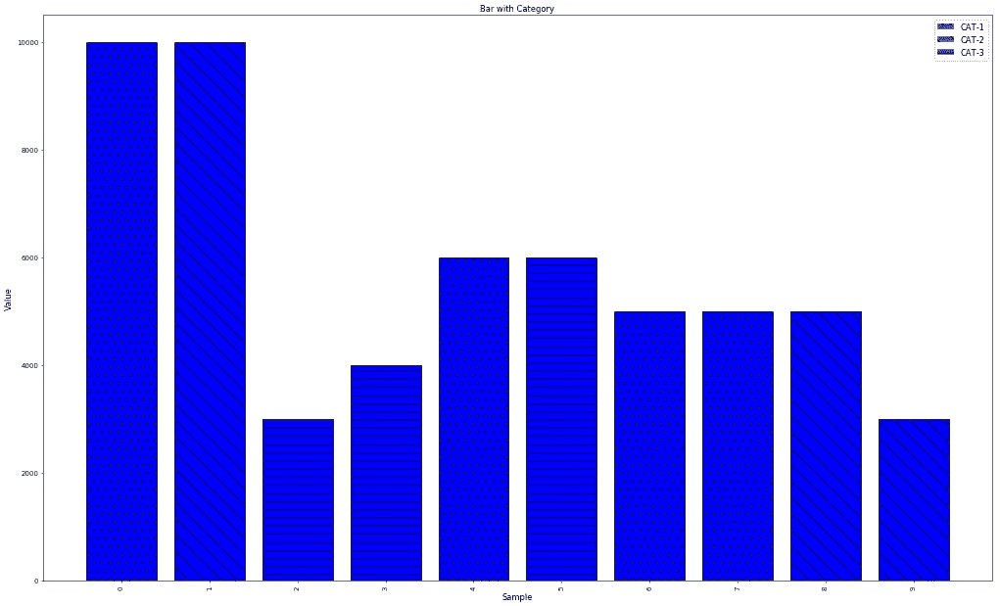

# 使用 Matplotlib 在条形图中显示分类数据

> 原文：<https://medium.com/analytics-vidhya/show-categorical-data-in-bar-chart-using-mathplotlib-e79243ad431e?source=collection_archive---------22----------------------->

在这里，我们将讨论一个表示条形图的过程，其中每个条也表示它的分类表示。

参考下面代码块，

```
import numpy as np
import matplotlib.pyplot as plt
import matplotlib.patches as mpatches

x_ticks = [1, 2, 3, 4, 5, 6, 7, 8, 9, 10]
graph_one = [10000, 10000, 3000, 4000, 6000, 6000, 5000, 5000, 5000, 3000]
categorical_data = ['CAT-1', 'CAT-2', 'CAT-3', 'CAT-3', 'CAT-1', 'CAT-3', 'CAT-1', 'CAT-1', 'CAT-2', 'CAT-2']

fig = plt.figure(figsize=(25, 15))
heights_graph_one = [x for x, _ in enumerate(graph_one)]

desc_patch = mpatches.Patch(hatch=".", label='CAT-1')
asc_patch = mpatches.Patch(hatch="\\", label='CAT-2')
mid_patch = mpatches.Patch(hatch="-", label='CAT-3')

for x in range(len(x_ticks)):
    if categorical_data[x] == 'CAT-1':
        pattrn = "."
    elif categorical_data[x] == 'CAT-2':
        pattrn = "\\"
    else:
        pattrn = "-"
    plt.bar(heights_graph_one[x], graph_one[x], hatch=pattrn, color='blue', edgecolor='black')
plt.xticks(np.arange(0, len(x_ticks), 1), rotation="90")
plt.legend(handles=[desc_patch, asc_patch, mid_patch], loc="upper right", frameon=True, fontsize=12)
plt.ylabel("Value", fontsize=12)
plt.xlabel("Sample", fontsize=12)
plt.title("Bar with Category", fontsize=12)

plt.show()
```



图 1 .分类数据条形图

实施就这么简单……