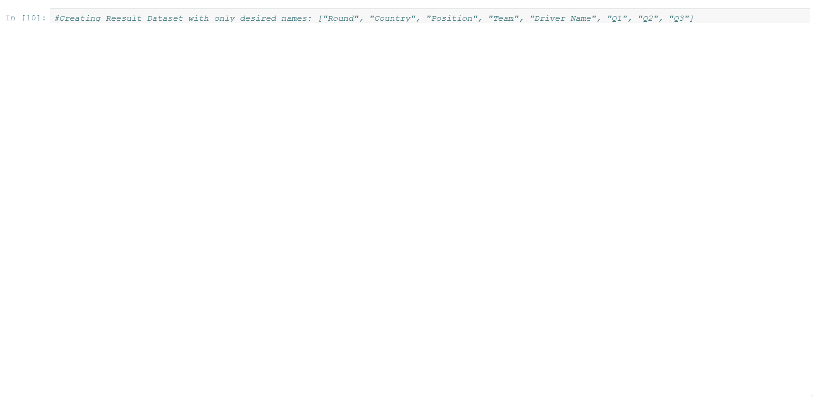
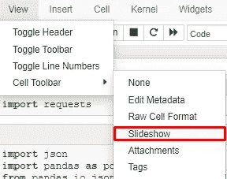
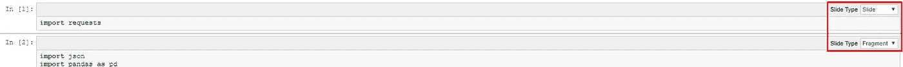
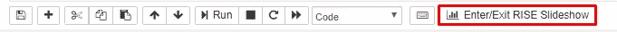
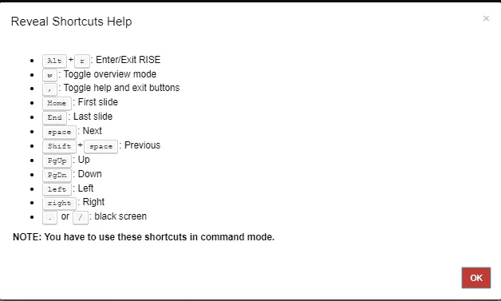

# 给我看看你的熊猫！

> 原文：<https://medium.com/analytics-vidhya/show-me-your-pandas-b7f0e9d77d96?source=collection_archive---------32----------------------->



使用 RISE 创建幻灯片演示。

在 Jupyter notebook 中创建一个项目很好，但是如何将您的项目展示给其他人呢？你如何在 Jupyter 笔记本上创建你的想法、概念或项目的演示文稿？

一个相对简单的方法就是使用 RISE。

## 什么是崛起？

RISE 是 Jupyter notebook 的演示模块，它使用 Reveal.js。作者达米安·阿维拉有一个很好的介绍。

## 怎么安装？

可以用**康达:**安装

```
conda install -c conda-forge rise
```

或者**皮普:**

```
pip install RISE
```

或者你可以在已经安装的地方使用[**Azure 笔记本**](https://notebooks.azure.com/) (像我一样)。

## 基本用法。

很简单。您需要激活 S**lide 显示单元格工具栏**:



幻灯片显示单元格工具栏

转到**视图/单元格工具栏**并点击**幻灯片**。

之后您可以选择**细胞载玻片类型**:



有几种类型的幻灯片:

**幻灯片** —不言而喻，将从该单元格开始新的幻灯片。

**子幻灯片** —将出现在当前幻灯片下的幻灯片类型

片段—幻灯片片段如果您不想让所有信息都立即出现在幻灯片上，您应该将幻灯片分成片段。

**跳过** —跳过此单元格，它不会出现在幻灯片上。

**注释** —该单元格用作注释。

**“—”**—从上面的单元格继承行为。

在你将所有类型的细胞放入细胞后，你可以看看它是如何工作的。

只需点击这个按钮:



表演开始了！


## 如何处理演示文稿？

只需点击“？”在左下角签名，您将看到带有快捷方式的模式窗口:



## 更多定制。

如果你想定制你的演示文稿，你也可以这样做。最简单的方法之一——通过**笔记本元数据。在这里你可以创建背景、页脚和页眉等等！如果你感兴趣，可以看看 [**崛起自定义帮助页面**](https://rise.readthedocs.io/en/stable/customize.html) **。****

## **结论:**

使用 RISE，您可以轻松创建笔记本的简单幻灯片演示。它对演示和会议非常有用。