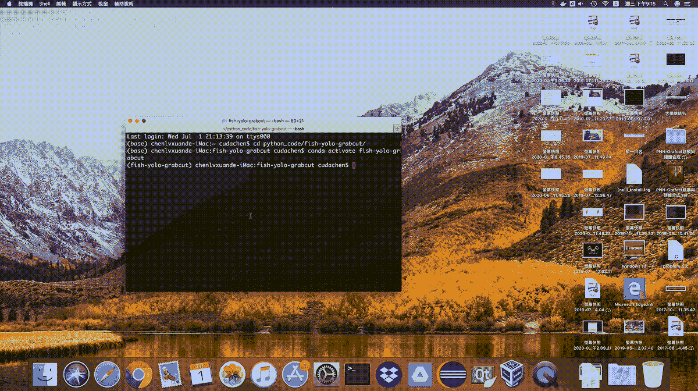

# 在 Web 上展示您的机器学习项目第 1 部分:简化它！

> 原文：<https://medium.com/analytics-vidhya/show-off-your-machine-learning-project-on-web-part-1-streamlit-it-801bc0b6848f?source=collection_archive---------31----------------------->

## 简化您的项目，并在浏览器中运行它！

> 点击进入[第二部分](/analytics-vidhya/show-off-your-machine-learning-project-on-web-part-2-dockerize-you-streamlit-app-fab385d79ef9?source=friends_link&sk=80ea34c77c509739f16c17530536a1eb)和[第三部分](/analytics-vidhya/show-off-your-machine-learning-project-on-web-part-3-deploy-onto-heroku-with-docker-b78fedb99ceb?source=friends_link&sk=1fe1f8bd66f523d0efb569807d108091)。
> 
> 点击[此](/analytics-vidhya/show-off-your-machine-learning-project-on-web-part-1-streamlit-it-801bc0b6848f?source=friends_link&sk=e64d0f6b0d101f8320465469d8812f35)通过付费墙。
> 
> *TL；你可以在这里得到***博士的例子项目。**

**

*在我的本地计算机上演示。*

# *动机*

*久而久之，你已经做了很多机器学习项目，但你需要一个可视化，否则其他人不会知道你的项目的过程和结果。更糟糕的是，有些人认为你没有准备好，因为你无法使用 Docker 和 PaaS 部署(台湾的机器学习工作很多需要前端或后端技能)。*

*因此，我写这个系列不仅仅是为了创建一个基于 web 的应用程序，也是为了展示 Docker 的基本用法，并使用 Docker 将我的应用程序部署到 Heroku 上。*

# *本系列的目标*

*本系列将指导您:*

1.  *用一个框架让你的机器学习项目在 web 上运行。*
2.  *使用 Docker 来减轻环境设置的难度，并与 DevOps 工作流集成。*
3.  *使用 PaaS 部署来展示您可以部署您的项目。*

# *本部分的目标*

*在这一部分，我将展示如何用 streamlit 创建一个应用程序。此外，我将展示如何毫无问题地将您的 OpenCV 项目与 streamlit 结合起来。*

# *为什么选择 Streamlit？*

*我选择 streamlit 而不是 flask 和 django 的原因是因为它的快速原型化和易于设置和部署。最重要的是，你不需要学习一些知识，如路由和 MVC 结构，以便你能够建立一个应用程序。*

# *嘿，给我举个例子！*

*在这个系列中，我使用我的 [fish-yolo-grabcut](https://github.com/Cuda-Chen/fish-yolo-grabcut) 作为 streamlit 应用程序的基础。*

*这个名为`app.py`的 streamlit 应用程序的内容如下所示:*

# *分解*

*你可能还不熟悉 streamlit，这里有一些要点可以让你知道这个应用程序会是什么样子:*

1.  *`st.title()`显示您的 streamlit 应用程序的标题。*
2.  *`st.file_uploader()`让用户上传他们想要的文件。在这种情况下，用户想要上传图像。*
3.  *`st.write()`在浏览器中显示您想要的文本。*
4.  *`st.image()`在浏览器中显示图像。*

# *Streamlit 如何与 OpenCV 一起工作*

*`st.file_uploader()`将[返回一个 BytesIO 对象](https://docs.streamlit.io/en/stable/api.html?highlight=file_uploader#streamlit.file_uploader)。但是，`cv.imread()`只接受 string 来读取图像。*

*如[本期](https://github.com/streamlit/streamlit/issues/888#issuecomment-568578281)所示，你可以用`cv.imdecode()`来代替将文件转换成 OpenCV 图像，或者 numpy 数组。*

> **当然，在使用* `*st.image()*` *展示你的图像时，别忘了使用 BGR 彩色格式！**

# *运行应用程序*

*只需输入`streamlit run app.py`，然后 streamlit 会自动设置服务器并打开浏览器。*

# *翘起*

*在这一部分，我对 stream 做了一个介绍，并结合我现有的项目展示了一个示例应用程序。我还告诉你我的应用程序看起来会是什么样子，并给出了一个解决方案时，使用 streamlit 与 OpenCV。*

**原载于 2020 年 6 月 29 日*[*https://cuda-Chen . github . io*](https://cuda-chen.github.io/devops/2020/06/29/streamlit-docker-heroku-part-1.html)*。**

> *如果你有什么想法和问题要分享，请联系我[**clh 960524【at】Gmail . com**](http://clh960524@gmail.com/)。另外，你可以查看我的 [GitHub 库](https://github.com/Cuda-Chen)中的其他作品。如果你像我一样对机器学习、图像处理和并行计算充满热情，欢迎在 LinkedIn 上加我。*