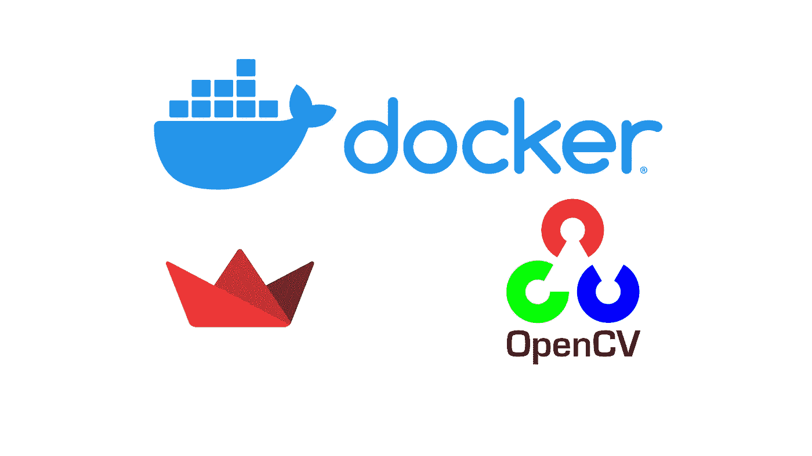

# 在 Web 上展示您的机器学习项目第 2 部分:Dockerize 您简化应用程序

> 原文：<https://medium.com/analytics-vidhya/show-off-your-machine-learning-project-on-web-part-2-dockerize-you-streamlit-app-fab385d79ef9?source=collection_archive---------29----------------------->

## 一天一个码头工人让你的老板远离你。

> 点击进入[第 1 部分](/analytics-vidhya/show-off-your-machine-learning-project-on-web-part-1-streamlit-it-801bc0b6848f?source=friends_link&sk=e64d0f6b0d101f8320465469d8812f35)和[第 3 部分](/analytics-vidhya/show-off-your-machine-learning-project-on-web-part-3-deploy-onto-heroku-with-docker-b78fedb99ceb?source=friends_link&sk=1fe1f8bd66f523d0efb569807d108091)。
> 
> 使用[这个好友链接](/analytics-vidhya/show-off-your-machine-learning-project-on-web-part-2-dockerize-you-streamlit-app-fab385d79ef9?source=friends_link&sk=80ea34c77c509739f16c17530536a1eb)传播这个帖子，无限制访问。
> 
> *TL；你可以在这里* *得到* [*博士的例子项目。*](https://github.com/Cuda-Chen/fish-yolo-grabcut)



对接您的应用程序，告别环境设置时间！

# 动机

因此，您最终用 streamlit 完成了您的机器学习项目，但您觉得每次都必须在新计算机上创建虚拟环境很乏味。更糟糕的是，有时您的虚拟环境会因为您使用不同的操作系统而崩溃。

希望我们可以使用 Docker 来缓解设置和部署环境的问题，并且您可以创建一个适合扩展的微服务。

# 本部分的目标

对于这一部分，我将展示如何创建一个可行的 streamlit + OpenCV Docker 映像，并展示一些关于 Docker 的简单用法。

# 用一个例子深入研究

长话短说，让我展示一下我的 streamlit + OpenCV 机器学习项目的 Dockerfile:

# 简化了一些 Dockerfile 命令的用法

1.  `FROM`:获取一个基础图像。就像你需要一个操作系统作为你应用的基础一样。
2.  `MAINTAINTER`:显示该图片作者的相关信息。
3.  `ENV`:将环境变量设置为某个值。
4.  `RUN`:执行命令。
5.  `EXPOSE`:让你的容器在运行时监听特定的端口。
6.  `WORKDIR`:设置工作目录。
7.  `COPY`:复制新文件/目录。
8.  `CMD`:执行容器时提供默认动作。

欲了解更多信息，请访问[官方文档参考](https://docs.docker.com/engine/reference/builder/)。

# 关于此 docker 文件的一些提醒

1.  第 13~16 行的目的是让 streamlit 在 Docker 中正常运行。否则，streamlit 将无法启动。
2.  第 24 行的目的是让 OpenCV 在 Docker 中正常运行。我遇到了一个问题，如果你不安装`libSM.so.6`然后在构建 Docker 镜像时导入 OpenCV，你的容器会在执行时无声地崩溃并显示消息:`segmentation fault (core dumped)`。你可以在这里看到这种问题[。](https://github.com/NVIDIA/nvidia-docker/issues/864)

# 构建并执行这个容器

使用以下命令构建并执行该容器:

```
$ docker image build -t fish-yolo-grabcut:app .
$ docker container run -p 8501:8501 --rm -d grabcut:app
```

之后，在浏览器的网址中输入`localhost:8501`，app 的内容就会显示出来。

要关闭容器类型:

```
$ docker kill <weird id of fish-yolo-grabcut.app>
```

# 翘起

在这一部分，我展示了这个项目的 Docker 配置，并告诉你我在构建和执行我构建的容器时的两个问题。

*原载于 2020 年 6 月 29 日*[*https://cuda-Chen . github . io*](https://cuda-chen.github.io/devops/2020/06/29/streamlit-docker-heroku-part-2.html)*。*

> 如果你有什么想法和问题要分享，请联系我[**clh 960524【at】Gmail . com**](http://clh960524@gmail.com/)。另外，你可以查看我的 [GitHub 库](https://github.com/Cuda-Chen)的其他作品。如果你和我一样对机器学习、图像处理和并行计算充满热情，欢迎在 LinkedIn 上加我。