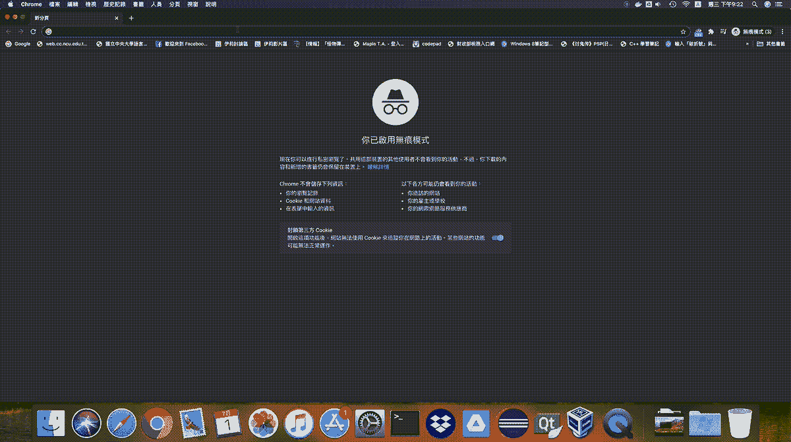

# 在 Web 上展示您的机器学习项目第 3 部分:使用 Docker 部署到 Heroku 上

> 原文：<https://medium.com/analytics-vidhya/show-off-your-machine-learning-project-on-web-part-3-deploy-onto-heroku-with-docker-b78fedb99ceb?source=collection_archive---------24----------------------->

## 客户需要的是一个域名和一个浏览器。

> 点击进入[第一部分](/analytics-vidhya/show-off-your-machine-learning-project-on-web-part-1-streamlit-it-801bc0b6848f?source=friends_link&sk=e64d0f6b0d101f8320465469d8812f35)和[第二部分](/analytics-vidhya/show-off-your-machine-learning-project-on-web-part-2-dockerize-you-streamlit-app-fab385d79ef9?source=friends_link&sk=80ea34c77c509739f16c17530536a1eb)。
> 点击[此](/analytics-vidhya/show-off-your-machine-learning-project-on-web-part-3-deploy-onto-heroku-with-docker-b78fedb99ceb)通过付费墙。
> 
> *TL；DR:你可以在这里* *得到范例项目* [*。*](https://github.com/Cuda-Chen/fish-yolo-grabcut)



我在 Heroku 上的应用程序演示。你可以在[https://fish-yolo-grabcut.herokuapp.com/](https://fish-yolo-grabcut.herokuapp.com/)访问这个应用。

# 动机

在你创建了一个 dockerized 环境后，你认为你应该在云上部署你的应用程序，这样你就可以炫耀你的机器学习项目，web 开发和 DevOps 技能。此外，其他人只需点击一下您提供的 URL 就可以访问您的项目，而无需了解如何设置环境。

# 本部分的目标

这一部分将教你如何把你 Docker 化的 app 部署到 Heroku 上，并告诉你用 Docker 部署时 Heroku 的一些专门设置。

# 在部署到 Heroku 之前

Heroku 为[提供了三种方式](https://devcenter.heroku.com/categories/deploying-with-docker)来部署你的 dockerized app:

1.  容器注册和运行时(Docker 部署)
2.  用 heroku.yml 构建 Docker 图像
3.  使用 Docker Compose 进行本地开发

由于我的应用程序不需要 Docker 组件(只有一个 streamlit 服务)，所以没有必要使用 Docker Compose。

尽管大多数帖子使用方法#1，我还是会选择方法#2，原因有两个:

1.  帖子很少提到这种方法。
2.  我为 Heroku 部署编写了一个专门的 docker 文件。

# 我们需要的组件

对于方法#2，我们至少需要两个文件:

1.  `Dockerfile`
2.  `heroku.yml`:向 Heroku 表明你想要什么来构建和部署。

在我的例子中，我需要三个文件，因为我喜欢模块化:

1.  `Dockerfile`
2.  `heroku.yml`
3.  heroku_startup.sh

# Dockerfile 文件

就像第 2 部分一样，对 Heroku 部署做了一些修改:

您可以在第 42 行和第 48 行看到变化。原因是:

1.  更改`heroku_startup.sh`的权限，否则在执行`heroku_startup.sh`时会收到`permission denied`错误。
2.  `ENTRYPOINT "./heroku_startup.sh"`告诉码头工人启动集装箱时执行`heroku_startup.sh`。

# Heroku.yml

Heroku 需要`heroku.yml`来构建和部署 Docker 映像，所以我为自己创建了一个:

```
build:
  docker:
    web: heroku.Dockerfile
run:
  web: ./heroku_startup.sh
```

显然，`build`和`run`部分分别指出了在 Heroku 上构建和运行阶段您想要做的事情。

# heroku_startup.sh

这里提到的[是](https://devcenter.heroku.com/articles/container-registry-and-runtime#unsupported-dockerfile-commands)，Heroku 使用一个`$PORT`环境变量进行端口暴露。所以`heroku_startup.sh`看起来会像这样:

```
#!/bin/bash

echo PORT $PORT
streamlit run --server.port $PORT app.py
```

您必须设置`$PORT`变量来简化它，否则您的应用程序将不会出现。

# 部署！

这一步相当容易，你需要的是用 Git 部署[。然后 Heroku 会用`Heroku.yml`而不是`Procfile`用 Docker 部署你的应用。](https://devcenter.heroku.com/articles/git)

# 概述

这部分展示了如何将你的机器学习应用部署到 Heroku 上，并提到了 Heroku 上的一些特殊设置。

希望这个系列可以帮助你把你的机器学习 app 和 web、DevOps 开发周期结合起来，让你赶上潮流，不被 web 开发公司嘲讽！

*原载于 2020 年 6 月 29 日*[*https://cuda-Chen . github . io*](https://cuda-chen.github.io/devops/2020/06/29/streamlit-docker-heroku-part-3.html)*。*

> 如果你有什么想法和问题要分享，请联系我[**clh 960524【at】Gmail . com**](http://clh960524@gmail.com/)。另外，你可以查看我的 [GitHub 库](https://github.com/Cuda-Chen)的其他作品。如果你像我一样对机器学习、图像处理和并行计算充满热情，请随时[在 LinkedIn](https://www.linkedin.com/in/lu-hsuan-chen-78071b171/) 上添加我。