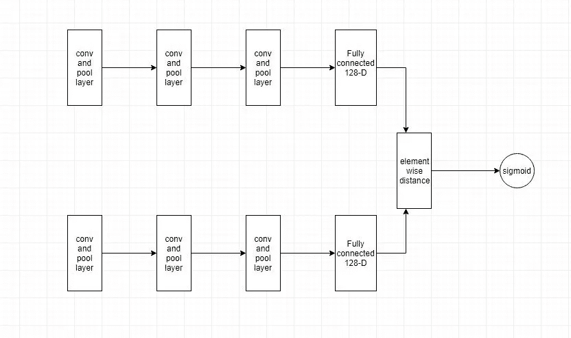
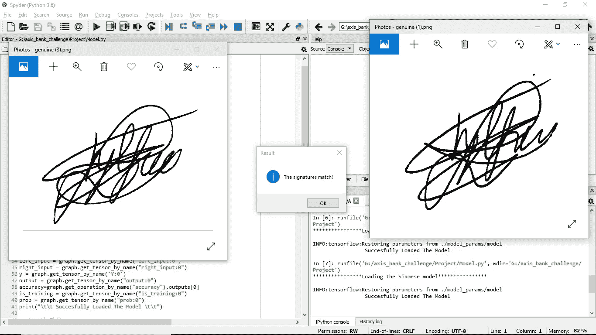

# 用于签名验证的连体神经网络

> 原文：<https://medium.com/analytics-vidhya/siamese-neural-network-for-signature-verification-efd2f399d586?source=collection_archive---------0----------------------->

## 让我们看看 Siamese Architecture 如何使用 CNN 来执行签名验证任务！

来源:[https://pix abay . com/photos/writing-pen-man-ink-paper-pencils-1149962/](https://pixabay.com/photos/writing-pen-man-ink-paper-pencils-1149962/)

**简介**

一个人的签名几乎不会在每次签名时发生变化，我们用于欺诈检测的算法必须考虑笔画的变化。但是检测系统还应该设法捕捉伪造的签名，这些签名可能与熟练的伪造签名非常相似。幸运的是，深度学习可以自己学习相似性，我们所要做的就是简单明了的反向传播。我们将构建一个连体网络，并训练它来逼近相似性函数，该函数输出 0 到 1 之间的分数(1 表示完全真实，0 表示完全不相似)

**数据准备**

让我们将此视为监督学习任务，并准备特征和标签。连体网络由成对的图像及其相应的标签(相似或不相似)提供。用于签名验证的数据集可在 SigComp 的网站上获得，其链接为[此处](http://www.iapr-tc11.org/mediawiki/index.php/ICDAR_2011_Signature_Verification_Competition_(SigComp2011))。通过在数据集上循环并在另一个数组中形成图像对及其标签的数组来准备数据。这最终使它成为一个二元分类问题！

**网络架构**

暹罗网络有一个卷积层和池层的堆栈，以及一个具有 128 个神经元的最终全连接层。姐妹网络承担与原始网络相同的权重和偏差(本质上意味着运行相同的网络两次)。它接受输入图像对并产生两个 128 维向量作为输出。网络学习在向量空间中对相似的输入图像进行编码，对相近的和不相似的输入图像进行编码，对彼此远离的输入图像进行编码。训练它的传统方法是通过使用对比损失函数或一次拍摄三幅图像的三重损失。在这篇文章中，我们将用“交叉熵”损失来训练我们的网络。你怎么问？这是我们建筑的布局。

具有分类的连体网络

然后，这两个向量按元素相减以形成单个 128 维向量(不要与仅产生单个标量值作为输出的 L1 距离函数相混淆)。

嗯，我们快完成了。它的下一部分是一个完全连接的网络，该网络将 128-D 距离向量作为输入，输出层具有单个输出神经元，用于通过 sigmoid 激活进行分类。隐藏层的数量是一个超参数，可以通过实验来获得最佳结果。现在，用我们先前收集的图像对和标签来训练网络。损失函数是“二元交叉熵”，最适合的优化器是“Adagrad”。

**结论**

经过几个时期(5 到 7)的训练后，我们将在验证集中获得接近 93%的准确率。注意:为了使网络在真实世界的签名中表现良好，SigComp 数据集可以通过添加噪声和随机模糊来增强，以迫使网络良好地概括，因为数据集是使用几乎没有伪像的数字平板电脑收集的。

而且，就是这么做的。

源代码:[https://he-S3 . S3 . Amazon AWS . com/media/sprint/axis-hackathon/team/456719/97 F5 EFA project . rar](https://he-s3.s3.amazonaws.com/media/sprint/axis-hackathon/team/456719/97f5efaproject.rar)

Github 链接:【https://github.com/Baakchsu 

 [## 在 Linkedin 上找到我](https://www.linkedin.com/in/anirudh-s-37307114b/)