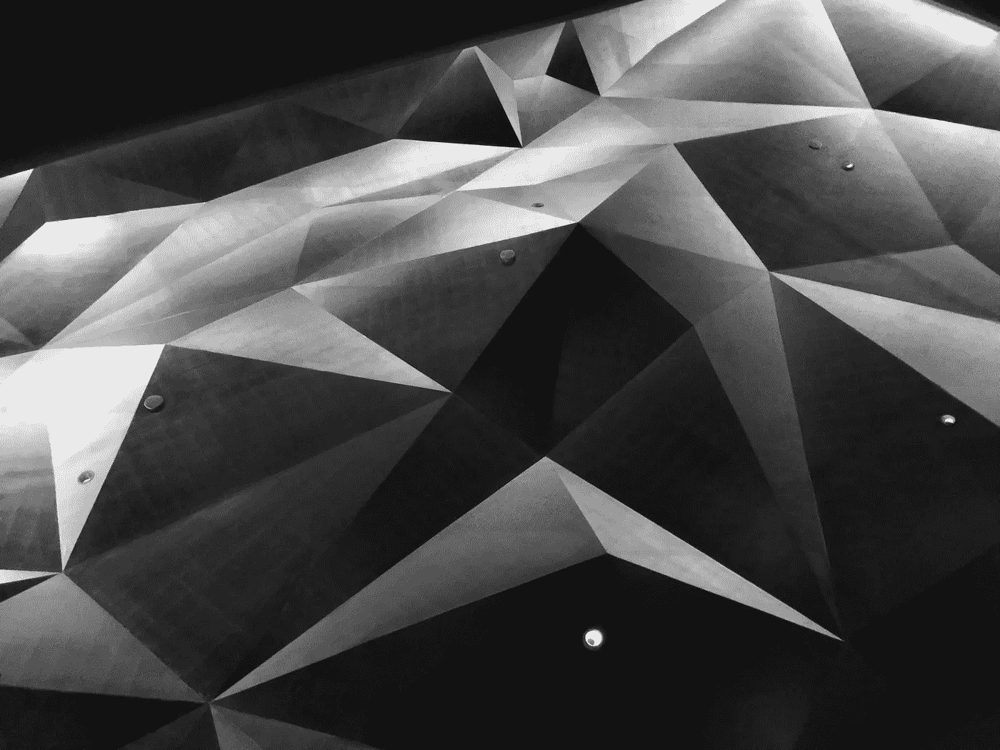

# 谢尔平斯基三角

> 原文：<https://medium.com/analytics-vidhya/sierpinskis-triangle-ff98218f5cad?source=collection_archive---------9----------------------->

# 为什么三角形会改变你对世界的看法

Sierpinski 的三角形是一种算法，它展示了随机性的一个有趣属性 *(Python)。*

关键在于，一个看似复杂的模式是从一个极其简单——部分随机——的模式中浮现出来的。

> 还有哪些复杂的结构可以被分解成…