# Sigmoid 神经元模型，带样本代码的梯度下降

> 原文：<https://medium.com/analytics-vidhya/sigmoid-neuron-model-gradient-descent-with-sample-code-4919bfc9d4c4?source=collection_archive---------0----------------------->

在感知器模型中，限制是输出函数(二进制输出)中有非常剧烈的变化，这需要线性可分离的数据。然而，在大多数实际情况下，**我们需要一个连续的输出**。所以我们提出了一个**的乙状结肠神经元模型**

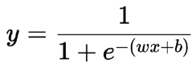

上面显示的函数是一个 sigmoid 函数，它采用线性输入，产生平滑连续的输出(以红线显示)。

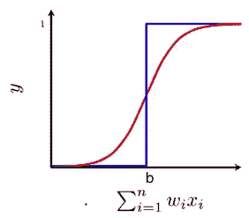

这里红线是 sigmoid 模型的输出，蓝线是感知器模型的输出。无论输入数量多少，输出值都在[0，1]之间。随着总和不断变化，我们观察到红线上的不同值。

sigmoid 模型可用于回归和分类问题。**在回归的情况下，sigmoid 函数的预测值是 y 值，无论是在分类问题中，首先使用 sigmoid 函数进行预测，然后确定对不同类别的预测 y 进行分类的阈值。**阈值可以是 0.5 或预测 y 的平均值或任何值，具体取决于问题。

## 损失函数

**交叉熵或平方损失**用于乙状结肠神经元模型。

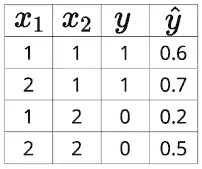

这里 cap y 是预测值，y 是实际值

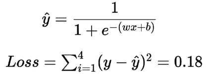

## 学习算法(梯度下降背后的数学)

通过改变系数(w)和偏差(b)的值，你将得到 sigmoid 函数族。

这里从随机的‘w’和‘b’值开始，计算损失，然后再次更新 w 和 b，以此类推。最初，您可能从最差的 sigmoid 函数开始，但随着 w 和 b 的更新，它将达到最佳 sigmoid 函数。

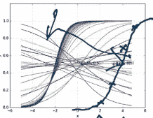

彩色曲线是不同 w 和 b 值的不同 sigmoid 函数。

现在，Pytorch/Tensorflow 内置了这一功能，可以自动计算最佳 w 和 b，并使损失最小化。

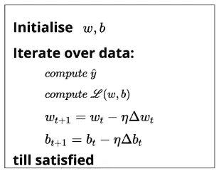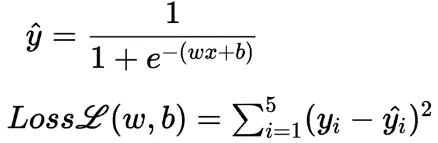

此后为了计算每对(w，b)的损失，我们需要找到等级-w 和等级-b。

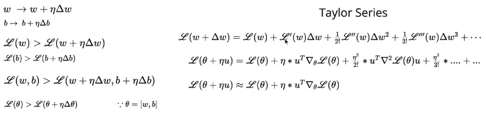

这里我们用泰勒级数来计算(w，b)更新后的损失。计算出来的损失应该小于之前的。现在我们的目标是找到(w，b)使得三次近似泰勒级数的第二项产生负值。

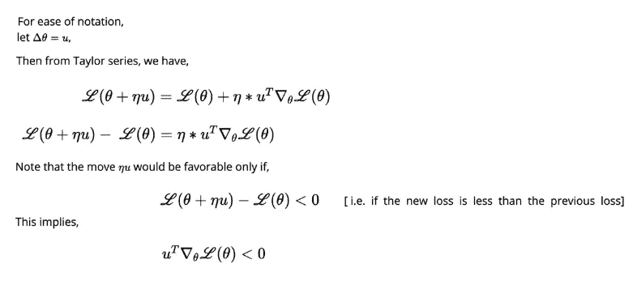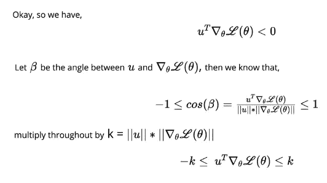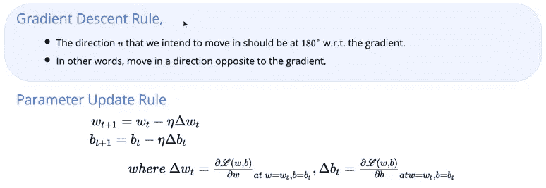

**如何计算成绩**

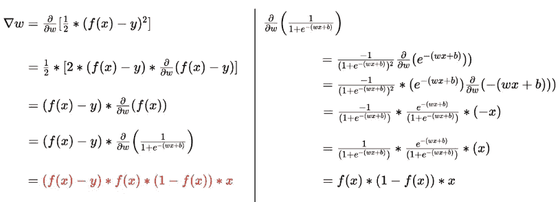

整体适应度函数如下所示

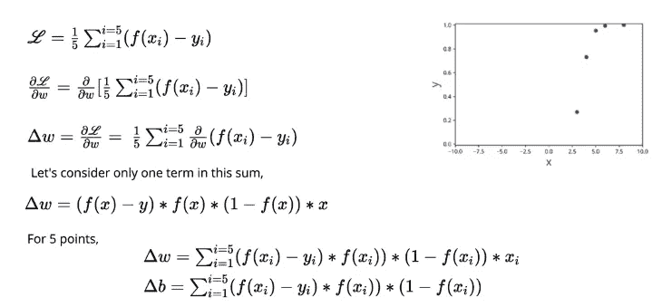

**迭代直到满意表示**

*   在迭代次数的预定值
*   在损失值的预定值
*   如果迭代后(w，b)的变化不大

## **多变量情况下的示例**

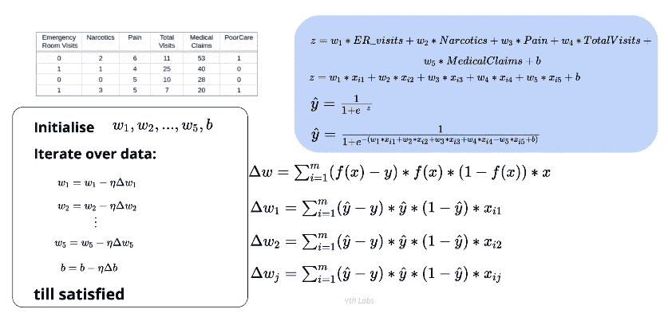

```
#importing library
**import** **numpy** **as** **np**
**import** **matplotlib.pyplot** **as** **plt**
**from** **mpl_toolkits** **import** mplot3d
**import** **matplotlib.colors**
**import** **pandas** **as** **pd**
**from** **sklearn.preprocessing** **import** StandardScaler, MinMaxScaler
**from** **sklearn.model_selection** **import** train_test_split
**from** **sklearn.metrics** **import** accuracy_score, mean_squared_error
**from** **tqdm** **import** tqdm_notebook**#sigmoid class for two variable
def** sigmoid(x1, x2, w1, w2, b):
  **return** 1/(1 + np.exp(-(w1*x1 + w2*x2 + b))) **#calculate loss
def** calculate_loss(X, Y, w_est, b_est):
  loss = 0
  **for** x, y **in** zip(X, Y):
    loss += (y - sigmoid(x, w_est, b_est))**2
  **return** loss**#=======================================
#class** **SigmoidNeuron**:

  **def** __init__(self):
    self.w = **None**
    self.b = **None**

  **def** perceptron(self, x):
    **return** np.dot(x, self.w.T) + self.b

  **def** sigmoid(self, x):
    **return** 1.0/(1.0 + np.exp(-x))

  **def** grad_w(self, x, y):
    y_pred = self.sigmoid(self.perceptron(x))
    **return** (y_pred - y) * y_pred * (1 - y_pred) * x

  **def** grad_b(self, x, y):
    y_pred = self.sigmoid(self.perceptron(x))
    **return** (y_pred - y) * y_pred * (1 - y_pred)

  **def** fit(self, X, Y, epochs=1, learning_rate=1, initialise=**True**, display_loss=**False**):

    *# initialise w, b*
    **if** initialise:
      self.w = np.random.randn(1, X.shape[1])
      self.b = 0

    **if** display_loss:
      loss = {}

    **for** i **in** tqdm_notebook(range(epochs), total=epochs, unit="epoch"):
      dw = 0
      db = 0
      **for** x, y **in** zip(X, Y):
        dw += self.grad_w(x, y)
        db += self.grad_b(x, y)       
      self.w -= learning_rate * dw
      self.b -= learning_rate * db

      **if** display_loss:
        Y_pred = self.sigmoid(self.perceptron(X))
        loss[i] = mean_squared_error(Y_pred, Y)

    **if** display_loss:
      plt.plot(loss.values())
      plt.xlabel('Epochs')
      plt.ylabel('Mean Squared Error')
      plt.show()

  **def** predict(self, X):
    Y_pred = []
    **for** x **in** X:
      y_pred = self.sigmoid(self.perceptron(x))
      Y_pred.append(y_pred)
    **return** np.array(Y_pred)
```

# 估价

分类问题的准确率

回归问题中的 RMSE

===================================

======详细代码在下面的 Github 链接中给出=====

[](https://github.com/ranasingh-gkp/padhaiAI/tree/master/Sigmoid%2C%20Gradient%20Descent) [## ranasingh-gkp/padhaiAI

### 在 GitHub 上创建一个帐户，为 ranasingh-gkp/padhaiAI 的发展做出贡献。

github.com](https://github.com/ranasingh-gkp/padhaiAI/tree/master/Sigmoid%2C%20Gradient%20Descent) 

# 参考

1.  维基百科(一个基于 wiki 技术的多语言的百科全书协作计划ˌ也是一部用不同语言写成的网络百科全书ˌ 其目标及宗旨是为全人类提供自由的百科全书)ˌ开放性的百科全书
2.  四分之一实验室深度学习(特别感谢)