# 手语数字分类

> 原文：<https://medium.com/analytics-vidhya/sign-language-classification-64fe8ad0fc2c?source=collection_archive---------6----------------------->

这篇文章讨论了基于数字的手语数据集训练不同的分类模型及其比较。它提供了关于每个模型的准确性度量如何不同的见解。

该数据集可在以下位置找到:

[](https://www.kaggle.com/ardamavi/sign-language-digits-dataset) [## 手语数字数据集

### 下载数千个项目的开放数据集+在一个平台上共享项目。探索热门话题，如政府…

www.kaggle.com](https://www.kaggle.com/ardamavi/sign-language-digits-dataset) 

# **数据集预览**

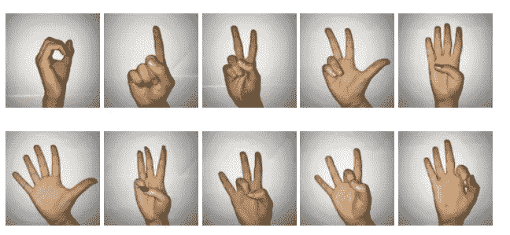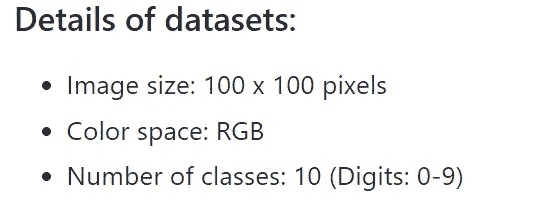

# 加载数据

克隆回购:

```
!git clone ‘[https://github.com/ardamavi/Sign-Language-Digits-Dataset.git'](https://github.com/ardamavi/Sign-Language-Digits-Dataset.git')
```

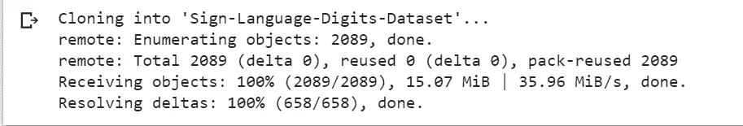

安装它(仅第一次)

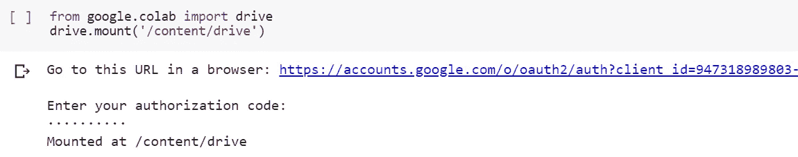

访问图像文件:

```
import os
dir=”/content/Sign-Language-Digits-Dataset/Dataset” 
```

将号码组织到不同的文件夹中

```
 zero= dir+”/0"
one= dir+”/1"
two= dir+”/2"
three= dir+”/3"
four= dir+”/4"
five= dir+”/5"
six= dir+”/6"
seven= dir+”/7"
eight= dir+”/8"
nine= dir+”/9"
```

浏览不同文件夹下的几个文件:

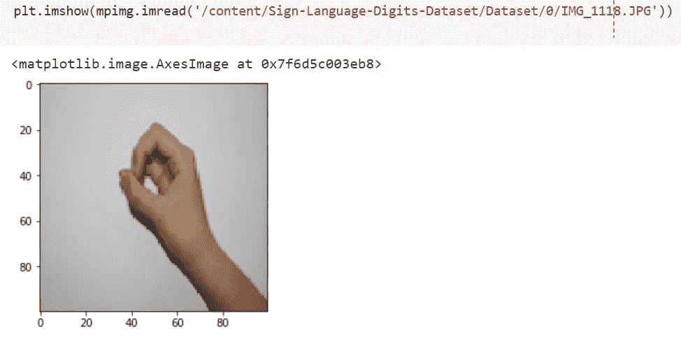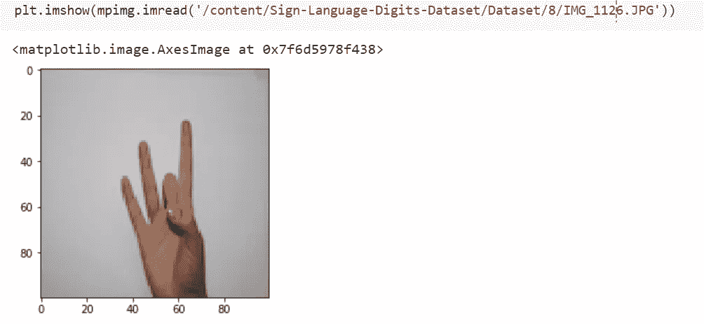

接下来，我们将图像和标签存储在两个不同的 numpy 数组中。

```
images = []
val=[]#Appending the images of different folders into one arrayimport cv2
def load_images_from_folder(folder):

 for filename in os.listdir(folder):
 img = cv2.imread(os.path.join(folder,filename))
 if img is not None:
 images.append(img)
 val.append(zero[-1])
 return images,val

imgs,label=load_images_from_folder(zero)
```

数字 0 的图像和标签已经被附加到各自的数组中。

对其他数字(1–9)重复同样的操作，将文件夹名称(粗体字的那个)更改为其他文件夹名称(一、二、三、四、五、六、七、八、九)，如下所示:

```
 def load_images_from_folder(folder):

 for filename in os.listdir(folder):
 img = cv2.imread(os.path.join(folder,filename))
 if img is not None:
 images.append(img)
 val.append(**one**[-1])       #label value
 return images,val

imgs,label=load_images_from_folder(**one**)
```

一旦所有的图像和标签被附加到各自的数组中，检查每个数组中的条目数。

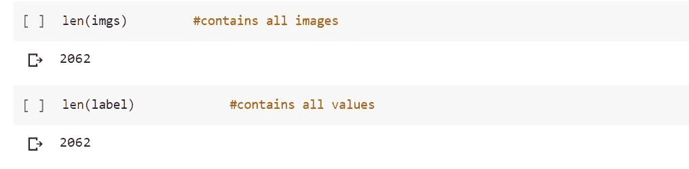

# **数据预处理**

接下来的步骤包括调整大小，将每个图像转换成灰度和展平。

调整大小:

```
width = 50
height = 50
dim = (width, height)
new=[]for img in imgs:
 resized = cv2.resize(img, dim, interpolation = cv2.INTER_AREA)

 new.append(resized)
```

灰度:

```
grayscale=[]
for img in new:
 gray = cv2.cvtColor(img, cv2.COLOR_BGR2GRAY)
 grayscale.append(gray)grayscalenew=np.asarray(grayscale)
```

扁平化:

```
flatten=[]
import numpy as np
for im in grayscale:
 data = np.array(im)
 flattened = data.flatten()
 flatten.append(flattened)
```

转换成 numpy 数组:

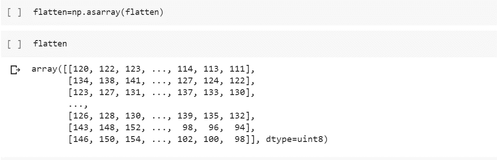

将标签转换为 numpy 数组

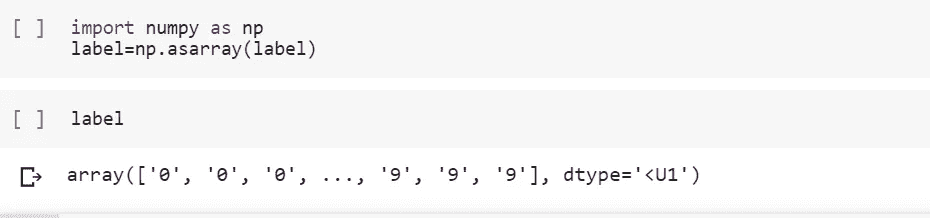

**分成训练集和测试集**

```
from sklearn.model_selection import train_test_split
x_train, x_test, y_train, y_test = train_test_split(flatten,label, test_size=0.25, random_state=58)
```

# **比较各种算法的精度**

***决策树***

```
from sklearn import tree
clf = tree.DecisionTreeClassifier()
clf = clf.fit(x_train, y_train)
y_pred_dt=clf.predict(x_test)
y_train_score_dt=clf.predict(x_train)from sklearn.metrics import accuracy_scoreprint("accuracy of the model is:\nTest ", accuracy_score(y_test, y_pred_dt, normalize=True, sample_weight=None))
print('Train',accuracy_score(y_train, y_train_score_dt, normalize=True, sample_weight=None))
```

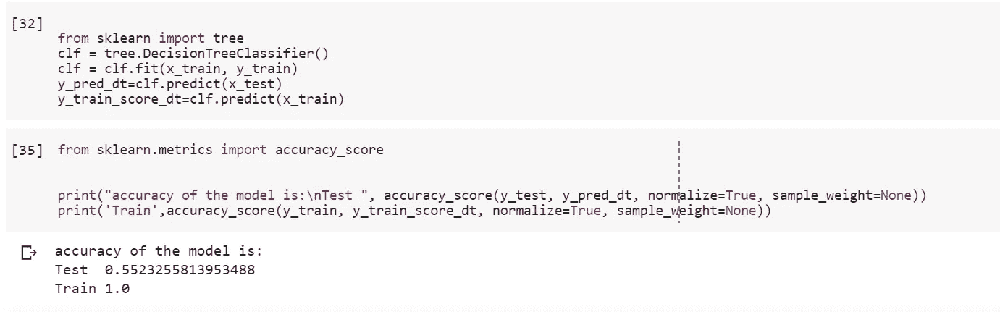

***逻辑回归***

```
from sklearn.linear_model import LogisticRegression
# all parameters not specified are set to their defaults
logisticRegr = LogisticRegression()logisticRegr.fit(x_train, y_train)
```

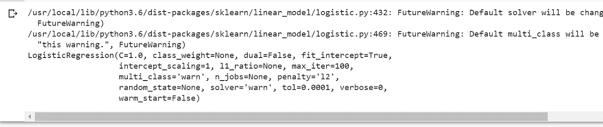

```
x_test[0].reshape(1,-1)logisticRegr.predict(x_test[0].reshape(1,-1))predictions = logisticRegr.predict(x_test)score = logisticRegr.score(x_test, y_test)
scoretr= logisticRegr.score(x_train, y_train)
print(“Test”)
print(score)
print(“Train”)
print(scoretr)
```

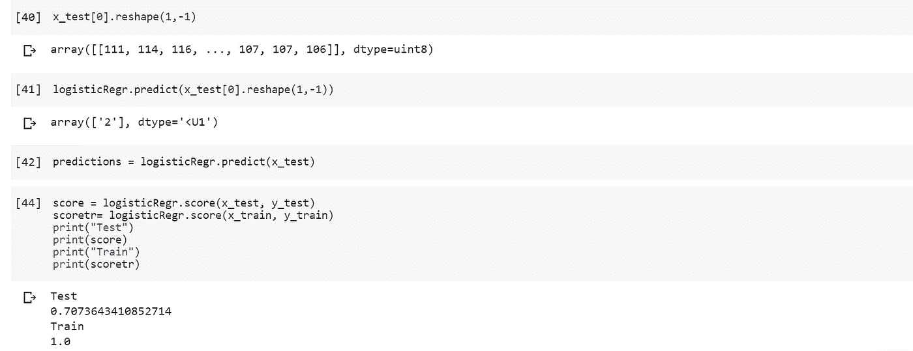

***随机森林***

```
from sklearn.ensemble import RandomForestClassifier
clf_rft = RandomForestClassifier(n_estimators=100, max_depth=15,random_state=0)
clf_rft = clf_rft.fit(x_train, y_train)y_pred_rft=clf_rft.predict(x_test)
y_train_score_rft=clf_rft.predict(x_train)from sklearn.metrics import accuracy_scoreprint(“accuracy of the model is:\nTest “, accuracy_score(y_test, y_pred_rft, normalize=True, sample_weight=None))
print(‘Train’,accuracy_score(y_train, y_train_score_rft, normalize=True, sample_weight=None))
```

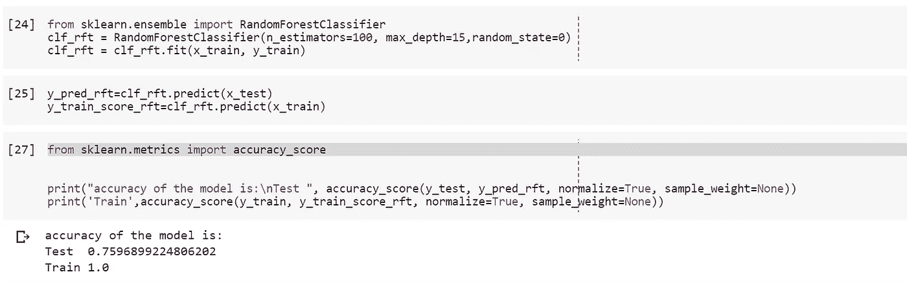

***朴素贝叶斯***

```
from sklearn.metrics import accuracy_scorefrom sklearn.naive_bayes import GaussianNB 
gnb = GaussianNB() 
gnb.fit(x_train, y_train)
y_pred_gnb=gnb.predict(x_test)
y_train_score_gnb=gnb.predict(x_train)
print(“accuracy of the model is:\nTest “, accuracy_score(y_test, y_pred_gnb, normalize=True, sample_weight=None))
print(‘Train’,accuracy_score(y_train, y_train_score_gnb, normalize=True, sample_weight=None))
```

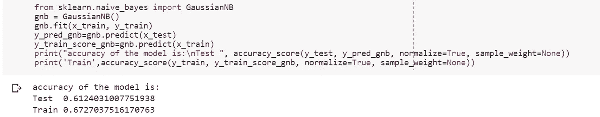

***梯度下降分类器***

```
from sklearn.metrics import accuracy_score
from sklearn.ensemble import AdaBoostRegressor
from sklearn.ensemble import GradientBoostingClassifier
gdc_model= GradientBoostingClassifier(learning_rate=0.01,random_state=41)
gdc_model.fit(x_train, y_train)
y_pred_gdc=gdc_model.predict(x_test)
y_train_score_gdc=gdc_model.predict(x_train)
print(“accuracy of the model is:\nTest “, accuracy_score(y_test, y_pred_gdc, normalize=True, sample_weight=None))
print(‘Train’,accuracy_score(y_train, y_train_score_gdc, normalize=True, sample_weight=None))
```

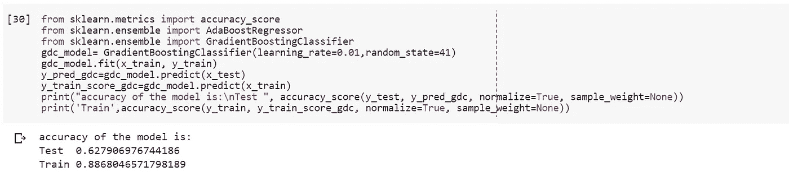

其他指标:

(关于梯度下降分类器)

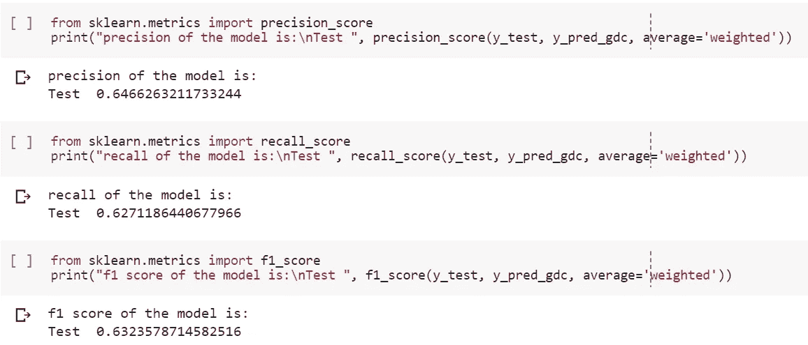

# **结论:**

基于上述实验，我们可以清楚地看到，朴素贝叶斯算法比其他任何算法都更好地对测试数据进行分类。

缺点是我们可能需要更多的数据来更新我们模型的参数，使其朝着更好的方向发展。在这种情况下，可以实现更高的精度。