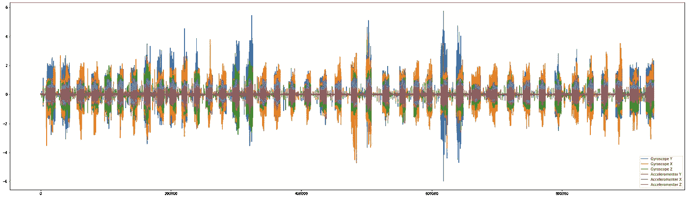

# 信号处理与机器学习(人类活动识别)第二部分(经典 ML)。

> 原文：<https://medium.com/analytics-vidhya/signal-processing-with-machine-learning-human-activity-recognition-part-2-classical-ml-74557c5d6ce0?source=collection_archive---------19----------------------->

再次您好，欢迎来到端到端人类活动识别项目的第二部分。在最后一部分，我们使用单变量和多变量特征分析来探索和观察我们的数据集。接下来，我们将在领域专家设计的特征数据集上实现经典的机器学习算法。

让我们再次从获取数据开始。下面的实现是基于从我们的驱动器获取数据集，并将其分割用于训练和测试。

我们在训练和测试文件夹中分别有大约 70%–30%的可用数据。我们将使用“训练”数据进行训练和 k 倍交叉验证，“测试”数据将用于验证。我们将用分类算法训练我们的数据，如逻辑回归、支持向量机、决策树、随机森林和集成模型，如梯度增强决策树。

我们将首先编写一个通用函数来运行任何指定的模型，该模型将使用 GridSearchCV 执行超参数选择，并以百分比、预测延迟(消耗的时间)记录特定模型的预测准确性，并绘制混淆矩阵以更好地了解模型性能。下面是实现。

现在，我们将开始执行各种模型，并分别打印它们的结果。逻辑回归是我们列表中的第一个，下面是输出。

可以得出结论，该模型表现非常好，验证数据的准确率为 95.72%，交叉验证分数也很好，为 93.59%。测试和 CV 值的接近证明了模型也没有过度拟合。观察混淆矩阵，我们可以看到模型混淆了“坐着”和“站着”两种状态。3%次“站立”被归类为“坐着”，12%次“坐着”被归类为“站立”。让我们看看还有哪些模型有助于解决这些分类混乱。

Hmm，使用线性支持向量分类器模型精度略有提高。我们得到了 96.47%的正确分类状态，“坐着”和“站着”类之间的混淆仍然相同，但像“走路”、“下楼”和“上楼”这样的动态状态之间的混淆略有减少。我们将每个模型的性能记录在我们的字典“model_results”中，稍后将在表格模型中比较所有模型。让我们尝试一个支持向量分类器的灵活内核(“rbf”内核)，看看这是否可以做得更好。

“rbf”内核化 SVC 似乎更好地进行了概括，并减少了“坐”和“站”类之间的混淆，将之前被错误分类为“站”类的“坐”类提高了约 4%。更多的超参数调整可以提高整体效率。让我们尝试一些基于树的模型，看看它们的表现如何。从决策树分类器开始。

测试精度远低于线性分类器，并且模型看起来混淆了静态和动态活动。从今以后，不应选择此型号进行部署。让我们尝试一些集成模型，如随机森林和梯度增强决策树，看看这些如何解决我们的问题。

在实现了各种经典的机器学习算法之后，下面是它们之间的表格比较。

在查看比较之后，我们可以得出结论，像逻辑回归和支持向量分类器这样的线性模型比基于树的模型表现得更好。此外，根据业务需求，我们可以为最终部署选择具有 96.23%准确度的“rbf”核的支持向量分类器。此外，这个模型看起来更一般化，在所有类中都表现良好。

在这一部分中，我们已经介绍了大多数经典的机器学习模型。经典的机器学习技术需要领域专业知识和大量的特征工程来解决问题，而神经网络能够从原始数据中自动提取重要的特征。接下来，我们将设计一些神经网络并应用我们的数据，看看它们在本系列的下一部分表现如何。

如果我错过了一些重要的东西，或者如果我可以实现一些更好的东西，请让我知道。如果你喜欢这篇文章，如果你能帮助它传播和分享，我会非常感激。

快乐阅读..:)