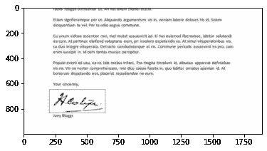
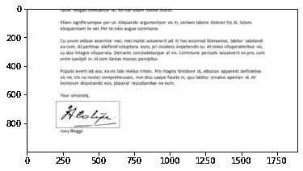
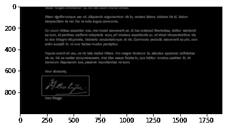
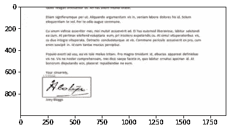

# 使用 OpenCV 进行签名识别

> 原文：<https://medium.com/analytics-vidhya/signature-recognition-using-opencv-2c99d878c66d?source=collection_archive---------0----------------------->

你是否曾梦想过在一家公司工作，而你的职责是向下滚动到 20-50 页，并验证最后一页的签名。看起来很简单，对吧？。但是想想看，你每天要做 500，1000，2000 个 pdf。我相信任何人都会感到无聊和疲惫。

在本文中，我们将看到一个简单的技术解决方案，它可以使用基本的计算机视觉技术来验证签名。本文分为五个部分。第一部分是关于将 pdf 转换为图像，在第二和第三部分，我们将看到如何使用轮廓识别签名并将其框起来，在最后一部分，我们将向前迈出一步，了解提取签名闭合区域的形态学操作，并使用结构相似性指数(SSIM)验证签名

# **PDF 到图像的转换**

为了将 pdf 转换成图像，我们将使用 pdf2image 库。

**安装 pdf2image 的步骤:**

```
pip install pdf2image
```

如果你使用的是 Windows，那么从这个[链接](https://github.com/oschwartz10612/poppler-windows/releases/)下载弹出器，并解压文件。

```
from pdf2image import convert_from_path
import numpy as npimages = convert_from_path('Hospital Discharge Summary.pdf',               poppler_path='C:/Users/Ramji/Downloads/softwares/poppler/poppler-20.12.0/bin')#Visulaize the converted image
for img in images:
    img = np.array(img)
    #resize the image to height of 500 and keep the same aspect ratio
    ratio = img.shape[0]/500.0
    plt.imshow(imutils.resize(img,height=1000))
```



原象

# 轮廓检测

为了从图像中识别签名的位置，我们需要首先识别轮廓。在这里，我将使用约翰·f·坎尼开发的[坎尼边缘检测算法](https://opencv-python-tutroals.readthedocs.io/en/latest/py_tutorials/py_imgproc/py_canny/py_canny.html)来勾画轮廓，并找到围绕签名位置的轮廓。

```
img = np.array(images[-1])
original = img.copy()
ratio = img.shape[0]/500.0
img = imutils.resize(img,height=500)
orig = img.copy()#converting to grayscale image
gray = cv2.cvtColor(img,cv2.COLOR_BGR2GRAY)
gray = cv2.GaussianBlur(gray,(5,5),0)plt.imshow(gray,'gray')
edged = cv2.Canny(gray,80,200)
plt.imshow(edged,'gray')
```



灰度和边缘图像

抓住正确的轮廓是一项任务，我们可以通过看到矩形来完成。圈出标志的等高线的面积应大于其他等高线。

```
cnts = cv2.findContours(edged.copy(), cv2.RETR_LIST, cv2.CHAIN_APPROX_SIMPLE)
cnts = imutils.grab_contours(cnts)
cnts = sorted(cnts, key= cv2.contourArea, reverse=True)[:1]
for c in cnts:
 peri = cv2.arcLength(c,True)
 apprx = cv2.approxPolyDP(c, 0.2*peri, True)
 x,y,w,h = cv2.boundingRect(apprx)
 cv2.rectangle(orig,(x,y),(x+w,y+h),(255,0,0),2)
plt.imshow(orig)
```



检测到的签名

在上面的示例图像中，您可以看到签名已正确加框，但仍有一些白色区域。我们如何去除那些多余的空白呢？这是我们可以应用形态学运算的地方。我将在下一篇文章中讨论这个问题。感谢阅读！！！明天会见面:-)

[此处提供第 2 部分](https://ramji-b.medium.com/signature-recognition-using-opencv-part-2-62685586d566)