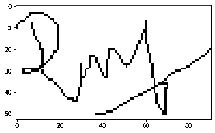

# 使用 OpenCV 进行签名识别-第 2 部分

> 原文：<https://medium.com/analytics-vidhya/signature-recognition-using-opencv-part-2-62685586d566?source=collection_archive---------5----------------------->

在我的前一篇文章中，我们尝试使用 contour 从 pdf 中检测签名区域，并绘制一个矩形覆盖签名区域。你可以在[第一部](https://ramji-b.medium.com/signature-recognition-using-opencv-2c99d878c66d)中读到。

正如我们在第 1 部分中所述，我们将涵盖形态学变换以从裁剪后的签名中移除额外的空格，以及结构相似性指数以比较原始签名图像和已识别签名图像之间的相似性。

# 从 PDF 中裁剪签名区域

为了裁剪图像，我们需要从第 1 部分收集矩形左上角的坐标、宽度和高度。


原始图像和裁剪区域

# 形态转换

形态学变换是基于图像的操作，被执行来从图像中移除额外的空白，或者连接破碎的图像或者加厚图像中的字符等。换句话说，我们可以说执行形态学操作是为了从图像中去除噪声。基本上它包括侵蚀、扩张、打开和关闭。这里是阅读这个概念的链接。

[https://docs . opencv . org/master/d9/d61/tutorial _ py _ morphology _ ops . html](https://docs.opencv.org/master/d9/d61/tutorial_py_morphological_ops.html)

```
def remove_white_space(image):
 gray = cv2.cvtColor(image, cv2.COLOR_BGR2GRAY)
 blur = cv2.GaussianBlur(gray, (25,25), 0)
 thresh = cv2.threshold(blur, 0, 255, cv2.THRESH_BINARY_INV + cv2.THRESH_OTSU)[1]noise_kernel = cv2.getStructuringElement(cv2.MORPH_RECT, (3,3))
 opening = cv2.morphologyEx(thresh, cv2.MORPH_OPEN, noise_kernel, iterations=2)
 close_kernel = cv2.getStructuringElement(cv2.MORPH_RECT, (7,7))
 close = cv2.morphologyEx(opening, cv2.MORPH_CLOSE, close_kernel, iterations=3)# Find enclosing boundingbox and crop ROI\n”,
 coords = cv2.findNonZero(close)
 x,y,w,h = cv2.boundingRect(coords)return image[y:y+h, x:x+w
```



左侧:原始图像右侧:执行形态变换后

# 结构相似指数(SSIM)

SSIM 是一种用于测量两幅图像之间相似性的方法。该方法由王等人提出，用于预测数字电视和电影图像的质量。

数学公式:


等式的参数包括每个图像中的 *N x N* 窗口的 *(x，y)* 位置、在 *x* 和 *y* 方向上的像素强度的平均值、 *x* 和 *y* 方向上的强度方差以及协方差。

因此，为了使用 ssim 比较图像，我们需要传递两个相同大小的灰度图像。

```
from skimage.measure import compare_ssim as ssimi = cv2.cvtColor(cv2.imread('sample_2.png'),cv2.COLOR_BGR2RGB)wrong_image = cv2.resize(cv2.cvtColor(i.copy(),cv2.COLOR_BGR2GRAY),(100,100))
original_image = cv2.resize(cv2.cvtColor(cropped_image.copy(),cv2.COLOR_BGR2GRAY),(100,100))print(ssim(original_image,original_image))
print(ssim(original_image,wrong_image))
```

> SSIM 得分:“1.0”和“0.50”

我希望这两篇文章可能已经给出了关于如何使用 OpenCV 及其相关概念的基本概念。继续学习！！！