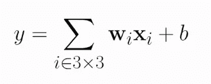
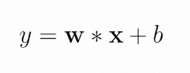
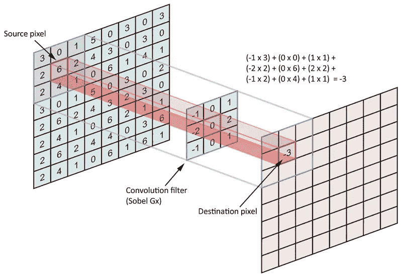
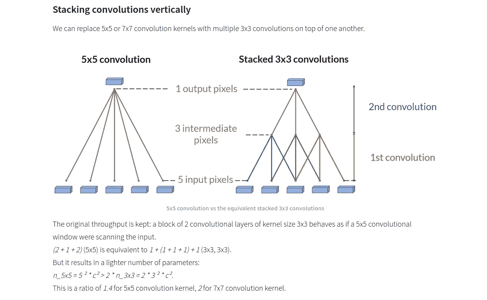
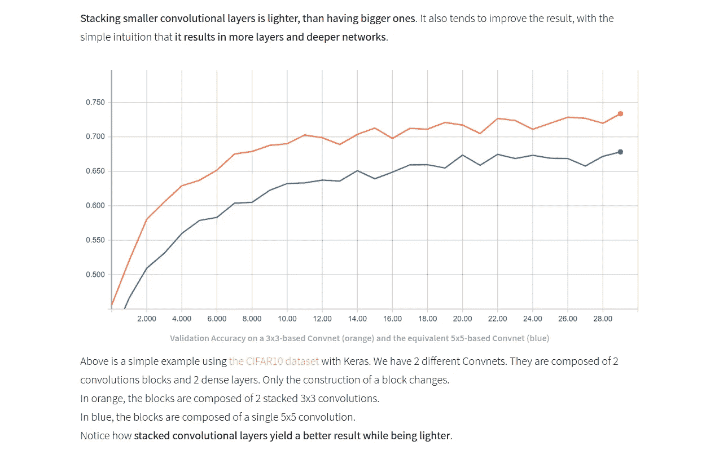

# 内核大小的重要性

> 原文：<https://medium.com/analytics-vidhya/significance-of-kernel-size-200d769aecb1?source=collection_archive---------1----------------------->

为什么内核大小应该是奇数？如果我们使用偶数内核大小会发生什么？

[R 莫](https://unsplash.com/@mooo3721?utm_source=medium&utm_medium=referral)在 [Unsplash](https://unsplash.com?utm_source=medium&utm_medium=referral) 上拍照

在我们开始讨论内核大小的重要性之前，让我们先回顾一下**内核**到底是什么。

在**全连接网络**中，输入中的每个向量元素都连接到第一层中的每个隐藏单元。所以你把每个单元和其他单元连接起来。

因此，如果您有 11×11 的图像，那么单个单元将有 121 个连接，而实际上将有 363 个连接。因为每个图像有 3 个通道。

在**本地连接网络**中，我们使用内核/过滤器。内核是一个单元可以看到的图像的一部分。所以我们可以说内核就像一扇窗户。但是这里的窗口可能不同，即内核的权重可能不同。

**卷积网络**类似于局部连接网络，只是内核中有权重共享。

内核不断在图像上滑动以生成输出。生成的输出称为特征地图。

# **卷积是如何工作的？**

卷积的目的是对源数据矩阵进行编码，即根据滤波器或内核对整个图像进行编码。更具体地说，我们试图对锚/源像素附近的像素进行编码

因此，无论像素的数量是多少，对称形状的内核的每条边的长度是 2*n+1(锚点的每条边+锚点像素)，因此滤波器/内核总是奇数大小。

**边界/边缘呢？**

有不同的处理方式:

1.  忽略它
2.  添加零填充
3.  镜子反射出影像

通常，池化操作(平均池化或最大池化)将会移除您的边界工件。

如果您不打算计算逆运算，即去卷积，并且对原始图像的完美重建不感兴趣，那么您不会关心由于边界问题而导致的信息损失或噪声注入。

**为什么内核大小是奇数？**

对于奇数大小的滤镜，所有前一层像素将围绕输出像素对称。如果没有这种对称性，我们将不得不考虑各层之间的失真。

**为什么连粒都不分大小？**

使用偶数大小内核是可能的，但是您可能会遇到别名错误。

混叠是原始输入中引起的失真。大多数情况下，当我们在信号处理中进行下采样时，这可以通过低通滤波来解决，但这不能插入到深层网络中，因为它会降低性能。

**为什么是 3x3？**

参数的数量随着内核大小成平方增长。这使得大卷积核的成本效率不够高。

限制参数的数量，我们就限制了可能的不相关特征的数量。

这迫使机器学习算法学习不同情况下的共同特征，从而更好地进行归纳。

因此，通常的选择是将内核大小保持在 3x3 或 5x5。

我们希望使用更小的奇数大小的内核过滤器。但是，由于提取的特征是细粒度的和局部的，没有来自相邻像素的信息，因此从候选最佳滤波器尺寸列表中排除了 1x1。此外，它并没有真正做任何有用的特征提取

更多详情请参考[链接](https://www.sicara.ai/blog/2019-10-31-convolutional-layer-convolution-kernel)

此外，在瓶颈条件下使用 1x1 滤波器来减少通道数量并保持特征图的大小。

> 我是一名电子和电信工程师。我发现数据科学很迷人，这就是为什么我决定学习机器学习和大数据分析，目前担任人工智能工程师。希望能为这个不断成长的数据科学社会做点贡献。你可以在 [**LinkedIn**](https://www.linkedin.com/in/anuja-ihare-a5b622b7) 上联系我。