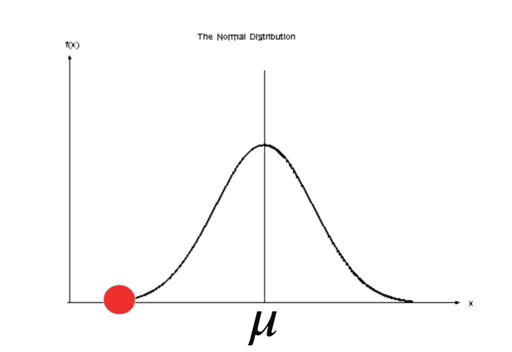
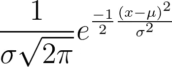
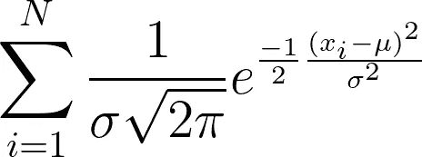
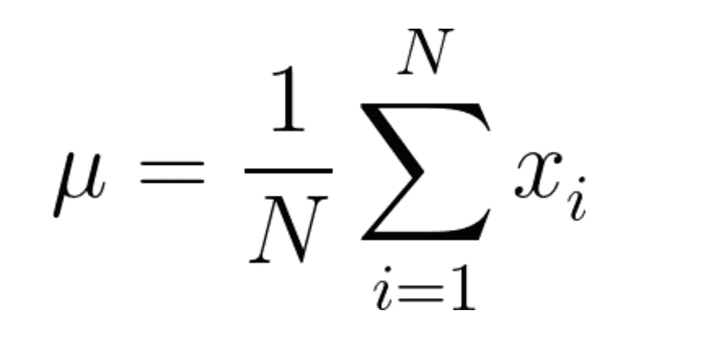
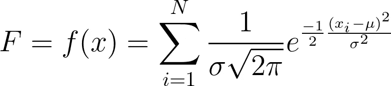
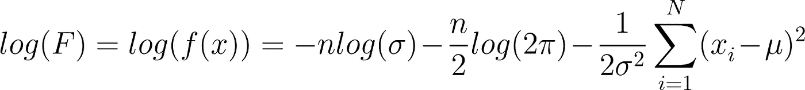
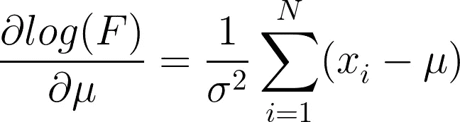
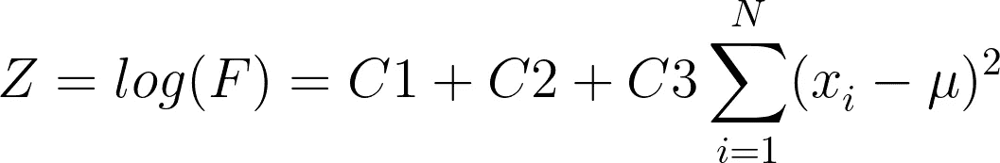
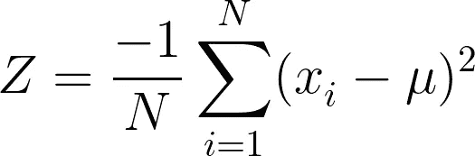

# 均方差在数据科学中的意义！

> 原文：<https://medium.com/analytics-vidhya/significance-of-mean-squared-error-in-data-science-4c4c08da3023?source=collection_archive---------7----------------------->

## 本博客旨在解释在机器学习、深度学习或数据科学中使用均方差背后的需求和逻辑。任何在该领域具有中级知识水平的人一定会有疑问，为什么要使用均方误差，或者为什么不使用平均绝对误差。本博客将用深刻的数学概念解释均方误差的意义！

你有没有尝试过找出**均方差(MSE)** & **平均绝对误差(MAE)**之间的区别，而不仅仅是平方项？对你来说，这个问题的答案是是或否并不重要，这个博客将指导你在任何领域的 MSE 的正确方法和意义。

> 大多数人认为使用 MSE 的原因是通过平方输出来消除负项，这是正确的原因之一，但这不是使用 MSE 的主要原因，因为通过取输出的绝对值也消除了平均绝对误差中的负项。

**使用均方差背后的实际原因是最大似然估计(MLE)的概念。**

本博客的许多读者可能知道 MLE，但也有一些人不知道这个概念。因此，我想先解释一下这个概念，因为这是 MSE 用法背后的基础和实际原因。

## **最大似然估计**

这是一个简单的过程，通过估计使我们在概率函数中的期望值最大化，即，在概率函数中，我们必须估计一些参数的值，这些参数将产生我们期望的概率函数的最大输出。

> 注意:在这个 MSE 的意义上，我假设数据分布是正态的，数据本质上是连续的！

**正态分布示例图！**

# MSE 的意义！

对于连续正态分布，我们总是使用**概率密度函数(PDF)** 因为函数的输出不是离散的。

正态分布的 PDF 为:

**单个 x 值正态分布的 PDF。**

**多个 x 值的正态分布 PDF =>*方程(1)***

在上面的 PDF***【x】***是常数，因为它是一个预定义的数，&变量是“mu”。

> 我们这里的目的是最大化“mu ”,如上面的正态分布图所示，当“mu”最大时，PDF 的值也最大。

众所周知，“μ”是 x 的所有值的样本均值。

**所有 x 值的样本平均值**

> 只有当我们将上述等式(1)**中定义的 PDF 用于正态分布时，上述结果才是可能的，正态分布是最大似然估计的基础，而最大似然估计又是最小均方误差的基础。一旦证明了这个事实，即只有在使用上述给定的 PDF 的情况下,“μ”的值等于 x 的值的样本均值才是可能的，那么它将自动证明 MSE 的显著性。**

## 用上面的 PDF 证明“mu”= x 的样本均值！

如上所述，我们的目的是使“μ”最大化，同样的目的可以通过对等式 1 中所示的 PDF 取**导数来实现。**但是，如果我们直接对方程 1 求导，那么就会很复杂。因此，为了简单起见，我们必须取 PDF 函数&的**自然对数**，然后求导。

> 之所以允许先取对数再求导，是因为**“log”**函数是单调递增函数。将最大化公式 1 PDF 值的**“mu”**的值将与最大化 PDF 自然对数值的值相同。

让我们将等式 1 赋给变量 F，如下所示。

**方程式(1)重写！**

> ***取等式 1 的对数后，我们将得到:***

**对数(等式 1) = >等式(2)**

> 现在，我们必须对等式 2 的**偏导数**求导。取偏导数后，我们剩下的是:

**方程式 3！**

> 为了找出“mu”的最大值，我们必须将上面获得的导数赋值为 0，以便使“mu”最大化。做同样的事情后，我们将得到:

**所有 x 值的样本平均值**

> 因此，证明了为了保持“μ”的定义，必须使用上面解释的 PDF。

为了在更高的层次上澄清，再看一下等式 1:

**对数(等式 1) = >等式(2)**

> 该等式也可以写成常数的形式，因为该等式中的前 2 个参数在最大化“μ”的可能性中不起任何作用。常数形式的方程是:

**方程涉及常数= >方程(3)**

> 在等式 2 中，我用常数替换了一些项，因为它们不影响最终结果。所以，为了方便起见，C1 = 0，C2 = 0，C3 = -1/N。你可以试着用我指定的常数对方程 3 求导，最终结果“μ”保持不变。

因此，我们最终得出了这个等式:

**最终方程式= >方程式(4)**

# 结论

在等式 4 中，有一项表示 x 值与所有 x 值的平均值之间的差，这是被平方的误差项。此外，等式 4 右侧的总表达式是一个负项。

> 事实是，如果我们最小化一个负表达式或最小化负误差，就相当于最大化正表达式或最大化期望的结果(提高的准确度)。在我们的例子中，我们将负的可能性最小化，这相当于将可能性最大化。

这个完整的解释用 PDF 和 MLE 概念证明了 MSE 的意义。

***我希望我的文章用所有深刻的概念和数学解释了与均方误差的意义相关的每一件事。非常感谢你花时间阅读我的博客&，增加你的知识！***