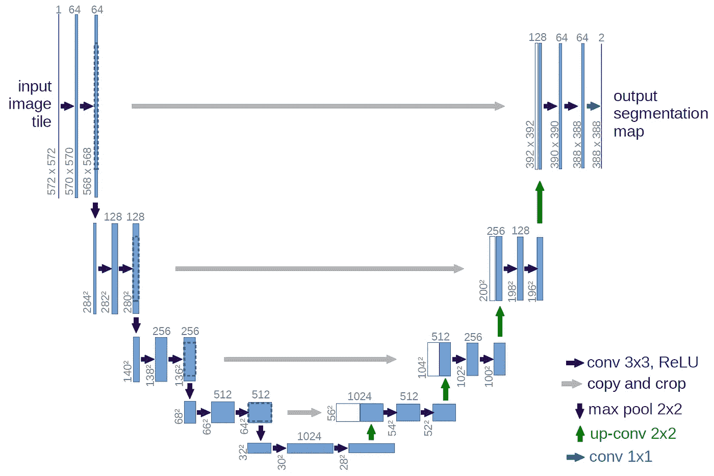

# SIIM-阿克尔气胸分割法

> 原文：<https://medium.com/analytics-vidhya/siim-acr-pneumothorax-segmentation-d92af3086b51?source=collection_archive---------6----------------------->

## `Can Artificial Intelligence recognize pneumothoraces(Collapsed Lung) from Chest X-ray and save lives?`


图片提供:[https://www . medi maging . net/industry-news/articles/294778410/ACR-releases-second-research-road-map-on-medical-imaging-ai . html](https://www.medimaging.net/industry-news/articles/294778410/acr-releases-second-research-road-map-on-medical-imaging-ai.html)

一个人工智能已经接管了各种行业，信不信由你，你在手机中使用的每个应用程序都在使用 **AI** 在某种程度上，有如此多的医疗正在使用 **AI** 来诊断各种疾病。事实上，医疗保健行业中的数字成像领域是一种非常受欢迎的诊断重大疾病的方法，如今**人工**智能通过分析 X 射线、ct 扫描等的数字成像为这种诊断提供了很大帮助。在这篇博客中，我将展示我在案例研究“ ***SIIM-ACR 气胸分割*** ”中的工作，其中包括使用胸部 X 射线识别肺部疾病。

所以让我们来看看博客的轮廓，

1.  *业务问题*
2.  *将业务问题映射为深度学习问题*
3.  *现有方法*
4.  *我的第一次切入方式*
5.  *探索性数据分析*
6.  *数据预处理*
7.  *深度学习模型*
8.  *最终管线*
9.  *部署*
10.  *未来扩展*
11.  *参考文献*

现在让我们开始人工智能的故事，

注:这将是一个很长的故事，但相信我，它真的很有趣。着急的可以直接去本博客的 ***部署*** *版块看一个工作的 web 应用演示。*

# **1。商务问题:**

**1.1 说明:**

首先，我们要了解什么是气胸，对吗？

所以，

*   **气胸**基本上就是两个字 Pneumo(空气)和 Thorax(胸腔)的组合。气胸又称肺萎陷。气胸是由壁层胸膜和内脏胸膜(即肺和胸壁之间的胸膜空间)之间的空气异常聚集引起的。气胸是一种相对常见的呼吸系统疾病，可发生在各种患者和各种临床环境中。下图是一个正常的和气胸影响的肺，可以让你对它的实际情况有一点了解。


`Image Credit: [https://www.firstaidforfree.com/what-is-a-spontaneous-pneumothorax/](https://www.firstaidforfree.com/what-is-a-spontaneous-pneumothorax/)`

*   **气胸的症状**包括突然发作的剧烈、单侧胸痛和气短。气胸可能由胸部钝伤、潜在肺部疾病的损伤引起，或者最可怕的是——它可能没有任何明显的原因。在某些情况下，肺萎陷可能会危及生命。仅通过体格检查诊断气胸可能是困难的，尤其是在较小的气胸中。通常，胸部 x 光、CT(计算机断层扫描)扫描或超声波用于检测或确认气胸的存在。小气胸通常无需治疗即可解决，只需监测即可。这种方法可能适用于没有潜在疾病的人。在较大的气胸或呼吸急促的情况下，可以通过连接到单向阀系统的注射器或胸管排出空气。偶尔，如果引流管引流不成功，可能需要手术。每年每 100，000 人中大约发生 17-23 例气胸。男性比女性更常见。
*   **对有经验的医生或放射科医生来说，在胸部放射摄影图像中诊断气胸并不困难，但在某些情况下，它很容易被遗漏。通常，它是由放射科医生在胸部 x 光片上诊断的，如上所述，有时很难确诊。一个精确的人工智能算法来检测气胸将在许多临床场景中有用。人工智能可以用于优先解释胸片，或者为非放射科医生提供更有信心的诊断。换句话说，需要根据胸部 X 射线图像的基于机器学习的气胸诊断技术来辅助医生诊断气胸。**

**来源:**此问题属于 Kaggle 上举办的比赛之一，可在以下链接找到:

[](https://www.kaggle.com/c/siim-acr-pneumothorax-segmentation/) [## SIIM-阿克尔气胸分割法

### 在胸片中识别气胸疾病

www.kaggle.com](https://www.kaggle.com/c/siim-acr-pneumothorax-segmentation/) 

**1.2 业务目标:**

*   我们必须预测气胸，并根据 x 光图像进行分割
*   预测所需的时间应该从几秒到几分钟。

# 2.深度学习问题:

在上面的部分中，我们已经看到了什么是气胸以及如何得到诊断，因此下一步是将该问题公式化为深度学习问题。首先，我们将检查我们有什么样的数据。

**2.1 数据:**

我们有两个 CSV 文件，一个用于训练集，一个用于测试集。训练 CSV 文件包含图像(X 射线)id 及其相应的 RLE 遮罩，而测试 CSV 文件仅包含图像(X 射线)id。

数据由 DICOM 格式的图像和图像 id 形式的注释以及游程编码(RLE)掩码组成。一些图像包含气胸(肺萎陷)的实例，这由注释中的编码二进制掩码指示。一些训练图像具有多个注释。


x 射线 ID 及其相应的 RLE 编码掩模

没有气胸的图像的遮罩值为-1。这意味着一个空白的面具。


x 射线 ID 及其相应的 RLE 编码掩模

该数据集可在以下位置找到:

[](https://www.kaggle.com/seesee/siim-train-test) [## SIIM _ 火车 _ 测试

### Kaggle 是世界上最大的数据科学社区，拥有强大的工具和资源来帮助您实现您的数据…

www.kaggle.com](https://www.kaggle.com/seesee/siim-train-test) 

**2.2 将真实世界问题映射到深度学习问题:**

**2.2.1 深度学习问题类型:**

正如我们在数据集部分看到的，我们有一个图像形式的数据集，我们的任务是预测 X 射线图像中气胸的掩蔽。这个问题属于**语义图像分割**问题。该模型将帮助医生诊断**气胸**。

为了解决这个问题，我们必须使用深度学习技术，这些技术用于音频和视频文件、图像等非结构化数据。在这种特殊情况下，我们有 X 射线图像形式的数据，这是非结构化数据之一。

我将简单介绍一下图像分割，

基本上，图像分割是一项任务，其中我们对属于特定对象类的图像的像素值进行分类。因此，基于对这些像素进行分类的方式，大致有两种类型的分割，语义分割和实例分割。考虑下面的图片:


*   **语义分割:**

在这种技术中，所有相似类型的像素用相同的颜色分割，正如我们在上面的图像中看到的。它检测到有粉红色阴影的人和黑色背景的人。

*   **实例分割:**

这种技术用不同的颜色分割所有相似的物体或像素，我们可以看到在上面的图像中每个人都用不同的颜色表示。

如前所述，我们的问题属于语义分割范畴，我们必须将像素标记为遮罩或非遮罩(背景)。

**2.2.2 评价指标:**

现在我们知道这个问题是一个语义分割问题。我们必须定义一个衡量标准来评估我们的深度学习模型。对于分割模型的评估，有一个更常用和更好的度量，称为 Dice 系数。

*   **骰子系数:**

骰子系数源于[索伦森–骰子系数](https://en.wikipedia.org/wiki/S%C3%B8rensen%E2%80%93Dice_coefficient)，是 20 世纪 40 年代开发的一种统计方法，用于衡量两个样本之间的相似性。2016 年由 Milletari 等人带到计算机视觉社区，用于 3D 医学图像分割。骰子损失也称为 F1 得分指标。简单地说，Dice 系数是 2 *重叠面积除以两幅图像中的总像素数。骰子损失范围从 0 到 1，1 表示预测和真实之间的最大相似性。


`[Dice Coefficient](https://towardsdatascience.com/metrics-to-evaluate-your-semantic-segmentation-model-6bcb99639aa2) = (2 * Area of Overlap)/(total pixels combined)`


*   **损失度量:**

每当我们解决机器学习问题或深度学习问题时，我们都需要一个很好的可信损失函数来检查我们的模型是否表现得更好。损失函数基本上是根据数据集的类型和我们所解决的问题来选择的。我们的问题是图像分割，对于分割模型的评估，研究人员发现二进制交叉熵和骰子损失是我们可以使用的最佳组合损失函数。这个[组合损失](https://www.kaggle.com/bigironsphere/loss-function-library-keras-pytorch#BCE-Dice-Loss)对于不平衡数据集的问题非常有帮助。因此，在整个案例研究中，我将使用这个组合损失作为损失指标。将这两种方法结合起来考虑到了损耗的多样性，同时受益于 BCE 的稳定性。


# 3.现有方法:

**3.1 第四名解法:**

[https://www . ka ggle . com/c/siim-ACR-气胸-分割/讨论](https://www.kaggle.com/c/siim-acr-pneumothorax-segmentation/discussion) /108397


这是本次比赛的第四名解决方案。这是基于具有用于空掩码分类的深度监督分支的 U-Net。他使用 U-Net 模型和 ResNet34 作为具有冻结批量标准化的主干网络。他使用了一些增强技术，如 albumentations 库中的 ShiftScaleRotate、RandomBrightnessContrast、ElasticTransform、HorizontalFlip。使用的优化器是 Adam，批量大小为 8。对于快速收敛，非空样本的比例根据时期从 0.8 线性下降到 0.22。他最后的合奏是平均 4 个最好的检查点超过 8 倍。

**3.2 用于气胸分割的 Unet exception Keras:**

[https://www . ka ggle . com/meaninglesslives/unet-xception-keras-for-pneumonia](https://www.kaggle.com/meaninglesslives/unet-xception-keras-for-pneumo)胸部分割

这个内核是由[悉达多](https://www.kaggle.com/meaninglesslives)共享的。这是基于带有 ResNet 解码器的预先训练的 imagenet 异常模型。他使用余弦退火和随机加权平均来收敛到一个更好的最优值。他在这个内核中说，模型的性能肯定可以通过使用其他一些技巧来提高，一个显而易见的方法是使用 KFold 交叉验证。在这个内核中使用的增强是弹性变形，网格变形。使用的图像尺寸为 256x256。他使用了带有 Xception 的 U-Net 架构作为主干网络，他称之为 Uxception 模型。

# 4.我的第一个切割方法:

我将使用以下步骤开始案例研究:

1.  *数据采集*:

对于任何问题，我们想要使用机器学习或深度学习算法来解决，我们需要足够多的数据。我们有时可能会在从各种来源收集数据时遇到困难，或者有时这并不是一项乏味的任务。谢天谢地，比赛组织者为我们提供了数据，我们只需下载并开始工作。因此，我将使用 wget chrome 扩展收集数据，以便从这里快速下载:

[](https://www.kaggle.com/seesee/full-dataset/data) [## 完整数据集

### 使用 Kaggle 笔记本探索和运行机器学习代码|使用来自多个数据源的数据

www.kaggle.com](https://www.kaggle.com/seesee/full-dataset/data) 

注意:我们也可以使用 Kaggle API 下载数据集。[点击此处](https://www.youtube.com/watch?v=tGw-ZACouik&t=120s)了解诀窍。

2.*预处理*:

因为我们被提供了数据。dcm 格式，这是一种 DICOM 图像格式，我将不得不提取的图像。dcm 格式，并使数据适合训练深度学习模型。在这一步中，我还将为所有可用的训练数据创建分段掩码。掩码数据是以游程编码的形式给出的，所以我必须使用这种编码来生成掩码。为此，组织者提供了功能，所以我将使用它。

3. *EDA(探索性数据分析)*:

实际上，我们有图像数据，所以我们不能像处理其他有很多特征要比较的问题那样做太多的 EDA。但好的一面是我们有 Dicom 文件，其中有一些关于图像的元数据。在训练模型时，这些元数据可能不完全有用，但我们可以从中获得一些见解，以便理解数据。我将尝试对可用的元数据以及我们可用的掩码信息执行 EDA。

4.*模型开发*:

现在，我将从预处理步骤中生成的数据和掩码中获得一些见解。在这里，我将使用深度学习技术来解决这个问题。这是一个图像分割问题，有许多深度学习算法可用于执行分割任务。我将使用最流行的普通 UNet 架构作为这项任务的基线模型。基于这个模型的结果，我将尝试不同的架构，以实现可靠的模型性能。

# 5.探索性数据分析:

## 5.1 让我们分析提供给我们的培训数据，

```
train_data = pd.read_csv('siim/train-rle.csv', delimiter=',')
train_data.head()
```


```
train_data.info()
```


*   在上面的信息中，我可以看到我们总共有 12954 个 X 射线文件作为训练数据

数据集中有两列:

*   ImageId =每位被检查患者的 X 射线 Id
*   EncodedPixels =每个 X 射线图像的游程长度编码像素数据

让我们检查数据集中是否有重复的 ImageId。

```
*# add column if the file is duplicate or not*
train_data['isDuplicate'] = train_data['ImageId'].duplicated()
train_data.head()
```


```
*# check where the files are duplicate*
dupImages = train_data.index[train_data['isDuplicate']==**True**]
print(f"We have total **{**len(dupImages)**}** duplicate image ids")Output:We have total **907 duplicate** image ids
```

我们应该总是丢弃重复的文件，

```
print(f"With duplicates we have total **{**len(train_data)**}** files.")
train_data = train_data.drop(list(dupImages))
print(f"Without duplicates we have total **{**len(train_data)**}** files.")Output:**With duplicates** we have total **12954** files.
**Without duplicates** we have total **12047** files.
```

现在我已经删除了重复的图像 Id，现在我必须为每个图像 Id 添加一个路径，以便进一步处理 X 射线图像，

```
train_data = train_data.drop('isDuplicate', axis=1)
train_data['ImagePath'] = 'siim/train_dicom/'+ train_data['ImageId']+'.dcm'
*# save the .csv file for further use*
train_data.to_csv('train_images_dicom.csv', index=**False**)
train_data.head()
```


## 5.2 让我们分析提供给我们的测试数据，

```
test_data = pd.read_csv('siim/stage_2_sample_submission.csv', delimiter=',')
test_data = test_data.drop('EncodedPixels', axis=1)
test_data['ImagePath'] = 'siim/test_dicom/'+ test_data['ImageId']+'.dcm'
*# save the .csv file for further use*
test_data.to_csv('test_images_dicom.csv', index=**False**)
test_data.head()
```


```
test_data.info()
```


*   在上面的信息中，我可以看到我们总共有 3205 个 x 光文件作为测试数据
*   我们在数据集中有一列:
*   ImageId =每位被检查患者的 X 射线 Id

图像路径的第二列是我添加的。

## 5.3 元数据的分析，

正如在本博客前面部分所讨论的，我们有 DICOM 文件格式的图像。那么什么是 DICOM 呢？

DICOM**(*****)**只不过是另一种存储图像的格式，就像 ***一样。png*** 和 ***。jpeg*** ，唯一不同的是与 ***。dcm*** 格式我们可以把图像的元数据和图像一起存储到这个里面。这种格式通常用于医学成像领域。现在，几乎所有形式的医学成像都已数字化，放射学领域不仅包括数字射线照片，还包括 CT 扫描、核磁共振成像、超声波和核成像。DICOM 是用于存储图像的文件格式，这些图像可以是 X 射线扫描、CT 扫描等。以及元数据。*

*让我们开始分析 DICOM 文件，我们有一个很棒的 python 库来处理 DICOM 文件，即**‘pydicom’***

*我们可以使用下面一行代码来安装**‘pydicom’**库，*

```
*pip install pydicom*
```

*给定图像的可用元数据太大，包含大量信息。并非所有信息都对我们有用，因此我们将分析文件中的一些重要数据，如患者年龄、性别等。*

```
**# Check the total no. of males and females in the dataset*
mens = len(meta_data[meta_data["Gender"] == "M"])
women = meta_data.shape[0] - mens
print(f"We have total **{**mens**}** Males, and total **{**women**}** Females in the DataSet.")Output:**We have total 6626 Males, and total 5421 Females in the DataSet.***#Check the number of pneumothorax affected people and healthy*
healthy = len(meta_data[meta_data["Affection"] == "No"])
ill = len(meta_data) - healthy
print(f"We have total **{**healthy**}** healthy patients, and **{**ill**}** pneumothorax affected patients")Output:**We have total 9378 healthy patients, and 2669 pneumothorax affected patients***
```

*让我们以饼状图的形式将上述信息可视化，*

**

*   *从上面的饼状图中，我可以看到 55%的患者是男性，45%是女性。*

**

*   *Piec 图表显示 78%的患者是安全的，他们没有气胸，只有 22%的人受到气胸的影响。*

**

*   *以上是气胸患者性别分布的饼状图，我们可以看到男性和女性的分布几乎相同。*
*   *77.5%的男性健康，22.5%的男性患有气胸。*
*   *78.2%的女性是健康的，21.8%的女性患有气胸。*

*从上图可以明显看出，男性和女性受影响的百分比几乎相同，所以现在只需绘制年龄直方图，以检查患者的年龄分布*

**

*观察结果:*

*   *首先，年龄的总体分布看起来几乎是正态分布，但并不精确。*
*   *在这个数据集中，0-6 岁的婴儿不会受到气胸的影响。*
*   *从 7 岁到 85 岁，至少有一名患者受到影响。*
*   *大多数受影响的患者年龄为 51 岁。*
*   *但是我们不能说特定的年龄组受到影响，因为我们有很大的差异，即几乎所有年龄在 6 岁以上的患者都受到影响。*

# *6.数据预处理:*

*我们有**形式的文件。dcm** 文件，我们不能直接使用它们来训练模型。所以我们必须把它们转换成**。png** 格式。此外，我必须为各个图像创建遮罩，这也将在**。png** 格式。*

*所以让我们开始吧，*

***6.1 DCM 到 PNG 的转换:***

*通过使用下面的函数，我们可以将。dcm 文件转换成. png。*

***6.2 遮罩创建:***

*我们有掩码为游程长度编码的数据，我们必须了解这实际上是什么，所以上面的视频给出了一个关于 RLE 的清晰概念。游程编码(RLE)是无损数据压缩的一种形式，在这种形式中，数据游程(相同数据值出现在许多连续数据元素中的序列)被存储为单个数据值和计数，而不是原始游程。这对于包含许多此类运行的数据非常有用。例如，考虑简单的图形图像，如图标、线条画、康威的生活游戏和动画。它对运行次数不多的文件没有用，因为它会大大增加文件的大小。*

*RLE : a4b3c3*

*例如*

*输入:aaaabbbccc*

*RLE : a4b3c3*

*现在我把所有的文件都放在**里了。png** 格式，下一步是为训练数据集中的每个图像创建地面真实遮罩。我们有行程长度编码像素形式的掩码数据，所以我们必须将它们转换成**。png** 图片。组织者提供了一个使用 RLE 创建蒙版的函数，如下面的代码片段所示。*

*下面是一个样本 X 射线，它是我用上面的函数创建的相应的遮罩，*

**

*从所提供的数据中选取带有屏蔽的 X 射线样本*

*   *上面是一个样本 X 射线和相应的面具*
*   *在最初的 x 光片中，很难识别是否有气胸。*
*   *但是事实摆在我们面前，我打印了 x 光片的蒙版图像，我用一个红色的补丁展示，这个补丁是气胸的存在。*
*   *第三张图片是一张带面具的 x 光片，我可以看到面具在 x 光片上的准确位置。*

# *7.深度学习模型:*

**注意:本研究的主要目标不是实现很高的准确性或胜过任何模型，而是探索模型如何表现并执行输出分析，以便了解模型的行为。**

***7.1 香草 U-Net:***

*作为第一种方法，我使用了一个普通的 U-网结构，在本文[*【U-网:生物医学图像分割的卷积网络】*](https://arxiv.org/abs/1505.04597.pdf) 中有所描述*

**

*U-Net 架构*

*用于这个普通 U-Net 模型的代码很长，所以我在这里不包括它，你可以在我提供链接的 Github 库中找到完整的代码。*

*以下是使用普通 U-Net 模型的结果，*

**

*骰子系数和损失图 U-网*

*   *从上面的图表中，我可以说训练和测试集的模型工作良好，但在 0.36014 之后它没有提高分数。*
*   *这可能是由于 U-Net 网络架构是香草，我应该尝试一些不同于香草的结构*

***7.2 双 U 形网:***

*顾名思义，这只是两个 U-Net 模型的组合。该架构来自论文[*【DC-UNet:反思 U-Net 架构与双通道高效 CNN 用于医学图像分割】*](https://arxiv.org/pdf/2006.00414)*

*作者对建筑的简短解释:*

**DoubleU-Net 以 VGG19 作为编码器子网开始，其后是解码器子网。在网络中，输入图像被馈送到修改的 UNet(UNet1)，该 UNet 生成预测的掩模(即，输出 1)。然后，我们将输入图像与生成的掩码(即，输出 1)相乘，该掩码作为第二个修改的 U-Net(UNet2)的输入，该 U-Net 生成另一个生成的掩码(输出 2)。最后，我们连接两个掩码(输出 1 和输出 2)以获得最终的预测掩码(输出)。**

**

*独创的双 U 网架构*

*作者提供的上述架构很好，但正如我们所看到的，有多个编码器和解码器模块，这意味着大量的训练参数，因此由于没有强大的资源来训练，我想通过使用 2 个模块而不是 4 个模块来稍微改变一下架构，如下图所示。*

**

*改进的双 U 网结构*

*不仅删除块，而且我已经将图像数据格式改为“通道优先”格式，这是专家提供的提示，通道优先数据格式比通道最后数据格式效果更好。该架构的代码可以在我的 GitHub 存储库中找到。*

*通过使用上述架构，我得到了以下结果:*

**

*骰子系数和损失图双 U 网*

*30 个周期后，模型给出的骰子系数为 0.25491，当然，这不是很好，但正如前面讨论的，我正在进行实验。我保存了骰子系数为 0.25491 的最佳模型。*

*在这之后，我做了一些分析，哪些类型的图像模型给出了高分，哪些类型的图像模型给出了低分。我计算了数据集中每个图像的骰子得分，发现具有大量背景像素的图像是模型给出高分的图像，这意味着低分图像是具有少量前景像素的图像。这是一个典型的不平衡数据集，因为我们有一个数据集，其中约 80%的患者是健康的，20%是受影响的患者。*

*因此，为了解决数据不平衡的问题，我使用了类加权方法，并为前景像素提供了更多的权重(这是我们正确预测的兴趣所在)，而为大多数背景像素提供了更少的权重。通过使用这一加权指标，我对之前的模型进一步训练了 3 个时期，但没有发现任何改进。以下是两个模型做出的预测:*

**

*没有加权指标的模型的预测*

**

*通过具有加权度量的模型进行预测*

*这些图像图显示结果或多或少彼此相似。除了类加权方法，还有许多其他方法来处理数据不平衡问题，不幸的是，由于一些时间限制，我只训练了 30 个时期的模型，也没有尝试其他方法来处理数据不平衡。但是分数肯定可以通过训练 300-1000 个时期的模型以及一些其他方法来提高，如对少数类数据进行过采样，增强技术也将有助于提高分数。*

# *8.最终管道:*

*因此，现在我正在使用保存的模型，并创建一个我们可以考虑部署的最终管道。*

```
*# load the saved model model.load_weights('/content/drive/MyDrive/27_Case_study_2/best_Double_Unet.hdf5')*
```

*我们可以用上面的函数如下预测气胸、*

****

# *9.部署:*

*我已经使用 Flask API 部署了上面解释的模型，下面是部署的 web 应用程序如何工作的演示视频，*

*气胸探测器演示网络应用程序*

# *10.未来扩展:*

1.  *我们可以使用不同的方法来处理数据不平衡，更好的增强技术等。*
2.  *Unet++架构可以用来解决这个深度学习问题。*

# *11.参考资料:*

*[1][https://www . first aidforfree . com/什么是自发性气胸/](https://www.firstaidforfree.com/what-is-a-spontaneous-pneumothorax/)*

*[2] Drbeen 解释气胸:[https://www.youtube.com/watch?v=uRMcgLvKeIE](https://www.youtube.com/watch?v=uRMcgLvKeIE)*

*【3】气胸动画:【https://youtu.be/DgU1HE_6ueI *

*[4][https://towards data science . com/metrics-to-evaluate-your-semantic-segmentation-model-6 BCB 99639 aa 2](https://towardsdatascience.com/metrics-to-evaluate-your-semantic-segmentation-model-6bcb99639aa2)*

*[5][https://www . ka ggle . com/jesperdramsch/intro-chest-Xray-DICOM-viz-u-nets-full-data](https://www.kaggle.com/jesperdramsch/intro-chest-xray-dicom-viz-u-nets-full-data)*

*[6][https://www . ka ggle . com/retyidoro/EDA-of-气胸-数据集#气胸的探索性数据分析-数据集](https://www.kaggle.com/retyidoro/eda-of-pneumothorax-dataset#Exploratory-Data-Analysis-of-Pneumothorax-dataset)*

*[7][https://www . ka ggle . com/sch lerp/getting-to-know-DICOM-and-the-data/notebook](https://www.kaggle.com/schlerp/getting-to-know-dicom-and-the-data/notebook)*

*[8][https://www . post DICOM . com/en/blog/handling-DICOM-medical-imaging-data](https://www.postdicom.com/en/blog/handling-dicom-medical-imaging-data)*

*[https://www.geeksforgeeks.org/run-length-encoding/](https://www.geeksforgeeks.org/run-length-encoding/)*

*[10]优网:[https://arxiv.org/abs/1505.04597.pdf](https://arxiv.org/abs/1505.04597.pdf)*

*[11]双 U 网:[https://arxiv.org/pdf/2006.04868.pdf](https://arxiv.org/pdf/2006.04868.pdf)*

*[https://www.appliedaicourse.com/](https://www.appliedaicourse.com/)*

*【13】[如何在 Google Colab 中运行 Flask](https://www.youtube.com/watch?v=h6skw_h7Wg8)*

*[14] [构建一个 Web 应用程序来部署机器学习模型|作者李宗德·韦恩|走向数据科学](https://towardsdatascience.com/building-a-web-application-to-deploy-machine-learning-models-e224269c1331)*

*[15] [在 Google Drive 上为您的应用程序或网站托管静态图像。(GDrive 图片的热链接)|作者 Pius Aboyi |值得注意的是——日志博客](https://blog.usejournal.com/host-static-images-for-your-apps-or-website-on-google-drive-hotlink-to-gdrive-images-358d6fcf8ef7)*

*感谢您阅读我的博客，在此，我要感谢我在整个案例研究中的导师以及整个应用课程团队。*

*所有代码的完整工作可以在我的 Github 个人资料中找到:*

*[](https://github.com/harsh-jadhav/SIIM-Pneumothorax-Case-Study2/) [## 哈什-贾达夫/SIIM-气胸-案例研究 2

### 此时您不能执行该操作。您已使用另一个标签页或窗口登录。您已在另一个选项卡中注销，或者…

github.com](https://github.com/harsh-jadhav/SIIM-Pneumothorax-Case-Study2/) 

在 LinkedIn 上联系我:

[](https://www.linkedin.com/in/harshwardhan-jadhav-a4a18682) [## 印度马哈拉施特拉邦 harshwardhan jad hav-Pune |职业简介| LinkedIn

### 查看 Harshwardhan Jadhav 在世界上最大的职业社区 LinkedIn 上的个人资料。Harshwardhan 有一份工作…

www.linkedin.com](https://www.linkedin.com/in/harshwardhan-jadhav-a4a18682)*