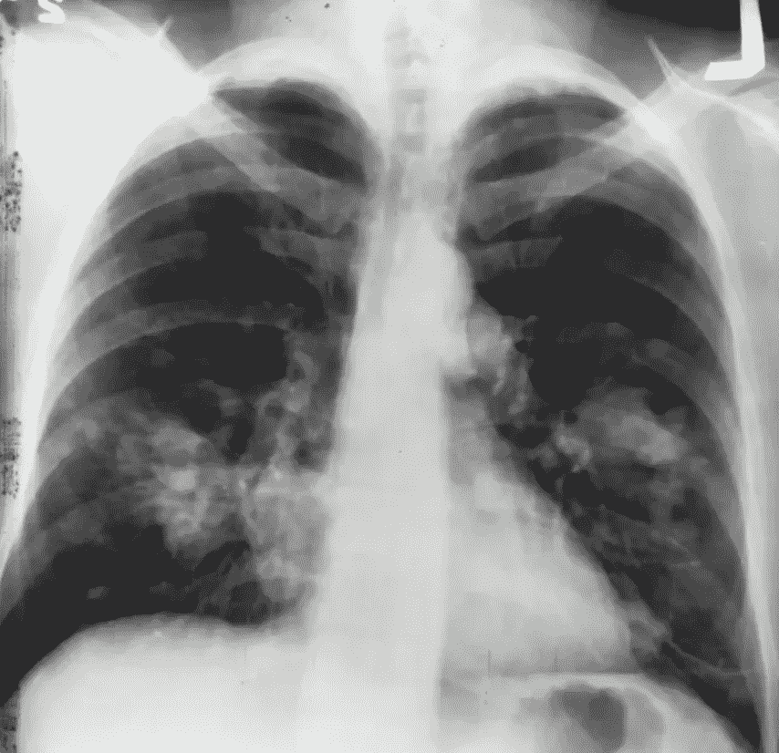
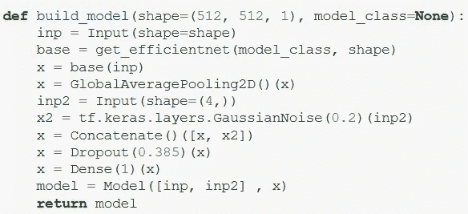
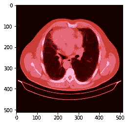
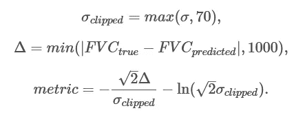
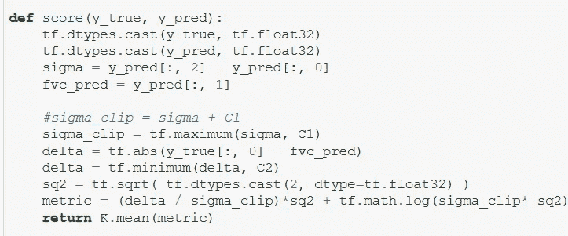
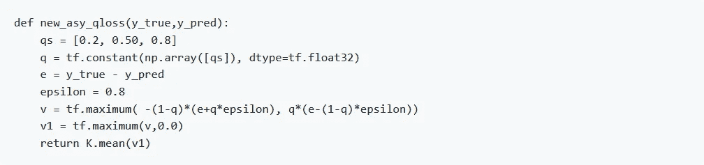
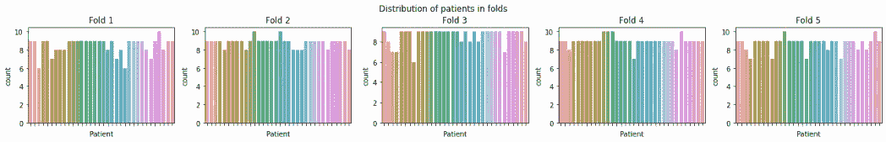
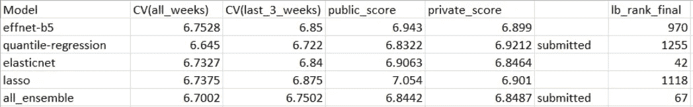

# OSIC 肺纤维化进展银牌解决方案

> 原文：<https://medium.com/analytics-vidhya/silver-medal-solution-to-osic-pulmonary-fibrosis-progression-99017ee24641?source=collection_archive---------8----------------------->

# **简介:**

首先，我要感谢[卡格尔和 OSIC](https://www.kaggle.com/c/osic-pulmonary-fibrosis-progression/overview) 举办这次比赛。我还要感谢我的队友[贾加迪什](https://www.kaggle.com/jagadish13)和[舒巴姆](https://www.kaggle.com/trooperog)。在这场比赛中，我们被要求根据患者肺部的 ct 扫描和肺活量计的输出来预测患者肺功能下降的严重程度，肺活量计测量吸入和呼出的空气量，并且还提供表格数据作为参赛者的输入，表格数据包括基线 FVC(用力肺活量系数)、周数、年龄、性别和百分比。挑战在于使用机器学习技术，以影像、元数据和基线 FVC 作为输入进行预测。这更像是一场表格数据的竞争，但使用 CT 扫描会带来推动，同时当它被赋予比表格数据更高的优先级时，它会导致排行榜的急剧下降。在这场比赛中，我意识到这是一场回归和分类的比赛。此外，公开排行榜的分数仅基于 15%的测试数据，当私人分数公布时，我们看到了巨大的排行榜变动。但是我们从动荡中幸存了下来，因为我们选择了验证分数更高的模型。因此，我们最终的解决方案是 efficient-net-b5(在 CT 扫描上训练)、elastic-net(在表格数据上训练)和 quantile-regression-model(在表格数据上训练)的集成。

# **型号:**

我们最终的 effnet 模型是有效的-b5-模型用 CT 扫描训练，训练是模型-> globalaverageopooling->添加高斯噪声-> Dropout-> Dense with Adam Optimizer。这样就输出了斜率和初始 FVC(用力肺活量),有了这个斜率，我们就可以根据初始 FVC 计算出随后几周的 FVC。我们对这个模型进行了 50 个时期的训练，得到的 CV 值(平均绝对误差)为 3.47718631997。

eff net-b5-模型

肺部图像样本。

上面显示的肺图像是一个样本肺图像，作为我们模型的输入。

# **竞争指标:**

对数似然的一个修改版本被作为竞争度量给出。

对于每个真实的 FVC 测量，竞争者被要求预测 FVC 和置信度(标准差 *σ* )。误差的阈值为 1000 毫升，以避免较大的误差对结果造成不利影响，而置信值被限制在 70 毫升，以反映 FVC 的近似测量不确定性。通过对患者在所有测试集中最后 3 周获得的指标进行平均来计算最终得分。下面给出了我的竞争指标的 python 实现。

# **训练:**

这是使用以下参数训练的:

*   Adam 优化器，带有减少平台调度程序
*   用 0.003 的 LR 训练 50 个时期和 5 个折叠
*   effnet-model 的批量大小为 4
*   接下来，我们使用新的分位数损失对表格数据进行分位数回归:

*   为 10 倍和 855 个时期训练分位数回归模型。
*   使用 Adam Optimizer 和 0.1 的 LR 进行训练
*   接下来，我们对 alpha=0.3 和 l1_ratio=0.8 的表格数据使用 ElasticNet
*   我们把这个训练了 10 次
*   接下来，我们对 random_state=42 的表格数据使用 LassoRegressor，我们没有做太多的更改。
*   我们把这个训练了 10 次。
*   无批量累加或混合精度
*   我们只使用 kaggle 内核-一个用于训练 effnet，另一个用于推断 effnet，在线训练和推断剩余的模型。

# **组装:**

我们做了加权平均，权重是使用 **scipy 的优化**和**最小化**函数计算的。

# **最终提交:**

我最后提交的是上述三个模型的合集。然而，我们发现 elastic-net 得分很高，但我们没有选择它作为我们的最终提交，否则我们会在排行榜上上升一些。

这是我在 Kaggle 上的第一枚银牌，我真的很高兴。试图下次获得金牌。这真的是一场很好的比赛，我们明白不尊重 CV 而提高公众 lb 分数是不好的，正如你从上面的分数中所看到的。

我已经附上我的 github 回购包含代码。

[**Github 回购**](https://github.com/vineeth-raj/OSIC-Pulmonary-Fibrosis-Progression)