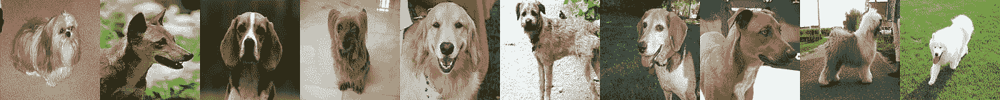
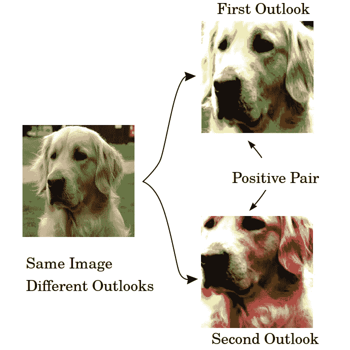
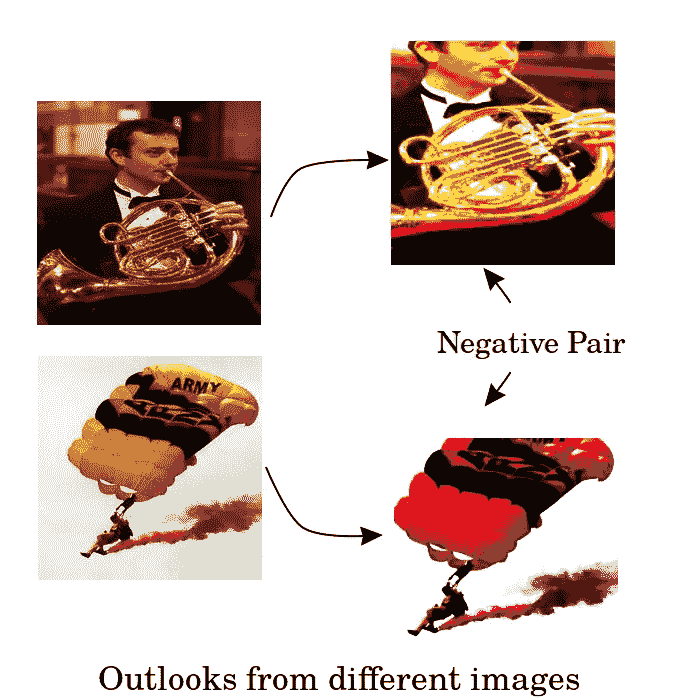
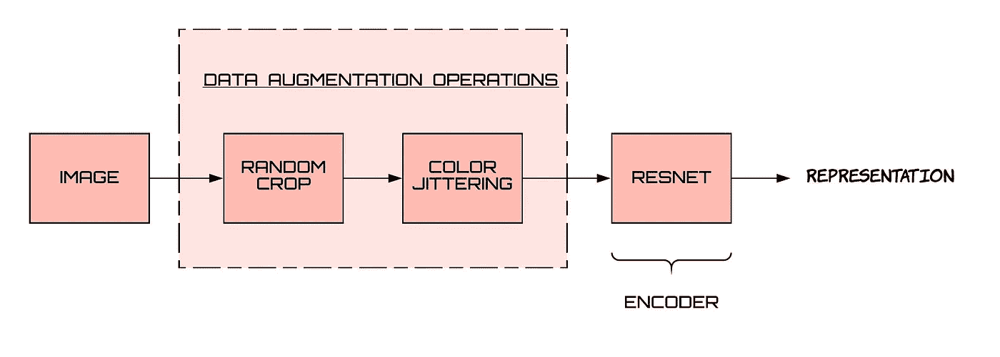
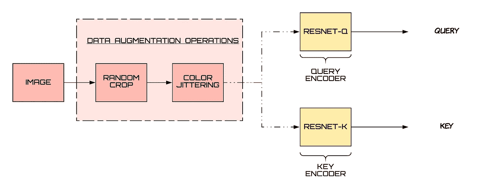
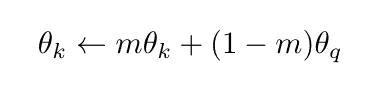
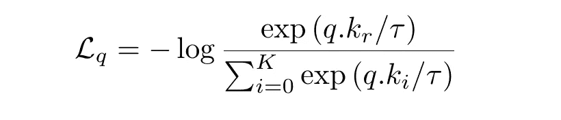
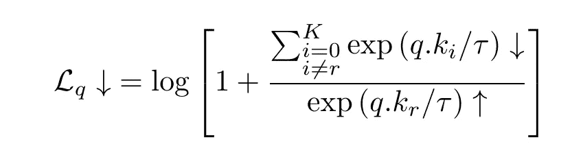
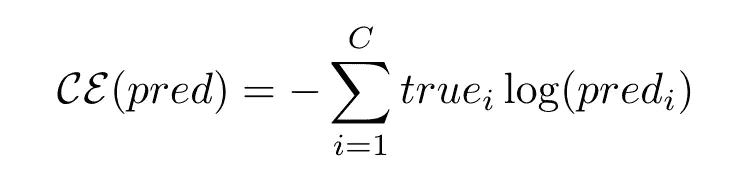

# 使用 PyTorch 中的动量对比 V2 (MoCo-V2)减少 SimCLR 中的计算约束

> 原文：<https://medium.com/analytics-vidhya/simclr-with-less-computational-constraints-moco-v2-in-pytorch-3d8f3a8f8bf2?source=collection_archive---------4----------------------->

赫克托·j·里瓦斯在 [Unsplash](https://unsplash.com?utm_source=medium&utm_medium=referral) 上拍摄的照片

在之前的[博客文章](/analytics-vidhya/understanding-simclr-a-simple-framework-for-contrastive-learning-of-visual-representations-d544a9003f3c?source=your_stories_page---------------------------)中，我们在 PyTorch 中实现了 **SimCLR 框架。在一个只有 1250 幅训练图像的 5 个类别的简单数据集上理解和实现它是一个有趣的练习。从 [SimCLR 论文](http://cse.iitkgp.ac.in/~arastogi/papers/simclr.pdf)中，我们看到了框架**如何受益于更大的模型和更大的批量**，并且如果有足够的计算能力，可以产生与监督模型相当的结果。但是这些要求使得框架的计算量相当大。如果我们能够拥有这个框架的简单性和强大功能，并且有更少的计算需求，这样每个人都可以使用它，这不是很好吗？ [**Moco-v2**](https://arxiv.org/pdf/2003.04297.pdf) 前来救援。**

## 数据集

这次我们将**在 PyTorch** 中在更大的数据集上实现 Moco-v2，并在 Google Colab 上训练我们的模型。这次我们将使用由 Fast 的杰瑞米·霍华德制作的 [**Imagenette 和 Imagewoof 数据集**](https://github.com/fastai/imagenette/) 。AI 。

Imagenette 数据集中的一些图像

来自 Imagewoof 数据集的一些图像

这些数据集的快速总结(更多信息请参见[此处](https://github.com/fastai/imagenette)):

*   Imagenette 由来自 Imagenet 的 **10 个容易分类的类**组成，共有 9479 个训练和 3935 个验证集图像。
*   Imagewoof 是来自 Imagenet 的 10 个困难类别的数据集——困难是因为所有类别都是狗的品种。总共有 9035 个训练集和 3939 个验证集图像。

# 对比学习——综述

对比学习在自我监督学习中的工作方式是基于这样的想法:我们希望来自同一类别的不同外观的图像具有相似的表示。但由于我们不知道哪些图像属于同一类别，通常所做的是将同一图像的不同外观的**表示彼此拉近**。这些成对的不同观点被称为正对。

但是常数表示满足了这个想法。所以，另外，**我们希望来自不同类别的不同外观的图像有彼此远离的表现。**但是，同样，由于缺乏关于类别的信息，相反**与类别无关的不同图像的不同外观的表示被彼此推开**。这些成对的不同观点被称为否定对。

在这种背景下，一幅图像的前景如何？展望可以被认为是以一种改变的方式看待图像的某一部分，它本质上是图像的一种转换。根据手头的任务，有些转换可能比其他转换更有效。SimCLR 表明，应用**随机裁剪和颜色抖动**可以很好地完成各种任务，包括图像分类。这基本上来自于网格搜索，从旋转、裁剪、剪切、噪声、模糊、sobel 过滤等选择中选择一对变换。通过**神经网络**完成从前景到表示空间的**映射，并且典型地，为此目的使用 **resnet** 。**

从图像到表示的管道如下所示。

# 负对是如何产生的？

从同一个图像中，由于随机裁剪，我们可以得到多个表示。这样，我们就可以生成正对。但是负对是如何产生的呢？**负像对是来自不同图像的表示**。SimCLR 论文在同一批中创建了这些。如果一个批处理包含 N 个图像，那么对于每个图像，我们得到 2 个表示，这总共占 2*N 个表示。对于一个特定的表示 x，有一个表示与 x 形成正对(与 x 来自同一个图像的那个),其余的(正好 2*N - 2)与 x 形成负对。

如果我们手头有大量的阴性样本，那么这种表现会有所改善。但是在 SimCLR 的情况下，只有当我们具有大批量时，才能完成大量的负样本，这导致了更高的计算能力要求。**动量对比(MoCo)提供了生成阴性样本的替代方法。**让我们详细了解一下。

## 动态词典

我们可以用稍微不同的方式来看待对比学习方法，即**将查询与键**匹配。不再只有一个编码器，我们现在有**两个编码器——一个用于查询，另一个用于键。**此外，为了有大量的否定样本，我们有**一个大的编码密钥字典。**

这个上下文中的正对意味着查询与键匹配。如果查询和密钥来自同一个图像，则它们匹配。*一个编码的查询应该与其匹配的键相似，而与其他的不相似[1]。*

对于负对，**我们维护一个大字典，其中包含来自先前批次**的编码密钥。它们充当手头查询的负样本。字典以队列的形式维护，最新的一批入队，最老的一批出队。通过改变该队列的大小，可以改变负样本的数量。

## **这种方法的挑战**

*   随着键编码器的改变，在较晚的时间点排队的键可能变得与很早就排队的键不一致。**为了使对比学习方法起作用，与查询进行比较的所有关键字必须来自相同或相似的编码器，以使比较有意义且一致。**
*   另一个挑战是**使用反向传播来学习关键编码器参数是不可行的，因为这需要计算队列中所有样本的梯度**(这将产生一个大的计算图)。

为了解决这两个问题，MoCo 将关键编码器实现为查询编码器【1】的基于动量的移动平均值*。这意味着它以这种方式更新关键编码器参数:*

其中 m 保持非常接近 1(例如，典型值是 0.999)，这确保我们在不同时间从相似的编码器获得编码的密钥。

# 损失函数——信息

**我们希望一个查询接近它的所有正样本，而远离它的所有负样本**。这由 InfoNCE 损失函数捕获，其中 InfoNCE 代表信息噪声对比估计。对于正关键字是 kᵣ的查询 q，信息损失函数被定义为:

我们可以改写成这样的形式:

**当 q 和 k 之间的相似度** ᵣ **增加时，以及当 q 和负样本之间的相似度**减少时，损失值减少

该损失函数可在 PyTorch 中编码如下:

让我们再来看看这个损失函数，并将其与分类交叉熵损失函数进行比较。

这里，predᵢ是数据点属于 iᵗʰ类的概率值预测，而 trueᵢ是该点属于 iᵗʰ类的实际概率值(可能很模糊，但主要是一次性的)。

如果你是这个话题的新手，你可以观看这个视频来更好地理解交叉熵。另外，请注意，分数通常通过 softmax 之类的函数转换为概率值。

**我们可以把信息损失函数看作交叉熵损失。数据样本“q”的正确类是 rᵗʰ类，底层分类器是基于 softmax 的，它试图在 K+1 个类之间进行分类。**

信息 NCE 损失也与编码表示之间的互信息有关；关于这一点的更多细节见[4]。

# MoCo-v2 框架

现在，让我们把所有的东西放在一起，看看整个动量对比算法是什么样子的。

**第一步:**我们必须得到查询和键编码器。**最初，键编码器的参数与查询编码器**的参数相同。他们是彼此的复制品。随着训练的进行，关键编码器将成为查询编码器的移动平均值(在该值上缓慢前进)。

由于计算能力的限制，我们使用 Resnet-18 架构来实现。在通常的 resnet 架构之上，我们添加了一些密集层，以将表示的维度降低到 25。这些层中的一些将在稍后充当投影头，就像我们在 [SimCLR](/analytics-vidhya/understanding-simclr-a-simple-framework-for-contrastive-learning-of-visual-representations-d544a9003f3c?source=your_stories_page---------------------------) 中所做的一样。

**步骤 2:** 现在，我们已经有了编码器，并假设我们已经建立了其他重要的数据结构，是时候开始训练循环并理解管道了。

**这一步是从训练批次中获取编码的查询和键。**我们通过它们的 L2 范数来归一化这些表示。

只是一个约定警告，所有后续步骤中的代码都将位于批处理和历元的循环中。我们还将张量“k”从其梯度中分离出来，因为我们不需要计算图中的关键编码器部分，因为动量更新方程会更新我们的关键编码器。

**步骤 3:** 现在，我们将查询、键和队列传递给我们之前定义的损失函数，并将值存储在一个列表中。然后，像往常一样，我们对损失值调用 backward 函数并运行优化器。

第四步:我们将最新的一批放入队列。如果我们的队列大小大于我们定义的最大队列大小(在 K 中),那么我们将最早的批处理从队列中出列。**通过使用 torch.cat 可以完成入队操作，通过对张量进行简单的索引切片可以完成出队操作。**

**第五步:**现在我们到了训练循环的最后一步，即更新关键编码器。我们使用下面的 for 循环来实现。

## 一些训练细节

对于 Imagenette 和 Imagewoof 数据集，训练 resnet-18 模型需要将近 18 小时的 GPU 时间。为此，我们使用了 Google Colab 的 GPU (16GB)。我们使用的批量大小为 256，tau 值为 0.05，学习速率为 0.001，我们最终将其降低到 1e-5，权重衰减为 1e-6。我们的队列大小是 8192，关键编码器的动量值是 0.999。

# 结果

顶部的 3 层(将 relu 视为一层)定义了我们的投影头，为了图像分类的下游任务，我们移除了它。在剩下的网络之上，我们训练了一个线性分类器。

使用 MoCo v2，我们在使用 10%的标记训练数据时，获得了 64.2%的 Imagenette 准确率。相比之下，使用最先进的方法进行监督学习，可以达到近 95%的准确率，这可以从[排行榜](https://github.com/fastai/imagenette)中看出。

对于 Imagewoof，我们对 10%的标记数据获得了 38.6%的准确率。在这个数据集上的对比学习表现低于我们的预期。我们怀疑这是因为，首先，数据集相当难，因为所有的类都是狗的种类。第二，我们认为颜色是这些阶级的一个基本区别特征。应用颜色抖动可能会导致来自不同类别的多个图像具有相互混合的表示。相比之下，监督方法在这方面的准确率接近 90%。

**能够弥合自我监督模型和监督模型之间差距的设计变更:**

1.  使用更大更宽的模型。
2.  使用更大的批处理和字典大小。
3.  如果可以的话，使用更多的数据。同时引入所有未标记的数据。
4.  根据大量数据训练大型模型，然后对其进行提炼。

**一些有用的链接:**

*   [Google Colab 的笔记本链接](https://colab.research.google.com/drive/1AepjEbcHPw2Z-xY8iJkvou-Njnn0VZmd?usp=sharing)
*   [Imagewoof 结果 Github Repo](https://github.com/thunderInfy/mocov2-imagewoof-results)
*   [Imagenette 结果 Github Repo](https://github.com/thunderInfy/simclr-with-momentum)
*   [图像数据集链接](https://github.com/thunderInfy/imagewoof)
*   [Imagenette 数据集链接](https://github.com/thunderInfy/imagenette)

# 参考

1.  【用于无监督视觉表征学习的动量对比，何，，范，，谢赛宁，和 Ross Girshick
2.  [用动量对比学习改进基线，陈，范，Ross Girshick，何](https://arxiv.org/pdf/2003.04297.pdf)
3.  视觉表征对比学习的简单框架，陈婷、西蒙·科恩布利思、穆罕默德·诺鲁齐和杰弗里·e·辛顿。
4.  [对比预测编码的表征学习，Aaron van den Oord，Yazhe Li 和 Oriol Vinyals](https://arxiv.org/pdf/1807.03748.pdf)

*原载于 2020 年 8 月 13 日*[https://www . analyticsvidhya . com/blog/2020/08/moco-v2-in-py torch/](https://www.analyticsvidhya.com/blog/2020/08/moco-v2-in-pytorch/)*。*