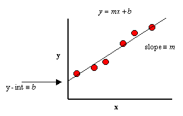
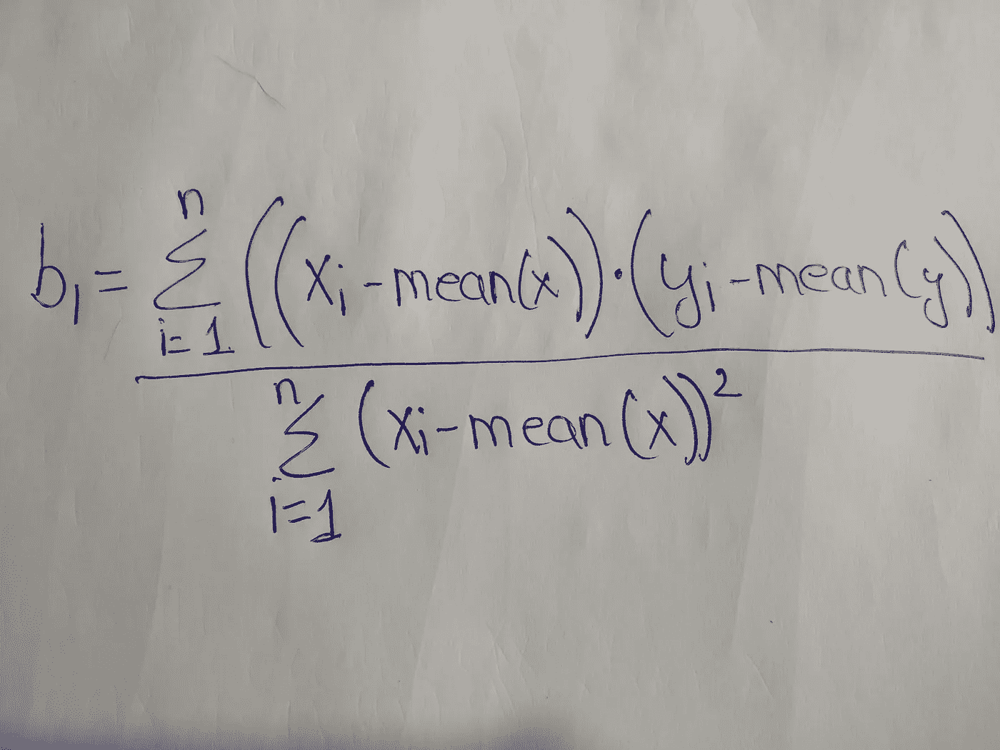
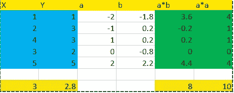

# 简单和多元线性回归数学，计算截距，系数和使用 Sklearn 实现

> 原文：<https://medium.com/analytics-vidhya/simple-and-multiple-linear-regression-maths-calculating-intercept-coefficients-and-9b05756391b5?source=collection_archive---------5----------------------->


线性回归是概率/统计领域最古老的方法之一。它的工作原理是拟合因变量和自变量之间的最佳拟合线。让我们熟悉一些常用术语。



最佳拟合线

**截距(b0):** 截距是最佳拟合直线在平面上与 y 轴相交的地方。

**斜率(b1):** 斜率是 y 值如何随着 x 轴上相应的单位变化而变化的度量(单位=1 值偏移)

让我们使用一个样本数据集，这样我们就可以理解简单线性回归背后的数学原理。

```
x=[1,2,4,3,5] #independent variable
y=[1,3,3,2,5] #dependent variable
```

## **Y=b0+b1*(x)** ，其中:

```
b0= interept
b1= coefficint of the independent variable
x= independent variable
Y=target variable
```

b0 =平均值(y)-B1 *平均值(x)



```
consider **xi-mean(x)** as **a**,**yi-mean(y)** as **b** 
So in the numerator we are going to have **a*b** for all n values
And in the denominator we will have **a*a** for all n values
```



```
So according to the formula for b1, the value of b1=8/10 is 0.8
b0=mean(y)-b1*(mean(x))
b0=2.8-0.8*(3)
b0=0.4
```

现在我们有了 X 和 Y 值的线性回归方程。

Y=0.4+0.8(X)

让我们替换 X 的一些值来检查我们的预测值。

```
##when x=1
Y=04+0.8(1)-->**1.2**
##when x=2
Y=0.4+0.8(2)-->**2**
##when x=4
Y=0.4+0.8(4)-->**3.6**
##when x=3
Y=0.4+0.8(3)-->**2.8**
##when x=5
Y=0.4+0.8(5)-->**4.4****0.692**(RMSE metric)
```

我创建了一个 Python 程序来计算简单线性回归的截距、斜率和预测。

```
def slope(x1,y1):
    a11=[]
    b11=[]
    c11=[]
    d11=[]
    a1=[]
    b1=[]
    c1=[]
    d1=[]
    mean_x=sum(x1)/len(x1)
    mean_y=sum(y1)/len(y1)
    for i in x1:
        a1=i-mean_x
        a11.append(round(a1,2))

    for j in y1:
        b1=j-mean_y
        b11.append(round(b1,2))

    for i,j in zip(a11,b11):
        c1=i*j
        c11.append(round(c1,2))

    for k in a11:
        d1=k*k
        d11.append(round(d1,2))

    sflope_l=sum(c11)/sum(d11)
    return sflope_ldef intercept(x2,y2):
    mean_x1=sum(x2)/len(x2)
    mean_y1=sum(y2)/len(y2)

    intercept=mean_y1-b1*mean_x1
    return round(intercept,2)def prediction(b0,b1,x):
    pred=b0+b1*x
    return round(pred,2)prediction(intercept(x,y),slope(x,y),4)
#returns **3.6**
```

既然我们知道简单线性回归是如何工作的，那么实现多元线性回归将会非常容易。公式有一些小的变化，我们准备好了。假设我们有两个独立特性**年龄**和**经验**和一个依赖特性**薪水**。

```
Y=b0+b1*x1+b2*x2
where:
b1=Age coefficient
b2=Experience coefficient
#use the same b1 formula(given above) to calculate the coefficients of Age and Experience
```

因为多元线性回归的计算可能很复杂并且需要很长时间。对于截距和系数的计算，我将使用 sklearn 线性回归模型。

```
**#implementing multiple Linear Regression Using Sklearn** import pandas as pd
import numpy as np
from sklearn.linear_model import LinearRegression as LRAge=[21,25,28,30,35]
Experience=[1,4,7,9,14]
Salary=[2000,4000,8000,10000,20000]data=pd.DataFrame({
    'Ages':Age,
    'Experiences':Experience,
    'Salary':Salary
})X=data.iloc[:,data.columns!='Salary']
Y=data.Salarymodel=LR()
model.fit(X,Y)model.intercept_
**70962.26415094335**model.coef_
**-3528.30188679,5132.0754717**def predictions_multiple(x,y):
    pred=70962.26415094335+(-3528.30188679*x)+(5132.0754717*y)
    return round(pred,0)predictions_multiple(21,1)
**#2000.0**predictions_multiple(25,4)
**#3283.0**predictions_multiple(28,7)
**#8094.0**predictions_multiple(30,9)
**#11302.0**predictions_multiple(35,14)
**#19321.0**
```

好了，伙计们，我们现在对线性回归背后的数学有了一个很好的了解。这是一个非常有效的模型，易于实现和理解。为了使预测更加准确，需要执行一些预处理技术来减少误差，并帮助模型学习从输入到输出的基本映射函数。以下是为线性回归准备数据的一些提示:

*   **线性假设:**模型受益于从属&独立特征之间的线性关系。我们可以使用**对数变换对数据进行线性变换。**
*   **移除共线性**:如果存在多重共线性，线性回归将过度拟合模型。考虑移除最独立的相关特征。
*   **去除噪声:**去除数据中的异常值，适当清理数据。从输出变量中移除异常值会有所帮助。
*   重新调整输入:模型通常会做出更可靠的预测，如果我们**标准化**或者**规范化**数据的话。
*   **高斯分布:**模型受益于高斯分布，尝试使用**对数**或 **box-cox** 变换。

如果你觉得这篇文章有帮助或者你认为有改进的空间，请在下面的评论区告诉我。如果您是数据科学领域的新手，请访问我的 Github，我有一些很棒的教程和概念可以帮助您入门。

github:[https://github.com/nitin689](https://github.com/nitin689)

练习线性回归的一些问题:[https://mathbitsnotebook . com/代数 1/statistics reg/ST 2 linregpractice . html](https://mathbitsnotebook.com/Algebra1/StatisticsReg/ST2LinRegPractice.html)