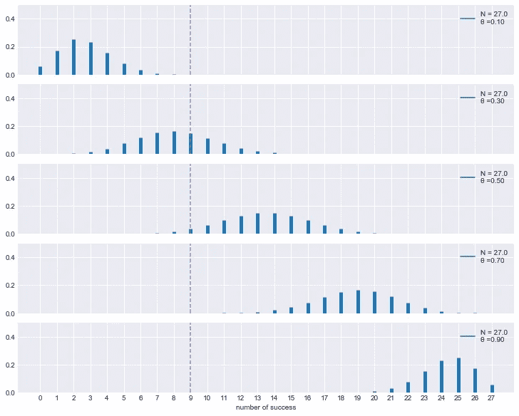
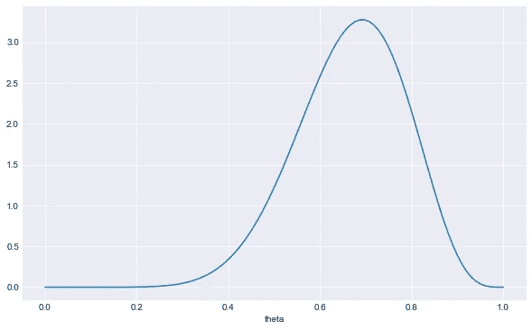
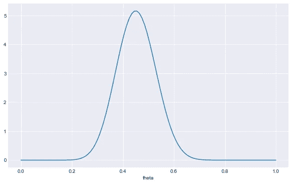
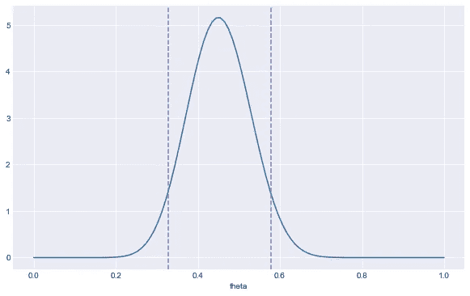

# 简单贝叶斯:一个你今天可以应用的例子！

> 原文：<https://medium.com/analytics-vidhya/simple-bayes-an-example-you-can-apply-today-11381b723967?source=collection_archive---------27----------------------->

贝叶斯或概率统计方法不仅在学术界和科学领域，而且在商业领域变得越来越流行。即使贝叶斯定理本身并不难理解，但当涉及到线性回归参数时，计算马上变得繁琐得多。所以，人们决定跳过它。

在这篇文章中，可能还有接下来的文章，我将给出几个案例和简单的 Python 例子，说明数据分析师和数据科学家如何在相当常见的情况下应用贝叶斯，当它带来可靠和合理的结果时，不需要付出太多的努力。

# 任务

我的大部分经历都与游戏设计有关。假设你的游戏设计师/制作人想出了一个关于新功能/游戏机制的主意。她相信你所有的球员都会喜欢它。在一组 27 名玩家的游戏测试中，只有 9 人表示他们完全理解这个想法和机制。与预期相差很大，对吧？如何找到共识？仅仅根据 26 条评论就能下结论吗？没有时间去思考和做更多的测试了——我们需要计划一个发布！

太棒了。这是用贝叶斯理论掸去你讲课灰尘的最佳时机。

从数学上来说，我们有一个[](https://en.wikipedia.org/wiki/Binomial_distribution)*二项式过程，需要估计参数𝜃——成功率——喜欢和玩新机制的玩家比例。*

*让我们加载库并设置关键变量。*

```
*import numpy as np
import matplotlib.pyplot as plt
from scipy import statsplt.style.use('seaborn-darkgrid')
plt.rcParams['figure.figsize']=(10,6)N = 27 # Number of trials/testers
success = 9
x = np.arange(0, N+1) # All possible outcomes*
```

*为了更好地理解全貌，让我们画出不同真实𝜃的可能结果*

```
*theta=np.linspace(0.1, 0.9, 5) # set of different possible thetasf,ax = plt.subplots(len(theta), 1,
                    sharex=True, sharey=True,
                    figsize=(8, 7), constrained_layout=True)for j in range(len(theta)):        
    p = theta[j]        
    y = stats.binom(n=N, p=p).pmf(x)        
    ax[j].vlines(x, 0, y, colors='C0', lw=5)        
    ax[j].set_ylim(0, 0.5)
    ax[j].plot(0, 0, label="N = {:3.1f}\nθ ={:3.2f}".format(N,p))
    ax[j].axvline(x=success, color='C4', linestyle='--')

    ax[j].legend()
    ax[4].set_xlabel('number of success')        
    ax[0].set_xticks(x)*
```

**

*我们可以看到，𝜃大于 70%看起来绝对不合理。但是 50%的概率有可能是真的。在这种情况下，27 次试验中有 9 次成功的概率只有 3.5%。但是谁知道呢，也许在生产中，有了我们真正的用户大军，我们会得到更多的运气。*

```
*stats.binom.pmf(success, N, 0.5)
Out[4]: 0.034919567406177285*
```

*但是为了计划这个特性的发布，我们需要得到一些𝜃.的边界游戏设计师同意她最初的感觉过于乐观。但是在真实的人群中，当人们开始玩并谈论新的机制时，她预计参与度不会低于 70%。不错！我们将在我们的先验中反映这一点。*

# *院长*

*让我们为可能的𝜃估计建立空间，然后使用 [*贝塔分布*](https://en.wikipedia.org/wiki/Beta_distribution) 来表示*“不低于 70%的参与度”*。*

```
*theta_space = np.linspace(0, 1, 100)alpha=10
beta=5y_pdf=stats.beta.pdf(theta_space, alpha, beta)
fig, ax = plt.subplots(1,1)
plt.plot(theta_space, y_pdf)
ax.set_xlabel('theta')
plt.show()*
```

**

*我不会过多关注 [beta 分布](https://en.wikipedia.org/wiki/Beta_distribution)本身。但我只想说𝛼和𝛽塑造了这条曲线。如果我们成比例地增加它们，例如把𝛼设为 6，𝛽设为 3，我们会得到“更胖的钟”，对所讨论的参数没有那么确定的先验知识。在许多出版物中，像这本[的书](https://subscription.packtpub.com/book/data/9781789341652)，推荐使用*的弱信息先验*，我完全喜欢这个想法。*

*幸运的是，有了二项式和贝塔分布，贝叶斯计算非常简单——我保证！基于公式𝑃(𝜃|𝑦) ~ 𝐵𝑒𝑡𝑎(𝛼+𝑦，𝛽+𝑁−𝑦)我们可以很容易地获得新的𝛼和𝛽的后验估计我们真正的𝜃*

```
*alpha_post=alpha+success
beta_post=beta+N-successy_pdf=stats.beta.pdf(theta_space, alpha_post, beta_post)
fig, ax = plt.subplots(1,1)
plt.plot(theta_space, y_pdf)
ax.set_xlabel('theta')
plt.show()*
```

**

# *合理估计*

*就是这样！基于我们的实验和对速率应该是多少的先验信念，我们得到了这个分布。我们来画一些关键值。贝塔分布理论平均值是𝜇=𝛼/(𝛼+𝛽)*

```
*alpha_post/(alpha_post+beta_post)
Out[9]: 0.4523809523809524*
```

*和 90% *最高密度区间*。请记住，这不同于置信区间，90%是一个任意的数字。*

```
*x1=stats.beta.ppf(0.05, alpha_post, beta_post) # limits lower 5% tail on the right
x2=stats.beta.ppf(0.95, alpha_post, beta_post) # limits upper 5% tail on the leftfig, ax = plt.subplots(1,1)
plt.plot(theta_space, y_pdf, label='pdf')
plt.axvline(x1, color='C4', linestyle='--')
plt.axvline(x2, color='C4', linestyle='--')
plt.show()*
```

**

```
*print(x1, x2)
0.32866582116602666 0.5787066958031966*
```

*我要说的是，期望参与超过 60%的机制是不合理的。同时，我们确信至少有 33%的玩家会得到它并玩它。有了这把叉子，我们可以制定计划。*

*真正美妙的是，有了新的数据，我们可以更新估计。假设我们又收到了 10 条评论。我们只需将结果添加到我们的𝛼和𝛽中，就能更精确地了解𝜃.*

*我希望无论你在哪个领域工作，你都会发现这是有趣和有用的。更多的例子和场景，你可以很容易地使用贝叶斯方法将随之而来。*

*敬请期待！*