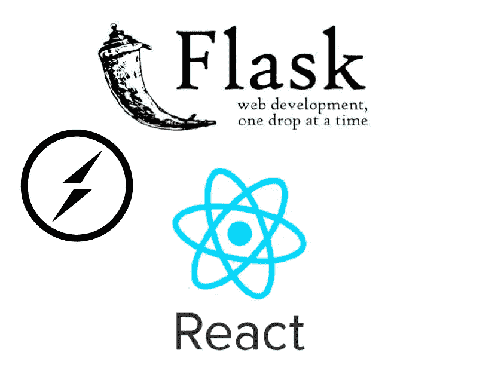
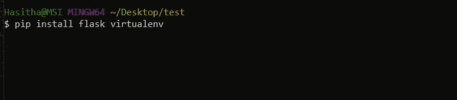
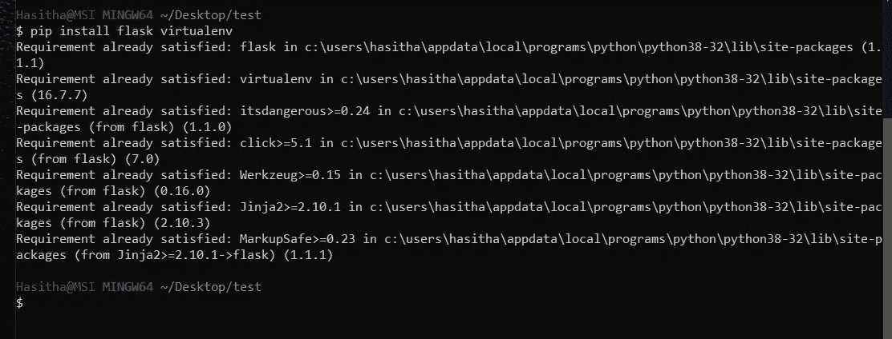
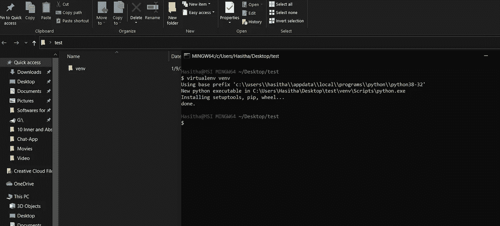
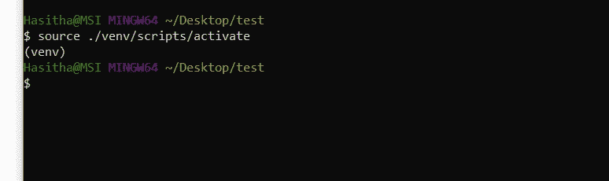
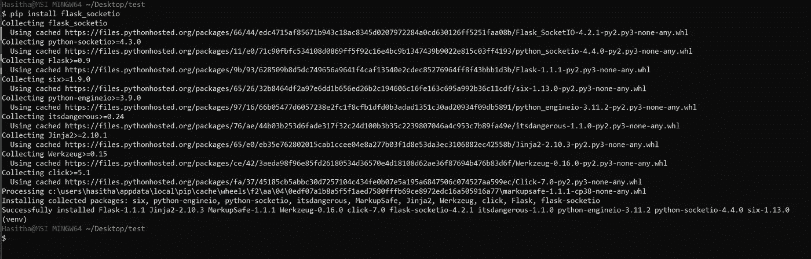
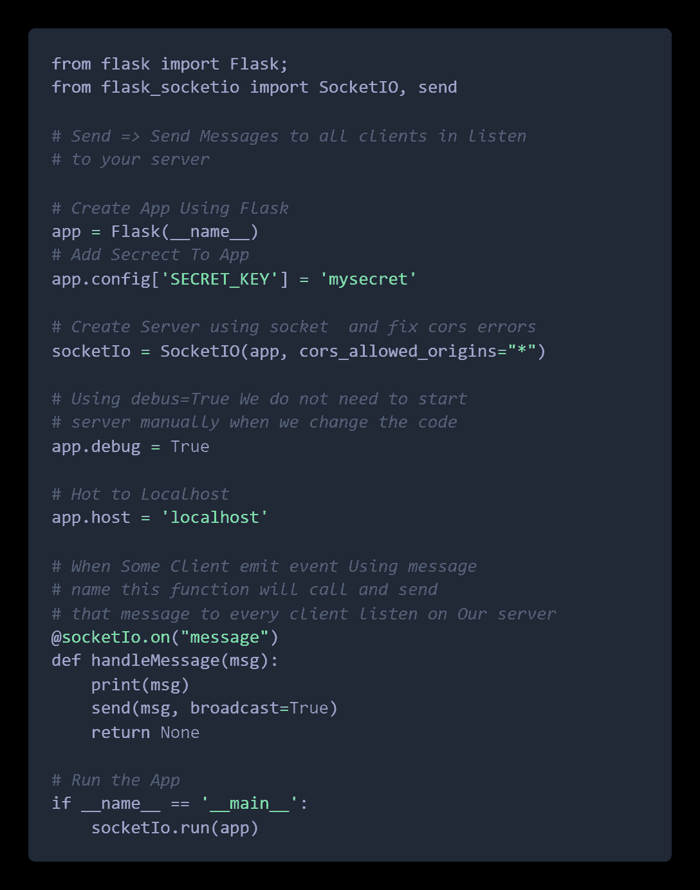
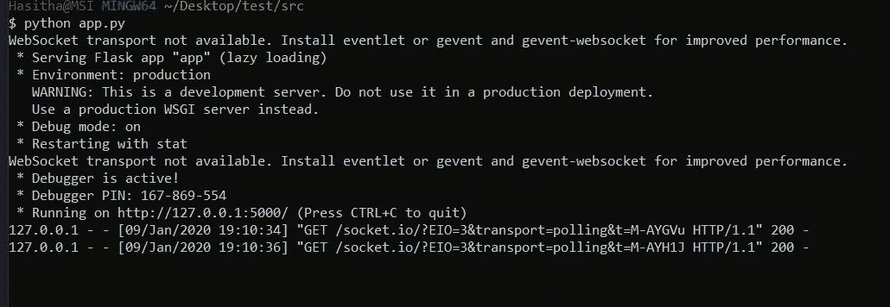
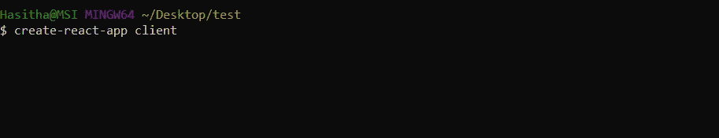
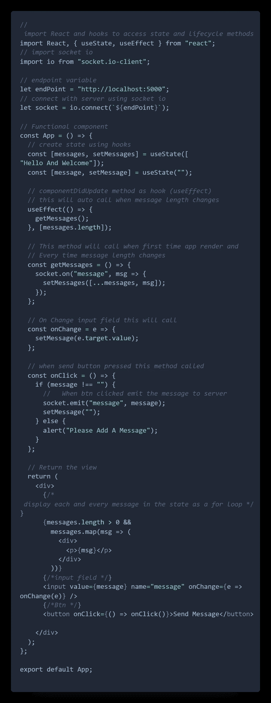

# 带有 React 和 Flask 的简单聊天应用程序

> 原文：<https://medium.com/analytics-vidhya/simple-chat-app-with-react-flask-b2ae72404fcb?source=collection_archive---------0----------------------->

在本文中，我将向您展示如何使用 react、flask 和 socket 构建一个实时的简单聊天应用程序。Io 库。React 是 JavaScript 库，Flask 是 python 库。我使用 React 作为我的客户端，flask 作为我的服务器端。我用了插座。Io 使我的应用程序实时。

首先，我将使用 flask 构建服务器端部分。

首先，你需要在你的电脑上安装 python 3，或者如果你没有安装，点击这里下载并安装最新版本的 python 3。之后，你需要在你的电脑上安装 flask 和 virtualenv。你可以打开你的终端或 cmd (windows)并输入***pip install flask virtualenv。***

我之前已经安装了，所以它会给我这样的响应

然后转到您的项目文件夹并创建 virtualenv。 ***virtualenv。***

它将创建一个 venv 文件夹，这是您的应用程序的环境。

现在打开这个文件夹，你最喜欢的文本编辑器，我用 vs-code 创建一个文件夹 src。在 src 文件夹中创建 app.py 文件。这个 app.py 文件是我们的应用程序中的主文件。

然后我们需要激活我们的 virtualenv，在你的项目文件夹中打开终端，输入 ***source。/venv/脚本/激活。***

现在在终端(venv)中显示

最后，我们需要安装 flask_socketio。我们可以使用 ***pip 安装 flask_socketio***

现在，环境设置在服务器端完成。首先在 app.py 文件中，我们需要导入 flask 和 flask_socketio staff 来构建一个服务器 app。

服务器端代码

现在服务器端已经完成，我们需要运行我们的服务器。在我们的项目 ***src*** 文件夹中打开终端，输入 python app.py

它会给出这样的信息。所以在我的例子中，我的应用程序将运行端口 5000。您可以通过如上图所示的终端详细信息找到您的服务器端口。现在我们需要和客户端一起工作。

首先，我们需要安装 nodejs。点击此处并在你的电脑上下载和安装 nodejs。之后，我们需要使用 create-react-app 创建 react app。全局安装键入***NPM I-g create-react-app。安装后进入你的项目文件夹，打开终端，输入 ***创建-反应-应用客户端。******

应用程序创建后，在文本编辑器中打开客户端文件夹，并在 App.js 文件中粘贴以下代码(代码在注释中解释)

现在服务器端和客户端都完成了。

现在，npm 在客户端文件夹中启动并测试您的应用程序。

[源代码](https://github.com/Hasi6/React-Flask-Chat-App)

就是这样。谢谢你