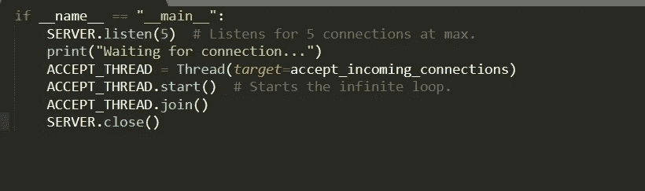
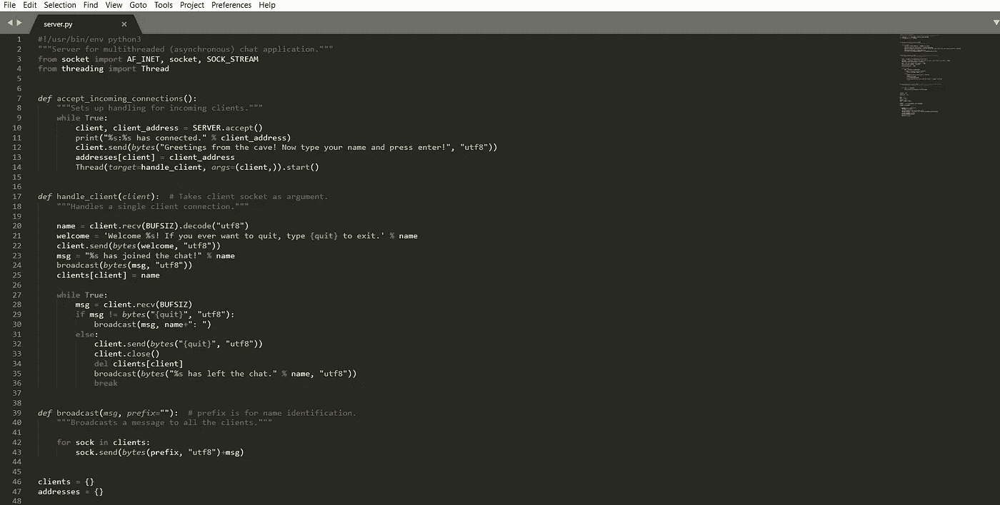

# Python 中的简单聊天室

> 原文：<https://medium.com/analytics-vidhya/simple-chat-room-in-python-b2cb0b2bf38c?source=collection_archive---------8----------------------->

## 插座+t inter


在直接进入教程之前，首先让我们回到过去，了解聊天应用程序发展的原因和历史。尽管如果你对发展的历史不感兴趣，你可以直接进入教程。

# **简史:**


追踪聊天应用的历史

信不信由你，聊天应用实际上可以追溯到 20 世纪 80 年代，当时 Compuserve 发布了 CB Simulator，这是第一个面向公众的专用在线聊天服务。第一条短信是由沃达丰 GSM 在 1992 年推出的，当时贯穿了整个 90 年代中后期，如 MSN 和 Yahoo！变得流行起来。最著名的聊天应用出现在 2000 年代末，被称为黑莓信使，它彻底改变了现代聊天应用的世界。

# **教程:**

一个简单的聊天应用程序，带有相当精辟的 Python 代码。有趣的是，整个代码是在没有任何第三方依赖的情况下完成的！所以让我们开始吧！

## 服务器

在本教程中，我们将使用 TCP 套接字，因此我们使用`AF_INET`和`SOCK_STREAM`标志。我们在 UDP 套接字上使用它们，因为它们越来越电话化，在通信开始之前，受益人需要确认接近的关联，UDP 附件更像是邮件后的东西(利用这一点，任何人都可以向任何知道其电子邮件地址的人发送电子邮件)，所以在通信开始之前，它们不需要任何类型的连接。显然，TCP 比 UDP 套接字更符合我们的目标，因此我们将使用它们。 ***套接字可以被认为是双向通信信道中的端点，在服务器和一个或多个客户端*** *之间建立通信。*你可以在这里了解更多关于插座的[。](https://en.wikipedia.org/wiki/Network_socket)

```
#!/usr/bin/env python3
"""Server for multithreaded (asynchronous) chat application."""from socket import AF_INET, socket, SOCK_STREAM
from threading import Thread
```

导入后，我们设置了一些*常量*以备后用:

```
clients = {}
addresses = {}HOST = ''
PORT = 33000
BUFSIZ = 1024
ADDR = (HOST, PORT)
SERVER = socket(AF_INET, SOCK_STREAM)
SERVER.bind(ADDR)
```

目前，我们将我们的服务分为接受新连接、广播消息和处理特定客户。让我们从接受连接开始:


这只是一个循环，它永远支持接近关联，当它得到一个关联时，它记录连接(打印一部分微妙的关联)并向关联的客户发送 invite 消息。之后，它将客户的地址保存在`addresses`字典中，稍后为该客户端启动处理线程。显然，我们还没有描述目标容量 handle_client()的特征，但是我们可以这样做:


通常，在我们向新客户发送邀请消息后，它会回复一个他/她需要用于其他通信的姓名。在我们的`handle_client()`方法中，首先我们保存这个名字，然后向客户端发送另一个消息，以获得进一步的指示。从这里开始是通信的主要循环:在这里，我们接收来自客户的进一步消息，如果消息不包含停止指南，我们基本上将该消息传达给其他相关客户(我们将在一秒钟内描述广播技术)。万一我们确实遇到了带有退出指令的消息(例如，客户端发送退出命令 it `{quit}`，并将相同的消息回滚到客户端(这调用客户端的关闭操作)，然后我们关闭它的连接套接字。在这一点上，我们做一些清理工作，为客户删除该段落，并最终向其他相关人员大喊，这个特定的人已经离开了讨论。

我们的`broadcast()`函数来了:


这本质上像水晶一样清晰(我希望如此)；它只是将消息发送给所有相关的客户，如果重要的话，还会添加一个任意前缀。在我们的`handle_client()`方法中，我们确实给`broadcast()`传递了一个前缀，我们这样做的目的是让个人能够准确地看到特定消息的发送者是谁。

这是我们服务器的所有必要功能。之后，我们将输入一些代码来启动我们的服务器，开始监听传入的连接:



我们`join()` `ACCEPT_THREAD`的目标是主脚本等待它完成，而不跳转到下一行，这将关闭服务器。

这就完成了我们的服务器脚本:



## 客户:

这越来越有趣，因为我们将编写一个 GUI！为了我们已经提到的目的，我们将使用 Tkinter，Python 的工具来创建基于 GUI 的应用程序。在此之前，让我们先做一些导入:

```
#!/usr/bin/env python3
"""Script for Tkinter GUI chat client."""from socket import AF_INET, socket, SOCK_STREAM
from threading import Thread
import tkinter
```

现在我们将编写负责发送和接收消息的方法。我们从接收开始:

```
def receive():
    """Handles receiving of messages."""
    while True:
        try:
            msg = client_socket.recv(BUFSIZ).decode("utf8")
            msg_list.insert(tkinter.END, msg)
        except OSError:  # Possibly client has left the chat.
            break
```

为什么又是无限循环？因为我们将收到几乎无法确定的消息，并且不受我们发送消息的方式和时间的限制。我们不需要这是一个对讲机聊天应用程序，可以发送或接收一次；我们需要尽可能地获取信息，并在需要时发送它们。循环内部的有用性是真正直接的；`recv()`是阻挡部分。它中断执行，除非它收到任何消息，当它收到消息时，我们继续前进，然后将消息追加到`msg_list`。然后我们将定义`msg_list`，它基本上是一个 Tkinter 特性，用于在屏幕上显示消息列表。

接下来，我们定义`send()`函数:


我们使用`event`作为参数，因为当 GUI 上的`send`按钮被点击时，它被 Tkinter 隐式传递。`my_msg`是 GUI 上要输入的字段，因此我们将使用`msg = my_msg.get()`提取要发送的消息。之后，我们将清除用户输入字段，然后我们将消息发送到服务器，正如我们之前已经看到的，服务器将此消息广播给所有客户(如果不是退出消息)。如果是退出消息，我们关闭套接字，然后关闭 GUI 应用程序(通过`top.close()`)

我们定义了另一个函数，当我们选择关闭 GUI 窗口时，这个函数将被调用。这也是一种关闭前清理功能，将在 **GUI 关闭之前关闭套接字连接:**


这将输入字段设置为`{quit}`，然后调用`send()`，然后按照我们预期的那样工作。现在我们开始构建 GUI，在主名称空间中(即，在任何函数之外)。我们首先启动顶级小部件，并将其设置为 title:

**top = tkinter。Tk()
top.title("喋喋不休")**

之后，我们将创建一个框架来存储消息列表。接下来，我们创建一个字符串变量，主要用于存储我们从输入字段(我们将定义它)中获得的值。我们将该变量设置为`"Type your messages here."`来提示用户输入他们的消息。之后，我们制作一个滚动条来向下滚动这个消息框。代码如下:


在这里，我们现在将定义将存储在`messages_frame`中的消息列表，然后将我们到目前为止创建的所有代码打包(在适当的位置):


之后，我们为用户创建输入字段来输入他们的消息，并将其绑定到上面声明的字符串变量。我们还将其绑定到`send()`函数，这样每当用户点击 return 时，消息就被发送到服务器。然后，如果用户希望通过点击发送按钮来发送消息，我们就构造发送按钮。同样，我们将按钮的按下绑定到`send()`功能。然后，我们还将刚才创建的所有内容打包。此外，不要忘记使用清理功能`on_closing()`，当用户想要关闭 GUI 窗口时，应该调用这个功能。我们将使用我们的`top`的`protocol`方法来完成。这是所有这些的代码:


但是，我们还没有编写连接到服务器的代码。为此，我们必须向用户询问服务器的地址。我们可以使用`input()`快速完成这项工作，因此在 GUI 开始之前，用户会收到一些命令行提示，要求输入主机地址。


一旦我们获得了地址并创建了一个连接到它的套接字，我们就开始接收消息的线程，然后是 GUI 应用程序的主循环:


**我们已经编写了聊天应用程序！**

以下是您可以参考的完整代码:


显然，您可以在同一台设备上运行服务器和客户机，以便进行测试(在您的客户机中使用`127.0.0.1`代替`HOST`)

**下面这里你可以参考我的 github 的全部源代码；**

[](https://github.com/antimatter01/Chat-app) [## 反物质 01/聊天应用

### 基于 python 的简单 GUI 聊天室。通过在…上创建帐户，为 anti matter 01/聊天应用程序的开发做出贡献

github.com](https://github.com/antimatter01/Chat-app)