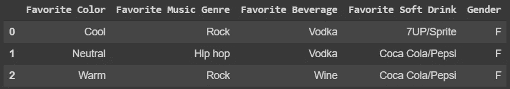
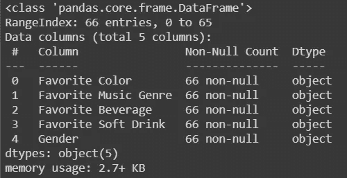
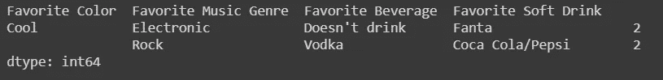
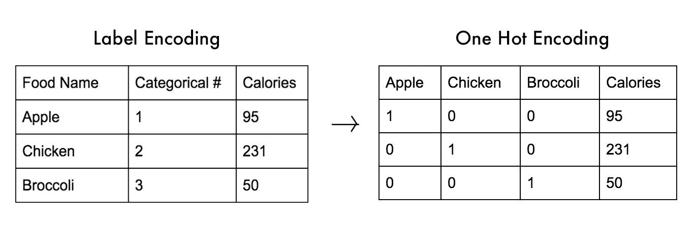
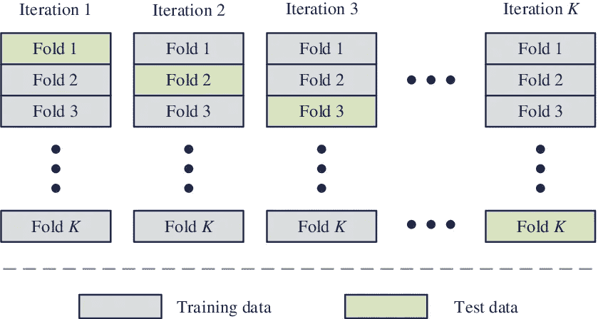
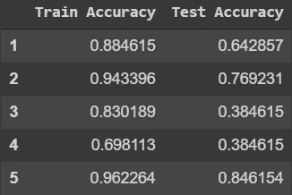
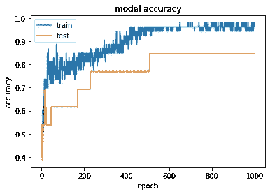
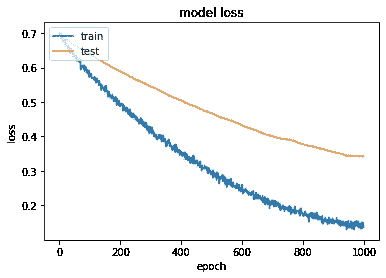
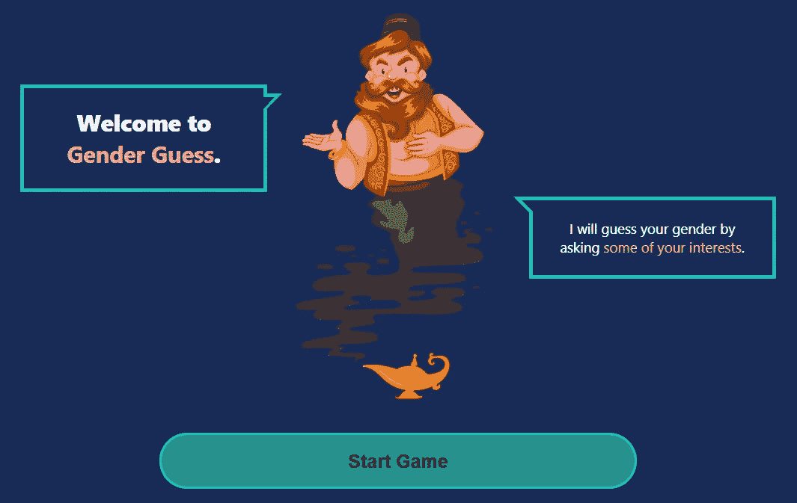

# 神经网络中的简单分类

> 原文：<https://medium.com/analytics-vidhya/simple-classification-in-neural-network-c349744d608a?source=collection_archive---------17----------------------->

我们知道，许多复杂的机器学习问题可以使用神经网络*轻松*解决。例如，在监督学习(分类)中，我们可以使用它们来对图像或文本进行分类。


作者:[法兰克福学派](https://blog.frankfurt-school.de/neural-networks-vs-random-forests-does-it-always-have-to-be-deep-learning/)

> **现在，如果我们对实际上可以使用“常规”机器学习解决的简单数据集进行处理，会怎么样？**

在本帖中，我们将尝试使用来自 Kaggle 的名为“[性别分类](https://www.kaggle.com/hb20007/gender-classification)”的简单数据集。该数据仅包含 66 行，4 个特征(在我们的目标变量中表示用户性别的兴趣)。



我们的目标是只根据用户的兴趣/偏好对他们的性别进行分类。通过使用`data.info()`，我们可以看到数据集中没有空值。



然而，尽管我们的数据中没有空值，因为我们只有 4 个特征和 2 个类，我们仍然有一个问题。我们不能确定我们的数据中没有来自相同特征值的不一致标注。我们可以通过对数据进行如下分组来检测它们。

```
grouping = data.groupby(list(data.columns)[:-1]).apply(lambda x: x.Gender.nunique())
grouping[grouping.eq(2)]
```



> **如果相同的特征值(输入)有不同的标签(输出)，我们该怎么办？**

在这种情况下，我们现在无能为力。如果是因为数据输入期间发生的错误(*人为错误*，那么我们可以删除这些值。然而，我们不能这样做，因为这会使我们的模型产生偏差。

实际上，两性对*颜色*、*音乐类型*、*饮料*和*软饮料*有共同的兴趣是合理的。因此，我们可以通过添加更多的功能来解决这个问题，特别是通过找到每个性别的独特特征。但是现在，我们就顺其自然吧。

# 预处理数据

接下来要考虑的是，我们不能直接将数据输入神经网络模型，因为数据仍然是分类文本。因此，我们必须使用一键编码和标签编码对数据进行编码。



作者: [@michaeldelsole](/@michaeldelsole/what-is-one-hot-encoding-and-how-to-do-it-f0ae272f1179)

点击[链接](https://towardsdatascience.com/categorical-encoding-using-label-encoding-and-one-hot-encoder-911ef77fb5bd)了解更多信息。

```
# Split the features and labels
X = data.iloc[:,:-1]
y = data.iloc[:,-1]# Change the data into one-hot encoding (for features) and change label to 0-1
X = pd.get_dummies(X)
y = le.fit_transform(y)
```

然后，由于我们的数据中有一个异常，我更喜欢使用 K-Fold 来评估模型，并尝试找到最佳的训练-测试分离场景，该场景在训练和测试集中给出最佳的准确性。



作者:[李明朝](https://www.researchgate.net/figure/K-fold-cross-validation-method_fig2_331209203)

# 训练和测试模型

我们定义模型，这样我们可以为 K-Fold 中的每次迭代创建新的模型。对于输入层，我们用 shape 20 输入数据(因为预处理数据后我们总共得到了 20 列)，并使用' float32 '作为 dtype(因为我将把这个模型导出到 TFJS 中—它支持 float32)。

我们选择 Adam 作为我们的优化器，因为它是最受欢迎的。你可以在这个链接上找到更多关于其他优化者[的信息，在这里](/datadriveninvestor/overview-of-different-optimizers-for-neural-networks-e0ed119440c3)了解更多关于亚当[的信息。](https://towardsdatascience.com/adam-latest-trends-in-deep-learning-optimization-6be9a291375c)

```
def train_model(X_train, X_test, y_train, y_test):
  model = tf.keras.models.Sequential([
            tf.keras.Input(shape=(20), dtype='float32'),
            tf.keras.layers.Dense(units=1024, activation='relu'),
            tf.keras.layers.Dropout(0.4),
            tf.keras.layers.Dense(units=1, activation='sigmoid')
          ]) model.compile(optimizer=Adam(lr=0.0001),
                loss='binary_crossentropy',
                metrics=['accuracy']) # Callback to reduce learning rate if no improvement in validation loss for certain number of epochs
  reduce_lr = ReduceLROnPlateau(monitor='val_loss', factor=0.1, patience=10, min_lr=1e-8, verbose=0)# Callback to stop training if no improvement in validation loss for certain number of epochs
  early_stop = EarlyStopping(monitor='val_loss', patience=20, verbose=0) history = model.fit(
              X_train, y_train,
              epochs=1000,
              validation_data=(X_test, y_test),
              callbacks=[reduce_lr, early_stop],
              verbose=0
            ) tr_loss, tr_acc = model.evaluate(X_train, y_train)
  loss, accuracy = model.evaluate(X_test, y_test)
  return model, history, tr_loss, tr_acc, loss, accuracy
```

然后我们运行并试图在 K-Fold 的每次迭代中找到最佳模型。

```
kfold = KFold(n_splits=5, random_state=42, shuffle=True)loss_arr = []
acc_arr = []
trloss_arr = []
tracc_arr = []temp_acc = 0for train, test in kfold.split(data):
  model, history, trloss_val, tracc_val, loss_val, acc_val =   train_model(X.iloc[train], X.iloc[test], y[train], y[test]) # If we got better accuracy in validation, then we save the split scenario and the model
  if acc_val > temp_acc:
      print("Model changed")
      temp_acc = acc_val
      model.save('best_model.h5')
      train_index = train
      test_index = test
      best_history = history trloss_arr.append(trloss_val)
  tracc_arr.append(tracc_val)
  loss_arr.append(loss_val)
  acc_arr.append(acc_val)
```

这是每次迭代的精确度的结果。



下面是我们的最佳模型(在第五次迭代中)的精度和损失图。



最后，我制作了 ReactJS 应用程序，并将其部署在 Github 页面上。你可以试着从选择的偏好中交互式地预测性别。

 [## 性别猜！

### 该网站仅用于项目

musmeong.github.io](https://musmeong.github.io/gender-guess/) 

来自[https://musmeong.github.io/gender-guess/](https://musmeong.github.io/gender-guess/)

我使用的模型与我在这篇文章中提出的模型相同，然后使用下面的代码将其转换为 TFJS(在`pip install tensorflowjs`之后)。

```
!tensorflowjs_converter --input_format keras best_model.h5 models/
```

React App 的回购链接:[https://github.com/musmeong/gender-guess/tree/master](https://github.com/musmeong/gender-guess/tree/master)

Kaggle 笔记本:[https://www . ka ggle . com/mus meong/gender-class ification-using-neural-network](https://www.kaggle.com/musmeong/gender-classification-using-neural-network)