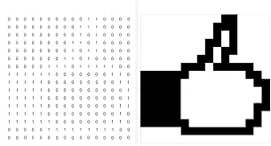
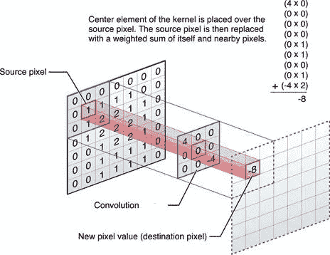

# 使用 PyTorch 的简单 CNN

> 原文：<https://medium.com/analytics-vidhya/simple-cnn-using-pytorch-c1be80bd7511?source=collection_archive---------17----------------------->

这篇文章是一个简单的指南，将帮助您构建和理解构建一个简单的 CNN 背后的概念。到本文结束时，您将能够基于 PyTorch API 构建一个简单的 CNN，并使用 FashionMNIST 数据集对服装进行分类。这是假设你有人工神经网络的先验知识。

# 美国有线新闻网；卷积神经网络

CNN 或卷积神经网络的概念是由 Yann André LeCun 推广的，他也被称为卷积网络之父。

CNN 的工作方式与我们人眼的工作方式非常相似。CNN 背后的核心操作是矩阵加法和乘法。所以，没有必要为他们担心。

但是要了解 CNN 的工作原理，我们需要知道图像是如何储存在电脑里的。

上面的例子向我们展示了图像是如何以数组的形式存储的。

但是这些只是灰度图像。因此，一幅 RGB 或彩色图像就是三个这样的矩阵相互叠加在一起。

上面的多维矩阵表示一幅彩色图像。但在本文中，我们将讨论灰度图像的分类。

**CNN 架构**

CNN 背后的核心功能是卷积运算。从图像矩阵中提取一些重要的特征是将图像矩阵与滤波矩阵相乘。

上图显示了对图像矩阵的卷积运算。通过在图像矩阵中移动滤波器矩阵来填充卷积矩阵。

CNN 的另一个重要组成部分叫做最大池层。这有助于我们减少特征的数量，也就是说，它使它们更清晰，这样我们的 CNN 表现得更好。

对于所有的卷积层，我们应用 RELU 激活函数。

在将卷积层映射到输出时，我们需要使用线性层。所以我们使用称为全连接层的层，缩写为 fc。

最终 fc 的激活主要是一个 sigmoid 激活函数。

我们可以清楚地看到所有输入值在 0 和 1 之间的输出映射。

现在你知道我们要使用的层了。这些知识足以构建一个简单的 CNN，但是一个可选的层调用 dropout 将帮助 CNN 运行良好。丢弃层被放置在 fc 层之间，这以设定的概率随机丢弃连接，这将帮助我们更好地训练 CNN。

我们的 CNN 架构，但最后我们会在 fc 层之间添加一个 dropout。

不再浪费时间，我们将进入代码

**代号**

 [## srimanthtenneti/fashion mnist-CNN

### 在 GitHub 上创建一个帐户，为 srimanthtenneti/fashion mnist-CNN 的发展做出贡献。

github.com](https://github.com/srimanthtenneti/FashionMNIST-CNN/blob/master/FashionMNIST.py) 

完整的代码在我的 git hub 中，可以通过上面的链接访问。我在代码中添加了注释，可以帮助您浏览代码。不要惊慌，一步一步来，这很简单，很容易理解。

# **结论**

因此，结束后，你将能够建立简单的 CNN 的。我建议你检查 PyTorch 的其他数据集，并实现 CNN 的。

如果你需要我的帮助，我的 Linkedin 链接在下面。

 [## Srimanth Tenneti -自由职业者-自由职业者| LinkedIn

### 我是 Srimanth Tenneti，一名 20 岁的硬件设计师和软件开发人员。目前就读于北京理工大学二年级…

www.linkedin.com](https://www.linkedin.com/in/srimanth-tenneti-662b7117b/)