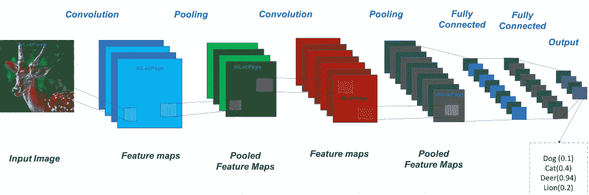
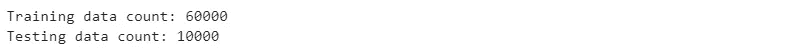
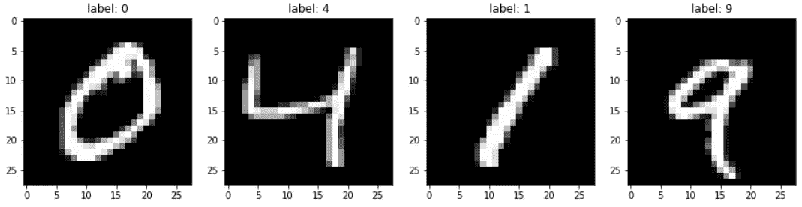
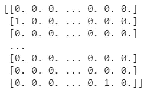
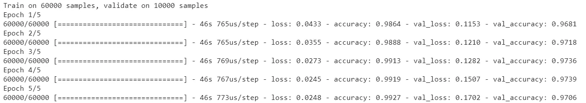
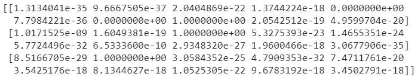

# 使用 Keras 的简单卷积神经网络

> 原文：<https://medium.com/analytics-vidhya/simple-convolutional-neural-network-using-keras-f2edcefc8f7c?source=collection_archive---------12----------------------->

旋转神经网络是一类深度神经网络。之所以称之为深度，是因为它的架构上有很多层。CNN 通常用于分析视觉图像。

CNN 由输入层、隐含层和输出层组成。隐藏层通常由一系列卷积层、汇集层、规范化层等组成。



CNN 建筑(https://mc.ai/how-does-convolutional-neural-network-work/)

在本文中，我们将使用 Keras 来创建架构和运行计算。Keras 是一个 python 库，它帮助我们非常简单容易地构建神经网络。

我们将尝试建立用于分类 MNIST 数据集(28x28 图像)的模型，该数据集由从 0 到 9 的 70，000 张手写图像组成。

## **准备数据**

Keras 图书馆准备了 MNIST 数据集供我们使用。

```
from keras.datasets import mnist
```

导入数据集后，我们需要将数据集加载到训练数据集和测试数据集。MNIST 的数据为我们提供了 60，000 个训练数据和 10，000 个测试数据

```
(x_train, y_train), (x_test, y_test) = mnist.load_data()
print('Training data count: {}'.format(x_train.shape[0]))
print('Testing data count: {}'.format(x_test.shape[0]))
```



培训和测试数据计数

MNIST 的数据如下所示:



MNIST 数据示例

## **数据预处理**

加载数据后，我们需要在将数据输入网络之前对数据进行预处理。我们知道，MNIST 数据是 28x28 的图像，该模型将期待与形状(数据计数，重量，高度，通道)的输入。因此，我们需要重塑我们的数据，代码将如下所示:

```
x_train = x_train.reshape(60000,28,28,1)
x_test = x_test.reshape(10000,28,28,1)
```

之后，我们应该使用一键编码器对每个数据的标签进行预处理。这将为每个类别创建一个二进制列，并返回一个稀疏矩阵或密集数组。

有许多方法可以对标签进行编码，这段代码使用的是 sklearn 库:

```
from sklearn.preprocessing import OneHotEncoderencoder = OneHotEncoder(sparse=False)
y_train = y_train.reshape(-1, 1)
y_train = encoder.fit_transform(y_train)y_test= y_train.reshape(-1, 1)
y_test = encoder.fit_transform(y_test)
```

这个用的是 Keras

```
from keras.utils import to_categoricaly_train = to_categorical(y_train)
y_test = to_categorical(y_test)
```



一键编码器输出

## 构建模型

我们已经准备好了数据，现在我们用 Keras 建立一个序列模型。为什么是顺序的？因为，顺序模型用于将模型构建为简单的层堆栈。

```
from keras.models import Sequential
from keras.layers import Dense, Conv2D, Flattenmodel = Sequential()
model.add(Conv2D(16, kernel_size=3, activation='relu', input_shape=(28,28,1)))
model.add(Conv2D(8, kernel_size=3, activation='relu'))
model.add(Flatten())
model.add(Dense(10, activation='softmax'))
```

第一卷积层中的 16 和第二卷积层中的 8 是该层中的节点数(可以调整)，kernel_size 是卷积窗口的大小。

在卷积层之后，有一个展平层。它将最后一个卷积层的输出转换成一维数组。

密集层是在许多情况下用于神经网络的经典层。我们可以添加另一个密集层，使我们的网络更智能(不总是这样！).

## 编译模型

创建模型后，我们需要编译模型。它需要优化器、损失函数和一系列指标。

```
model.compile(optimizer='adam', loss='categorical_crossentropy', metrics=['accuracy'])
```

我们使用“adam”优化器，因为它非常好(你也可以尝试另一个优化器)。

我们使用的损失函数是*categorial _ cross entropy*，我们在最后一层使用 softmax，因为我们的数据是多类的，我们正在制作单标签分类模型。你可以参考这篇[文章](https://www.dlology.com/blog/how-to-choose-last-layer-activation-and-loss-function/)找到关于损失函数和最后一层激活的细节。

## 训练模型

```
history = model.fit(x_train, y_train, validation_data=(x_test, y_test), epochs=5)
```

我们只需从模型中调用 fit 函数，Keras 就会自动运行计算来训练我们的数据。正如你在上面的代码中看到的，fit 方法需要以下参数:x_data，y_data，epoch 的数量。验证数据是一个可选参数。我们使用验证数据来检查我们的模型是否足够好，或者是否过拟合。



5 个时期后的结果

在我们的验证(测试)数据集中，我们得到了 97.06%。这对我们的模型来说已经足够好了。我们可以调整[超参数](https://en.wikipedia.org/wiki/Hyperparameter_(machine_learning))来使我们的模型更大。

## 使用模型进行预测

我们可以简单地将一些输入数组传递给预测方法

```
prediction = model.predict(x_test[:3]) #first 3 data of test data
```

它将返回一个输出数组，如下所示:



模型输出

我们可以使用 numpy 的 argmax 函数获得实际的数字。下面的代码绘制了带有标签的测试图像:

```
import numpy as npprediction = model.predict(x_test[:3])
print(prediction)w=60
h=40fig=plt.figure(figsize=(15, 15))
columns = 3
rows = 1
for i in range(1, columns*rows +1):
    ax = fig.add_subplot(rows, columns, i)
    plt.xticks([], [])
    plt.yticks([], [])actual_label = np.argmax(y_test[i-1])
    prediction_label = np.argmax(prediction[i-1]) ax.title.set_text('Prediction: {} - Actual:  {}'.format(prediction_label, actual_label)) image = x_test[i-1].reshape((28,28)) plt.imshow(image, cmap='gray')plt.show()
```


结果

最后，您创建了自己的模型来对 MNIST 数据进行分类。恭喜你。！👏👏👏

我会在 google colab 或 github 上提供完整的源代码供你参考。

> [https://colab . research . Google . com/drive/1 gha 17 akie 8 gbk 6 r jup 0 dehzuzit 3 fztl？usp =分享](https://colab.research.google.com/drive/1Gha17Akie8gBk6rJUP0dEhzUZit3fZtl?usp=sharing)
> 
> [https://github . com/ardiantutomo/Simple-CNN-Mn ist/blob/master/Simple _ CNN _ for _ Mn ist . ipynb](https://github.com/ardiantutomo/simple-cnn-mnist/blob/master/Simple_CNN_for_MNIST.ipynb)

感谢阅读。希望你喜欢它！🙏