# 简单的新冠肺炎数据分析

> 原文：<https://medium.com/analytics-vidhya/simple-covid-19-data-analysis-b80aa444e602?source=collection_archive---------27----------------------->

作为一名初学数据的科学家，我制定了一个简单的计划来处理新冠肺炎数据，我将在这里介绍这个过程。

# 安装/部署软件包:

对于数据分析，我只使用了基本的 R 包和一些建模包。为了再现性，设置了一个种子。

```
library(tidyverse)
library(reshape2)
library(hrbrthemes)
library(timeSeries)
library(caret)
library(forecast)
library(lubridate)
library(randomForest)
library(e1071)
library(gbm)
library(DMwR)
theme_set(theme_economist())
set.seed(123)
```

# 分析和清理数据

数据集来自 Kaggle 的 [COVID19 全球预测(第 4 周)](https://www.kaggle.com/c/covid19-global-forecasting-week-4)挑战赛，他们从约翰·霍普斯金·CSSE 那里获得了这些数据。约翰·霍普斯金每天都在更新它的数据，可以很容易地直接从 [GitHub](https://github.com/CSSEGISandData/COVID-19) 访问。

该数据集包含有关正在进行的新冠肺炎疫情的全球信息，其主要关注点是按日期、国家甚至州/省划分的确诊病例和死亡病例。

```
k.train <- read.csv(“.../Downloads/train.csv”)#Training Data
k.test <- read.csv(".../Downloads/test.csv")#Testing Data#Make Data Usable
k.train$Province_State <- as.character(k.train$Province_State)
k.train$Country_Region <- as.character(k.train$Country_Region)k.test$Province_State <- as.character(k.test$Province_State)
k.test$Country_Region <- as.character(k.test$Country_Region)k.train$Date <- as.Date(k.train$Date, format = "%Y-%m-%d")
k.test$Date <- as.Date(k.test$Date, format = "%Y-%m-%d")k.train$Province_State <- ifelse(k.train$Province_State == "", k.train$Country_Region, k.train$Province_State)
k.test$Province_State <- ifelse(k.test$Province_State == "", k.test$Country_Region, k.test$Province_State)#Show any missing values
colSums(is.na(k.train)) 
colSums(is.na(k.test)) 
sum(is.na(k.train))head(k.train)
tail(k.train)head(k.test)
tail(k.test)
```

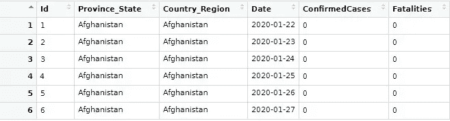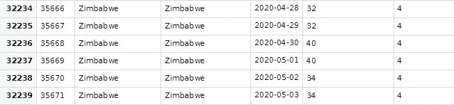

培训用数据

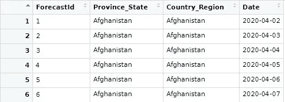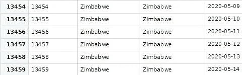

测试数据

除了全球 COVID 19 信息之外，我还将探索有关饮食预订和美国票房的数据。

# 形象化

由于新冠肺炎是一个全球性问题，我们将首先查看该数据子集。

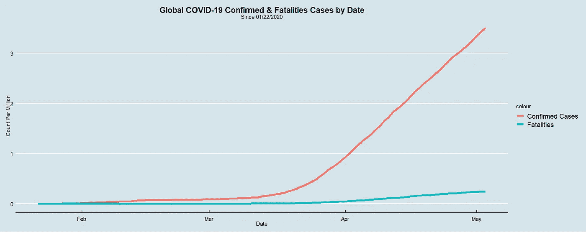

确诊病例的线图几乎是指数型的，清楚地显示了局势失控的速度。病例的迅速增加因各国的居家命令而受到抑制。通过尝试按国家量化每个锁定的严重性，可以进一步研究这些数据。

现在，把焦点转移到美国，看看哪些州在死亡人数方面受影响最大是至关重要的。

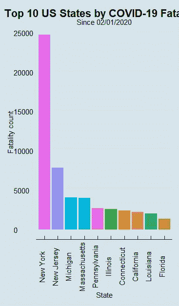

此外，我们可以将数据分组以查看特定的区域，在本例中，这将是美国大西洋中部。

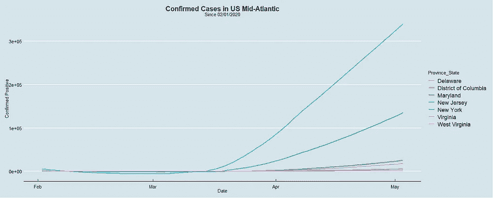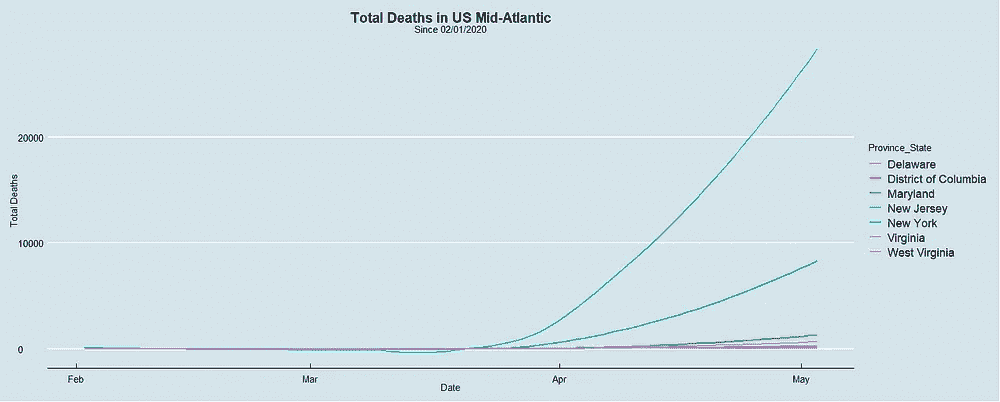

要查看流行病对特定州的影响，可以对该州的所有数据点进行分组。此外，要查看新病例和死亡的每日数值，可以向数据集中添加新列。

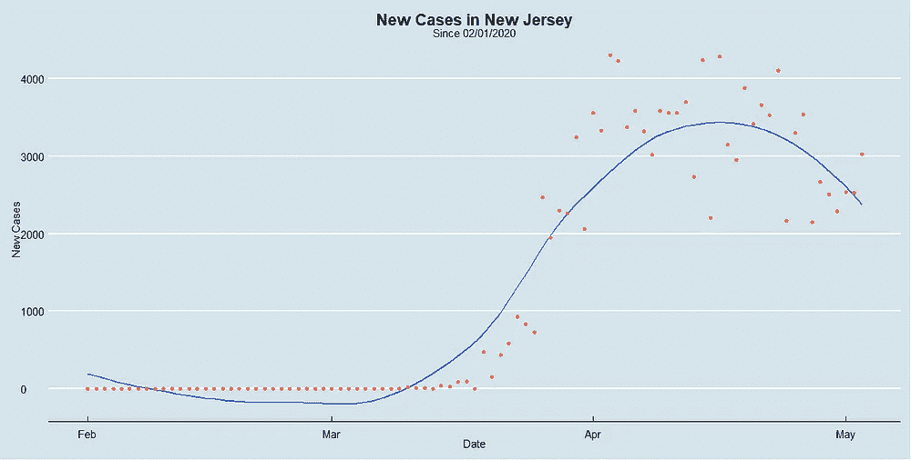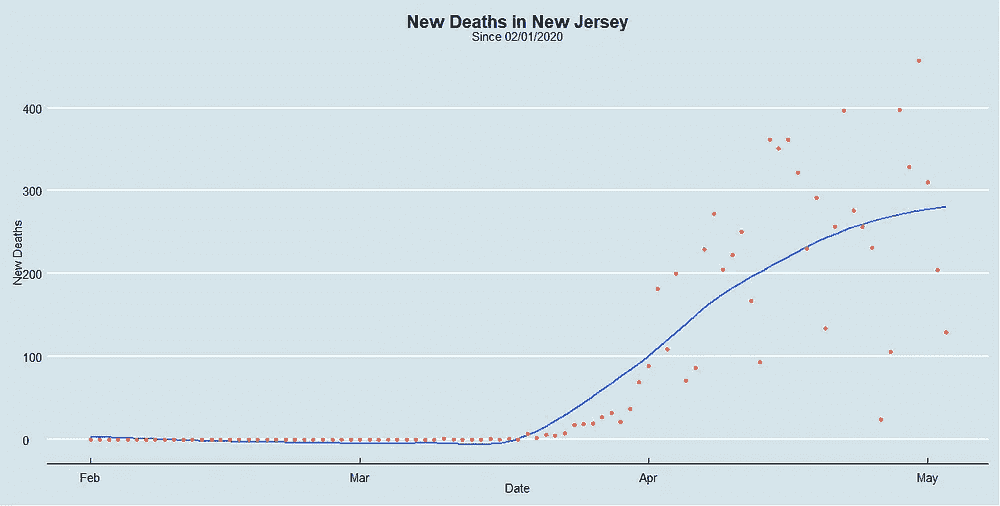

如所见，黄土曲线被添加到两个图中，这用来显示各个变量之间的局部回归。


《没时间死》因为病毒已经推迟到 11 月。

除了人类健康，新冠肺炎还严重影响了商业。这种疾病影响的一个主要例子是电影业。从电影上映日期被推迟到电影被直接发送到家庭视频，没有一个方面是安全的。一种令人兴奋的可视化影响的方法是查看 2019 年 1 月至 3 月的票房收入，并将其与今年的收入进行比较。数据从[票房魔咒](https://www.boxofficemojo.com/month/by-year/2019/?grossesOption=calendarGrosses)手动获取。

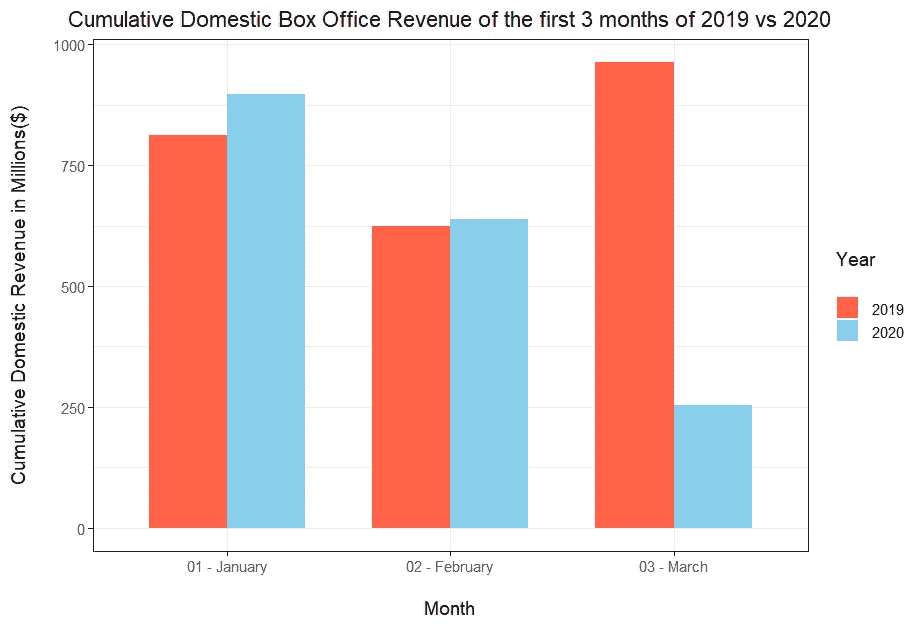

正如所见，2020 年的初始年收入下降，值得注意的是，2020 年 4 月的收入仅为 52，015 美元，而 2019 年的收入为 1，034，981，639 美元，增长了约 20 倍。


另一个深受新冠肺炎强制检疫影响的行业是餐饮业。OpenTable 提供了[数据](https://www.opentable.com/state-of-industry),显示了 OpenTable 网络上所有渠道的餐厅年复一年的入座客户:在线预订、电话预订和无预约。对于按天进行的年同比比较，它们与上一年同一周的同一天进行比较。

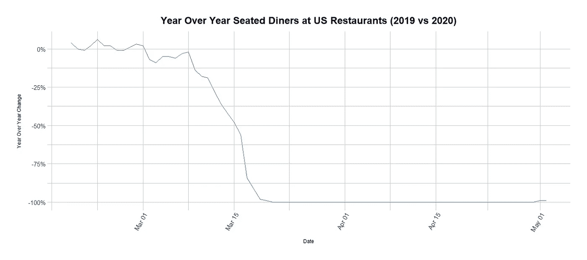

图表没有骗人。根据 OpenTable 从 3 月中旬开始的数据，他们网络中的活动减少了 100%,随着美国强制实施封锁，这是可以预料的。

# 预测和模型

回到 Kaggle 提供的数据集，可以制作模型来预测确诊病例和死亡人数的增加/减少。我使用了四个模型来预测到该日期的任何批准的实例。

```
##NY Data
ny <- k.train %>% dplyr::filter(Country_Region == “US” & Province_State==”New York”) %>% 
 dplyr::filter(Date >=”2020–03–05")ny.test <- k.test %>% dplyr::filter(Country_Region == “US” & Province_State==”New York”)
```

第一个模型是广义线性模型或 GLM。该模型将基础线性模型链接到响应变量，在这种情况下，响应变量将是确认的病例。

```
##GLM
glm <- glm(ConfirmedCases~ Date, data=ny)
summary(glm)
pred.glm <- predict(glm,ny.test)
pred.glm <- as.data.frame(pred.glm)
```

我使用的下一个模型是支持向量机模型或 SVM，这个模型在超平面或接近无限的空间中进行回归分析/赋值。在这个超平面中，模型将理想地找出异常值，并对变量进行适当的分类。

```
##SVM
svm.model <- svm(ConfirmedCases ~ Date, data = ny)
summary(svm.model)
pred.svm <- predict(svm.model, newdata = ny.test)
pred.svm <- as.data.frame((pred.svm))
```

在使用 SVM 之后，我使用相同的变量组合创建了一个随机森林模型。随机森林通过为回归或分类任务创建决策树来工作。随机决策树纠正了决策树过度适应数据的习惯。

```
##Random Forest
rf.model <- randomForest(ConfirmedCases~ Date, data = ny)
summary(rf.model)
rf.predict <- predict(rf.model, ny.test)
rf.predict <- as.data.frame((rf.predict))
```

我使用的最后一个模型，也是出于好奇，是一个梯度推进模型或 GBM。该模型通过生成弱预测模型集合形式的预测模型来解决分类和回归问题。总体目标是尝试将所有较弱的关联联系起来。

在对每个模型进行训练后，我用它们预测了 43 个时间段(2020 年 4 月 2 日-2020 年 5 月 14 日)的确诊新冠肺炎病例，使用的是 Kaggle 测试数据。我还使用了来自[新冠肺炎跟踪项目](https://covidtracking.com/data/state/new-york)的另一组数据来找出每个模型的误差。

```
[1] "GLM: ">DMwR::regr.eval(pred.glm.error,nycConfirmedCases$ConfirmedCases)
              mae          mse         rmse         mape
3.442320e+05 4.696230e+09 6.852904e+04 1.833325e+00> print(paste("SVM: ")) 
[1] "SVM: " 
> DMwR::regr.eval(pred.svm.error,nycConfirmedCases$ConfirmedCases) mae          mse         rmse         mape 
1.929837e+05 1.810168e+09 4.254607e+04 9.352455e-01>>print(paste("RF: ")) 
[1] "RF: " 
> DMwR::regr.eval(rf.predict.error,nycConfirmedCases$ConfirmedCases) mae          mse         rmse         mape 
8.941814e+04 3.756527e+08 1.938176e+04 4.436796e-01> print(paste("GBM: ")) 
[1] "GBM: " 
>DMwR::regr.eval(boost.predict.error,nycConfirmedCases$ConfirmedCases) 
mae          mse         rmse         mape 
7.027998e+06 1.286084e+12 1.134056e+06 1.120166e+04
```

均方根误差或 RMSE 在 1.938176e+04 时是随机森林模型的最佳值。然而，重要的是要注意，在大的情况下，这个误差太大了，并且永久地阻止了这个随机森林模型用于进一步的预测。它需要通过数据争论或改进模型参数来改进。

# 改进和最终想法

对于世界来说，新冠肺炎是一个需要处理的复杂问题，主要是因为每个人都毫无准备。在这种情况下，一个重要的积极方面是，人们共同努力分析数据，以便能够克服整体状况，并充分解决未来的类似问题。对于这种数据分析的范围来说，还有很大的改进空间。我可以尝试找到更多可以与潜在响应变量进行反应的功能，甚至可以简单地在更广泛的数据集上部署一个模型。对这种分析的另一个改进是更高级的数据转换，这样我就可以揭露任何不明显的关系。正确的答案可能只是更好的型号选择，我希望今后能了解这类信息。