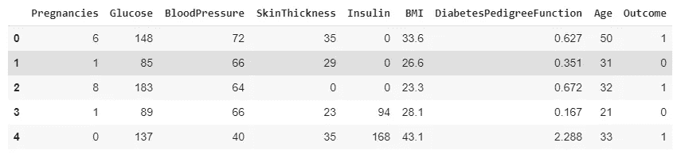
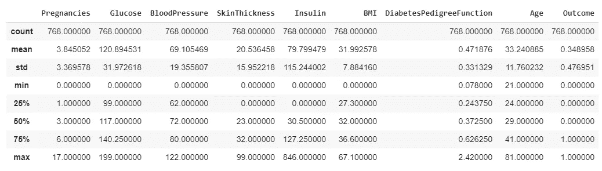
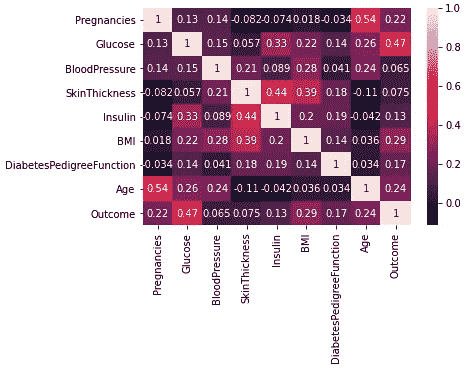
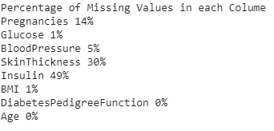
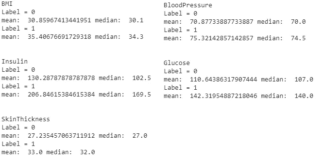
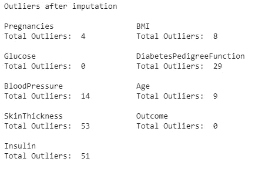
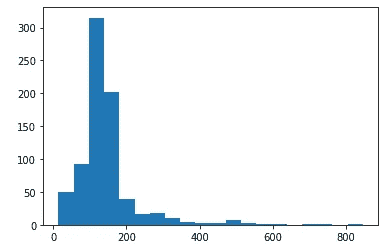
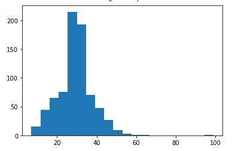
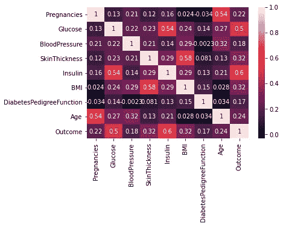
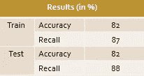

# 机器学习的简单数据准备

> 原文：<https://medium.com/analytics-vidhya/simple-data-prep-for-machine-learning-1749ca4e8451?source=collection_archive---------33----------------------->

## 您可以为数据做的基本数据准备示例


卢克·切瑟在 [Unsplash](https://unsplash.com?utm_source=medium&utm_medium=referral) 上的照片

当然，在对数据建模之前，您必须确保数据是干净的，并且能够给出最佳结果。以下是在简单数据集中应用数据预处理的一些基本尝试。

## 数据集的第一眼

在这个例子中，我将使用我在 Kaggle 上找到的 PIMA 数据集。你可以在这里找到:【https://www.kaggle.com/uciml/pima-indians-diabetes-database】T4

该数据集来自国家糖尿病、消化和肾脏疾病研究所。该数据集的目的是基于一些健康测量来预测患者是否患有糖尿病。这里所有的病人都是女性，至少 21 岁，有皮马印第安血统。

首先，我们观察数据集的样子。这是数据集的前五行。



在上图中，数据集包含 8 个变量或特征和一个结果(或标签)。结果是二进制的。确切地说，这个数据集中有 768 个例子(行)。现在，让我们通过调用 describe 函数来查看该数据集的统计描述。



看结果的平均值。由于这是一个二元变量，平均值为 34.89%，因此这不是一个平衡变量或数据集。它说 34.89%的样本是阳性糖尿病。

## 与标签的相关性

为了评估数据准备是否充分或工作是否良好，我最舒服的方法是绘制特征与标签的相关性。这是更改前数据集的相关矩阵。



准备前数据集的相关矩阵

我们可以看到，葡萄糖与标签的相关性最高。身体质量指数、年龄和怀孕或多或少与标签有相似的相关值。

## 缺少值

从上面的描述来看，这里有一些缺失值被替换为 0，例如在葡萄糖、血压、胰岛素等中。让我们看看每个变量缺失值的百分比。



每个变量缺失值的百分比

有一些变量具有相当大百分比的零/缺失值，例如皮肤厚度和胰岛素。除了这两个变量，我将包括葡萄糖、血压和身体质量指数来代替它们缺失的值，就像皮肤厚度和胰岛素一样。



5 个变量中每个标签的平均值和中值

对于这些变量，缺失的值将被平均值或中值替换，具体取决于标签。我们如何做到这一点？

对于每个变量:

*   根据结果(0 或 1)对值进行分组，当然不包括缺失的值
*   对于每组，计算平均值和中值
*   根据结果值，用平均值/中值替换缺失值。

下一个问题，我们如何在中位数和均值之间选择替换值？首先，让我们看看每个标签和变量的中值或平均值。如果中间值和平均值相差很大，我认为最好用中间值代替，因为分散/稀疏值应该用中间值代替。

根据上面的那些图像，胰岛素的平均值和中间值相差很大，所以我选择用中间值替换胰岛素的缺失值。对于其他变量，我用各自的平均值来代替。下面是 Python 中替换丢失值的代码块。

```
df_new = df.copy()#copy dataset to a new one for substitutioncols_to_change = ['BMI', 'Insulin', 'SkinThickness', BloodPressure', 'Glucose']for col in cols_to_change:
    mean_0 = np.mean(df.loc[(df.Outcome == 0)&(df[col]!= 0), col])
    median_0 = np.median(df.loc[(df.Outcome==0)&(df[col] != 0),col])
    mean_1 = np.mean(df.loc[(df.Outcome == 1)&(df[col] != 0), col])
    median_1 = np.median(df.loc[(df.Outcome==1)&(df[col] != 0),col]) # Print the mean and median value for each label and variable
    print(col)
    print("Label = 0")
    print("mean: ", mean_0, "median: ", median_0)
    print("Label = 1")
    print("mean: ", mean_1, "median: ", median_1) # Replacing Insulin with median, since median and mean is far     different if col == 'Insulin':
       df_new.loc[(df_new[col]==0)&(df_new['Outcome']== 0),col] = median_0
       df_new.loc[(df_new[col] == 0) & (df_new['Outcome'] == 1), col] = median_1
    else:
       df_new.loc[(df_new[col] == 0) & (df_new['Outcome'] == 0), col] = mean_0
       df_new.loc[(df_new[col] == 0) & (df_new['Outcome'] == 1), col] = mean_1
```

## **处理异常值**

要处理异常值，首先我们必须知道每个变量中有多少异常值。我们如何找出异常值？在这里，我应用 IQR 来检测异常值。IQR 代表四分位数范围，或者在数学上，第 75 百分位(Q3)和第 25 百分位(Q1)之间的差异。

那么，什么是 75 百分位，25 百分位等等呢？首先，您必须对数据进行升序排序(从最小到最大)。第 n 个百分位数是数据的第 n 个最低值。如果有 100 个值，第 25 个百分位数是对值进行升序排序后的第 25 个值。当然，第 75 百分位是第 75 个值(如果你有 100 个值)。

异常值被定义为高于 Q3 + n * IQR 或低于 Q1- n * IQR 的值。对于 n 值，你可以自己调，但是经过一番研究，通常人们用 1.5 或者 2。下面是用于确定异常值的代码块。

```
for col in df_new.columns:
  IQR = df_new[col].quantile(0.75) - df_new[col].quantile(0.25)
  maxVal = df_new[col].quantile(0.75) + 1.5 * IQR
  minVal = df_new[col].quantile(0.25) - 1.5 * IQR 
  print(col)
  print("Total Outliers: ", 
      sum((df_new[col] < minVal) |    (df_new[col] > maxVal)), "\n")
```



替换缺失值后异常值的数量

我们可以看到皮肤厚度和胰岛素具有最高的异常值。对于这两个变量，我们来看看它们的分布。



胰岛素(左)和皮肤厚度(右)的分布图

从上面的图来看，在分布的右边有许多异常值。这意味着，许多离群值存在于更高的值中。对于这种情况，我决定用阈值本身替换某个阈值以上的值。

```
InsulinCappedValue = df_new['Insulin'].quantile(0.85)
df_new['Insulin'] = np.where(df_new['Insulin'] > InsulinCappedValue, InsulinCappedValue, df_new['Insulin'])SkinThicknessCappedValue = df_new['SkinThickness'].quantile(0.95)
df_new['SkinThickness'] = np.where(df_new['SkinThickness'] > SkinThicknessCappedValue, SkinThicknessCappedValue, df_new['SkinThickness'])
```

85%用于胰岛素而 95%用于皮肤厚度的原因是，它们之后的下一个值与那些百分位数有相当大的距离。

在这些过程之后，让我们看看相关矩阵。



准备前(左)和准备后(右)的相关矩阵

完成这些步骤后，胰岛素现在与输出量的相关性最强，其次是葡萄糖。皮肤厚度和血压都增加了相关性。

## 训练模型和结果

为了训练模型，在 Tensorflow 中使用简单的密集层，具有 sigmoid 激活(即逻辑回归)。使用的优化器是 Adam 优化器，学习率为 0.001。应用的其他超参数有:

*   纪元= 700
*   批处理大小= 10
*   分类 _ 阈值= 0.4

因为数据很小，所以应用 K 倍，这里 k = 3。为了获得单个评估值，对训练和测试评估结果进行平均。

这里用于评估的指标是准确率和召回率。使用回忆作为衡量标准的原因是为了从所有实际上呈阳性的患者中了解模型预测糖尿病患者的效果。下面是训练模型的结果。



在这里，经过这些数据预处理步骤后，训练和测试结果相差不远。但是，正如我自己的补充说明，应该添加更多的数据以确保建模的结果。