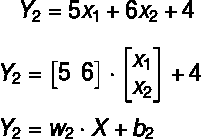

# 简单的神经网络解释:从逻辑回归到神经网络—第二部分

> 原文：<https://medium.com/analytics-vidhya/simple-explanation-from-logistic-regression-to-neural-network-part-2-9b74718544c8?source=collection_archive---------9----------------------->

在我们的[上一篇文章](/@esraa.sabry.mohamed/simple-explanation-from-logistic-regression-to-neural-network-part-1-8c018b04a824)中，我们概述了监督机器学习和逻辑回归模型。让我们从重温逻辑回归模型术语开始，然后开始画一个神经网络模型。

# 索引:

1.  建立一个简单的神经网络
2.  神经网络组件
3.  为什么叫神经网络？我们为什么要用它？
4.  激活功能类型

在之前的逻辑回归算法中，我们在下面的公司数据集上应用了线性回归概念，以对给定员工是否会离开公司进行分类。我们通过为训练数据集找到最合适的**线/分隔符/决策边界**来完成这一任务。

图 1:训练数据集

拟合线的一般方程为:

**Z** 值代表员工属于另一个阶层**{离开，不离开}** 的概率。

**现在，让我们将逻辑回归模型描绘成一个图形/网络，如下所示:**

图 2:作为网络的逻辑回归

上图显示了一个简单的神经网络结构。本质上，我们可以将逻辑回归视为一个单层神经网络。

# 神经网络

我们可以将神经网络描述为**一种处理给定输入以计算期望输出的功能。**

# 神经网络组件

神经网络由以下五个主要组件组成:

1.  **神经元:**是神经网络的基本单元。

图 3:神经元

神经元是一个数学函数，它接收**多个输入**并返回一个**单个** **输出**作为对输入的一些计算的结果。例如，上面的黄色神经元将 X1(年龄)和 X2(休假天数)作为输入，然后计算 Y 预测函数:

在计算预测的 Y 值后，它对预测的 Y 应用 sigmoid 函数以获得 Z 值。最后， **Z** 就是这个神经元的输出。

**2。权重:**任何对神经元的输入都有一个相关的值叫做权重( *w* )。

图 4:重量

如上所述，黄色神经元将 X1 和 X2 作为输入，并将 **a** 和 **b** 作为它们的关联权重。因此，每个单个神经元基于其**输入乘以其相关权重值**来计算其输出。因此，对于我们的输入， **X1** 将乘以其相关权重 **a** 并且 **X2** 乘以其权重 **b** 。

**3。输入层:**是神经网络的第一层神经元。

图 5:输入层

输入层告诉我们关于训练数据集及其外观，输入层中的每个神经元代表训练数据集中的一个**特征(列)**。例如，年龄列有一个神经元 **(X1)** ，假期列有另一个神经元 **(X2)** 。它由被动神经元组成，这些神经元不接受来自前几层的信息，因为它们是网络的第一层。这一层的目标是向神经网络提供输入数据。本质上，它是逐行获取训练数据，并将行的值分布在输入层的神经元上，然后将这些值传递给下一层。

**** *注意*** *在 NN 中统计层数时我们不统计输入层数。*

**4。输出层:**这一层是神经网络的最后一层神经元。

图 6:输出层

该层接收来自前几层的输入，**返回代表模型预测的输出**。这一层的神经元数量取决于预测的类型*。当它解决一个回归问题时，输出层只包含一个神经元。另一方面，当网络解决一个分类问题时，它包含的神经元数量等于类别(类)的数量。*

**5。隐层:**输入层和输出层之间的所有层神经元都是隐层。

图 7:隐藏层

在上图中，有一个隐藏层，但神经网络通常有多个隐藏层。这些图层被称为“隐藏的”，因为它们在网络输出中不可见。隐藏层中的所有这些神经元都有一个计算过程。
隐藏层通常是完全连接的层(每个神经元接收来自所有前一层神经元的输入，并将其输出发送给下一层中的每个神经元)。

到目前为止，我们对神经网络有了一个基本的了解，我们经历了一个可以构建的基本结构。神经网络可以通过具有两个或更多隐藏层(在这种情况下，它被称为深度神经网络)而具有更复杂的结构，或者根据问题的复杂性在任何层中具有更多神经元。

# 为什么叫神经网络？我们为什么要用它？

开发神经网络架构是为了让计算机模仿大脑，方法是让这些节点以类似于人脑中神经元和突触的方式学习和行为。这就是为什么它被称为神经网络。

在将逻辑回归模型转换为神经网络模型并简要介绍了其主要组件之后，如果神经网络模型与逻辑回归模型实现了相同的计算并给出了相同的结果，而不管它们是如何实现的，那么我们为什么要使用神经网络模型而不是逻辑回归模型呢？有什么区别？

1.  我们可以将神经网络模型用于回归和分类问题，这与仅用于分类的逻辑回归不同。
2.  神经网络具有高维数(具有大量特征/列的训练数据),非常方便。
3.  **神经网络为模型**引入了非线性(这是神经网络的重要部分)。

从我们以前的帖子中，我们知道逻辑回归是一个线性模型，这意味着它试图找到最佳的决策边界(线)，可以分离可能的类别(组)，所以它不能捕捉更复杂的非线性关系。在神经网络的情况下，它试图生成更复杂的决策边界(非线性分隔符),可以对特征之间的高度复杂的关系进行建模。神经网络(简称 NN)可以使用一个**激活函数**来完成，它通常是一个传递函数，接受输入，然后将结果值映射到不同的范围。我们之前确实使用了相同的概念，对吗？🤔在 sigmoid 函数中，将预测值映射到代表类概率的(0–1)范围。sigmoid 函数是各种激活函数中的一种，我们将在这篇文章中讨论其中的一些。

现在人们越来越清楚地认识到，没有激活函数的神经网络本质上只是一个线性逻辑回归模型。激活函数将非线性变换应用于输入，使神经网络能够学习和执行更复杂的任务，并找到非线性决策边界。

图 8:非线性决策边界

回到我们将逻辑回归转换为神经网络时所做的事情，我们仍然看不到神经网络在哪里执行这种非线性转换(应用激活函数)，因为它实现了与线性逻辑回归相同的数学函数！让我们在更大的神经网络中解释更多。

让我们考虑图 1 中使用的相同训练数据，并通过训练两个线性逻辑回归模型来尝试找到这两个类之间的最佳分隔符。每个模型必须正确地对大多数训练点进行分类，并生成所需决策边界的一部分，直到完成为止。

图 9:逻辑回归模型

每个模型都可以用它自己的方程来表示，这是我们在训练数据集上训练该模型之后获得的。

两个模型都试图将点分成两个给定的类，但是每次它们都将一些点分类错误。

图 10:错误分类的点

对于模型 1，它错误分类了 1 个红点，模型 2 错误分类了 2 个红点。因此，我们可以说绿色模型的精度比蓝色模型好。

但是，我们不会依赖这两个模型中的任何一个作为我们的最终模型。最终模型将是两条线(模型)的组合乘以代表每个模型有多好的因子。该因子可以是总点数中正确分类的点数。

图 11:最终的(组合的)模型

最后，这个组合模型将比早期的两个单独的模型具有更好的准确性。

让我们从数学上追溯我们是如何计算最终模型的:

**型号 1 /绿线/ Y1:**

**模型 2 /蓝线/ Y2:**

**最终型号/双线/ Yc:**

这从数学上总结了最终的模型方程。通过这样做，我们仍然得到线性模型中使用的相同的线性方程。此外，上图没有显示我们在图 8 中看到的弯曲的决策边界。那么接下来我们需要做什么来证明这一点呢？🙄答案是到**应用激活功能。**

让我们把这些逻辑回归模型转换成神经网络结构，看看应用激活函数在数学上是什么样子。

图 12:神经网络模型

这可以用数学方法写成如下:

**模型 1 输出 Z(Y1):**

**模型 2 输出 Z(Y2):**

**最终模型输出 Zf(Y):**

很明显，每个模型的输出都不是线性的。请记住，神经元执行某种计算(在我们的情况下是线性回归)，然后它应用一个激活函数将线性输出转换为非线性输出，如上面的等式所示。每个模型在其输出上应用 sigmoid 函数来打破模型的线性。

**在上述 NN 中，我们在神经元[Z(Y1)，Z(Y2)，Zf(Y)]中的每次计算后使用相同的激活函数 3 次，但它们执行的不是相同的工作！**

通常，我们在 NN 中使用激活函数来完成两个不同的任务，具体取决于我们使用它的层:

*   如果我们在隐藏层中使用一个激活函数(例如 Z(Y1)，Z(Y2))，那么它被用来打破神经网络的线性，就像我们上面所做的那样。
*   如果我们在输出层使用它(例如 Zf(Y))，那么它将用于返回表示模型预测的输出。例如，在二进制分类问题中，我们需要通过对其应用 sigmoid 函数来计算作为模型输出的类的概率。不像如果我们有一个回归问题，那么我们将在输出层有一个神经元，不需要应用任何类型的激活函数。因此，在输出图层中应用激活函数是可选的，并且取决于问题类型，但是当到达使 NN 成为任何正常线性模型的隐藏图层时，它不是可选的。
*   输入层没有激活功能。

简单来说，应用非线性激活函数和使用多个隐藏层，使得 NN 可以检测数据集中更复杂的模式。

# 激活功能类型:

前面我们提到过，**激活函数是一个传递函数，用来确定一定范围内的输出。**

当在神经网络的几个隐藏层中使用激活函数时，我们可以在每个隐藏层中使用不同类型的激活函数。实践中使用了几种激活函数:

1.  **Sigmoid** :它接受输入并将输出映射到范围[0，1]。

**2。Tanh(正切双曲函数):**它接受输入并将输出映射到范围[-1，1]。

**3。ReLU(整流线性单元):**是使用最广泛的激活功能。它将输出映射到范围[0，无穷大]。当 x 为正时，其值等于 x，否则为 0。

**4。Softmax** :类似于 sigmoid 函数，它将输出映射到范围[0，1]中，但在我们有多个类时使用。

到目前为止，我们已经介绍了基本的神经网络结构，以及它如何帮助构建非线性决策边界。此外，我们回顾了一些常见的激活功能，我们可以使用它们。在下一篇文章中，我们将开始使用数据训练我们的神经网络。

## 接下来:[第三部分——如何训练神经网络模型。](/analytics-vidhya/simple-explanation-from-logistic-regression-to-neural-network-part-3-284baee5db13)

如果您有任何建议、想法、意见或问题，请在下面留言