# 简单的神经网络解释:从逻辑回归到神经网络—第三部分

> 原文：<https://medium.com/analytics-vidhya/simple-explanation-from-logistic-regression-to-neural-network-part-3-284baee5db13?source=collection_archive---------21----------------------->

照片由[at ree23](https://pixabay.com/users/athree23-6195572/)在 [Pixabay](https://pixabay.com/) 上拍摄

训练步骤是任何建模过程的主要步骤。在本文中，我们将重点关注神经网络的训练/学习步骤，这是采用神经网络模型时最耗时的部分。在我们的 ***“简单解释:从逻辑回归到神经网络”*** 系列的前几部分中，我们浏览了神经网络结构的概述，并学习了一些关于激活函数类型的基础知识，[在这里查看它们以刷新您的记忆。](/analytics-vidhya/simple-explanation-from-logistic-regression-to-neural-network-part-2-9b74718544c8)

# 索引:

1.  神经网络是如何学习的？
2.  神经网络训练—前馈传播

我们之前已经建立了一个具有非常基本结构的神经网络。通过在每层中增加隐藏层和额外的神经元，神经网络可以变得更加复杂。对于我们这里的教程，让我们考虑下面的简单神经网络结构和我们之前在训练该神经网络时使用的员工数据集，以预测**(员工是否会离开公司)**

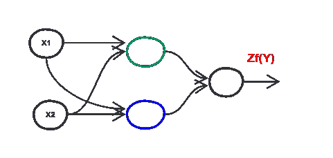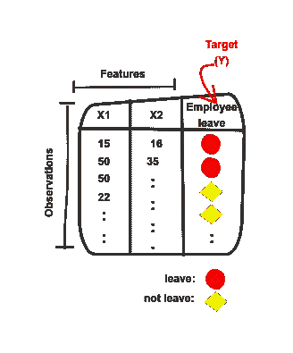

图 1:神经网络模型，训练数据集

# 神经网络是如何学习的？

像任何模型一样，神经网络需要经过训练才能做出预测。

神经网络的学习过程或训练不比**优化网络中每一层的权重更复杂。**记住权重是每个神经元输入的相关值。通常，当构建神经网络时，我们从**随机值开始初始化所有层中的权重**。

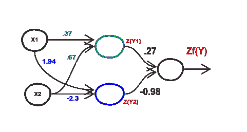

图 2:带有随机权重的神经网络初始化

正如你在上面看到的，我们为每一层的所有神经元分配了随机权重(基于高斯分布)。这里我们有三个神经元，让我们给每个神经元分配一种颜色，以简化本文中对它们的引用。绿色神经元有 2 个输入，因此我们有 2 个随机权重为[0.37，0.67]，蓝色神经元为[1.94，-2.3]，黑色神经元为[ 0.27，-0.98]。
在这个随机初始化步骤之后，学习过程开始，这是那些随机权重的缓慢优化。

**神经网络的训练过程包括两个阶段:**

1.  前馈传播
2.  反向传播

# **前馈-传播**

前馈-传播是将输入值(训练数据)馈送到神经网络并计算输出值(预测目标)的过程。

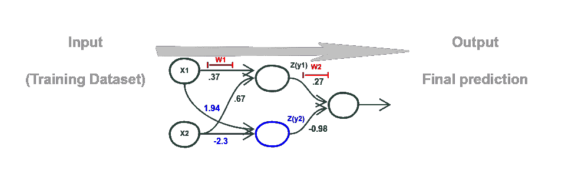

图 3:前馈-传播

让我们看看如何使用上面的训练数据集(员工数据集)来为上面的神经网络模型提供信息，以预测员工是否会离开公司。

首先，我们需要处理图 3 中的 NN 结构。我们有 **2 层** NN，为每层分配随机权重(在计算 NN 的深度时，我们不计算输入层，我们只考虑权重可调的层)。对于隐藏层，我们有 **2 个神经元，**，而对于输出层，我们有**一个神经元**，因为这是一个二元分类问题。对于激活函数，让我们在所有隐藏层中使用 **RELU 函数，在输出层**中使用 S **igmoid 来给出期望的预测(概率)。**

其次，让我们用一个数字来表示我们的神经网络结构中的每一层(每一层都有输入/输出值)(见下面的图 4)。这样，我们可以很容易地跟踪输入值，从进入第一层，直到计算最终预测。

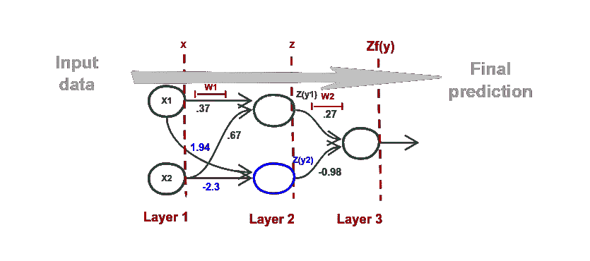

图 4: NN 层

让我们将上面显示的神经网络层进一步细分:

**第一层(输入层):**

*   *X* :输入数据/数据集的特征/数据集的列。

**第二层(第一个隐藏层):**

*   *Z* :第二层输出。
*   *W1* :用于计算 *Z* 的第二层关联权重。

**第三层(输出层):**

*   *Zf* :第三层输出。因为这是该特定神经网络的最后一层，所以这将是最终的模型输出/预测。
*   *W2* :第三层的关联权重，用于计算 *Zf* 。

现在，让我们开始向我们的神经网络输入数据。我们使用的数据集包含两个特征:

1.  年龄 ***(X1)***
2.  休假天数***【X2】***

输入层上有 2 个神经元(每个列/特征一个)。回到前馈-传播过程，我们需要将这两个特征作为输入值输入到我们的神经网络，以产生一个输出。

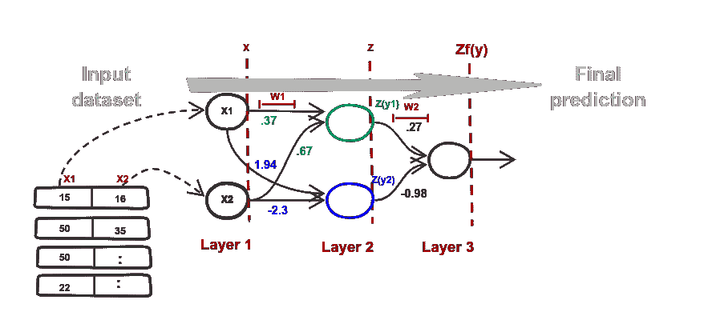

图 5:将数据逐行输入神经网络

我们一次向 NN **馈送一行** **的数据。**然后，一些数学方程将应用于这些输入值 *x1* 和 *x2* 以计算一些结果 *Z(y1)* 和 *Z(y2)* ，如图 5 所示。这些结果将被传递到下一层，在那里执行另一个计算，等等，直到在结束 *Zf(y)* 计算出最终的预测值。我们对每一行重复上述过程(输入数据)，以便为数据集中的每个观察值获得预测值 *Zf(y)* 。

让我们通过跟踪每个层的输出，将上述流程场景细分为更多细节:

*   **输入图层(图层 1):**

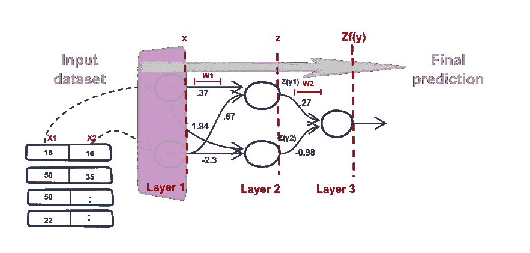

图 6:第 1 层—输入数据集的行

输入层是 NN 中的第一个前端层，它为下一层提供***×T21(数据集的特征)，而不执行任何类型的计算，因为它是由被动神经元构建的。***

正如我们前面提到的，我们需要将训练集中的所有行输入神经网络。有两种可能的方法来实现这一点:

1.  使用 for 循环遍历所有行，并对每一行执行上述过程。

2.使用矩阵表示**(矢量化)**，这将比上述方法更快。

因为我们喜欢更少的训练时间，所以我们将使用矩阵表示来跟踪饲养过程中的值。训练数据集的特征 *(X)* 将呈现为形状 *(n，m)* 的矩阵，其中:

*   **n** :矩阵的行数——代表特征的数量。
*   **m** :矩阵的列数——代表观察值的数量。

因此矩阵 *X* 将通过这一层传递到下一层，如下所示:

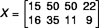

图 7:作为(X)矩阵的数据集特征

*   **第一个隐藏层(第二层):**

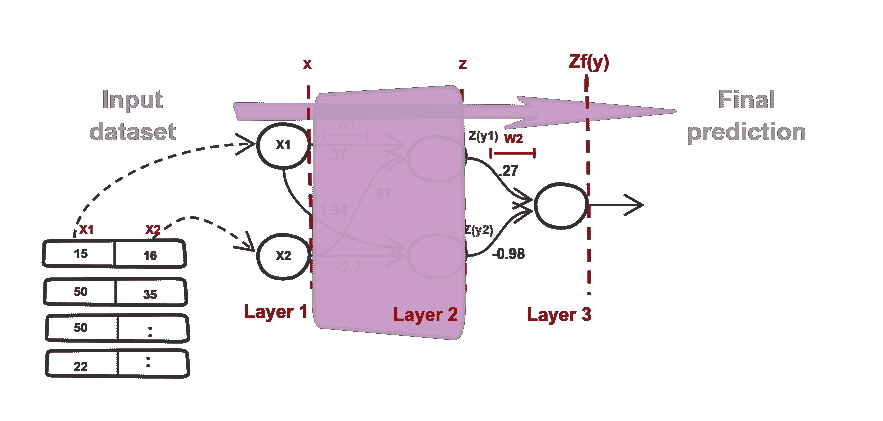

图 8:第 2 层—处理数据

在隐藏层中，我们执行一些线性计算(组合所有输入值 *X* 乘以它们相关的随机权重 *W1* )。我们在这一层的每个神经元中执行这种计算，以获得将被传递到下一层的结果。在本系列的[第 2 部分，我们详细介绍了如何进行线性计算，如下所示:](/analytics-vidhya/simple-explanation-from-logistic-regression-to-neural-network-part-2-9b74718544c8)

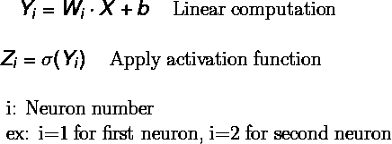

隐藏层包含 2 个神经元，因此我们执行上述等式两次，以获得绿色神经元的 *Z(y1)* 和蓝色神经元的*Z(y2)**。* 正如我们提到的，我们将通过使用矢量化一次性计算所有神经元的所有 *Z(yi)* 来避免循环。因此，让我们重写上面的等式，以利用优化的向量和矩阵运算，如下所示:

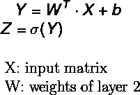

图 9:第 2 层—线性计算

其中 *X* 这里是通过图 7 中的输入层传递到该层的矩阵，并且 *W* 是表示每个神经元的权重的矩阵。如图 8 所示，分配给绿色和蓝色神经元的随机权重分别为[0.37，0.67]和[1.94，-2.3]。使用这两组权重，我们可以将权重矩阵*(****W1****)*写如下:

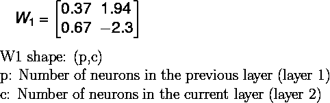

图 10:第 2 层—权重矩阵

使用矩阵来计算图 9 中的计算，以获得表示该隐藏层的输出的矩阵 *Z* 。矩阵 *Z* 具有 *(c，m)*的形状，因此 *Z* 中的每一行都包含在神经元中执行计算的单独结果，我们在此将神经元结果命名为 *Z(y1)* 和 *Z(y2)* ，并且我们对每个观察重复这一过程( *m* 次)。

为了帮助我们计算矩阵 ***Z*** ，让我们快速记住两个矩阵如何相乘:

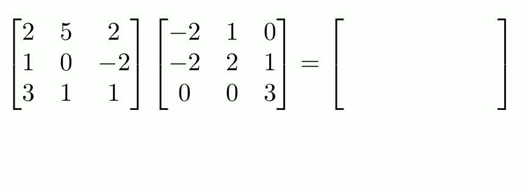

图 11:矩阵乘法

利用上面的矩阵乘法，矩阵**在数学上可以写成:**

**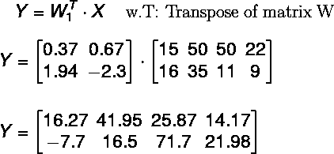****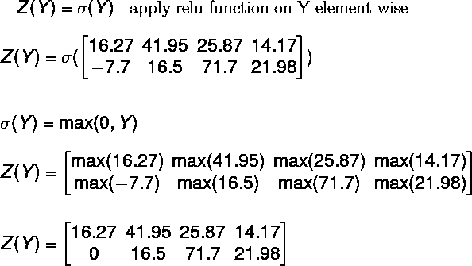**

**图 12:第 2 层—输出矩阵(Z)**

***(注意:在上述计算中，为了更简单起见，我们在计算中没有考虑偏差项)***

**这个矩阵 *Z 是这一层(第 2 层)的输出，它将以 *(c，m)的形状传递给下一层。*矩阵中的每一列包含层的神经元计算结果*Z(yi)*对数据集中的每一次观察执行。***

*   ***输出层(第三层):***

*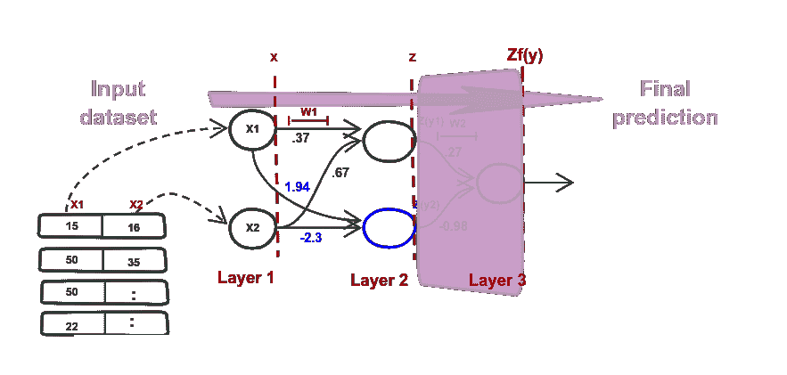*

*图 13:第 3 层—计算最终预测*

*这一层的输出代表我们模型的最终预测值。*

*正如我们在隐藏层中所做的，我们将使用分配的随机权重 ***W2*** 在该层中的单个神经元中执行相同的计算*(图 9)* ，如下所示:*

*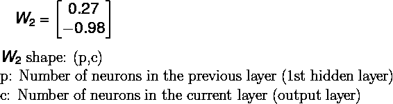*

*图 14:第 3 层—权重矩阵*

*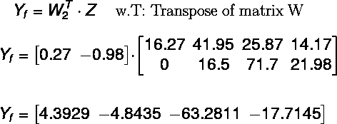**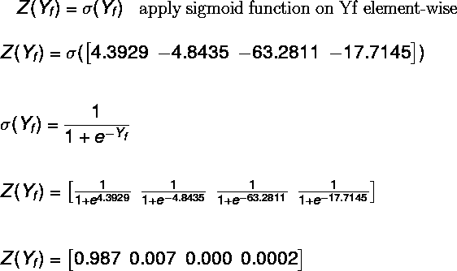*

*图 15:第 3 层—输出矩阵(Zf)*

*矩阵 *Z(yf)* shape 是图层的输出形状，是 *(c，m)* ，其中矩阵中的每一列代表为每个观察计算的**预测概率**。在我们的数据集中，这是员工离开公司的概率。*

*使用分配的随机权重 *W1* 和*W2*,**NN 预测每个员工目标为 1 的**概率(1 表示该员工将离开公司)，如图*图 15* 所示。从上面的矩阵 *Z(yf)* 中可以看出，神经网络预测一名员工大概率离职等于 *(99%)* ，三名员工不离职的概率约为 *(0%)* 。让我们将这个预测结果与数据集中员工的实际结果进行比较:*****

***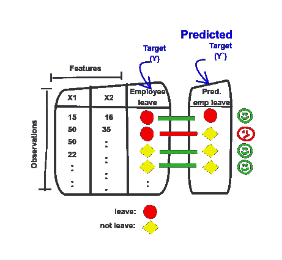***

***图 16:数据集—实际结果**与** NN —预测值***

***对于使用随机权重来获得预测的神经网络来说，误差实际上不是一个坏结果，对吗？我们只错误地预测了一个案例/员工。***

***这里需要注意的重要一点是，上面的错误百分比是通过预测 4 名员工(4 行)样本的目标值计算出来的。这个样本数据集不够大，不足以在实际应用中评估模型，实际应用通常需要更大的数据集来训练神经网络，并使用单独的数据集来进行评估。***

***我们现在已经完成了前馈-传播过程的一次迭代😄。***

***现在，你认为我们应该做些什么来改善我们的结果🤔？我们可以用不同的随机权重再次执行相同的前馈-传播过程(另一次迭代)。它能给我们一个更好的预测吗？是啊！💯我们修改这些初始权重，但这次不是随机的，因为这样做将花费我们更多的时间和运气来获得更好的权重并给出更好的预测。因此，我们可以考虑一个取决于**预测值与实际值相差多远的修正过程，并基于此进行权重修正。这种修改是学习过程下一阶段的一部分，称为反向传播。*****

***到目前为止，我们已经讨论了 NN 训练过程的第一阶段。我们经历了每一层的前向传播步骤，并看到了我们如何在数学上实现这些步骤。在下一部分中，我们将经历相应的反向传播步骤，并回顾一些将帮助我们更有效地开发神经网络的超参数。***

## ***[接下来:第 4 部分——如何训练神经网络模型——反向传播](/@esraa.sabry.mohamed/simple-neural-network-explanation-from-logistic-regression-to-neural-network-part-4-109328c6912d)***

***如果您有任何建议、想法、意见或问题，请在下面留言***